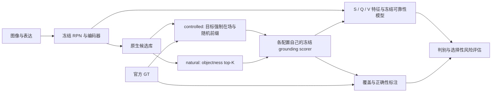

# V3 论文收束蓝图

当前状态：首次正式确认、自然测量和最终验收完成；C1 未确认，C2/C3/C4 支持指定正向效应，自然增量有反向和配置边界。实际数字只由 [V3 正文结果表](../results/v3_final_validation/publication/key_findings.md)、[完整索引](../results/v3_final_validation/evidence_index.md) 和 [修补版证据](../results/research_repair_v1/publication/evidence.json) 提供。已据此更新 [论证草稿](paper_draft_v3.md)，没有修改已冻结假设。

## 题目和研究对象

建议题目：《候选集合变化下视觉定位的正确性判别可靠性研究》。英文可用 *Correctness Reliability of Visual Grounding under Candidate-Set Changes*。

研究对象不是一个新 grounding 架构，而是固定定位打分器输出的可靠性：候选规模和组成改变时，定位是否正确、置信值能否区分正确与错误、按置信度接受预测的风险如何变化。概率校准是另一性质，不能用 AUROC 或选择性风险替代。

贯穿全文的三个问题：

1. 在目标可用、打分器固定的受控接口中，候选扩张改变了什么？
2. 分数模型的训练支持与冻结嵌入的不同信息来源能改善多少，在哪些条件下改善？
3. 将这些发现移到新的项目未使用图像和自然 proposal 接口后，哪些成立、哪些失效？

## 第一章：问题与文献位置

先用候选扩张的同一表达示例引入问题，再区分 Accuracy、correctness AUROC、Risk@50/80 和概率校准。明确候选集合是评估条件，不能把预测错误数变化直接当作置信判别机制。

相关工作围绕问题组织：grounding 与 proposal 瓶颈；置信度和选择性预测；候选池变化；候选上下文与信息来源。引用 [新颖性检索记录](../reviews/v3_novelty_review.md) 的正文位置和阅读深度。SafeGround 改变重复坐标采样数，MTLA 扩张模型生成池，Ref-NMS 改变 proposal 保留规则，CMRIN 与 Variational Context 使用候选关系。这些工作限制“首次研究 grounding 可靠性”“首次使用关系特征”等措辞。

贡献候选只写成具体评估问题、源信息对照和适用边界；检索没有找到完全同构工作不能证明优先权。哈希、审查与修补保证可追踪性，但不是独立的科学发现。

实际主线应写成：“候选变化下的可靠性性质需要分别检验；受控来源增量和训练支持能够迁移，而规模退化与自然增量具有更窄边界。”不要用“普遍退化—提出修复—全面成功”的叙事。新确认的未确认结果与自然 K5 反向是核心论证的一部分。

## 第二章：设计为何能回答问题

用一张图同时说明 controlled 与 natural 两种接口。controlled 使用 GT 构造目标在场、清除其他合法目标、嵌套扩张的候选；natural 使用原生 RPN NMS 后 objectness top-K，GT 只进入事后标签。两者改变的不仅是是否强制目标，还包括有效目标多重性和样本筛选，不能把两接口的差异解释成单因素因果效应。

写清编码器、proposal 生成器、grounding scorer、可靠性模型与温度何时训练、何时冻结。B/16 使用对应 scorer，是跨配置复制，不能说只改变 backbone。S/Q/V 是固定特征来源，Full−S+Q 是该训练流程下加入 V 的条件性增量，不是因果贡献，也不要求 Full 最优。

来源分组也不是统计正交：V 的若干相似度以 B3 winner 或 top-ranked proposals 为锚点，选择这些锚点已依赖 query-conditioned scorer；Q/S 也共享分数排序。V 不直接使用文本嵌入计算候选间余弦，但不能称为完全与 query 独立的信息。Full−S+Q 比较的是加入这一固定候选相似度块后重新拟合可靠性模型的结果，不是同一拟合模型删除 V 的因果效应。

来源消融也不估计条件互信息：有限 Logistic 流程可能受益于已有输入的非线性变换。因此使用“该流程可利用的预测信号”，不将 AUROC 增量当作信息量，也不据此证明完整分数向量的信息论不足。

此图表示计算接口，不是因果图。GT 进入 controlled 构造及事后标注，不进入 natural 排序或特征。

说明 train/tune/test 的图像隔离、表达身份和图像聚类抽样。区间条件于三个既有固定 seed 模型；先在各 seed 内计算效应再平均，不能改成预测 ensemble。V3 风险的边界同分处理与历史风险定义分开标记。

FineCops 的独立性指未进入此前项目训练、选型或性能分析流程；来源映射与像素筛查覆盖要如实列出。基础模型预训练暴露未知。新表达与图像来源同时改变，不单独归因为视觉域。

## 第三章：受控现象和可用信号

以候选 K 曲线和主要绝对指标建立现象，紧接训练支持对照：小 K 与大 K 训练的 Stats/ScoreDeepSets，给出公平数据预算、训练/调参诊断和跨 K 结果。模型失败不能推出分数不包含信息。

随后回答额外信息来自哪里：S、S+Q、S+V、Full 的绝对性能及 Full−S+Q 增量；matched random/hard 和固定 K dose 的增量差共享抽样。稳健性嵌入对应命题，不另开“大量验证”章。B/16 已观察测试集复制放在这里，标明开发性证据。

每一小节遵循：问题 → 对照为何有效 → 效应与区间 → 能支持什么 → 尚不能支持什么。正文避免 Phase、V2-P、M2.5 等流水账标题。

## 第四章：解释审计，不冒充因果机制

四角 AUROC 同时呈现 A00、A10、A01、A11，两条标签/置信切换路径、有符号对称分量和交互项 I。大交互与路径抵消解释小净分量为何不等于标签翻转不重要。pairwise ranking 展示正负比较组和归一化权重如何改变。

理论在此为结果提供统计解释和措辞约束；它不识别模型内部因果机制。有限温度修正未消除退化不等于尺度机制被排除；accuracy harm 不直接解释 AUROC gap；未匹配标注对象不等于空背景。同类数量解释所测渠道没有获得支持，不写成全部语义竞争机制被否证。

## 第五章：独立确认与自然接口的边界

先报告数据流失，再给四个预先固定的 C1–C4：绝对端点、效应、95% 和 98.75% 区间、共同样本数量、无效抽样。C2/C3 分别判断，不合并配置掩盖失败。

现有结果要求在这一章明确三个层次：C1 没有确认判别退化但准确率/选择风险变差；C2/C3/C4 支持固定流程下的受控增量；自然 K5 反向、K20 漏检排序贡献、K50 B0 支持而 B/16 证据不足。不能将受控确认提升直接称为部署收益；大 K ScoreDeepSets 也没有超过简单基线点表现。

自然接口以目标覆盖率、全部准确率、覆盖条件准确率开场，再展示整体与覆盖条件的 AUROC/Risk。主分母包括候选漏检；空集合和低候选数仍进入流程表。目标在图像中但 proposal 漏检不是 NONE 任务。

Full−S+Q 的整体排名增量按 covered 错误与 uncovered 错误的成对比较分解；同时展示绝对性能和有符号贡献。整体增量如果主要来自候选漏检识别，就收缩为这种条件下的错误排序信号；不能声称定位区分普遍改善。自然 K 趋势不要求复制受控退化，召回改善与排序改变可以并存。

## 第六章：贡献、限制和停止

依据实际确认结果选择结论：跨配置与新数据支持时强调可迁移的条件性发现；只在受控接口成立时强调 GT 条件和候选规则；迁移失败时明确外推限制。CI 跨零表示证据不足，不等于无效或等效。负结果具有边界价值，不自动成为理论创新。

明确限制：已有模型与固定训练流程；源数据映射和近重复筛查的覆盖；表达与图像同时变化；受控筛选；自然 RPN/scorer 支持；学习特征的来源增量不是因果分解；统计解释不识别内部机制。M3 仍不可验证，不复活到主结论中。

## 正文图表预算

- 图1：研究接口与候选变化示例，突出 GT 参与位置。
- 图2：受控 Accuracy/AUROC/Risk 的主现象；完整网格附录。
- 图3：四组信息源绝对表现、条件增量及训练支持对照。
- 图4：四角、两条路径、有符号分量及 pairwise ranking。
- 图5：四项正式确认森林图与自然覆盖/准确率/增量；来源和样本流失表相邻。
- 表1：研究问题、冻结对象、样本条件与对应证据。
- 表2：主要绝对端点与效应；其数字由产物生成。
- 表3：支持的主张、失败边界和不能推出的解释。

附录：E-AURC/RER、Brier/可靠性图、完整 K/hard/dose 网格、逐 seed 结果、历史 gate、失败路线、冻结/修补台账、身份清单与复现命令。图表按读者需要选取，不按实验数量分配正文篇幅。
