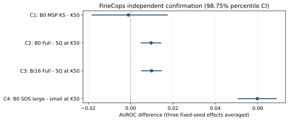
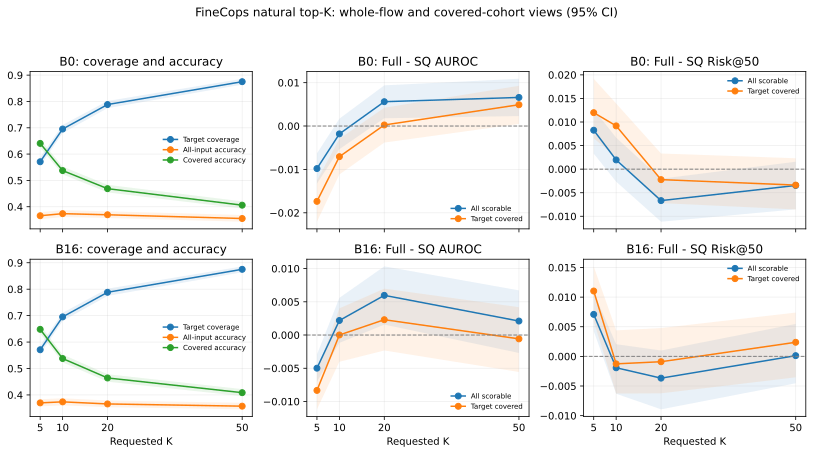

# 候选集合变化下视觉定位的正确性判别可靠性研究

论文论证草稿，已纳入首次正式确认及自然接口的实际结果。数值表图由冻结产物生成；完整方法身份、样本流与区间见 [V3 正文结果表](../results/v3_final_validation/publication/key_findings.md)、[V3 证据索引](../results/v3_final_validation/evidence_index.md) 和 [修补版证据表](../results/research_repair_v1/publication/statistics.md)。这是一份内容草稿，学位格式、引文样式和完整附录仍需按学校要求排版。

## 摘要

候选式视觉定位通常在一组 region proposals 中选择与表达最匹配的框。实际候选集合的规模与组成会改变，但定位准确率、置信度区分正确与错误的能力，以及按置信度接受预测时的风险是不同性质。本文研究固定打分器在候选集合变化下的正确性可靠性，区分目标在场、候选嵌套扩张的受控接口与冻结 RPN 原生 top-K 的自然接口。我们比较分数模型的训练支持及 query–candidate、candidate–candidate 特征来源，并用四角、路径和成对排名分析审计指标变化的统计构成。COCO 上观察到的判别退化未在项目暴露审计后的 FineCops 正例确认中获得支持；加入候选间特征的受控大 K 增量在两个配置中获得确认，大 K 训练的 ScoreDeepSets 也优于小 K 训练版本，但仍未超越简单基线。自然接口揭示进一步边界：小 K 的特征增量反向，中等 K 的整体改善主要体现在候选漏检错误排序，大 K 的覆盖后增量未在两个配置中均获得支持。研究因此贡献一组可追踪的条件性发现和外推边界，而非通用可靠性修复方法或因果机制。全部正式推断条件于既有固定模型，采用共享图像簇抽样；确认结果未用于重新选型。

## 1 引言

同一图像与表达的定位任务可以接受不同的候选集合。候选增加可能提高自然 proposal 的目标召回，也可能引入更具竞争力的错误框。当目标被强制包含、已有候选不被删除、候选打分彼此独立且并列规则固定时，添加错误候选不能纠正原本错误的选择。因此，受控设定下的准确率单调性具有结构性来源；置信度能否有效区分正确与错误则仍需经验评估。

本文关注的是这种正确性判别可靠性，而非一个新的 grounding 架构。最大 softmax 概率可能对候选集规模敏感，预测正确性标签本身也会随集合变化。两者共同决定 AUROC，不能把 AUROC 变化简单解释为概率数值缩小，或仅仅解释为错误数增加。选择性风险进一步考察高置信预测的可用性；概率校准回答输出概率与正确频率是否一致，不能由前两种指标代替。

研究依次回答三个问题：受控集合变化改变了哪些性能性质；已有分数信息的训练支持和不同嵌入特征块提供多少增量；这些发现进入新的项目未使用图像与自然候选接口后，哪些成立、哪些失效。贡献定位于清楚的估计对象、可核查的对照和适用边界，不以增加实验轴数量或形成全部正结果为目标。

全文的论证依赖不是“每个实验都有提升”。受控接口先说明所观察现象的条件，训练支持与特征来源对照再检查现有流程能利用什么信号，解释审计厘清指标构成，最后由新确认与自然接口检验外推。一个信号能迁移而原始退化现象不能迁移，并不矛盾：前者比较两个可靠性预测器，后者比较同一个预测器在两个候选条件下的表现，两者不是同一假设。

## 2 相关工作与定位

proposal-based grounding 的候选召回瓶颈早已受到关注，[一阶段视觉定位](https://openaccess.thecvf.com/content_ICCV_2019/html/Yang_A_Fast_and_Accurate_One-Stage_Approach_to_Visual_Grounding_ICCV_2019_paper.html)据此改变定位架构；[Ref-NMS](https://arxiv.org/abs/2009.01449)通过表达相关性改变 proposal 的保留规则与上下文召回。因此候选组成并不是本研究首次引入的设计轴。

候选关系特征同样有明确先例。[CMRIN](https://arxiv.org/abs/1906.04464)建模 proposal 关系图并引入表达信息，[Variational Context](https://arxiv.org/abs/1712.01892)使用 referent–context 组合。本文不声称提出新的关系表示；所检验的是，在固定 grounding 预测和既定可靠性训练流程下，这类特征来源能否提供额外的正确性排序信号。

grounding 可靠性也不是空白。[SafeGround](https://arxiv.org/abs/2602.02419)根据重复坐标预测的空间分布估计不确定性，并考察采样数与选择性性质；[Zoom Consistency](https://arxiv.org/abs/2604.15376)用放大后定位的几何一致性判断正确性。[Propose and Attend](https://arxiv.org/abs/2607.05978)扩张模型生成池并通过注意力信号重排。这些研究与本文的动机相近，但重复采样数、生成预测数和一个固定 scorer 接收的外部 proposal 数具有不同估计对象，不能混用 K。

[OpenRef](https://arxiv.org/abs/2605.25706)等工作还研究多目标和无目标表达，而本研究的自然评估只涉及正例图像中目标未被 proposal 覆盖的情形。未覆盖不等于图像无目标。[FineCops-Ref](https://arxiv.org/abs/2409.14750)提供组合性表达和官方难度分组，但它的难度不是本文同类候选构造的替代变量。所有新颖性判断的检索日期、纳入范围、正文位置和阅读深度保存在 [文献审查](../reviews/v3_novelty_review.md)；未检索到完全同构工作不构成“首次”的证明。

## 3 研究设计与推断对象

### 3.1 两种候选接口

受控接口选择与官方目标最大 IoU 的 proposal，保留唯一有效目标，其他合法目标框不作为 distractors，再由固定随机排列的前缀构造嵌套候选。主要规模比较使用最大 K 共同可构造样本。它隔离了目标召回改善这一路径，但条件于 GT 辅助构造和可构造性筛选。

自然接口直接取冻结 RPN 原生 NMS 后按 objectness 与稳定身份排序的 top-K。它不强制目标、不清除其他合法目标框、不额外去重，也不填充不足 K 的候选。GT 只进入事后覆盖和正确性标签；多个 IoU≥0.5 的框都可以正确。空候选计为无法输出定位，低于五个有效候选的样本保留基础定位和流失原因，但不伪造现有 Full 特征的可靠性分数。

两接口差异同时包含目标强制、多重合法框和筛选条件；不是只改变一个因素的因果试验。自然结果要分别报告全部输入准确率、目标覆盖率和覆盖条件准确率，再给可评分整体与覆盖条件下的 AUROC/Risk。

令 C 表示呈现的候选覆盖目标、Y 表示输出框正确。在本任务的 IoU 定义下 Y=1 必须满足 C=1，因此全部输入定位准确率满足 P(Y=1)=P(C=1)P(Y=1|C=1)，空候选算流程失败。这个恒等式将 proposal 可达性与覆盖后的选择能力分开，既不要求二者独立，也不把 proposal 漏检当成图像无目标。自然 K 扩张可以新增有效目标，故受控接口的准确率单调性不能直接移植到自然接口。

### 3.2 模型、信息来源与训练支持

grounding 预测在可靠性组间固定。S 是原分数统计；Q 是 query–crop 匹配与相对排名；V 是候选之间的相似度与 density；Full 合并全部块。每组按同一原图像划分、超参数网格和选型规则拟合，标准化只使用训练数据。Full−(S+Q) 估计在这一学习流程中加入 V 后的增量，不要求 Full 最优，也不是同一组权重中删除 V 的因果效应。

V 的若干锚点是 B3 winner 或高排名候选，因此也间接依赖 query-conditioned scorer。来源划分不是统计正交，更不是将视觉语义拆成独立因果因素。候选相似度可以同时反映重复框、外观和上下文，不能直接命名为真实语义混淆。

消融比较的是受限可靠性预测器的性能，不估计条件互信息。一个可由已有输入非线性计算的新增特征也可能帮助线性模型；因此 V 的增益应称为本流程可利用的预测信号，不能据此证明整个分数向量在信息论上不足，或把 AUROC 增量解释为信息量。

训练支持对照固定图像与训练行预算、架构、网格和上限，分别在小 K 或大 K 训练/选型，再评估全部 K。该比较考察既定学习流程的外推；K 改变同时影响分数和标签分布，不能据此独立归因为一个表示机制。训练诊断、确定性 MSP 基线与训练子集拟合检查用于区分实现错误、优化失败和支持外推问题；模型失败不证明分数不含信息。

### 3.3 新确认与统计

FineCops positive train 仅用于开发，positive val 经历史身份、来源映射、文件/像素哈希和近重复筛查后用于确认。基础模型预训练暴露未知，历史元数据与本地像素覆盖分别报告。VG/GQA 命名空间不同不证明非 COCO 来源；确认身份与视觉域外推是不同判断。结构不可用的官方框按性能观察前规则排除，部分越界而仍相交的框保留官方坐标并报告。

正式确认先封存代码、源与派生输入、模型、样本、候选规则和统计协议，再独占建立运行台账。四个主要比较为：B0 MSP 的 K5−K50 AUROC；B0 与 B/16 各自 K50 的 Full−S+Q；B0 K50 的 large-K−small-K trained ScoreDeepSets。C2/C3 分别判断，不平均配置掩盖失败。

5000 次共享 image-cluster bootstrap 保留同图全部表达，每次先在三个固定 seed 内算效应，再求均值；不是预测 ensemble。主要比较给 95% 和 Bonferroni 98.75% percentile 区间，次要分析给边际区间。推断条件于现有模型和学习流程，不覆盖完整训练/搜索随机性。单类 AUROC 和空分母未定义，不填零；区间跨零不能证明无效或等效。

V3 的 Risk@50/80 对边界同分组按所需比例接受，报告名义覆盖量下期望风险；历史 ceil/stable-sort 风险保持原定义。正文必须标记版本，不能将两者当作同一个端点直接比较。

## 4 受控发现与可用信号

受控规模曲线建立准确率、判别和选择性性质的区别。经统计修补后的结果与温度诊断见 [当前摘要](final_result_summary.md) 及原产物。最大 softmax 概率在统一 logit 温度下可能改变跨表达排序；有限温度模型未消除退化不能排除所有尺度机制。

主图来源：[受控接口](../results/research_repair_v1/publication/figure_controlled_interface.svg)、[受控规模端点](../results/research_repair_v1/publication/figure_expansion_endpoints.svg)。[温度诊断](../results/research_repair_v1/publication/figure_temperature_gap.svg)放附录，不将校准和正确性判别混成同一性质。

分数训练支持对照与四组信息来源分析紧接现象，回答“可用信息是什么”而不是堆叠方法名称。matched hard 和固定 K dose 的增量差直接配对计算，不能用一个显著、另一个不显著代替差异比较。候选类别错配、同物体多 proposal 和敏感性交集流失应与最强组成结论一起展示。

B/16 的修补定义复制为已观察 COCO 测试集上的开发性证据。其大 K 与困难组成条件支持 V 的条件性增量，但小 K 不稳定；S+V 可以高于 Full，S+Q 可以低于 S。这限制了“Full 普遍最优”或“query 特征普遍有益”的主张。绝对组性能和成对差分的正式数值见 [V3 证据索引](../results/v3_final_validation/evidence_index.md)，不得把复制升级为新数据确认。

信号图表：[修补版来源分析](../results/research_repair_v1/publication/figure_information_sources.svg)、[训练支持](../results/research_repair_v1/publication/figure_cross_k_training.svg)、[B/16 配置复制](../results/v3_final_validation/publication/figure_b16_source_replication.svg)。完整模型网格放附录，正文只选回答相邻问题的端点。

## 5 解释审计

以两套置信排序和两套 correctness labels 构成四角 A00、A10、A01、A11。标签先切换与置信先切换给出两条路径，对称分配取路径平均，交互项为 I=A11−A10−A01+A00。较小的平均标签分量可以由两个很大的反向路径抵消；比值超过 100% 是有符号分配，不是互斥因果占比。

AUROC 是正确–错误成对排序概率。标签改变同时改变正负组及归一化权重，平均置信值不能决定其效应。[理论分析](theory_analysis_v1.md)及 [冻结预测审计](../results/research_repair_v1/theory_analysis/v1/analysis_report.md)明确四角和排名组变化，并使用共享抽样验证恒等式。这解释指标变化记在何处，不识别模型内部为什么变化。

解释图表：[四角与两路径](../results/research_repair_v1/publication/figure_mechanism_paths.svg)、[成对排名构成](../results/research_repair_v1/theory_analysis/v1/figure_pair_ranking.svg)。正文必须同时讨论路径抵消和交互，不能只展示百分比贡献。

同类数量、冗余和 proposal-family 差异的解释也必须对准所测指标。accuracy harm 不等于 AUROC gap；未匹配所用标注对象不等于框里什么都没有。所测数量解释渠道未获得支持，不代表全部语义竞争机制被否证。

## 6 独立确认与自然边界

### 6.1 一次确认改变了哪些结论

样本流失、四项主要比较的数值及两个区间等级见 [自动生成的正文结果表](../results/v3_final_validation/publication/key_findings.md)；绝对端点和逐 seed 结果见 [完整索引](../results/v3_final_validation/evidence_index.md)。受控共同样本排除目标不被原生库覆盖的表达，以及清除其他合法目标框后不能组成 K50 的表达。自然分析保留这些输入，不将受控共同样本冒充完整确认集。正式前向只执行一次，区间从保存预测计算，没有性能驱动的模型或样本调整。

C1 的调整区间跨零，未确认 B0 MSP 从 K5 到 K50 的 correctness AUROC 退化。与此同时，受控准确率下降、固定覆盖选择风险上升。这是本研究必须呈现的结果：准确率和选择性效用变差，并不要求 AUROC 同步下降。它限制了源 COCO 上的判别退化结论，不能由“不显著”进一步声称两个 K 的判别能力等效。

C2 与 C3 的调整区间各自支持受控 K50 的 Full−S+Q 正增量。因此候选间特征在指定可靠性学习流程中的增量获得了新图像和表达来源上的确认，而不是仅依赖既有 COCO 测试集上的反复分析。增量的绝对幅度有限；B/16 的 S+V 点估计仍高于 Full。论文应同时给出全部特征组的绝对表现，避免用一个较弱的 S+Q 对照暗示 Full 普遍最优。

C4 支持既有大 K 训练版本在确认 K50 上优于小 K 训练版本；其 Risk@50/80 差分也支持改善。但是大 K 版本的绝对 AUROC 仍低于 MSP 和 Stats，三个 seed 的效应大小不同。这个结果支持“训练支持影响这一学习流程的外推”，不支持深模型必然更强、优化已完全解决或完整分数表示存在一般信息限制。

图注：四项主要 AUROC 比较使用同一组共享图像抽样，报告 Bonferroni 98.75% percentile 区间。C1 的正向含义是规模退化；其余比较的正向含义是指定模型的增益。区间条件于三个既有固定 seed，不包含整个重新训练和选型过程的不确定性。

### 6.2 自然候选改变了适用范围

自然接口的覆盖率随 K 增加，但全部输入准确率的点估计没有持续提高；MSP 的整体 AUROC 点估计反而提高。覆盖、覆盖后的选择及正确性排序因此必须分开呈现。这里不额外宣称跨 K 差分显著，也不能用两接口不同样本上的绝对 AUROC 差作为单因素效果。

自然 K5 的 Full−S+Q 增量在两个配置均为负，边际区间支持反向；自然 K20 的整体增量为正，但覆盖条件增量区间均跨零，有符号分解主要将整体增量记入未覆盖错误比较。自然 K50 的 B0 整体和覆盖条件 AUROC 增量获得边际区间支持；B/16 两者均未获得同样支持。不能用一个配置显著、另一个不显著直接证明配置间差异；本轮没有增加这种交互确认比较。

B0 自然 K50 的 AUROC 增量也不能替代所有选择性风险结论：Risk@50 差分区间跨零，Risk@80 差分支持降低。B/16 的相应风险增量证据不足。自然分析属于预先声明的次要外部有效性评估，使用边际区间，不借用四个主要比较的 family-wise 确认身份。

图注：所有输入保留在基础流程统计中；可靠性比较使用明确的可评分分母，覆盖条件是相应 K 的子集。AUROC 差分正向表示 Full 更好，风险差分负向表示 Full 更好。风险采用 V3 的边界同分随机接受定义，不能与历史 ceil/stable 指标直接混用。官方 difficulty 本轮不用于额外的结果驱动确认或挽救主要比较。

### 6.3 整体增益具体记在哪里

自然总体 AUROC 可写为覆盖错误和未覆盖错误两类成对比较的加权平均。Full−S+Q 的两个贡献按各 seed 的错误组成分别计算后平均；整体增量如果来自区分候选漏检，就不能写成覆盖后定位判别普遍改善。该恒等式同样是统计解释，不是漏检的因果效应。

具体而言，令 w=P(C=0|Y=0) 为可评分配对样本中未覆盖错误的权重，A_cov 比较同一批正确预测与覆盖错误，A_miss 比较同一批正确预测与未覆盖错误；所有 AUROC 对并列给半分，则 A_all=(1−w)A_cov+wA_miss。Full 和 S+Q 使用相同 grounding 预测及标签，因此其差分也满足 ΔA_all=(1−w)ΔA_cov+wΔA_miss。w 和两项贡献均在每个 seed、每次图像簇抽样内计算，再平均；不能用均值权重乘均值效应替代。不同 K 的覆盖集合发生变化，所以覆盖条件曲线还包含样本组成变化，不能把其斜率直接称为 K 的因果效应。

## 7 讨论与结论

正式证据支持三项有限贡献。第一，候选变化对准确率、正确性判别和选择性风险的影响需要分开检验：源数据上的判别退化未自动迁移。第二，既定流程中的训练支持和候选间特征增量可以迁移到新确认数据，但不能据此宣称复杂模型或 Full 普遍最优。第三，自然候选中的漏检排序与覆盖后定位排序提供不同解释；只报告整体 AUROC 会掩盖小 K 的反向效果和配置、覆盖条件边界。

这三项贡献构成问题与证据的实证研究。候选上下文、AUROC 成对表达和对称分解均有既有方法依据，实验审计与哈希提高可信度，也不应包装成新的理论或架构贡献。四角分析回答指标变化如何记账，尚未识别模型内部因果机制。

图像来源、表达生成与样本筛选共同变化，不能单独归因于视觉域；FineCops 的新项目身份也不等于基础模型预训练未见。自然结果只覆盖这一冻结 COCO RPN/N64 候选库及两个对应 scorer 配置，不能推广到所有开放候选、生成式 grounding 或无目标任务。模型选择已在源数据中完成，确认没有再次拟合；区间描述固定模型对新图像簇的不确定性，不能取代更多独立训练流程的复制。

研究没有部署层面的校准保证、NONE 分类器或无目标检测结论；M3 仍不可验证。失败路线只在公平对照与可核查边界下具有价值，失败本身不产生理论贡献。完整模型网格、阶段日志、修补、gate、哈希及失败尝试置于附录，正文围绕论证依赖组织。

本轮已达到文献可核查、项目确认身份通过审计、来源复制和自然测量完成的停止条件。接下来将本文扩展为符合学校格式的完整论文，整合自动生成表图和对应附录；不再用更多架构或数据筛选追求全正结果。
