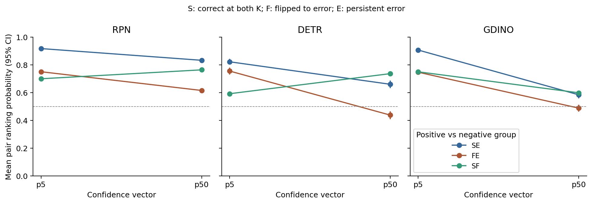

# 候选扩张的理论分析：结构约束、配对排序与四角路径

版本：v1，2026-10-04。本文把现有实验的解释整理为可核验的命题、证明与反例。基础定义来自 [AUC 的排序解释](https://pubmed.ncbi.nlm.nih.gov/7063747/) 和 [Baseline Shapley](https://proceedings.mlr.press/v119/sundararajan20b.html)；对本项目的公式展开、边界和反例属于本项目分析，不声称为新的通用理论方法。

文献阅读深度和限制见[调研留档](../reviews/analysis_literature_review_2026-10-04.md)。实测分析输出见[已有预测的配对排序分析](../results/research_repair_v1/theory_analysis/v1/analysis_report.md)。本轮不增加模型训练、数据集或候选条件；使用已经观察过的测试预测，属于结果驱动的补充分析。

## 1. 研究对象和统一符号

对图像–表达样本 i，两个候选集合分别为 `C_i^0` 和 `C_i^1`，在本次分析中对应 K5、K50。模型在各条件下输出预测框、正确性 `r_i^t` 和置信度 `p_i^t`。置信度用于预测该条件下所选框是否正确。

每个 family 内固定共同 K50 cohort，并按 sentence identity 对齐三 seed。不同 family 可以有不同可行性 cohort，故下文各 family 的并列展示不构成它们之间的配对效果比较。

沿用仓库和历史 CSV 的符号，避免上轮文献笔记自定义的 F/E 命名与已有数据相反：

| 组 | r5 | r50 | 含义 | 英文名 |
|---|---:|---:|---|---|
| S | 1 | 1 | 两端均正确 | stable correct |
| F | 1 | 0 | 由正确转为错误 | flipped to error |
| E | 0 | 0 | 两端均错误 | persistent error |
| G | 0 | 1 | 由错误转为正确 | gained correct |

U_AB(p) 表示 A 组置信度高于 B 组的平均配对胜率，并列算半胜。不跨 seed 合并预测；所有均值均为先按 seed 算完整量再平均。

## 2. 命题一：什么条件下准确率必然不增加？

**条件。** 对每个样本：

1. 小集合严格包含于大集合；原候选及其分数保留。
2. 每个候选的打分独立于其他候选，或至少原候选之间的排序保持不变。
3. tie-breaking 对保留候选使用不变的优先序，不能因重新编号改变原排序。
4. 唯一有效 target 候选保留；新增候选均被协议定义为错误候选。

**结论。** `r50 ≤ r5`，于是 G 为空，准确率差等于 `−nF/N`。

**证明。** 若小集合已经预测错误，则存在原错误候选在分数与 tie-breaking 的联合排序中排在 target 前。该候选及优先关系被保留，增加候选不能使 target 获得第一名。因此小集合错误的样本不能在大集合变为正确。样本只能 S、F 或 E，准确率从 `(nS+nF)/N` 变为 `nS/N`。证毕。

**限制。** 这不是任意 grounding 架构的性质：上下文交互重打分、原候选变化、tie 优先序改变，或新增另一个有效 target 都可能产生 G。即便实际 G=0，也不能反过来证明所有条件成立；协议与输入身份要另外核验。

**论文用途。** 在满足这些条件时，“K 增大导致准确率下降或不变”本身有结构约束，不能将其包装成最主要的新发现。需要分析下降幅度及置信度与正确性关系是否改变。

## 3. 命题二：正确性变化与 AUROC 变化没有同一单调性

对两类均存在的有限样本：

\[
\operatorname{AUC}(r,p)=\frac{1}{n_+n_-}\sum_{i:r_i=1}\sum_{j:r_j=0}
\left[\mathbf1(p_i>p_j)+\tfrac12\mathbf1(p_i=p_j)\right].
\]

固定 r 时，严格递增的标量变换 `h(p)` 保留所有配对胜负和并列，因此保留 AUROC。改变 r 时，正负比较的成员和归一化分母改变，不能引用这种不变性。

**反例。** 三个样本依次是 S/F/E，固定置信度为 `(0.9,0.1,0.5)`。小 K 正类为 S/F，AUROC 为 0.5；大 K 仅 S 为正类，AUROC 为 1。准确率从 2/3 降至 1/3，但 AUROC 上升。若改用 `(0.6,0.9,0.3)`，AUROC 从 1 降至 0.5。故即使 G=0，AUROC 仍可升可降。

这里的反例用于说明指标定义，不是项目真实样本，也不是关于不同构造条件下可部署预测器的独立证据。

## 4. 命题三：用组间配对胜率精确重构四角

以下假设 G=0，且 nS、nE 为正。nF 可以为零；此时涉及 F 的胜率不定义但对应权重为零，应省略该项，不能将未定义胜率伪造为 0。

令

\[
\alpha=\frac{n_F}{n_S+n_F},\qquad \beta=\frac{n_F}{n_F+n_E}.
\]

对任意固定置信度向量 p：

\[
A_5(p)=(1-\alpha)U_{SE}(p)+\alpha U_{FE}(p),
\]

\[
A_{50}(p)=(1-\beta)U_{SE}(p)+\beta U_{SF}(p).
\]

**证明。** 小 K 的正类为 S∪F、负类为 E，配对数分别为 nS·nE 与 nF·nE；将 AUROC 双重求和按组展开并约去公共 nE，得到第一式。大 K 的正类为 S、负类为 F∪E，约去公共 nS 后得到第二式。并列修正逐对相加，故不影响恒等式。证毕。

因此四角为：

\[
A_{00}=A_5(p_5),\quad A_{10}=A_{50}(p_5),\quad
A_{01}=A_5(p_{50}),\quad A_{11}=A_{50}(p_{50}).
\]

这不是首次出现的公式：仓库历史 `group_weight_reconstruction` 与 `pairwise_auc_components.csv` 已实现并保存这些恒等式。此阶段的增量是统一论文符号、展开路径、提供各配对变化及有符号项的正式共享抽样区间，并解释它们如何导致路径反号。

## 5. 命题四：标签路径为什么会反号？

定义固定 p 下的标签切换路径 `L(p)=A50(p)−A5(p)`。由命题三直接得到：

\[
L(p)=\underbrace{\beta[U_{SF}(p)-U_{SE}(p)]}_{T_N(p)}
+\underbrace{\alpha[U_{SE}(p)-U_{FE}(p)]}_{T_R(p)}.
\]

T_N 比较新增的 S–F 配对与原 S–E 配对；T_R 比较移除的 F–E 配对与 S–E 配对。二者都是以 S–E 为共同参照的指标分摊，**不是新增候选对内部过程的干预效应**，也不保证各项符号。

由此，路径为正的充要条件是：

\[
\beta[U_{SF}-U_{SE}]+\alpha[U_{SE}-U_{FE}]>0.
\]

若 `U_SF<U_SE` 且 `U_FE<U_SE`，第一项为负、第二项为正，路径符号取决于两者大小。若 `U_SF>U_SE>U_FE`，两项均为正。若不满足这些次序，直接使用原式，不机械套用“成本/收益”的称谓。

**重要解释。** 正标签路径不意味着把正确预测变错改善了真实任务。它表示指标改变了比较对象：较难与 E 区分的 F 从正类中移走，同时成为 S 的负类。混合四角中的正差不是一个部署系统的准确率收益。

### 5.1 本项目使用的幅度界：准确率损失不能直接限制标签路径

因为三个 U 均在 [0,1]：

\[
|L(p)|\le \max(\alpha,\beta).
\]

**证明。** 将 L 写成 `βU_SF−αU_FE+(α−β)U_SE`。若 α≥β，正系数和为 α、负系数绝对值和也为 α；若 β≥α，两者均为 β。各 U 在 [0,1] 即得结论。这个界可达到：α≥β 时，组分数次序 S>E>F 给出 L=α，反序给出 L=−α；β≥α 时，E>S>F 给出 L=β，反序给出 L=−β。组内可使用相同分数，组间严格分离。证毕。

准确率损失 `rho=nF/N`，而

\[
\alpha=\frac{\rho}{a_5},\qquad \beta=\frac{\rho}{1-a_{50}}.
\]

因此没有一般的 `|L|≤rho` 保证。例：nS=98、nF=1、nE=1，分数满足 E>S>F。准确率仅从 0.99 降至 0.98，α=1/99、β=1/2，AUROC 却从 0 上升至 0.5。这个极端例子说明稀少正/负类的配对归一化可能放大标签成员变化，不说明本项目各 cohort 存在同样幅度。

## 6. 命题五：交互与 Shapley 平均是怎样的关系？

记 `L0=L(p5)`、`L1=L(p50)`、`C0=A01−A00`、`C1=A11−A10`。

\[
I=A_{11}-A_{10}-A_{01}+A_{00}=L_1-L_0=C_1-C_0.
\]

由命题四，固定端点标签分组和权重时：

\[
I=\beta[\Delta U_{SF}-\Delta U_{SE}]
+\alpha[\Delta U_{SE}-\Delta U_{FE}],
\]

其中 `ΔU=U(p50)−U(p5)`。交互表示三种配对排序变化速度与相应权重之间的关系。它不等于 Q/V 特征的语义交互，也不唯一指向某种内部机制。由幅度界还能得到 `|I|≤2 max(α,β)`，但此界不是实际效应的统计置信区间。

两块 Baseline Shapley 的排列平均为：

\[
\phi_L=\tfrac12(L_0+L_1)=L_0+\tfrac12I,\quad
\phi_C=\tfrac12(C_0+C_1)=C_0+\tfrac12I,
\]

\[
\phi_L+\phi_C=A_{11}-A_{00}.
\]

**证明。** 两玩家 L/C 只有两种加入顺序；L 在两种顺序的边际量分别为 L0、L1，C 为 C0、C1。平均后交叉项相消，得到总差。定义的价值函数和玩家对应详见[文献留档 §3](../reviews/analysis_literature_review_2026-10-04.md)。

**抵消反例。** 三个 S/F/E 样本，`p5=(0.6,0.9,0.3)`、`p50=(0.5,0.2,0.8)`。四角为 `(1,0.5,0,0.5)`，故 L0=−0.5、L1=+0.5、φL=0，但 nF/N=1/3，且两条标签路径都不小。这直接否定“净标签分摊为零，因此错误转移无关”的推论。

对下降定义 `D=A00−A11`，分量是 `−φL` 与 `−φC`。某一分量超过 D 仅意味着另一分量抵消，不能解释为独占的因果份额。

## 7. 命题六：置信度路径可定位到哪类排序变化？

固定标签组时，命题三给出：

\[
C_0=(1-\alpha)\Delta U_{SE}+\alpha\Delta U_{FE},
\]

\[
C_1=(1-\beta)\Delta U_{SE}+\beta\Delta U_{SF}.
\]

因此同样的置信度向量替换可以在旧标签和新标签上得到不同方向：它们使用不同的比较对象及权重。“平均 confidence 降了多少”不出现在这些式子中，无法替代组间排名分析。

**可用于正文的解释。** 报告哪种 U 改变、它的权重多大、如何加和为 C0/C1。先解释统计过程，再讨论可能的算法原因。后者不能由恒等式直接推出。

## 8. 命题七：温度与有限学习器失败的解释范围

### 8.1 Argmax 不变不等于跨样本排序不变

对 T>0，统一 logits/T 保持样本内排序及 argmax，见 [Guo 等](https://proceedings.mlr.press/v70/guo17a.html)。但在 K≥3 时，最大 softmax 依赖全部相对 logits，未必是旧 MSP 的共同严格单调函数。

项目反例：两行 `(2,0,0)` 与 `(1,0,−100)`，T 从 1 到 10 后 MSP 大小关系翻转，而两行 argmax 不变。因此不能借 argmax 保证宣称 AUROC 一定不变。

一个有用的特殊情形是 K=2 且所有样本使用同一 T：MSP=`sigmoid(|s1−s2|/T)`，所以跨样本排序由同一 margin 决定。这个二分类保证不能推广到本项目 K5/10/20/50。

### 8.2 确定性分数基线已经约束“信息不足”的主张

设 X 为完整原始分数向量（长度包含 K），MSP 为固定 T 下的确定性函数 g(X)。若函数类 H 包含 g，则在同一已定义评估分布上：

\[
\sup_{h\in H}\operatorname{AUC}(r,h(X))\ge\operatorname{AUC}(r,g(X)).
\]

**证明。** 上确界至少包含 g 这一可选函数的值。证毕。

这条简单界说明，某个已训练 ScoreDeepSets 低于 MSP，并不能证明完整分数向量没有 MSP 所使用的信息。它可能是函数类、优化、选型或训练支持的限制。这里 H 的范围是显式前提；不保证实际 ScoreDeepSets 实现能精确表示 g，也不证明 Bayes 性能已达到。

同理，有限 Logistic 的 Full−(S+Q) 增益是指定学习流程下的增量效用，不能直接等同于 oracle 变量重要性或信息必要性，参见 [Williamson 等](https://pmc.ncbi.nlm.nih.gov/articles/PMC10652709/)。失败可以被解释与保留，不需无限调参使它变为正结果。

## 9. 经验核验如何与理论对应？

本轮分析直接读取 18 份冻结 K5/K50 预测，按 sentence_id 和 image_id 对齐，复核既有 C1 锚点、历史 pairwise 胜率及修补四角。保持原 `1e-12` 恒等式/锚点容差，不为通过检查放宽。

新增量是上述 T_N/T_R、ΔU、置信度配对分量和 I 分项的区间。正式设置为 5,000 次共享 image-cluster bootstrap、seed=0、95% percentile；在每次抽样和各 seed 内重新计算组数量、α/β、U 和完整项，再平均 seed 效应。不能用平均权重乘平均 U 代替它。

原有正确四角不被新近似值取代。新程序用 tie-aware 加权配对计算优化速度：先保存原分数的 tie groups，再让抽样图像只改变行的整数重数。每个有序组对的胜数为：

\[
\sum_v w_A(v)\left[\sum_{u<v}w_B(u)+\tfrac12w_B(v)\right].
\]

除以组总质量的乘积，等价于显式复制样本后的 Mann–Whitney AUROC。新抽样的四角与 I 会逐 replicate 对照旧 raw bootstrap 锚点，而不是只检查最终 CI。

含并列、图像重复抽样、缺少 F、单类样本和 G 非空的边界有专门测试。单类 AUROC 和无定义配对保持 NaN 并计无效次数，不填零。完整证据及图表由产物生成：

- [配对项与区间报告](../results/research_repair_v1/theory_analysis/v1/analysis_report.md)
- [逐 seed 点估计](../results/research_repair_v1/theory_analysis/v1/point_components.csv)
- [所有正式区间](../results/research_repair_v1/theory_analysis/v1/bootstrap_ci.csv)
- [来源、哈希、状态与数值核验](../results/research_repair_v1/theory_analysis/v1/manifest.json)
- [组间排序图](../results/research_repair_v1/theory_analysis/v1/figure_pair_ranking.png)

<!-- GENERATED_INTERPRETATION_START -->

### 已有数据支持的路径解释

| Family | T_N(p5) | T_R(p5) | L0 | T_N(p50) | T_R(p50) | L1 |
|---|---:|---:|---:|---:|---:|---:|
| RPN | -0.137353 | +0.076221 | -0.061132 | -0.043410 | +0.099332 | +0.055922 |
| DETR | -0.163966 | +0.022414 | -0.141553 | +0.054596 | +0.074625 | +0.129221 |
| GDINO | -0.113538 | +0.075853 | -0.037685 | +0.010468 | +0.045507 | +0.055975 |

数值为逐 seed 计算后的均值；完整 CI 见配对报告。所有 p5 路径中负的新比较项超过正的移除比较项。
RPN 的 p50 新比较项仍为负，但移除比较项更大，导致 L1 为正。DETR 的 p50 两项均稳定为正。
GDINO 的 p50 移除比较项为正；新比较项点估计为正但区间跨零，不宣称该项稳定为正。

| Family | delta U_SE（95% CI） | delta U_FE（95% CI） | delta U_SF（95% CI） |
|---|---:|---:|---:|
| RPN | -0.084509 [-0.094875, -0.074929] | -0.135124 [-0.150930, -0.119720] | +0.064281 [+0.051043, +0.077785] |
| DETR | -0.162167 [-0.195944, -0.129849] | -0.317673 [-0.353896, -0.283048] | +0.144665 [+0.122269, +0.167420] |
| GDINO | -0.322921 [-0.350842, -0.295362] | -0.258976 [-0.289720, -0.229233] | -0.151456 [-0.175351, -0.128502] |

RPN/DETR 的 SF 排序改善，但 SE/FE 排序变差；GDINO 三种排序都变差。
这一组间变化通过命题六精确形成 C0/C1 的不同方向。它不是平均置信度变化，也不是内部原因的唯一识别。
尤其是 GDINO：I 为正并不表示 SF 排序改善，而是 SF 比 SE 下降得慢；正交互不能直接写成语义协同增强。

图中每个配对把第一个组作为分析正组、第二个组作为分析负组；这只是 U_AB 的比较方向。
它不表示两种 K 下的真实正确性标签始终相反，例如 SF 在小 K 下都属于正确预测。

<!-- GENERATED_INTERPRETATION_END -->

## 10. 解释审计与因果识别的界线

现有设计可以比较冻结输入下、明确候选构造操作造成的输出变化；并非所有受控计算比较都只有无意义的相关性。但 K 的标量不唯一指定新增候选内容，条件结果不能自动推广到任意自然候选生成过程。

四角混合量还涉及另一个问题：`A10` 用大 K 的正确性标签评价小 K 对所选框的置信度，两个条件的所选框可能不同。它是指标审计对象，不自动等于一个可部署系统，也不自动成为潜在结果 `Y(t,M(t'))`。

[Pearl 的直接/间接效应](https://ftp.cs.ucla.edu/pub/stat_ser/R273-U.pdf)、[Imai 等的中介识别](https://imai.fas.harvard.edu/research/files/BaronKenny.pdf) 和 [causal Shapley](https://proceedings.neurips.cc/paper_files/paper/2020/hash/32e54441e6382a7fbacbbbaf3c450059-Abstract.html) 都需要超出普通指标数组替换的反事实/干预定义与假设。当前理论不提供这些识别条件。

因此，U、T_N/T_R 和 I 可以解释**指标差由哪些比较关系组成**，还不能回答相似语义、重复物体、尺度或视觉表示之中哪一项是唯一内部原因。结果定义的 S/F/E 组不是预处理因果分层，组间差异也不是被随机分配的机制干预。

正确的结论等级是：结构命题和指标恒等式有证明；路径抵消与配对变化有条件实测证据；唯一内部因果机制仍未识别。

## 11. 进入论文时如何组织？

理论无需成为脱离结果的大章。建议在定义章节给出命题一和 AUROC 配对定义；在结果章节的问题递进中使用命题三至六解释四角；其余证明、反例与数值复核放附录。

主分析图按下面顺序组织：

1. 四角与双路径：先展示反号及抵消，说明仅看 φL 会漏掉什么。
2. S/F/E 配对排序图：解释实际比较对象及哪些排名变差/变好。
3. T_N/T_R 与 C0/C1 的有符号项：将组间变化精确连接回路径与交互。

正文贡献可写为“在受控候选扩张下，展示正确性成员变化与置信度配对排序变化如何共同进入可靠性指标，并据此限制过强归因”。不要写成“提出新 Shapley 理论”“证明语义机制”“完整识别因果中介”或“百分之百解释所有退化”。

理论的价值在于提出可复核、可被反例约束的判断，并使现有结果相互衔接；不是把已有定义改写成复杂符号来扩大贡献。
