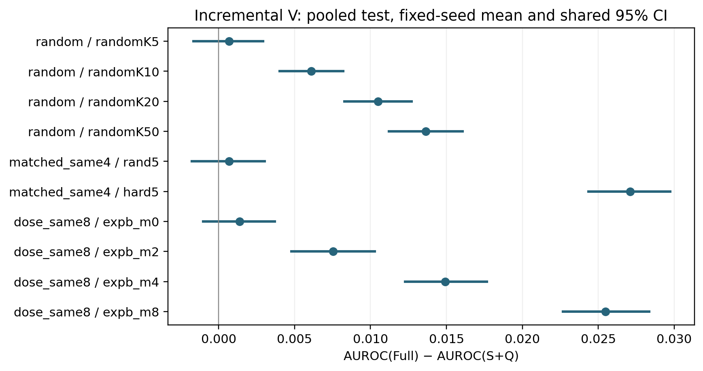
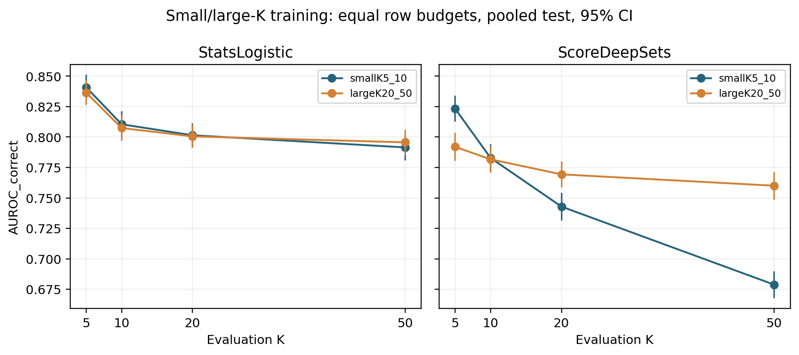

# Incremental candidate–candidate information

Stored shared image-cluster intervals, 5000 draws, seed 0, 95% percentile.

Effects are computed within each of three fixed B3 model seeds and then averaged. Grounding is fixed within each feature comparison on the GT-assisted target-present common cohort. These are conditional cellwise estimates on previously observed test distributions.

| scope | cell | K | eval_split | contrast | metric | point | ci_low | ci_high | valid_replicates | invalid_replicates |
| --- | --- | --- | --- | --- | --- | --- | --- | --- | --- | --- |
| random | randomK5 | 5 | testA | Full_minus_S_plus_Q | auroc_correct | -0.0011679707007749747 | -0.003927031607286075 | 0.0016276075381856864 | 5000 | 0 |
| random | randomK10 | 10 | testA | Full_minus_S_plus_Q | auroc_correct | 0.0049205804168280425 | 0.0022518168529736342 | 0.007682231320610397 | 5000 | 0 |
| random | randomK20 | 20 | testA | Full_minus_S_plus_Q | auroc_correct | 0.010751652206710852 | 0.007914260259147323 | 0.013700566714328134 | 5000 | 0 |
| random | randomK50 | 50 | testA | Full_minus_S_plus_Q | auroc_correct | 0.013293312711352737 | 0.010185799780782611 | 0.016372109174893304 | 5000 | 0 |
| random | randomK5 | 5 | testB | Full_minus_S_plus_Q | auroc_correct | 0.0030864546768375467 | -0.0007508359477679615 | 0.006925938566230438 | 5000 | 0 |
| random | randomK10 | 10 | testB | Full_minus_S_plus_Q | auroc_correct | 0.008055653179602032 | 0.004470474785605558 | 0.011633044513333777 | 5000 | 0 |
| random | randomK20 | 20 | testB | Full_minus_S_plus_Q | auroc_correct | 0.010937037101767114 | 0.007200614481342638 | 0.014648108104426023 | 5000 | 0 |
| random | randomK50 | 50 | testB | Full_minus_S_plus_Q | auroc_correct | 0.015593714106784303 | 0.011431169551498943 | 0.01973649057827882 | 5000 | 0 |
| random | randomK5 | 5 | __pooled_test__ | Full_minus_S_plus_Q | auroc_correct | 0.0006789573899348422 | -0.0016562629668562283 | 0.0029223020552721357 | 5000 | 0 |
| random | randomK10 | 10 | __pooled_test__ | Full_minus_S_plus_Q | auroc_correct | 0.0060972782868638315 | 0.004016782749604756 | 0.00821502960930366 | 5000 | 0 |
| random | randomK20 | 20 | __pooled_test__ | Full_minus_S_plus_Q | auroc_correct | 0.010500939883926197 | 0.008289699318758451 | 0.012696583317168542 | 5000 | 0 |
| random | randomK50 | 50 | __pooled_test__ | Full_minus_S_plus_Q | auroc_correct | 0.013637994191101788 | 0.011201818650386698 | 0.016070190050054882 | 5000 | 0 |
| matched_same4 | rand5 | 5 | testA | Full_minus_S_plus_Q | auroc_correct | -0.0011406512988145767 | -0.004114135085864516 | 0.0017141913724926252 | 5000 | 0 |
| matched_same4 | hard5 | 5 | testA | Full_minus_S_plus_Q | auroc_correct | 0.02421675008012425 | 0.020836346579177153 | 0.027544972413026874 | 5000 | 0 |
| matched_same4 | rand5 | 5 | testB | Full_minus_S_plus_Q | auroc_correct | 0.003286415322106606 | -0.000974889291181968 | 0.007535688225737873 | 5000 | 0 |
| matched_same4 | hard5 | 5 | testB | Full_minus_S_plus_Q | auroc_correct | 0.03477000522342333 | 0.029751384950580332 | 0.03967810253192349 | 5000 | 0 |
| matched_same4 | rand5 | 5 | __pooled_test__ | Full_minus_S_plus_Q | auroc_correct | 0.0006945581668402016 | -0.0017631129710902274 | 0.003032586059098472 | 5000 | 0 |
| matched_same4 | hard5 | 5 | __pooled_test__ | Full_minus_S_plus_Q | auroc_correct | 0.02708934282260078 | 0.02433759673090369 | 0.02974361787257281 | 5000 | 0 |
| dose_same8 | expb_m0 | 10 | testA | Full_minus_S_plus_Q | auroc_correct | 0.00024103909456318906 | -0.002593147961167426 | 0.003225329412805688 | 5000 | 0 |
| dose_same8 | expb_m2 | 10 | testA | Full_minus_S_plus_Q | auroc_correct | 0.004804308214589252 | 0.001511807910838479 | 0.008221371159806428 | 5000 | 0 |
| dose_same8 | expb_m4 | 10 | testA | Full_minus_S_plus_Q | auroc_correct | 0.013300545311634973 | 0.00978514475521663 | 0.016832303179282863 | 5000 | 0 |
| dose_same8 | expb_m8 | 10 | testA | Full_minus_S_plus_Q | auroc_correct | 0.024833279918117235 | 0.021420197418751674 | 0.028252973479855212 | 5000 | 0 |
| dose_same8 | expb_m0 | 10 | testB | Full_minus_S_plus_Q | auroc_correct | 0.0029235756772584645 | -0.00144024656594126 | 0.007406297658717823 | 5000 | 0 |
| dose_same8 | expb_m2 | 10 | testB | Full_minus_S_plus_Q | auroc_correct | 0.01240940315617615 | 0.007174124291779553 | 0.01780491941071424 | 5000 | 0 |
| dose_same8 | expb_m4 | 10 | testB | Full_minus_S_plus_Q | auroc_correct | 0.02026372703045391 | 0.015307652241002317 | 0.02521390283167907 | 5000 | 0 |
| dose_same8 | expb_m8 | 10 | testB | Full_minus_S_plus_Q | auroc_correct | 0.031149814274789134 | 0.025386048443704047 | 0.03705971295491892 | 5000 | 0 |
| dose_same8 | expb_m0 | 10 | __pooled_test__ | Full_minus_S_plus_Q | auroc_correct | 0.001379262749921062 | -0.00100597377432028 | 0.003688418410203349 | 5000 | 0 |
| dose_same8 | expb_m2 | 10 | __pooled_test__ | Full_minus_S_plus_Q | auroc_correct | 0.0075429466694050635 | 0.004784257213450247 | 0.01027179381217137 | 5000 | 0 |
| dose_same8 | expb_m4 | 10 | __pooled_test__ | Full_minus_S_plus_Q | auroc_correct | 0.014917409282953412 | 0.01229084845741699 | 0.01766536431691774 | 5000 | 0 |
| dose_same8 | expb_m8 | 10 | __pooled_test__ | Full_minus_S_plus_Q | auroc_correct | 0.025463534545424604 | 0.02266963603644719 | 0.028347898428729076 | 5000 | 0 |

Incremental V signal is not uniformly resolved across reported cells. The central claim is limited to the measured cellwise effects; no general candidate-interaction conclusion follows.

All test data are evaluated after tune selection. Plotted absolute intervals do not replace paired regime/DoD intervals.
