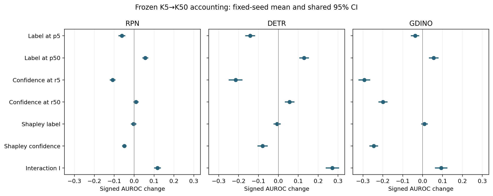

# Four corners, signed paths and interaction

Stored shared image-cluster intervals, 5000 draws, seed 0, 95% percentile.

| family | estimate | formula | point_mean3 | ci_low_mean3 | ci_high_mean3 | seed_standard_deviation | valid_replicates | invalid_replicates |
| --- | --- | --- | --- | --- | --- | --- | --- | --- |
| RPN | A00 | AUROC(r5, p5) | 0.8407200372791596 | 0.8315338742159132 | 0.8501699517836544 | 0.002493628924755589 | 5000 | 0 |
| RPN | A10 | AUROC(r50, p5) | 0.7795883609130826 | 0.7685556309988132 | 0.7907461998452615 | 0.0010918393039858162 | 5000 | 0 |
| RPN | A01 | AUROC(r5, p50) | 0.7331001558658256 | 0.7198690992613802 | 0.7455796606480866 | 0.007777264576193252 | 5000 | 0 |
| RPN | A11 | AUROC(r50, p50) | 0.7890224259559516 | 0.7786945190937232 | 0.7987138510696156 | 0.0031206344983223736 | 5000 | 0 |
| RPN | L_at_p5 | A10 - A00 | -0.061131676366077047 | -0.07569859603397529 | -0.046925954176842824 | 0.0026625187467776805 | 5000 | 0 |
| RPN | L_at_p50 | A11 - A01 | 0.05592227009012599 | 0.044541233372471976 | 0.06796557940541516 | 0.00477485302285493 | 5000 | 0 |
| RPN | C_at_r5 | A01 - A00 | -0.10761988141333396 | -0.11943407238289715 | -0.09646964137120008 | 0.005301571412808376 | 5000 | 0 |
| RPN | C_at_r50 | A11 - A10 | 0.00943406504286907 | -0.0009152337786663755 | 0.019978674685756998 | 0.0029066548300994625 | 5000 | 0 |
| RPN | interaction_I | A11 - A10 - A01 + A00 = L_at_p50 - L_at_p5 = C_at_r50 - C_at_r5 | 0.11705394645620304 | 0.10358948660075942 | 0.13146727986322265 | 0.002507040936137969 | 5000 | 0 |
| RPN | shapley_label_delta | 0.5 * (L_at_p5 + L_at_p50) | -0.0026047031379755245 | -0.013611844477594953 | 0.008414586101407783 | 0.0036568839425851125 | 5000 | 0 |
| RPN | shapley_confidence_delta | 0.5 * (C_at_r5 + C_at_r50) | -0.04909290818523245 | -0.057584015154519406 | -0.04074931730306049 | 0.004087338658510679 | 5000 | 0 |
| RPN | D_total | A00 - A11 | 0.05169761132320797 | 0.03982718304878724 | 0.063554917954432 | 0.0010736990453657693 | 5000 | 0 |
| RPN | D_label | -shapley_label_delta | 0.0026047031379755245 | -0.008414586101407794 | 0.01361184447759495 | 0.0036568839425851125 | 5000 | 0 |
| RPN | D_confidence | -shapley_confidence_delta | 0.04909290818523245 | 0.04074931730306049 | 0.0575840151545194 | 0.004087338658510679 | 5000 | 0 |
| RPN | shapley_identity_residual | D_total - D_label - D_confidence | 0.0 | 0.0 | 0.0 | 0.0 | 5000 | 0 |
| DETR | A00 | AUROC(r5, p5) | 0.7993564000651058 | 0.7785128618209366 | 0.820369619084068 | 0.004942224201592361 | 5000 | 0 |
| DETR | A10 | AUROC(r50, p5) | 0.657803688333627 | 0.6424893742724186 | 0.672595031119694 | 0.0024696943214655006 | 5000 | 0 |
| DETR | A01 | AUROC(r5, p50) | 0.5849782657400164 | 0.557735931243498 | 0.6106605653672318 | 0.003314966287412442 | 5000 | 0 |
| DETR | A11 | AUROC(r50, p50) | 0.7141993664275684 | 0.7001320152026916 | 0.728078656392971 | 0.0037918787033741474 | 5000 | 0 |
| DETR | L_at_p5 | A10 - A00 | -0.14155271173147865 | -0.16356978177867254 | -0.11987692315301897 | 0.0028633379331068232 | 5000 | 0 |
| DETR | L_at_p50 | A11 - A01 | 0.12922110068755208 | 0.10815632762119298 | 0.15086015811322154 | 0.00243358920927284 | 5000 | 0 |
| DETR | C_at_r5 | A01 - A00 | -0.21437813432508926 | -0.2472908630152646 | -0.18296173288745166 | 0.002448415825363288 | 5000 | 0 |
| DETR | C_at_r50 | A11 - A10 | 0.05639567809394145 | 0.03549274459294882 | 0.07761715685258128 | 0.0025440132051037425 | 5000 | 0 |
| DETR | interaction_I | A11 - A10 - A01 + A00 = L_at_p50 - L_at_p5 = C_at_r50 - C_at_r5 | 0.2707738124190307 | 0.24119959890055548 | 0.3023480984723516 | 0.0016205659999054354 | 5000 | 0 |
| DETR | shapley_label_delta | 0.5 * (L_at_p5 + L_at_p50) | -0.006165805521963293 | -0.02106660718321141 | 0.009076286459435949 | 0.00253060699029234 | 5000 | 0 |
| DETR | shapley_confidence_delta | 0.5 * (C_at_r5 + C_at_r50) | -0.07899122811557391 | -0.10183035421476427 | -0.056167760306015384 | 0.0023615277006216605 | 5000 | 0 |
| DETR | D_total | A00 - A11 | 0.0851570336375372 | 0.06094217203313324 | 0.10894670820233976 | 0.004820193307912833 | 5000 | 0 |
| DETR | D_label | -shapley_label_delta | 0.006165805521963293 | -0.009076286459435949 | 0.0210666071832114 | 0.00253060699029234 | 5000 | 0 |
| DETR | D_confidence | -shapley_confidence_delta | 0.07899122811557391 | 0.056167760306015384 | 0.10183035421476426 | 0.0023615277006216605 | 5000 | 0 |
| DETR | shapley_identity_residual | D_total - D_label - D_confidence | 0.0 | 0.0 | 0.0 | 0.0 | 5000 | 0 |
| GDINO | A00 | AUROC(r5, p5) | 0.8307571362976516 | 0.8159473649110157 | 0.8454430171123604 | 0.002547522370868291 | 5000 | 0 |
| GDINO | A10 | AUROC(r50, p5) | 0.7930723936936545 | 0.7803212951187709 | 0.8060035804865311 | 0.0025479164173215388 | 5000 | 0 |
| GDINO | A01 | AUROC(r5, p50) | 0.5381830779811633 | 0.5142748602276876 | 0.5622242438402622 | 0.0020714033260242366 | 5000 | 0 |
| GDINO | A11 | AUROC(r50, p50) | 0.5941576892735677 | 0.5778491208699077 | 0.6108337975232785 | 0.007288591880556325 | 5000 | 0 |
| GDINO | L_at_p5 | A10 - A00 | -0.03768474260399712 | -0.05593787159452537 | -0.019861421746461192 | 0.0027388967575595643 | 5000 | 0 |
| GDINO | L_at_p50 | A11 - A01 | 0.05597461129240455 | 0.03477497687698559 | 0.0776875388564863 | 0.008671047995575859 | 5000 | 0 |
| GDINO | C_at_r5 | A01 - A00 | -0.29257405831648836 | -0.31925174535087947 | -0.26605099048978664 | 0.003516361015968565 | 5000 | 0 |
| GDINO | C_at_r50 | A11 - A10 | -0.1989147044200867 | -0.21952292015536998 | -0.17897882389702366 | 0.00549462080041069 | 5000 | 0 |
| GDINO | interaction_I | A11 - A10 - A01 + A00 = L_at_p50 - L_at_p5 = C_at_r50 - C_at_r5 | 0.09365935389640168 | 0.06546258218558641 | 0.12180765925084831 | 0.008813700090850248 | 5000 | 0 |
| GDINO | shapley_label_delta | 0.5 * (L_at_p5 + L_at_p50) | 0.009144934344203715 | -0.004540390920905503 | 0.023026258171861155 | 0.004682305743136793 | 5000 | 0 |
| GDINO | shapley_confidence_delta | 0.5 * (C_at_r5 + C_at_r50) | -0.24574438136828755 | -0.2647632504202532 | -0.2268283861392963 | 0.0013629009298555908 | 5000 | 0 |
| GDINO | D_total | A00 - A11 | 0.23659944702408384 | 0.21726347135791352 | 0.25649103946678287 | 0.005162465472601581 | 5000 | 0 |
| GDINO | D_label | -shapley_label_delta | -0.009144934344203715 | -0.02302625817186116 | 0.0045403909209054995 | 0.004682305743136793 | 5000 | 0 |
| GDINO | D_confidence | -shapley_confidence_delta | 0.24574438136828755 | 0.22682838613929626 | 0.2647632504202532 | 0.0013629009298555908 | 5000 | 0 |
| GDINO | shapley_identity_residual | D_total - D_label - D_confidence | 0.0 | 0.0 | 0.0 | 0.0 | 5000 | 0 |

Exact accounting; no causal identification.

Observed label path means have opposite signs in RPN, DETR, GDINO. The signed Shapley mean can conceal this cancellation; the accounting does not identify a cause.
