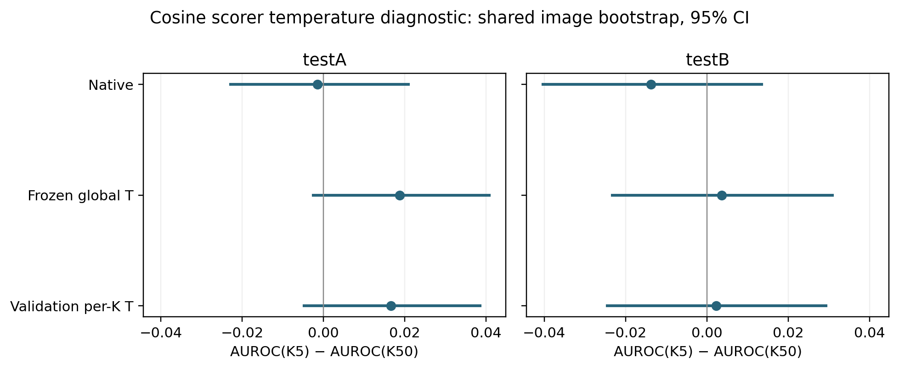
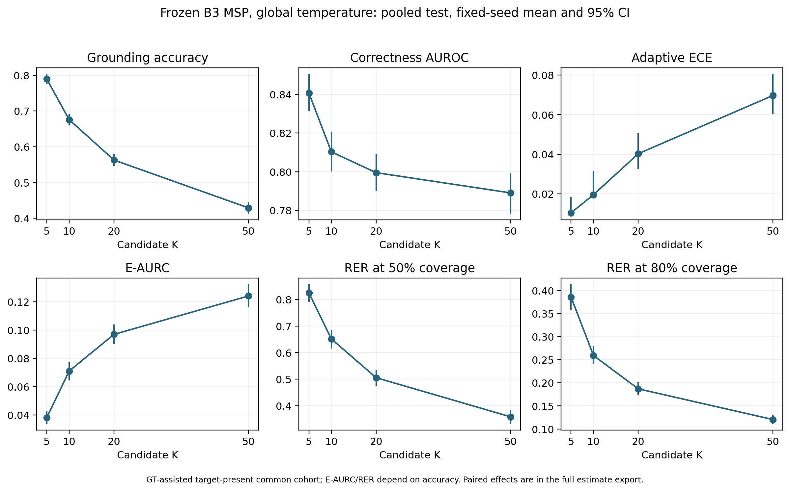

# Artifact-derived formal statistical evidence

Absolute endpoints are descriptive; paired contrasts and their intervals
are preserved in [the complete export](formal_statistics.csv).

| Scope | Cohort | Endpoint | Unit | Point | 95% CI | Seeds | Valid / invalid draws | Anchor |
|---|---|---|---|---|---|---|---|---|
| Phase0A_B0_temperature | testA | K5__native::accuracy | fraction | 0.549061 | [0.530518, 0.567553] | 1 | 5000 / 0 | PASS |
| Phase0A_B0_temperature | testA | K5__native::auroc_correct | fraction | 0.743958 | [0.727815, 0.760285] | 1 | 5000 / 0 | PASS |
| Phase0A_B0_temperature | testA | K5__native::e_aurc | fraction | 0.138590 | [0.126171, 0.150997] | 1 | 5000 / 0 | PASS |
| Phase0A_B0_temperature | testA | K5__native::rer_at_50 | fraction | 0.395915 | [0.357854, 0.432177] | 1 | 5000 / 0 | PASS |
| Phase0A_B0_temperature | testA | K5__native::ece_adaptive | fraction | 0.252563 | [0.236813, 0.268821] | 1 | 5000 / 0 | PASS |
| Phase0A_B0_temperature | testA | K5__global_T::accuracy | fraction | 0.549061 | [0.530518, 0.567553] | 1 | 5000 / 0 | PASS |
| Phase0A_B0_temperature | testA | K5__global_T::auroc_correct | fraction | 0.745699 | [0.729319, 0.762699] | 1 | 5000 / 0 | PASS |
| Phase0A_B0_temperature | testA | K5__global_T::e_aurc | fraction | 0.138075 | [0.125605, 0.150138] | 1 | 5000 / 0 | PASS |
| Phase0A_B0_temperature | testA | K5__global_T::rer_at_50 | fraction | 0.399843 | [0.363328, 0.441483] | 1 | 5000 / 0 | PASS |
| Phase0A_B0_temperature | testA | K5__global_T::ece_adaptive | fraction | 0.026726 | [0.023063, 0.045848] | 1 | 5000 / 0 | PASS |
| Phase0A_B0_temperature | testA | K5__validation_perK_diagnostic::accuracy | fraction | 0.549061 | [0.530518, 0.567553] | 1 | 5000 / 0 | NO_LEGACY_POINT_ANCHOR |
| Phase0A_B0_temperature | testA | K5__validation_perK_diagnostic::auroc_correct | fraction | 0.745542 | [0.729092, 0.762542] | 1 | 5000 / 0 | NO_LEGACY_POINT_ANCHOR |
| Phase0A_B0_temperature | testA | K5__validation_perK_diagnostic::e_aurc | fraction | 0.138150 | [0.125666, 0.150223] | 1 | 5000 / 0 | NO_LEGACY_POINT_ANCHOR |
| Phase0A_B0_temperature | testA | K5__validation_perK_diagnostic::rer_at_50 | fraction | 0.398272 | [0.362827, 0.441169] | 1 | 5000 / 0 | NO_LEGACY_POINT_ANCHOR |
| Phase0A_B0_temperature | testA | K5__validation_perK_diagnostic::ece_adaptive | fraction | 0.027647 | [0.024512, 0.048106] | 1 | 5000 / 0 | NO_LEGACY_POINT_ANCHOR |
| Phase0A_B0_temperature | testA | K10__native::accuracy | fraction | 0.404888 | [0.386598, 0.423321] | 1 | 5000 / 0 | PASS |
| Phase0A_B0_temperature | testA | K10__native::auroc_correct | fraction | 0.734182 | [0.716945, 0.751941] | 1 | 5000 / 0 | PASS |
| Phase0A_B0_temperature | testA | K10__native::e_aurc | fraction | 0.171796 | [0.157635, 0.185975] | 1 | 5000 / 0 | PASS |
| Phase0A_B0_temperature | testA | K10__native::rer_at_50 | fraction | 0.267857 | [0.241093, 0.300000] | 1 | 5000 / 0 | PASS |
| Phase0A_B0_temperature | testA | K10__native::ece_adaptive | fraction | 0.305173 | [0.288790, 0.321520] | 1 | 5000 / 0 | PASS |
| Phase0A_B0_temperature | testA | K10__global_T::accuracy | fraction | 0.404888 | [0.386598, 0.423321] | 1 | 5000 / 0 | PASS |
| Phase0A_B0_temperature | testA | K10__global_T::auroc_correct | fraction | 0.730419 | [0.712085, 0.748207] | 1 | 5000 / 0 | PASS |
| Phase0A_B0_temperature | testA | K10__global_T::e_aurc | fraction | 0.174554 | [0.160197, 0.188944] | 1 | 5000 / 0 | PASS |
| Phase0A_B0_temperature | testA | K10__global_T::rer_at_50 | fraction | 0.269048 | [0.241942, 0.301999] | 1 | 5000 / 0 | PASS |
| Phase0A_B0_temperature | testA | K10__global_T::ece_adaptive | fraction | 0.026800 | [0.022744, 0.046169] | 1 | 5000 / 0 | PASS |
| Phase0A_B0_temperature | testA | K10__validation_perK_diagnostic::accuracy | fraction | 0.404888 | [0.386598, 0.423321] | 1 | 5000 / 0 | NO_LEGACY_POINT_ANCHOR |
| Phase0A_B0_temperature | testA | K10__validation_perK_diagnostic::auroc_correct | fraction | 0.730623 | [0.712286, 0.748392] | 1 | 5000 / 0 | NO_LEGACY_POINT_ANCHOR |
| Phase0A_B0_temperature | testA | K10__validation_perK_diagnostic::e_aurc | fraction | 0.174398 | [0.160050, 0.188778] | 1 | 5000 / 0 | NO_LEGACY_POINT_ANCHOR |
| Phase0A_B0_temperature | testA | K10__validation_perK_diagnostic::rer_at_50 | fraction | 0.270238 | [0.242717, 0.302677] | 1 | 5000 / 0 | NO_LEGACY_POINT_ANCHOR |
| Phase0A_B0_temperature | testA | K10__validation_perK_diagnostic::ece_adaptive | fraction | 0.023634 | [0.021460, 0.043579] | 1 | 5000 / 0 | NO_LEGACY_POINT_ANCHOR |
| Phase0A_B0_temperature | testA | K20__native::accuracy | fraction | 0.304463 | [0.286729, 0.322323] | 1 | 5000 / 0 | PASS |
| Phase0A_B0_temperature | testA | K20__native::auroc_correct | fraction | 0.746145 | [0.728615, 0.763340] | 1 | 5000 / 0 | PASS |
| Phase0A_B0_temperature | testA | K20__native::e_aurc | fraction | 0.174220 | [0.161037, 0.187618] | 1 | 5000 / 0 | PASS |
| Phase0A_B0_temperature | testA | K20__native::rer_at_50 | fraction | 0.210593 | [0.186231, 0.235591] | 1 | 5000 / 0 | PASS |
| Phase0A_B0_temperature | testA | K20__native::ece_adaptive | fraction | 0.314894 | [0.299509, 0.330793] | 1 | 5000 / 0 | PASS |
| Phase0A_B0_temperature | testA | K20__global_T::accuracy | fraction | 0.304463 | [0.286729, 0.322323] | 1 | 5000 / 0 | PASS |
| Phase0A_B0_temperature | testA | K20__global_T::auroc_correct | fraction | 0.737660 | [0.719819, 0.755163] | 1 | 5000 / 0 | PASS |
| Phase0A_B0_temperature | testA | K20__global_T::e_aurc | fraction | 0.180555 | [0.167166, 0.194377] | 1 | 5000 / 0 | PASS |
| Phase0A_B0_temperature | testA | K20__global_T::rer_at_50 | fraction | 0.209065 | [0.181154, 0.230659] | 1 | 5000 / 0 | PASS |
| Phase0A_B0_temperature | testA | K20__global_T::ece_adaptive | fraction | 0.043623 | [0.034445, 0.061438] | 1 | 5000 / 0 | PASS |
| Phase0A_B0_temperature | testA | K20__validation_perK_diagnostic::accuracy | fraction | 0.304463 | [0.286729, 0.322323] | 1 | 5000 / 0 | NO_LEGACY_POINT_ANCHOR |
| Phase0A_B0_temperature | testA | K20__validation_perK_diagnostic::auroc_correct | fraction | 0.738496 | [0.720588, 0.755903] | 1 | 5000 / 0 | NO_LEGACY_POINT_ANCHOR |
| Phase0A_B0_temperature | testA | K20__validation_perK_diagnostic::e_aurc | fraction | 0.179961 | [0.166626, 0.193745] | 1 | 5000 / 0 | NO_LEGACY_POINT_ANCHOR |
| Phase0A_B0_temperature | testA | K20__validation_perK_diagnostic::rer_at_50 | fraction | 0.209065 | [0.182205, 0.231834] | 1 | 5000 / 0 | NO_LEGACY_POINT_ANCHOR |
| Phase0A_B0_temperature | testA | K20__validation_perK_diagnostic::ece_adaptive | fraction | 0.037490 | [0.027917, 0.053170] | 1 | 5000 / 0 | NO_LEGACY_POINT_ANCHOR |
| Phase0A_B0_temperature | testA | K50__native::accuracy | fraction | 0.208820 | [0.194070, 0.223579] | 1 | 5000 / 0 | PASS |
| Phase0A_B0_temperature | testA | K50__native::auroc_correct | fraction | 0.745407 | [0.725011, 0.764837] | 1 | 5000 / 0 | PASS |
| Phase0A_B0_temperature | testA | K50__native::e_aurc | fraction | 0.170182 | [0.156428, 0.184570] | 1 | 5000 / 0 | PASS |
| Phase0A_B0_temperature | testA | K50__native::rer_at_50 | fraction | 0.143944 | [0.126646, 0.162362] | 1 | 5000 / 0 | PASS |
| Phase0A_B0_temperature | testA | K50__native::ece_adaptive | fraction | 0.294150 | [0.280076, 0.308820] | 1 | 5000 / 0 | PASS |
| Phase0A_B0_temperature | testA | K50__global_T::accuracy | fraction | 0.208820 | [0.194070, 0.223579] | 1 | 5000 / 0 | PASS |
| Phase0A_B0_temperature | testA | K50__global_T::auroc_correct | fraction | 0.726964 | [0.707511, 0.746501] | 1 | 5000 / 0 | PASS |
| Phase0A_B0_temperature | testA | K50__global_T::e_aurc | fraction | 0.183289 | [0.169306, 0.197352] | 1 | 5000 / 0 | PASS |
| Phase0A_B0_temperature | testA | K50__global_T::rer_at_50 | fraction | 0.132751 | [0.114548, 0.149767] | 1 | 5000 / 0 | PASS |
| Phase0A_B0_temperature | testA | K50__global_T::ece_adaptive | fraction | 0.060421 | [0.047965, 0.074184] | 1 | 5000 / 0 | PASS |
| Phase0A_B0_temperature | testA | K50__validation_perK_diagnostic::accuracy | fraction | 0.208820 | [0.194070, 0.223579] | 1 | 5000 / 0 | NO_LEGACY_POINT_ANCHOR |
| Phase0A_B0_temperature | testA | K50__validation_perK_diagnostic::auroc_correct | fraction | 0.729001 | [0.709492, 0.748354] | 1 | 5000 / 0 | NO_LEGACY_POINT_ANCHOR |
| Phase0A_B0_temperature | testA | K50__validation_perK_diagnostic::e_aurc | fraction | 0.181781 | [0.167863, 0.195891] | 1 | 5000 / 0 | NO_LEGACY_POINT_ANCHOR |
| Phase0A_B0_temperature | testA | K50__validation_perK_diagnostic::rer_at_50 | fraction | 0.133199 | [0.115751, 0.150881] | 1 | 5000 / 0 | NO_LEGACY_POINT_ANCHOR |
| Phase0A_B0_temperature | testA | K50__validation_perK_diagnostic::ece_adaptive | fraction | 0.046579 | [0.035838, 0.060758] | 1 | 5000 / 0 | NO_LEGACY_POINT_ANCHOR |
| Phase0A_B0_temperature | testB | K5__native::accuracy | fraction | 0.511638 | [0.489866, 0.534218] | 1 | 5000 / 0 | PASS |
| Phase0A_B0_temperature | testB | K5__native::auroc_correct | fraction | 0.739521 | [0.720778, 0.757541] | 1 | 5000 / 0 | PASS |
| Phase0A_B0_temperature | testB | K5__native::e_aurc | fraction | 0.139037 | [0.126169, 0.152536] | 1 | 5000 / 0 | PASS |
| Phase0A_B0_temperature | testB | K5__native::rer_at_50 | fraction | 0.366284 | [0.325246, 0.415455] | 1 | 5000 / 0 | PASS |
| Phase0A_B0_temperature | testB | K5__native::ece_adaptive | fraction | 0.244668 | [0.226048, 0.263029] | 1 | 5000 / 0 | PASS |
| Phase0A_B0_temperature | testB | K5__global_T::accuracy | fraction | 0.511638 | [0.489866, 0.534218] | 1 | 5000 / 0 | PASS |
| Phase0A_B0_temperature | testB | K5__global_T::auroc_correct | fraction | 0.753418 | [0.734978, 0.771207] | 1 | 5000 / 0 | PASS |
| Phase0A_B0_temperature | testB | K5__global_T::e_aurc | fraction | 0.133487 | [0.120800, 0.146418] | 1 | 5000 / 0 | PASS |
| Phase0A_B0_temperature | testB | K5__global_T::rer_at_50 | fraction | 0.386584 | [0.341504, 0.427064] | 1 | 5000 / 0 | PASS |
| Phase0A_B0_temperature | testB | K5__global_T::ece_adaptive | fraction | 0.044990 | [0.034740, 0.061535] | 1 | 5000 / 0 | PASS |
| Phase0A_B0_temperature | testB | K5__validation_perK_diagnostic::accuracy | fraction | 0.511638 | [0.489866, 0.534218] | 1 | 5000 / 0 | NO_LEGACY_POINT_ANCHOR |
| Phase0A_B0_temperature | testB | K5__validation_perK_diagnostic::auroc_correct | fraction | 0.753373 | [0.734992, 0.771192] | 1 | 5000 / 0 | NO_LEGACY_POINT_ANCHOR |
| Phase0A_B0_temperature | testB | K5__validation_perK_diagnostic::e_aurc | fraction | 0.133558 | [0.120893, 0.146522] | 1 | 5000 / 0 | NO_LEGACY_POINT_ANCHOR |
| Phase0A_B0_temperature | testB | K5__validation_perK_diagnostic::rer_at_50 | fraction | 0.385702 | [0.341173, 0.427171] | 1 | 5000 / 0 | NO_LEGACY_POINT_ANCHOR |
| Phase0A_B0_temperature | testB | K5__validation_perK_diagnostic::ece_adaptive | fraction | 0.044438 | [0.036660, 0.063400] | 1 | 5000 / 0 | NO_LEGACY_POINT_ANCHOR |
| Phase0A_B0_temperature | testB | K10__native::accuracy | fraction | 0.360560 | [0.339745, 0.382642] | 1 | 5000 / 0 | PASS |
| Phase0A_B0_temperature | testB | K10__native::auroc_correct | fraction | 0.738531 | [0.719616, 0.757143] | 1 | 5000 / 0 | PASS |
| Phase0A_B0_temperature | testB | K10__native::e_aurc | fraction | 0.172133 | [0.156436, 0.188338] | 1 | 5000 / 0 | PASS |
| Phase0A_B0_temperature | testB | K10__native::rer_at_50 | fraction | 0.237614 | [0.206604, 0.268089] | 1 | 5000 / 0 | PASS |
| Phase0A_B0_temperature | testB | K10__native::ece_adaptive | fraction | 0.281115 | [0.263108, 0.298482] | 1 | 5000 / 0 | PASS |
| Phase0A_B0_temperature | testB | K10__global_T::accuracy | fraction | 0.360560 | [0.339745, 0.382642] | 1 | 5000 / 0 | PASS |
| Phase0A_B0_temperature | testB | K10__global_T::auroc_correct | fraction | 0.749185 | [0.730256, 0.767822] | 1 | 5000 / 0 | PASS |
| Phase0A_B0_temperature | testB | K10__global_T::e_aurc | fraction | 0.168849 | [0.153193, 0.184881] | 1 | 5000 / 0 | PASS |
| Phase0A_B0_temperature | testB | K10__global_T::rer_at_50 | fraction | 0.259184 | [0.225976, 0.289231] | 1 | 5000 / 0 | PASS |
| Phase0A_B0_temperature | testB | K10__global_T::ece_adaptive | fraction | 0.053049 | [0.041023, 0.070085] | 1 | 5000 / 0 | PASS |
| Phase0A_B0_temperature | testB | K10__validation_perK_diagnostic::accuracy | fraction | 0.360560 | [0.339745, 0.382642] | 1 | 5000 / 0 | NO_LEGACY_POINT_ANCHOR |
| Phase0A_B0_temperature | testB | K10__validation_perK_diagnostic::auroc_correct | fraction | 0.749300 | [0.730382, 0.767912] | 1 | 5000 / 0 | NO_LEGACY_POINT_ANCHOR |
| Phase0A_B0_temperature | testB | K10__validation_perK_diagnostic::e_aurc | fraction | 0.168678 | [0.152987, 0.184727] | 1 | 5000 / 0 | NO_LEGACY_POINT_ANCHOR |
| Phase0A_B0_temperature | testB | K10__validation_perK_diagnostic::rer_at_50 | fraction | 0.258510 | [0.226476, 0.289285] | 1 | 5000 / 0 | NO_LEGACY_POINT_ANCHOR |
| Phase0A_B0_temperature | testB | K10__validation_perK_diagnostic::ece_adaptive | fraction | 0.051837 | [0.039054, 0.067483] | 1 | 5000 / 0 | NO_LEGACY_POINT_ANCHOR |
| Phase0A_B0_temperature | testB | K20__native::accuracy | fraction | 0.258405 | [0.239621, 0.277586] | 1 | 5000 / 0 | PASS |
| Phase0A_B0_temperature | testB | K20__native::auroc_correct | fraction | 0.737178 | [0.717099, 0.756899] | 1 | 5000 / 0 | PASS |
| Phase0A_B0_temperature | testB | K20__native::e_aurc | fraction | 0.182605 | [0.167437, 0.197012] | 1 | 5000 / 0 | PASS |
| Phase0A_B0_temperature | testB | K20__native::rer_at_50 | fraction | 0.172915 | [0.149199, 0.198382] | 1 | 5000 / 0 | PASS |
| Phase0A_B0_temperature | testB | K20__native::ece_adaptive | fraction | 0.278070 | [0.261884, 0.293898] | 1 | 5000 / 0 | PASS |
| Phase0A_B0_temperature | testB | K20__global_T::accuracy | fraction | 0.258405 | [0.239621, 0.277586] | 1 | 5000 / 0 | PASS |
| Phase0A_B0_temperature | testB | K20__global_T::auroc_correct | fraction | 0.746240 | [0.726612, 0.765964] | 1 | 5000 / 0 | PASS |
| Phase0A_B0_temperature | testB | K20__global_T::e_aurc | fraction | 0.181617 | [0.166352, 0.196321] | 1 | 5000 / 0 | PASS |
| Phase0A_B0_temperature | testB | K20__global_T::rer_at_50 | fraction | 0.181633 | [0.158305, 0.207875] | 1 | 5000 / 0 | PASS |
| Phase0A_B0_temperature | testB | K20__global_T::ece_adaptive | fraction | 0.054099 | [0.041672, 0.070657] | 1 | 5000 / 0 | PASS |
| Phase0A_B0_temperature | testB | K20__validation_perK_diagnostic::accuracy | fraction | 0.258405 | [0.239621, 0.277586] | 1 | 5000 / 0 | NO_LEGACY_POINT_ANCHOR |
| Phase0A_B0_temperature | testB | K20__validation_perK_diagnostic::auroc_correct | fraction | 0.746731 | [0.727025, 0.766509] | 1 | 5000 / 0 | NO_LEGACY_POINT_ANCHOR |
| Phase0A_B0_temperature | testB | K20__validation_perK_diagnostic::e_aurc | fraction | 0.181035 | [0.165829, 0.195736] | 1 | 5000 / 0 | NO_LEGACY_POINT_ANCHOR |
| Phase0A_B0_temperature | testB | K20__validation_perK_diagnostic::rer_at_50 | fraction | 0.182796 | [0.158165, 0.208333] | 1 | 5000 / 0 | NO_LEGACY_POINT_ANCHOR |
| Phase0A_B0_temperature | testB | K20__validation_perK_diagnostic::ece_adaptive | fraction | 0.046043 | [0.036423, 0.064995] | 1 | 5000 / 0 | NO_LEGACY_POINT_ANCHOR |
| Phase0A_B0_temperature | testB | K50__native::accuracy | fraction | 0.159914 | [0.144020, 0.176397] | 1 | 5000 / 0 | PASS |
| Phase0A_B0_temperature | testB | K50__native::auroc_correct | fraction | 0.753257 | [0.728504, 0.775419] | 1 | 5000 / 0 | PASS |
| Phase0A_B0_temperature | testB | K50__native::e_aurc | fraction | 0.159090 | [0.145015, 0.173997] | 1 | 5000 / 0 | PASS |
| Phase0A_B0_temperature | testB | K50__native::rer_at_50 | fraction | 0.112365 | [0.094165, 0.130854] | 1 | 5000 / 0 | PASS |
| Phase0A_B0_temperature | testB | K50__native::ece_adaptive | fraction | 0.246550 | [0.231934, 0.260712] | 1 | 5000 / 0 | PASS |
| Phase0A_B0_temperature | testB | K50__global_T::accuracy | fraction | 0.159914 | [0.144020, 0.176397] | 1 | 5000 / 0 | PASS |
| Phase0A_B0_temperature | testB | K50__global_T::auroc_correct | fraction | 0.749769 | [0.725489, 0.773695] | 1 | 5000 / 0 | PASS |
| Phase0A_B0_temperature | testB | K50__global_T::e_aurc | fraction | 0.165645 | [0.150300, 0.180950] | 1 | 5000 / 0 | PASS |
| Phase0A_B0_temperature | testB | K50__global_T::rer_at_50 | fraction | 0.109287 | [0.092734, 0.127507] | 1 | 5000 / 0 | PASS |
| Phase0A_B0_temperature | testB | K50__global_T::ece_adaptive | fraction | 0.048729 | [0.038681, 0.064567] | 1 | 5000 / 0 | PASS |
| Phase0A_B0_temperature | testB | K50__validation_perK_diagnostic::accuracy | fraction | 0.159914 | [0.144020, 0.176397] | 1 | 5000 / 0 | NO_LEGACY_POINT_ANCHOR |
| Phase0A_B0_temperature | testB | K50__validation_perK_diagnostic::auroc_correct | fraction | 0.751104 | [0.726789, 0.775126] | 1 | 5000 / 0 | NO_LEGACY_POINT_ANCHOR |
| Phase0A_B0_temperature | testB | K50__validation_perK_diagnostic::e_aurc | fraction | 0.164244 | [0.148970, 0.179500] | 1 | 5000 / 0 | NO_LEGACY_POINT_ANCHOR |
| Phase0A_B0_temperature | testB | K50__validation_perK_diagnostic::rer_at_50 | fraction | 0.109800 | [0.093029, 0.128045] | 1 | 5000 / 0 | NO_LEGACY_POINT_ANCHOR |
| Phase0A_B0_temperature | testB | K50__validation_perK_diagnostic::ece_adaptive | fraction | 0.039976 | [0.031369, 0.056213] | 1 | 5000 / 0 | NO_LEGACY_POINT_ANCHOR |
| Phase0A_B0_temperature | __pooled_test__ | K5__native::accuracy | fraction | 0.532180 | [0.517465, 0.546450] | 1 | 5000 / 0 | NO_LEGACY_POINT_ANCHOR |
| Phase0A_B0_temperature | __pooled_test__ | K5__native::auroc_correct | fraction | 0.743329 | [0.731012, 0.755150] | 1 | 5000 / 0 | NO_LEGACY_POINT_ANCHOR |
| Phase0A_B0_temperature | __pooled_test__ | K5__native::e_aurc | fraction | 0.138644 | [0.129951, 0.148094] | 1 | 5000 / 0 | NO_LEGACY_POINT_ANCHOR |
| Phase0A_B0_temperature | __pooled_test__ | K5__native::rer_at_50 | fraction | 0.386118 | [0.357243, 0.412248] | 1 | 5000 / 0 | NO_LEGACY_POINT_ANCHOR |
| Phase0A_B0_temperature | __pooled_test__ | K5__native::ece_adaptive | fraction | 0.249001 | [0.236937, 0.261253] | 1 | 5000 / 0 | NO_LEGACY_POINT_ANCHOR |
| Phase0A_B0_temperature | __pooled_test__ | K5__global_T::accuracy | fraction | 0.532180 | [0.517465, 0.546450] | 1 | 5000 / 0 | NO_LEGACY_POINT_ANCHOR |
| Phase0A_B0_temperature | __pooled_test__ | K5__global_T::auroc_correct | fraction | 0.750360 | [0.738209, 0.761978] | 1 | 5000 / 0 | NO_LEGACY_POINT_ANCHOR |
| Phase0A_B0_temperature | __pooled_test__ | K5__global_T::e_aurc | fraction | 0.136102 | [0.127552, 0.145249] | 1 | 5000 / 0 | NO_LEGACY_POINT_ANCHOR |
| Phase0A_B0_temperature | __pooled_test__ | K5__global_T::rer_at_50 | fraction | 0.396093 | [0.366909, 0.424861] | 1 | 5000 / 0 | NO_LEGACY_POINT_ANCHOR |
| Phase0A_B0_temperature | __pooled_test__ | K5__global_T::ece_adaptive | fraction | 0.028976 | [0.024921, 0.042643] | 1 | 5000 / 0 | NO_LEGACY_POINT_ANCHOR |
| Phase0A_B0_temperature | __pooled_test__ | K5__validation_perK_diagnostic::accuracy | fraction | 0.532180 | [0.517465, 0.546450] | 1 | 5000 / 0 | NO_LEGACY_POINT_ANCHOR |
| Phase0A_B0_temperature | __pooled_test__ | K5__validation_perK_diagnostic::auroc_correct | fraction | 0.750258 | [0.738109, 0.761919] | 1 | 5000 / 0 | NO_LEGACY_POINT_ANCHOR |
| Phase0A_B0_temperature | __pooled_test__ | K5__validation_perK_diagnostic::e_aurc | fraction | 0.136178 | [0.127628, 0.145329] | 1 | 5000 / 0 | NO_LEGACY_POINT_ANCHOR |
| Phase0A_B0_temperature | __pooled_test__ | K5__validation_perK_diagnostic::rer_at_50 | fraction | 0.395262 | [0.365944, 0.423950] | 1 | 5000 / 0 | NO_LEGACY_POINT_ANCHOR |
| Phase0A_B0_temperature | __pooled_test__ | K5__validation_perK_diagnostic::ece_adaptive | fraction | 0.032437 | [0.027526, 0.045671] | 1 | 5000 / 0 | NO_LEGACY_POINT_ANCHOR |
| Phase0A_B0_temperature | __pooled_test__ | K10__native::accuracy | fraction | 0.384892 | [0.370675, 0.398584] | 1 | 5000 / 0 | NO_LEGACY_POINT_ANCHOR |
| Phase0A_B0_temperature | __pooled_test__ | K10__native::auroc_correct | fraction | 0.737054 | [0.724057, 0.749726] | 1 | 5000 / 0 | NO_LEGACY_POINT_ANCHOR |
| Phase0A_B0_temperature | __pooled_test__ | K10__native::e_aurc | fraction | 0.171969 | [0.161855, 0.182487] | 1 | 5000 / 0 | NO_LEGACY_POINT_ANCHOR |
| Phase0A_B0_temperature | __pooled_test__ | K10__native::rer_at_50 | fraction | 0.259365 | [0.237350, 0.280485] | 1 | 5000 / 0 | NO_LEGACY_POINT_ANCHOR |
| Phase0A_B0_temperature | __pooled_test__ | K10__native::ece_adaptive | fraction | 0.294321 | [0.282371, 0.306166] | 1 | 5000 / 0 | NO_LEGACY_POINT_ANCHOR |
| Phase0A_B0_temperature | __pooled_test__ | K10__global_T::accuracy | fraction | 0.384892 | [0.370675, 0.398584] | 1 | 5000 / 0 | NO_LEGACY_POINT_ANCHOR |
| Phase0A_B0_temperature | __pooled_test__ | K10__global_T::auroc_correct | fraction | 0.739383 | [0.726448, 0.751894] | 1 | 5000 / 0 | NO_LEGACY_POINT_ANCHOR |
| Phase0A_B0_temperature | __pooled_test__ | K10__global_T::e_aurc | fraction | 0.172364 | [0.162209, 0.182669] | 1 | 5000 / 0 | NO_LEGACY_POINT_ANCHOR |
| Phase0A_B0_temperature | __pooled_test__ | K10__global_T::rer_at_50 | fraction | 0.264106 | [0.241613, 0.284790] | 1 | 5000 / 0 | NO_LEGACY_POINT_ANCHOR |
| Phase0A_B0_temperature | __pooled_test__ | K10__global_T::ece_adaptive | fraction | 0.033111 | [0.026210, 0.046262] | 1 | 5000 / 0 | NO_LEGACY_POINT_ANCHOR |
| Phase0A_B0_temperature | __pooled_test__ | K10__validation_perK_diagnostic::accuracy | fraction | 0.384892 | [0.370675, 0.398584] | 1 | 5000 / 0 | NO_LEGACY_POINT_ANCHOR |
| Phase0A_B0_temperature | __pooled_test__ | K10__validation_perK_diagnostic::auroc_correct | fraction | 0.739553 | [0.726647, 0.752078] | 1 | 5000 / 0 | NO_LEGACY_POINT_ANCHOR |
| Phase0A_B0_temperature | __pooled_test__ | K10__validation_perK_diagnostic::e_aurc | fraction | 0.172213 | [0.162030, 0.182528] | 1 | 5000 / 0 | NO_LEGACY_POINT_ANCHOR |
| Phase0A_B0_temperature | __pooled_test__ | K10__validation_perK_diagnostic::rer_at_50 | fraction | 0.263158 | [0.241795, 0.284848] | 1 | 5000 / 0 | NO_LEGACY_POINT_ANCHOR |
| Phase0A_B0_temperature | __pooled_test__ | K10__validation_perK_diagnostic::ece_adaptive | fraction | 0.029640 | [0.024007, 0.043300] | 1 | 5000 / 0 | NO_LEGACY_POINT_ANCHOR |
| Phase0A_B0_temperature | __pooled_test__ | K20__native::accuracy | fraction | 0.283687 | [0.270368, 0.296226] | 1 | 5000 / 0 | NO_LEGACY_POINT_ANCHOR |
| Phase0A_B0_temperature | __pooled_test__ | K20__native::auroc_correct | fraction | 0.743309 | [0.729981, 0.756618] | 1 | 5000 / 0 | NO_LEGACY_POINT_ANCHOR |
| Phase0A_B0_temperature | __pooled_test__ | K20__native::e_aurc | fraction | 0.177129 | [0.167008, 0.187169] | 1 | 5000 / 0 | NO_LEGACY_POINT_ANCHOR |
| Phase0A_B0_temperature | __pooled_test__ | K20__native::rer_at_50 | fraction | 0.191640 | [0.175277, 0.209895] | 1 | 5000 / 0 | NO_LEGACY_POINT_ANCHOR |
| Phase0A_B0_temperature | __pooled_test__ | K20__native::ece_adaptive | fraction | 0.298283 | [0.287370, 0.309446] | 1 | 5000 / 0 | NO_LEGACY_POINT_ANCHOR |
| Phase0A_B0_temperature | __pooled_test__ | K20__global_T::accuracy | fraction | 0.283687 | [0.270368, 0.296226] | 1 | 5000 / 0 | NO_LEGACY_POINT_ANCHOR |
| Phase0A_B0_temperature | __pooled_test__ | K20__global_T::auroc_correct | fraction | 0.742348 | [0.729071, 0.755521] | 1 | 5000 / 0 | NO_LEGACY_POINT_ANCHOR |
| Phase0A_B0_temperature | __pooled_test__ | K20__global_T::e_aurc | fraction | 0.180605 | [0.170458, 0.190616] | 1 | 5000 / 0 | NO_LEGACY_POINT_ANCHOR |
| Phase0A_B0_temperature | __pooled_test__ | K20__global_T::rer_at_50 | fraction | 0.194354 | [0.176933, 0.211523] | 1 | 5000 / 0 | NO_LEGACY_POINT_ANCHOR |
| Phase0A_B0_temperature | __pooled_test__ | K20__global_T::ece_adaptive | fraction | 0.045109 | [0.037588, 0.057603] | 1 | 5000 / 0 | NO_LEGACY_POINT_ANCHOR |
| Phase0A_B0_temperature | __pooled_test__ | K20__validation_perK_diagnostic::accuracy | fraction | 0.283687 | [0.270368, 0.296226] | 1 | 5000 / 0 | NO_LEGACY_POINT_ANCHOR |
| Phase0A_B0_temperature | __pooled_test__ | K20__validation_perK_diagnostic::auroc_correct | fraction | 0.743001 | [0.729742, 0.756157] | 1 | 5000 / 0 | NO_LEGACY_POINT_ANCHOR |
| Phase0A_B0_temperature | __pooled_test__ | K20__validation_perK_diagnostic::e_aurc | fraction | 0.180041 | [0.169995, 0.189996] | 1 | 5000 / 0 | NO_LEGACY_POINT_ANCHOR |
| Phase0A_B0_temperature | __pooled_test__ | K20__validation_perK_diagnostic::rer_at_50 | fraction | 0.194083 | [0.177456, 0.211920] | 1 | 5000 / 0 | NO_LEGACY_POINT_ANCHOR |
| Phase0A_B0_temperature | __pooled_test__ | K20__validation_perK_diagnostic::ece_adaptive | fraction | 0.038581 | [0.030248, 0.049830] | 1 | 5000 / 0 | NO_LEGACY_POINT_ANCHOR |
| Phase0A_B0_temperature | __pooled_test__ | K50__native::accuracy | fraction | 0.186759 | [0.175599, 0.197833] | 1 | 5000 / 0 | NO_LEGACY_POINT_ANCHOR |
| Phase0A_B0_temperature | __pooled_test__ | K50__native::auroc_correct | fraction | 0.751668 | [0.736538, 0.766591] | 1 | 5000 / 0 | NO_LEGACY_POINT_ANCHOR |
| Phase0A_B0_temperature | __pooled_test__ | K50__native::e_aurc | fraction | 0.164421 | [0.154343, 0.174849] | 1 | 5000 / 0 | NO_LEGACY_POINT_ANCHOR |
| Phase0A_B0_temperature | __pooled_test__ | K50__native::rer_at_50 | fraction | 0.132337 | [0.119095, 0.145704] | 1 | 5000 / 0 | NO_LEGACY_POINT_ANCHOR |
| Phase0A_B0_temperature | __pooled_test__ | K50__native::ece_adaptive | fraction | 0.272678 | [0.262660, 0.282777] | 1 | 5000 / 0 | NO_LEGACY_POINT_ANCHOR |
| Phase0A_B0_temperature | __pooled_test__ | K50__global_T::accuracy | fraction | 0.186759 | [0.175599, 0.197833] | 1 | 5000 / 0 | NO_LEGACY_POINT_ANCHOR |
| Phase0A_B0_temperature | __pooled_test__ | K50__global_T::auroc_correct | fraction | 0.739653 | [0.724474, 0.754731] | 1 | 5000 / 0 | NO_LEGACY_POINT_ANCHOR |
| Phase0A_B0_temperature | __pooled_test__ | K50__global_T::e_aurc | fraction | 0.175044 | [0.164975, 0.185167] | 1 | 5000 / 0 | NO_LEGACY_POINT_ANCHOR |
| Phase0A_B0_temperature | __pooled_test__ | K50__global_T::rer_at_50 | fraction | 0.122534 | [0.110346, 0.135533] | 1 | 5000 / 0 | NO_LEGACY_POINT_ANCHOR |
| Phase0A_B0_temperature | __pooled_test__ | K50__global_T::ece_adaptive | fraction | 0.052914 | [0.044226, 0.063677] | 1 | 5000 / 0 | NO_LEGACY_POINT_ANCHOR |
| Phase0A_B0_temperature | __pooled_test__ | K50__validation_perK_diagnostic::accuracy | fraction | 0.186759 | [0.175599, 0.197833] | 1 | 5000 / 0 | NO_LEGACY_POINT_ANCHOR |
| Phase0A_B0_temperature | __pooled_test__ | K50__validation_perK_diagnostic::auroc_correct | fraction | 0.741406 | [0.726247, 0.756495] | 1 | 5000 / 0 | NO_LEGACY_POINT_ANCHOR |
| Phase0A_B0_temperature | __pooled_test__ | K50__validation_perK_diagnostic::e_aurc | fraction | 0.173605 | [0.163562, 0.183778] | 1 | 5000 / 0 | NO_LEGACY_POINT_ANCHOR |
| Phase0A_B0_temperature | __pooled_test__ | K50__validation_perK_diagnostic::rer_at_50 | fraction | 0.123969 | [0.111171, 0.136810] | 1 | 5000 / 0 | NO_LEGACY_POINT_ANCHOR |
| Phase0A_B0_temperature | __pooled_test__ | K50__validation_perK_diagnostic::ece_adaptive | fraction | 0.041232 | [0.033264, 0.051741] | 1 | 5000 / 0 | NO_LEGACY_POINT_ANCHOR |
| Phase0B_temperature | testA | K5__native::accuracy | fraction | 0.822234 | [0.807668, 0.836732] | 3 | 5000 / 0 | PASS |
| Phase0B_temperature | testA | K5__native::auroc_correct | fraction | 0.859253 | [0.847438, 0.871053] | 3 | 5000 / 0 | PASS |
| Phase0B_temperature | testA | K5__native::e_aurc | fraction | 0.028295 | [0.024207, 0.032510] | 3 | 5000 / 0 | PASS |
| Phase0B_temperature | testA | K5__native::rer_at_50 | fraction | 0.878436 | [0.845267, 0.914088] | 3 | 5000 / 0 | PASS |
| Phase0B_temperature | testA | K5__native::ece_adaptive | fraction | 0.015183 | [0.012940, 0.026768] | 3 | 5000 / 0 | PASS |
| Phase0B_temperature | testA | K5__global_T::accuracy | fraction | 0.822234 | [0.807668, 0.836732] | 3 | 5000 / 0 | PASS |
| Phase0B_temperature | testA | K5__global_T::auroc_correct | fraction | 0.859411 | [0.847568, 0.871260] | 3 | 5000 / 0 | PASS |
| Phase0B_temperature | testA | K5__global_T::e_aurc | fraction | 0.028260 | [0.024186, 0.032500] | 3 | 5000 / 0 | PASS |
| Phase0B_temperature | testA | K5__global_T::rer_at_50 | fraction | 0.877756 | [0.844706, 0.914186] | 3 | 5000 / 0 | PASS |
| Phase0B_temperature | testA | K5__global_T::ece_adaptive | fraction | 0.010591 | [0.011480, 0.020229] | 3 | 5000 / 0 | PASS |
| Phase0B_temperature | testA | K5__validation_perK_diagnostic::accuracy | fraction | 0.822234 | [0.807668, 0.836732] | 3 | 5000 / 0 | PASS |
| Phase0B_temperature | testA | K5__validation_perK_diagnostic::auroc_correct | fraction | 0.859409 | [0.847624, 0.871267] | 3 | 5000 / 0 | PASS |
| Phase0B_temperature | testA | K5__validation_perK_diagnostic::e_aurc | fraction | 0.028260 | [0.024178, 0.032495] | 3 | 5000 / 0 | PASS |
| Phase0B_temperature | testA | K5__validation_perK_diagnostic::rer_at_50 | fraction | 0.876442 | [0.844275, 0.913877] | 3 | 5000 / 0 | PASS |
| Phase0B_temperature | testA | K5__validation_perK_diagnostic::ece_adaptive | fraction | 0.011484 | [0.012070, 0.021400] | 3 | 5000 / 0 | PASS |
| Phase0B_temperature | testA | K10__native::accuracy | fraction | 0.722576 | [0.705256, 0.739924] | 3 | 5000 / 0 | PASS |
| Phase0B_temperature | testA | K10__native::auroc_correct | fraction | 0.826137 | [0.813286, 0.838154] | 3 | 5000 / 0 | PASS |
| Phase0B_temperature | testA | K10__native::e_aurc | fraction | 0.055810 | [0.049507, 0.062567] | 3 | 5000 / 0 | PASS |
| Phase0B_temperature | testA | K10__native::rer_at_50 | fraction | 0.715661 | [0.674921, 0.758468] | 3 | 5000 / 0 | PASS |
| Phase0B_temperature | testA | K10__native::ece_adaptive | fraction | 0.013190 | [0.016760, 0.027493] | 3 | 5000 / 0 | PASS |
| Phase0B_temperature | testA | K10__global_T::accuracy | fraction | 0.722576 | [0.705256, 0.739924] | 3 | 5000 / 0 | PASS |
| Phase0B_temperature | testA | K10__global_T::auroc_correct | fraction | 0.825980 | [0.813123, 0.838012] | 3 | 5000 / 0 | PASS |
| Phase0B_temperature | testA | K10__global_T::e_aurc | fraction | 0.055814 | [0.049478, 0.062575] | 3 | 5000 / 0 | PASS |
| Phase0B_temperature | testA | K10__global_T::rer_at_50 | fraction | 0.714382 | [0.674028, 0.757875] | 3 | 5000 / 0 | PASS |
| Phase0B_temperature | testA | K10__global_T::ece_adaptive | fraction | 0.021492 | [0.019730, 0.034714] | 3 | 5000 / 0 | PASS |
| Phase0B_temperature | testA | K10__validation_perK_diagnostic::accuracy | fraction | 0.722576 | [0.705256, 0.739924] | 3 | 5000 / 0 | PASS |
| Phase0B_temperature | testA | K10__validation_perK_diagnostic::auroc_correct | fraction | 0.826021 | [0.813177, 0.838060] | 3 | 5000 / 0 | PASS |
| Phase0B_temperature | testA | K10__validation_perK_diagnostic::e_aurc | fraction | 0.055808 | [0.049466, 0.062575] | 3 | 5000 / 0 | PASS |
| Phase0B_temperature | testA | K10__validation_perK_diagnostic::rer_at_50 | fraction | 0.716077 | [0.674104, 0.758058] | 3 | 5000 / 0 | PASS |
| Phase0B_temperature | testA | K10__validation_perK_diagnostic::ece_adaptive | fraction | 0.019303 | [0.018733, 0.032403] | 3 | 5000 / 0 | PASS |
| Phase0B_temperature | testA | K20__native::accuracy | fraction | 0.613059 | [0.594840, 0.632473] | 3 | 5000 / 0 | PASS |
| Phase0B_temperature | testA | K20__native::auroc_correct | fraction | 0.815252 | [0.803323, 0.826618] | 3 | 5000 / 0 | PASS |
| Phase0B_temperature | testA | K20__native::e_aurc | fraction | 0.080992 | [0.073568, 0.089044] | 3 | 5000 / 0 | PASS |
| Phase0B_temperature | testA | K20__native::rer_at_50 | fraction | 0.593961 | [0.557036, 0.631283] | 3 | 5000 / 0 | PASS |
| Phase0B_temperature | testA | K20__native::ece_adaptive | fraction | 0.020548 | [0.021648, 0.033632] | 3 | 5000 / 0 | PASS |
| Phase0B_temperature | testA | K20__global_T::accuracy | fraction | 0.613059 | [0.594840, 0.632473] | 3 | 5000 / 0 | PASS |
| Phase0B_temperature | testA | K20__global_T::auroc_correct | fraction | 0.814057 | [0.801965, 0.825534] | 3 | 5000 / 0 | PASS |
| Phase0B_temperature | testA | K20__global_T::e_aurc | fraction | 0.081608 | [0.074131, 0.089686] | 3 | 5000 / 0 | PASS |
| Phase0B_temperature | testA | K20__global_T::rer_at_50 | fraction | 0.585738 | [0.550511, 0.627061] | 3 | 5000 / 0 | PASS |
| Phase0B_temperature | testA | K20__global_T::ece_adaptive | fraction | 0.037129 | [0.032290, 0.051939] | 3 | 5000 / 0 | PASS |
| Phase0B_temperature | testA | K20__validation_perK_diagnostic::accuracy | fraction | 0.613059 | [0.594840, 0.632473] | 3 | 5000 / 0 | PASS |
| Phase0B_temperature | testA | K20__validation_perK_diagnostic::auroc_correct | fraction | 0.814530 | [0.802511, 0.825994] | 3 | 5000 / 0 | PASS |
| Phase0B_temperature | testA | K20__validation_perK_diagnostic::e_aurc | fraction | 0.081366 | [0.073893, 0.089423] | 3 | 5000 / 0 | PASS |
| Phase0B_temperature | testA | K20__validation_perK_diagnostic::rer_at_50 | fraction | 0.588804 | [0.552713, 0.628227] | 3 | 5000 / 0 | PASS |
| Phase0B_temperature | testA | K20__validation_perK_diagnostic::ece_adaptive | fraction | 0.029699 | [0.026771, 0.043293] | 3 | 5000 / 0 | PASS |
| Phase0B_temperature | testA | K50__native::accuracy | fraction | 0.484945 | [0.465747, 0.504770] | 3 | 5000 / 0 | PASS |
| Phase0B_temperature | testA | K50__native::auroc_correct | fraction | 0.803784 | [0.791564, 0.815603] | 3 | 5000 / 0 | PASS |
| Phase0B_temperature | testA | K50__native::e_aurc | fraction | 0.107393 | [0.098635, 0.116468] | 3 | 5000 / 0 | PASS |
| Phase0B_temperature | testA | K50__native::rer_at_50 | fraction | 0.437238 | [0.404767, 0.468110] | 3 | 5000 / 0 | PASS |
| Phase0B_temperature | testA | K50__native::ece_adaptive | fraction | 0.045799 | [0.039188, 0.058657] | 3 | 5000 / 0 | PASS |
| Phase0B_temperature | testA | K50__global_T::accuracy | fraction | 0.484945 | [0.465747, 0.504770] | 3 | 5000 / 0 | PASS |
| Phase0B_temperature | testA | K50__global_T::auroc_correct | fraction | 0.801546 | [0.789266, 0.813532] | 3 | 5000 / 0 | PASS |
| Phase0B_temperature | testA | K50__global_T::e_aurc | fraction | 0.108858 | [0.100041, 0.118053] | 3 | 5000 / 0 | PASS |
| Phase0B_temperature | testA | K50__global_T::rer_at_50 | fraction | 0.430816 | [0.399491, 0.464083] | 3 | 5000 / 0 | PASS |
| Phase0B_temperature | testA | K50__global_T::ece_adaptive | fraction | 0.075274 | [0.064990, 0.088966] | 3 | 5000 / 0 | PASS |
| Phase0B_temperature | testA | K50__validation_perK_diagnostic::accuracy | fraction | 0.484945 | [0.465747, 0.504770] | 3 | 5000 / 0 | PASS |
| Phase0B_temperature | testA | K50__validation_perK_diagnostic::auroc_correct | fraction | 0.803385 | [0.791172, 0.815271] | 3 | 5000 / 0 | PASS |
| Phase0B_temperature | testA | K50__validation_perK_diagnostic::e_aurc | fraction | 0.107646 | [0.098875, 0.116747] | 3 | 5000 / 0 | PASS |
| Phase0B_temperature | testA | K50__validation_perK_diagnostic::rer_at_50 | fraction | 0.436311 | [0.403522, 0.467574] | 3 | 5000 / 0 | PASS |
| Phase0B_temperature | testA | K50__validation_perK_diagnostic::ece_adaptive | fraction | 0.050931 | [0.043622, 0.064020] | 3 | 5000 / 0 | PASS |
| Phase0B_temperature | testB | K5__native::accuracy | fraction | 0.749713 | [0.729972, 0.769210] | 3 | 5000 / 0 | PASS |
| Phase0B_temperature | testB | K5__native::auroc_correct | fraction | 0.813501 | [0.797578, 0.828032] | 3 | 5000 / 0 | PASS |
| Phase0B_temperature | testB | K5__native::e_aurc | fraction | 0.053715 | [0.046278, 0.061393] | 3 | 5000 / 0 | PASS |
| Phase0B_temperature | testB | K5__native::rer_at_50 | fraction | 0.731943 | [0.678440, 0.781552] | 3 | 5000 / 0 | PASS |
| Phase0B_temperature | testB | K5__native::ece_adaptive | fraction | 0.022821 | [0.019659, 0.035589] | 3 | 5000 / 0 | PASS |
| Phase0B_temperature | testB | K5__global_T::accuracy | fraction | 0.749713 | [0.729972, 0.769210] | 3 | 5000 / 0 | PASS |
| Phase0B_temperature | testB | K5__global_T::auroc_correct | fraction | 0.813785 | [0.797787, 0.828383] | 3 | 5000 / 0 | PASS |
| Phase0B_temperature | testB | K5__global_T::e_aurc | fraction | 0.053626 | [0.046157, 0.061318] | 3 | 5000 / 0 | PASS |
| Phase0B_temperature | testB | K5__global_T::rer_at_50 | fraction | 0.733658 | [0.679974, 0.780984] | 3 | 5000 / 0 | PASS |
| Phase0B_temperature | testB | K5__global_T::ece_adaptive | fraction | 0.019570 | [0.020323, 0.032442] | 3 | 5000 / 0 | PASS |
| Phase0B_temperature | testB | K5__validation_perK_diagnostic::accuracy | fraction | 0.749713 | [0.729972, 0.769210] | 3 | 5000 / 0 | PASS |
| Phase0B_temperature | testB | K5__validation_perK_diagnostic::auroc_correct | fraction | 0.813806 | [0.797863, 0.828507] | 3 | 5000 / 0 | PASS |
| Phase0B_temperature | testB | K5__validation_perK_diagnostic::e_aurc | fraction | 0.053622 | [0.046170, 0.061319] | 3 | 5000 / 0 | PASS |
| Phase0B_temperature | testB | K5__validation_perK_diagnostic::rer_at_50 | fraction | 0.733086 | [0.679781, 0.780825] | 3 | 5000 / 0 | PASS |
| Phase0B_temperature | testB | K5__validation_perK_diagnostic::ece_adaptive | fraction | 0.020979 | [0.021239, 0.034135] | 3 | 5000 / 0 | PASS |
| Phase0B_temperature | testB | K10__native::accuracy | fraction | 0.618463 | [0.596291, 0.640576] | 3 | 5000 / 0 | PASS |
| Phase0B_temperature | testB | K10__native::auroc_correct | fraction | 0.783174 | [0.767460, 0.797980] | 3 | 5000 / 0 | PASS |
| Phase0B_temperature | testB | K10__native::e_aurc | fraction | 0.096006 | [0.085082, 0.107710] | 3 | 5000 / 0 | PASS |
| Phase0B_temperature | testB | K10__native::rer_at_50 | fraction | 0.527019 | [0.482376, 0.574599] | 3 | 5000 / 0 | PASS |
| Phase0B_temperature | testB | K10__native::ece_adaptive | fraction | 0.020808 | [0.022459, 0.036559] | 3 | 5000 / 0 | PASS |
| Phase0B_temperature | testB | K10__global_T::accuracy | fraction | 0.618463 | [0.596291, 0.640576] | 3 | 5000 / 0 | PASS |
| Phase0B_temperature | testB | K10__global_T::auroc_correct | fraction | 0.783172 | [0.767439, 0.798082] | 3 | 5000 / 0 | PASS |
| Phase0B_temperature | testB | K10__global_T::e_aurc | fraction | 0.096062 | [0.085170, 0.107828] | 3 | 5000 / 0 | PASS |
| Phase0B_temperature | testB | K10__global_T::rer_at_50 | fraction | 0.524373 | [0.481803, 0.574546] | 3 | 5000 / 0 | PASS |
| Phase0B_temperature | testB | K10__global_T::ece_adaptive | fraction | 0.028822 | [0.025604, 0.044016] | 3 | 5000 / 0 | PASS |
| Phase0B_temperature | testB | K10__validation_perK_diagnostic::accuracy | fraction | 0.618463 | [0.596291, 0.640576] | 3 | 5000 / 0 | PASS |
| Phase0B_temperature | testB | K10__validation_perK_diagnostic::auroc_correct | fraction | 0.783176 | [0.767507, 0.798097] | 3 | 5000 / 0 | PASS |
| Phase0B_temperature | testB | K10__validation_perK_diagnostic::e_aurc | fraction | 0.096047 | [0.085165, 0.107805] | 3 | 5000 / 0 | PASS |
| Phase0B_temperature | testB | K10__validation_perK_diagnostic::rer_at_50 | fraction | 0.525130 | [0.481748, 0.574895] | 3 | 5000 / 0 | PASS |
| Phase0B_temperature | testB | K10__validation_perK_diagnostic::ece_adaptive | fraction | 0.025929 | [0.024401, 0.041433] | 3 | 5000 / 0 | PASS |
| Phase0B_temperature | testB | K20__native::accuracy | fraction | 0.501437 | [0.480221, 0.523119] | 3 | 5000 / 0 | PASS |
| Phase0B_temperature | testB | K20__native::auroc_correct | fraction | 0.772810 | [0.756966, 0.787926] | 3 | 5000 / 0 | PASS |
| Phase0B_temperature | testB | K20__native::e_aurc | fraction | 0.121881 | [0.110541, 0.134032] | 3 | 5000 / 0 | PASS |
| Phase0B_temperature | testB | K20__native::rer_at_50 | fraction | 0.400635 | [0.362766, 0.443896] | 3 | 5000 / 0 | PASS |
| Phase0B_temperature | testB | K20__native::ece_adaptive | fraction | 0.023597 | [0.024647, 0.041200] | 3 | 5000 / 0 | PASS |
| Phase0B_temperature | testB | K20__global_T::accuracy | fraction | 0.501437 | [0.480221, 0.523119] | 3 | 5000 / 0 | PASS |
| Phase0B_temperature | testB | K20__global_T::auroc_correct | fraction | 0.771674 | [0.755801, 0.786716] | 3 | 5000 / 0 | PASS |
| Phase0B_temperature | testB | K20__global_T::e_aurc | fraction | 0.122828 | [0.111308, 0.135267] | 3 | 5000 / 0 | PASS |
| Phase0B_temperature | testB | K20__global_T::rer_at_50 | fraction | 0.397463 | [0.359471, 0.440338] | 3 | 5000 / 0 | PASS |
| Phase0B_temperature | testB | K20__global_T::ece_adaptive | fraction | 0.047595 | [0.038340, 0.064314] | 3 | 5000 / 0 | PASS |
| Phase0B_temperature | testB | K20__validation_perK_diagnostic::accuracy | fraction | 0.501437 | [0.480221, 0.523119] | 3 | 5000 / 0 | PASS |
| Phase0B_temperature | testB | K20__validation_perK_diagnostic::auroc_correct | fraction | 0.772138 | [0.756240, 0.787202] | 3 | 5000 / 0 | PASS |
| Phase0B_temperature | testB | K20__validation_perK_diagnostic::e_aurc | fraction | 0.122439 | [0.110915, 0.134712] | 3 | 5000 / 0 | PASS |
| Phase0B_temperature | testB | K20__validation_perK_diagnostic::rer_at_50 | fraction | 0.398339 | [0.360244, 0.441853] | 3 | 5000 / 0 | PASS |
| Phase0B_temperature | testB | K20__validation_perK_diagnostic::ece_adaptive | fraction | 0.038234 | [0.032000, 0.055347] | 3 | 5000 / 0 | PASS |
| Phase0B_temperature | testB | K50__native::accuracy | fraction | 0.360920 | [0.341281, 0.380921] | 3 | 5000 / 0 | PASS |
| Phase0B_temperature | testB | K50__native::auroc_correct | fraction | 0.762688 | [0.746639, 0.778053] | 3 | 5000 / 0 | PASS |
| Phase0B_temperature | testB | K50__native::e_aurc | fraction | 0.149909 | [0.137882, 0.162782] | 3 | 5000 / 0 | PASS |
| Phase0B_temperature | testB | K50__native::rer_at_50 | fraction | 0.269837 | [0.242554, 0.298590] | 3 | 5000 / 0 | PASS |
| Phase0B_temperature | testB | K50__native::ece_adaptive | fraction | 0.036023 | [0.030765, 0.052957] | 3 | 5000 / 0 | PASS |
| Phase0B_temperature | testB | K50__global_T::accuracy | fraction | 0.360920 | [0.341281, 0.380921] | 3 | 5000 / 0 | PASS |
| Phase0B_temperature | testB | K50__global_T::auroc_correct | fraction | 0.759968 | [0.743616, 0.775460] | 3 | 5000 / 0 | PASS |
| Phase0B_temperature | testB | K50__global_T::e_aurc | fraction | 0.152113 | [0.140067, 0.165082] | 3 | 5000 / 0 | PASS |
| Phase0B_temperature | testB | K50__global_T::rer_at_50 | fraction | 0.268927 | [0.240486, 0.297078] | 3 | 5000 / 0 | PASS |
| Phase0B_temperature | testB | K50__global_T::ece_adaptive | fraction | 0.065198 | [0.052099, 0.080072] | 3 | 5000 / 0 | PASS |
| Phase0B_temperature | testB | K50__validation_perK_diagnostic::accuracy | fraction | 0.360920 | [0.341281, 0.380921] | 3 | 5000 / 0 | PASS |
| Phase0B_temperature | testB | K50__validation_perK_diagnostic::auroc_correct | fraction | 0.762169 | [0.746042, 0.777541] | 3 | 5000 / 0 | PASS |
| Phase0B_temperature | testB | K50__validation_perK_diagnostic::e_aurc | fraction | 0.150317 | [0.138225, 0.163157] | 3 | 5000 / 0 | PASS |
| Phase0B_temperature | testB | K50__validation_perK_diagnostic::rer_at_50 | fraction | 0.268930 | [0.241927, 0.298150] | 3 | 5000 / 0 | PASS |
| Phase0B_temperature | testB | K50__validation_perK_diagnostic::ece_adaptive | fraction | 0.042103 | [0.034323, 0.058047] | 3 | 5000 / 0 | PASS |
| Phase0B_temperature | __pooled_test__ | K5__native::accuracy | fraction | 0.789520 | [0.777603, 0.801466] | 3 | 5000 / 0 | NO_LEGACY_POINT_ANCHOR |
| Phase0B_temperature | __pooled_test__ | K5__native::auroc_correct | fraction | 0.840509 | [0.831367, 0.849903] | 3 | 5000 / 0 | NO_LEGACY_POINT_ANCHOR |
| Phase0B_temperature | __pooled_test__ | K5__native::e_aurc | fraction | 0.038143 | [0.034257, 0.042067] | 3 | 5000 / 0 | NO_LEGACY_POINT_ANCHOR |
| Phase0B_temperature | __pooled_test__ | K5__native::rer_at_50 | fraction | 0.823849 | [0.793072, 0.853282] | 3 | 5000 / 0 | NO_LEGACY_POINT_ANCHOR |
| Phase0B_temperature | __pooled_test__ | K5__native::ece_adaptive | fraction | 0.015297 | [0.012915, 0.024647] | 3 | 5000 / 0 | NO_LEGACY_POINT_ANCHOR |
| Phase0B_temperature | __pooled_test__ | K5__global_T::accuracy | fraction | 0.789520 | [0.777603, 0.801466] | 3 | 5000 / 0 | NO_LEGACY_POINT_ANCHOR |
| Phase0B_temperature | __pooled_test__ | K5__global_T::auroc_correct | fraction | 0.840720 | [0.831534, 0.850170] | 3 | 5000 / 0 | NO_LEGACY_POINT_ANCHOR |
| Phase0B_temperature | __pooled_test__ | K5__global_T::e_aurc | fraction | 0.038092 | [0.034229, 0.042037] | 3 | 5000 / 0 | NO_LEGACY_POINT_ANCHOR |
| Phase0B_temperature | __pooled_test__ | K5__global_T::rer_at_50 | fraction | 0.824775 | [0.792797, 0.853906] | 3 | 5000 / 0 | NO_LEGACY_POINT_ANCHOR |
| Phase0B_temperature | __pooled_test__ | K5__global_T::ece_adaptive | fraction | 0.010401 | [0.010831, 0.018070] | 3 | 5000 / 0 | NO_LEGACY_POINT_ANCHOR |
| Phase0B_temperature | __pooled_test__ | K5__validation_perK_diagnostic::accuracy | fraction | 0.789520 | [0.777603, 0.801466] | 3 | 5000 / 0 | NO_LEGACY_POINT_ANCHOR |
| Phase0B_temperature | __pooled_test__ | K5__validation_perK_diagnostic::auroc_correct | fraction | 0.840732 | [0.831510, 0.850170] | 3 | 5000 / 0 | NO_LEGACY_POINT_ANCHOR |
| Phase0B_temperature | __pooled_test__ | K5__validation_perK_diagnostic::e_aurc | fraction | 0.038089 | [0.034218, 0.042045] | 3 | 5000 / 0 | NO_LEGACY_POINT_ANCHOR |
| Phase0B_temperature | __pooled_test__ | K5__validation_perK_diagnostic::rer_at_50 | fraction | 0.824466 | [0.792603, 0.853952] | 3 | 5000 / 0 | NO_LEGACY_POINT_ANCHOR |
| Phase0B_temperature | __pooled_test__ | K5__validation_perK_diagnostic::ece_adaptive | fraction | 0.011275 | [0.011479, 0.019829] | 3 | 5000 / 0 | NO_LEGACY_POINT_ANCHOR |
| Phase0B_temperature | __pooled_test__ | K10__native::accuracy | fraction | 0.675611 | [0.661861, 0.689429] | 3 | 5000 / 0 | NO_LEGACY_POINT_ANCHOR |
| Phase0B_temperature | __pooled_test__ | K10__native::auroc_correct | fraction | 0.810401 | [0.800595, 0.820447] | 3 | 5000 / 0 | NO_LEGACY_POINT_ANCHOR |
| Phase0B_temperature | __pooled_test__ | K10__native::e_aurc | fraction | 0.070988 | [0.064904, 0.077138] | 3 | 5000 / 0 | NO_LEGACY_POINT_ANCHOR |
| Phase0B_temperature | __pooled_test__ | K10__native::rer_at_50 | fraction | 0.649951 | [0.619212, 0.682368] | 3 | 5000 / 0 | NO_LEGACY_POINT_ANCHOR |
| Phase0B_temperature | __pooled_test__ | K10__native::ece_adaptive | fraction | 0.012082 | [0.013797, 0.022988] | 3 | 5000 / 0 | NO_LEGACY_POINT_ANCHOR |
| Phase0B_temperature | __pooled_test__ | K10__global_T::accuracy | fraction | 0.675611 | [0.661861, 0.689429] | 3 | 5000 / 0 | NO_LEGACY_POINT_ANCHOR |
| Phase0B_temperature | __pooled_test__ | K10__global_T::auroc_correct | fraction | 0.810275 | [0.800499, 0.820406] | 3 | 5000 / 0 | NO_LEGACY_POINT_ANCHOR |
| Phase0B_temperature | __pooled_test__ | K10__global_T::e_aurc | fraction | 0.071018 | [0.064948, 0.077167] | 3 | 5000 / 0 | NO_LEGACY_POINT_ANCHOR |
| Phase0B_temperature | __pooled_test__ | K10__global_T::rer_at_50 | fraction | 0.651547 | [0.618234, 0.682025] | 3 | 5000 / 0 | NO_LEGACY_POINT_ANCHOR |
| Phase0B_temperature | __pooled_test__ | K10__global_T::ece_adaptive | fraction | 0.019556 | [0.017987, 0.031088] | 3 | 5000 / 0 | NO_LEGACY_POINT_ANCHOR |
| Phase0B_temperature | __pooled_test__ | K10__validation_perK_diagnostic::accuracy | fraction | 0.675611 | [0.661861, 0.689429] | 3 | 5000 / 0 | NO_LEGACY_POINT_ANCHOR |
| Phase0B_temperature | __pooled_test__ | K10__validation_perK_diagnostic::auroc_correct | fraction | 0.810312 | [0.800495, 0.820430] | 3 | 5000 / 0 | NO_LEGACY_POINT_ANCHOR |
| Phase0B_temperature | __pooled_test__ | K10__validation_perK_diagnostic::e_aurc | fraction | 0.071006 | [0.064939, 0.077142] | 3 | 5000 / 0 | NO_LEGACY_POINT_ANCHOR |
| Phase0B_temperature | __pooled_test__ | K10__validation_perK_diagnostic::rer_at_50 | fraction | 0.651153 | [0.618672, 0.682190] | 3 | 5000 / 0 | NO_LEGACY_POINT_ANCHOR |
| Phase0B_temperature | __pooled_test__ | K10__validation_perK_diagnostic::ece_adaptive | fraction | 0.017283 | [0.016390, 0.028441] | 3 | 5000 / 0 | NO_LEGACY_POINT_ANCHOR |
| Phase0B_temperature | __pooled_test__ | K20__native::accuracy | fraction | 0.562707 | [0.548416, 0.577488] | 3 | 5000 / 0 | NO_LEGACY_POINT_ANCHOR |
| Phase0B_temperature | __pooled_test__ | K20__native::auroc_correct | fraction | 0.800673 | [0.791558, 0.809721] | 3 | 5000 / 0 | NO_LEGACY_POINT_ANCHOR |
| Phase0B_temperature | __pooled_test__ | K20__native::e_aurc | fraction | 0.096200 | [0.089936, 0.102637] | 3 | 5000 / 0 | NO_LEGACY_POINT_ANCHOR |
| Phase0B_temperature | __pooled_test__ | K20__native::rer_at_50 | fraction | 0.509448 | [0.482649, 0.536421] | 3 | 5000 / 0 | NO_LEGACY_POINT_ANCHOR |
| Phase0B_temperature | __pooled_test__ | K20__native::ece_adaptive | fraction | 0.015256 | [0.017120, 0.027370] | 3 | 5000 / 0 | NO_LEGACY_POINT_ANCHOR |
| Phase0B_temperature | __pooled_test__ | K20__global_T::accuracy | fraction | 0.562707 | [0.548416, 0.577488] | 3 | 5000 / 0 | NO_LEGACY_POINT_ANCHOR |
| Phase0B_temperature | __pooled_test__ | K20__global_T::auroc_correct | fraction | 0.799487 | [0.790316, 0.808596] | 3 | 5000 / 0 | NO_LEGACY_POINT_ANCHOR |
| Phase0B_temperature | __pooled_test__ | K20__global_T::e_aurc | fraction | 0.096938 | [0.090626, 0.103438] | 3 | 5000 / 0 | NO_LEGACY_POINT_ANCHOR |
| Phase0B_temperature | __pooled_test__ | K20__global_T::rer_at_50 | fraction | 0.505755 | [0.477721, 0.532521] | 3 | 5000 / 0 | NO_LEGACY_POINT_ANCHOR |
| Phase0B_temperature | __pooled_test__ | K20__global_T::ece_adaptive | fraction | 0.040287 | [0.032949, 0.050506] | 3 | 5000 / 0 | NO_LEGACY_POINT_ANCHOR |
| Phase0B_temperature | __pooled_test__ | K20__validation_perK_diagnostic::accuracy | fraction | 0.562707 | [0.548416, 0.577488] | 3 | 5000 / 0 | NO_LEGACY_POINT_ANCHOR |
| Phase0B_temperature | __pooled_test__ | K20__validation_perK_diagnostic::auroc_correct | fraction | 0.799965 | [0.790821, 0.808999] | 3 | 5000 / 0 | NO_LEGACY_POINT_ANCHOR |
| Phase0B_temperature | __pooled_test__ | K20__validation_perK_diagnostic::e_aurc | fraction | 0.096641 | [0.090379, 0.103130] | 3 | 5000 / 0 | NO_LEGACY_POINT_ANCHOR |
| Phase0B_temperature | __pooled_test__ | K20__validation_perK_diagnostic::rer_at_50 | fraction | 0.506641 | [0.479803, 0.534059] | 3 | 5000 / 0 | NO_LEGACY_POINT_ANCHOR |
| Phase0B_temperature | __pooled_test__ | K20__validation_perK_diagnostic::ece_adaptive | fraction | 0.030012 | [0.025159, 0.040891] | 3 | 5000 / 0 | NO_LEGACY_POINT_ANCHOR |
| Phase0B_temperature | __pooled_test__ | K50__native::accuracy | fraction | 0.428997 | [0.415011, 0.443047] | 3 | 5000 / 0 | NO_LEGACY_POINT_ANCHOR |
| Phase0B_temperature | __pooled_test__ | K50__native::auroc_correct | fraction | 0.791426 | [0.781257, 0.801019] | 3 | 5000 / 0 | NO_LEGACY_POINT_ANCHOR |
| Phase0B_temperature | __pooled_test__ | K50__native::e_aurc | fraction | 0.122333 | [0.115020, 0.129961] | 3 | 5000 / 0 | NO_LEGACY_POINT_ANCHOR |
| Phase0B_temperature | __pooled_test__ | K50__native::rer_at_50 | fraction | 0.362902 | [0.338645, 0.385349] | 3 | 5000 / 0 | NO_LEGACY_POINT_ANCHOR |
| Phase0B_temperature | __pooled_test__ | K50__native::ece_adaptive | fraction | 0.038088 | [0.033202, 0.049416] | 3 | 5000 / 0 | NO_LEGACY_POINT_ANCHOR |
| Phase0B_temperature | __pooled_test__ | K50__global_T::accuracy | fraction | 0.428997 | [0.415011, 0.443047] | 3 | 5000 / 0 | NO_LEGACY_POINT_ANCHOR |
| Phase0B_temperature | __pooled_test__ | K50__global_T::auroc_correct | fraction | 0.789022 | [0.778694, 0.798714] | 3 | 5000 / 0 | NO_LEGACY_POINT_ANCHOR |
| Phase0B_temperature | __pooled_test__ | K50__global_T::e_aurc | fraction | 0.124054 | [0.116575, 0.131801] | 3 | 5000 / 0 | NO_LEGACY_POINT_ANCHOR |
| Phase0B_temperature | __pooled_test__ | K50__global_T::rer_at_50 | fraction | 0.358815 | [0.334891, 0.381343] | 3 | 5000 / 0 | NO_LEGACY_POINT_ANCHOR |
| Phase0B_temperature | __pooled_test__ | K50__global_T::ece_adaptive | fraction | 0.069660 | [0.060497, 0.080193] | 3 | 5000 / 0 | NO_LEGACY_POINT_ANCHOR |
| Phase0B_temperature | __pooled_test__ | K50__validation_perK_diagnostic::accuracy | fraction | 0.428997 | [0.415011, 0.443047] | 3 | 5000 / 0 | NO_LEGACY_POINT_ANCHOR |
| Phase0B_temperature | __pooled_test__ | K50__validation_perK_diagnostic::auroc_correct | fraction | 0.790982 | [0.780774, 0.800570] | 3 | 5000 / 0 | NO_LEGACY_POINT_ANCHOR |
| Phase0B_temperature | __pooled_test__ | K50__validation_perK_diagnostic::e_aurc | fraction | 0.122643 | [0.115321, 0.130280] | 3 | 5000 / 0 | NO_LEGACY_POINT_ANCHOR |
| Phase0B_temperature | __pooled_test__ | K50__validation_perK_diagnostic::rer_at_50 | fraction | 0.361654 | [0.337883, 0.384858] | 3 | 5000 / 0 | NO_LEGACY_POINT_ANCHOR |
| Phase0B_temperature | __pooled_test__ | K50__validation_perK_diagnostic::ece_adaptive | fraction | 0.043955 | [0.037974, 0.055203] | 3 | 5000 / 0 | NO_LEGACY_POINT_ANCHOR |
| Phase05_score_sufficiency | testA | margin__K5::accuracy | fraction | 0.822234 | [0.807668, 0.836732] | 3 | 5000 / 0 | LEGACY_POINT_UNAVAILABLE |
| Phase05_score_sufficiency | testA | margin__K5::auroc_correct | fraction | 0.853601 | [0.841952, 0.865131] | 3 | 5000 / 0 | PASS |
| Phase05_score_sufficiency | testA | margin__K5::e_aurc | fraction | 0.029397 | [0.025197, 0.033660] | 3 | 5000 / 0 | PASS |
| Phase05_score_sufficiency | testA | margin__K5::rer_at_50 | fraction | 0.881571 | [0.842454, 0.910426] | 3 | 5000 / 0 | PASS |
| Phase05_score_sufficiency | testA | margin__K5::ece_adaptive | fraction | 0.278208 | [0.266779, 0.289557] | 3 | 5000 / 0 | LEGACY_POINT_UNAVAILABLE |
| Phase05_score_sufficiency | testA | margin__K10::accuracy | fraction | 0.722576 | [0.705256, 0.739924] | 3 | 5000 / 0 | LEGACY_POINT_UNAVAILABLE |
| Phase05_score_sufficiency | testA | margin__K10::auroc_correct | fraction | 0.813800 | [0.801096, 0.825511] | 3 | 5000 / 0 | PASS |
| Phase05_score_sufficiency | testA | margin__K10::e_aurc | fraction | 0.059712 | [0.053185, 0.066954] | 3 | 5000 / 0 | PASS |
| Phase05_score_sufficiency | testA | margin__K10::rer_at_50 | fraction | 0.706750 | [0.665249, 0.749625] | 3 | 5000 / 0 | PASS |
| Phase05_score_sufficiency | testA | margin__K10::ece_adaptive | fraction | 0.178328 | [0.166041, 0.190574] | 3 | 5000 / 0 | LEGACY_POINT_UNAVAILABLE |
| Phase05_score_sufficiency | testA | margin__K20::accuracy | fraction | 0.613059 | [0.594840, 0.632473] | 3 | 5000 / 0 | LEGACY_POINT_UNAVAILABLE |
| Phase05_score_sufficiency | testA | margin__K20::auroc_correct | fraction | 0.799022 | [0.787570, 0.809934] | 3 | 5000 / 0 | PASS |
| Phase05_score_sufficiency | testA | margin__K20::e_aurc | fraction | 0.086721 | [0.079037, 0.094988] | 3 | 5000 / 0 | PASS |
| Phase05_score_sufficiency | testA | margin__K20::rer_at_50 | fraction | 0.566680 | [0.531239, 0.607744] | 3 | 5000 / 0 | PASS |
| Phase05_score_sufficiency | testA | margin__K20::ece_adaptive | fraction | 0.071513 | [0.064131, 0.085324] | 3 | 5000 / 0 | LEGACY_POINT_UNAVAILABLE |
| Phase05_score_sufficiency | testA | margin__K50::accuracy | fraction | 0.484945 | [0.465747, 0.504770] | 3 | 5000 / 0 | LEGACY_POINT_UNAVAILABLE |
| Phase05_score_sufficiency | testA | margin__K50::auroc_correct | fraction | 0.782228 | [0.770240, 0.793817] | 3 | 5000 / 0 | PASS |
| Phase05_score_sufficiency | testA | margin__K50::e_aurc | fraction | 0.117035 | [0.108120, 0.126130] | 3 | 5000 / 0 | PASS |
| Phase05_score_sufficiency | testA | margin__K50::rer_at_50 | fraction | 0.406035 | [0.374889, 0.437379] | 3 | 5000 / 0 | PASS |
| Phase05_score_sufficiency | testA | margin__K50::ece_adaptive | fraction | 0.095640 | [0.086037, 0.108749] | 3 | 5000 / 0 | LEGACY_POINT_UNAVAILABLE |
| Phase05_score_sufficiency | testA | msp__K5::accuracy | fraction | 0.822234 | [0.807668, 0.836732] | 3 | 5000 / 0 | LEGACY_POINT_UNAVAILABLE |
| Phase05_score_sufficiency | testA | msp__K5::auroc_correct | fraction | 0.859411 | [0.847568, 0.871260] | 3 | 5000 / 0 | PASS |
| Phase05_score_sufficiency | testA | msp__K5::e_aurc | fraction | 0.028260 | [0.024186, 0.032500] | 3 | 5000 / 0 | PASS |
| Phase05_score_sufficiency | testA | msp__K5::rer_at_50 | fraction | 0.877756 | [0.844706, 0.914186] | 3 | 5000 / 0 | PASS |
| Phase05_score_sufficiency | testA | msp__K5::ece_adaptive | fraction | 0.010591 | [0.011480, 0.020229] | 3 | 5000 / 0 | PASS |
| Phase05_score_sufficiency | testA | msp__K10::accuracy | fraction | 0.722576 | [0.705256, 0.739924] | 3 | 5000 / 0 | LEGACY_POINT_UNAVAILABLE |
| Phase05_score_sufficiency | testA | msp__K10::auroc_correct | fraction | 0.825980 | [0.813123, 0.838012] | 3 | 5000 / 0 | PASS |
| Phase05_score_sufficiency | testA | msp__K10::e_aurc | fraction | 0.055814 | [0.049478, 0.062575] | 3 | 5000 / 0 | PASS |
| Phase05_score_sufficiency | testA | msp__K10::rer_at_50 | fraction | 0.714382 | [0.674028, 0.757875] | 3 | 5000 / 0 | PASS |
| Phase05_score_sufficiency | testA | msp__K10::ece_adaptive | fraction | 0.021492 | [0.019730, 0.034714] | 3 | 5000 / 0 | PASS |
| Phase05_score_sufficiency | testA | msp__K20::accuracy | fraction | 0.613059 | [0.594840, 0.632473] | 3 | 5000 / 0 | LEGACY_POINT_UNAVAILABLE |
| Phase05_score_sufficiency | testA | msp__K20::auroc_correct | fraction | 0.814057 | [0.801965, 0.825534] | 3 | 5000 / 0 | PASS |
| Phase05_score_sufficiency | testA | msp__K20::e_aurc | fraction | 0.081608 | [0.074131, 0.089686] | 3 | 5000 / 0 | PASS |
| Phase05_score_sufficiency | testA | msp__K20::rer_at_50 | fraction | 0.585738 | [0.550511, 0.627061] | 3 | 5000 / 0 | PASS |
| Phase05_score_sufficiency | testA | msp__K20::ece_adaptive | fraction | 0.037129 | [0.032290, 0.051939] | 3 | 5000 / 0 | PASS |
| Phase05_score_sufficiency | testA | msp__K50::accuracy | fraction | 0.484945 | [0.465747, 0.504770] | 3 | 5000 / 0 | LEGACY_POINT_UNAVAILABLE |
| Phase05_score_sufficiency | testA | msp__K50::auroc_correct | fraction | 0.801546 | [0.789266, 0.813532] | 3 | 5000 / 0 | PASS |
| Phase05_score_sufficiency | testA | msp__K50::e_aurc | fraction | 0.108858 | [0.100041, 0.118053] | 3 | 5000 / 0 | PASS |
| Phase05_score_sufficiency | testA | msp__K50::rer_at_50 | fraction | 0.430816 | [0.399491, 0.464083] | 3 | 5000 / 0 | PASS |
| Phase05_score_sufficiency | testA | msp__K50::ece_adaptive | fraction | 0.075274 | [0.064990, 0.088966] | 3 | 5000 / 0 | PASS |
| Phase05_score_sufficiency | testA | norm_entropy__K5::accuracy | fraction | 0.822234 | [0.807668, 0.836732] | 3 | 5000 / 0 | LEGACY_POINT_UNAVAILABLE |
| Phase05_score_sufficiency | testA | norm_entropy__K5::auroc_correct | fraction | 0.851914 | [0.839161, 0.864558] | 3 | 5000 / 0 | PASS |
| Phase05_score_sufficiency | testA | norm_entropy__K5::e_aurc | fraction | 0.029696 | [0.025444, 0.034126] | 3 | 5000 / 0 | PASS |
| Phase05_score_sufficiency | testA | norm_entropy__K5::rer_at_50 | fraction | 0.877051 | [0.841018, 0.913881] | 3 | 5000 / 0 | PASS |
| Phase05_score_sufficiency | testA | norm_entropy__K5::ece_adaptive | fraction | 0.097221 | [0.086668, 0.107778] | 3 | 5000 / 0 | LEGACY_POINT_UNAVAILABLE |
| Phase05_score_sufficiency | testA | norm_entropy__K10::accuracy | fraction | 0.722576 | [0.705256, 0.739924] | 3 | 5000 / 0 | LEGACY_POINT_UNAVAILABLE |
| Phase05_score_sufficiency | testA | norm_entropy__K10::auroc_correct | fraction | 0.810286 | [0.796633, 0.823565] | 3 | 5000 / 0 | PASS |
| Phase05_score_sufficiency | testA | norm_entropy__K10::e_aurc | fraction | 0.060660 | [0.054056, 0.067678] | 3 | 5000 / 0 | PASS |
| Phase05_score_sufficiency | testA | norm_entropy__K10::rer_at_50 | fraction | 0.677407 | [0.632608, 0.723555] | 3 | 5000 / 0 | PASS |
| Phase05_score_sufficiency | testA | norm_entropy__K10::ece_adaptive | fraction | 0.063598 | [0.052393, 0.075724] | 3 | 5000 / 0 | LEGACY_POINT_UNAVAILABLE |
| Phase05_score_sufficiency | testA | norm_entropy__K20::accuracy | fraction | 0.613059 | [0.594840, 0.632473] | 3 | 5000 / 0 | LEGACY_POINT_UNAVAILABLE |
| Phase05_score_sufficiency | testA | norm_entropy__K20::auroc_correct | fraction | 0.789165 | [0.775405, 0.802150] | 3 | 5000 / 0 | PASS |
| Phase05_score_sufficiency | testA | norm_entropy__K20::e_aurc | fraction | 0.093245 | [0.085121, 0.101983] | 3 | 5000 / 0 | PASS |
| Phase05_score_sufficiency | testA | norm_entropy__K20::rer_at_50 | fraction | 0.523044 | [0.483248, 0.561644] | 3 | 5000 / 0 | PASS |
| Phase05_score_sufficiency | testA | norm_entropy__K20::ece_adaptive | fraction | 0.030060 | [0.029779, 0.044866] | 3 | 5000 / 0 | LEGACY_POINT_UNAVAILABLE |
| Phase05_score_sufficiency | testA | norm_entropy__K50::accuracy | fraction | 0.484945 | [0.465747, 0.504770] | 3 | 5000 / 0 | LEGACY_POINT_UNAVAILABLE |
| Phase05_score_sufficiency | testA | norm_entropy__K50::auroc_correct | fraction | 0.764866 | [0.750662, 0.778492] | 3 | 5000 / 0 | PASS |
| Phase05_score_sufficiency | testA | norm_entropy__K50::e_aurc | fraction | 0.131655 | [0.121695, 0.142143] | 3 | 5000 / 0 | PASS |
| Phase05_score_sufficiency | testA | norm_entropy__K50::rer_at_50 | fraction | 0.371459 | [0.339906, 0.403469] | 3 | 5000 / 0 | PASS |
| Phase05_score_sufficiency | testA | norm_entropy__K50::ece_adaptive | fraction | 0.045244 | [0.039402, 0.059536] | 3 | 5000 / 0 | LEGACY_POINT_UNAVAILABLE |
| Phase05_score_sufficiency | testA | score_deepsets__K5::accuracy | fraction | 0.822234 | [0.807668, 0.836732] | 3 | 5000 / 0 | LEGACY_POINT_UNAVAILABLE |
| Phase05_score_sufficiency | testA | score_deepsets__K5::auroc_correct | fraction | 0.723104 | [0.700621, 0.744696] | 3 | 5000 / 0 | PASS |
| Phase05_score_sufficiency | testA | score_deepsets__K5::e_aurc | fraction | 0.081109 | [0.069539, 0.093314] | 3 | 5000 / 0 | PASS |
| Phase05_score_sufficiency | testA | score_deepsets__K5::rer_at_50 | fraction | 0.506190 | [0.451253, 0.562953] | 3 | 5000 / 0 | PASS |
| Phase05_score_sufficiency | testA | score_deepsets__K5::ece_adaptive | fraction | 0.047713 | [0.042392, 0.058016] | 3 | 5000 / 0 | PASS |
| Phase05_score_sufficiency | testA | score_deepsets__K10::accuracy | fraction | 0.722576 | [0.705256, 0.739924] | 3 | 5000 / 0 | LEGACY_POINT_UNAVAILABLE |
| Phase05_score_sufficiency | testA | score_deepsets__K10::auroc_correct | fraction | 0.551755 | [0.544465, 0.558736] | 3 | 5000 / 0 | PASS |
| Phase05_score_sufficiency | testA | score_deepsets__K10::e_aurc | fraction | 0.207027 | [0.188914, 0.222216] | 3 | 5000 / 0 | PASS |
| Phase05_score_sufficiency | testA | score_deepsets__K10::rer_at_50 | fraction | 0.090719 | [0.064186, 0.155304] | 3 | 5000 / 0 | PASS |
| Phase05_score_sufficiency | testA | score_deepsets__K10::ece_adaptive | fraction | 0.574979 | [0.567861, 0.581752] | 3 | 5000 / 0 | PASS |
| Phase05_score_sufficiency | testA | score_deepsets__K20::accuracy | fraction | 0.613059 | [0.594840, 0.632473] | 3 | 5000 / 0 | LEGACY_POINT_UNAVAILABLE |
| Phase05_score_sufficiency | testA | score_deepsets__K20::auroc_correct | fraction | 0.548269 | [0.541637, 0.554811] | 3 | 5000 / 0 | PASS |
| Phase05_score_sufficiency | testA | score_deepsets__K20::e_aurc | fraction | 0.270906 | [0.251602, 0.284986] | 3 | 5000 / 0 | PASS |
| Phase05_score_sufficiency | testA | score_deepsets__K20::rer_at_50 | fraction | 0.077086 | [0.055622, 0.126884] | 3 | 5000 / 0 | PASS |
| Phase05_score_sufficiency | testA | score_deepsets__K20::ece_adaptive | fraction | 0.540442 | [0.532937, 0.548185] | 3 | 5000 / 0 | PASS |
| Phase05_score_sufficiency | testA | score_deepsets__K50::accuracy | fraction | 0.484945 | [0.465747, 0.504770] | 3 | 5000 / 0 | LEGACY_POINT_UNAVAILABLE |
| Phase05_score_sufficiency | testA | score_deepsets__K50::auroc_correct | fraction | 0.546728 | [0.540342, 0.552871] | 3 | 5000 / 0 | PASS |
| Phase05_score_sufficiency | testA | score_deepsets__K50::e_aurc | fraction | 0.330251 | [0.301105, 0.331162] | 3 | 5000 / 0 | PASS |
| Phase05_score_sufficiency | testA | score_deepsets__K50::rer_at_50 | fraction | 0.046509 | [0.041672, 0.096765] | 3 | 5000 / 0 | PASS |
| Phase05_score_sufficiency | testA | score_deepsets__K50::ece_adaptive | fraction | 0.496989 | [0.489177, 0.505106] | 3 | 5000 / 0 | PASS |
| Phase05_score_sufficiency | testA | stats_logistic__K5::accuracy | fraction | 0.822234 | [0.807668, 0.836732] | 3 | 5000 / 0 | LEGACY_POINT_UNAVAILABLE |
| Phase05_score_sufficiency | testA | stats_logistic__K5::auroc_correct | fraction | 0.859519 | [0.847512, 0.871366] | 3 | 5000 / 0 | PASS |
| Phase05_score_sufficiency | testA | stats_logistic__K5::e_aurc | fraction | 0.028308 | [0.024153, 0.032549] | 3 | 5000 / 0 | PASS |
| Phase05_score_sufficiency | testA | stats_logistic__K5::rer_at_50 | fraction | 0.880241 | [0.844500, 0.913506] | 3 | 5000 / 0 | PASS |
| Phase05_score_sufficiency | testA | stats_logistic__K5::ece_adaptive | fraction | 0.013396 | [0.013222, 0.023811] | 3 | 5000 / 0 | PASS |
| Phase05_score_sufficiency | testA | stats_logistic__K10::accuracy | fraction | 0.722576 | [0.705256, 0.739924] | 3 | 5000 / 0 | LEGACY_POINT_UNAVAILABLE |
| Phase05_score_sufficiency | testA | stats_logistic__K10::auroc_correct | fraction | 0.825085 | [0.812027, 0.837151] | 3 | 5000 / 0 | PASS |
| Phase05_score_sufficiency | testA | stats_logistic__K10::e_aurc | fraction | 0.056335 | [0.049984, 0.063227] | 3 | 5000 / 0 | PASS |
| Phase05_score_sufficiency | testA | stats_logistic__K10::rer_at_50 | fraction | 0.713570 | [0.674123, 0.755615] | 3 | 5000 / 0 | PASS |
| Phase05_score_sufficiency | testA | stats_logistic__K10::ece_adaptive | fraction | 0.016240 | [0.017654, 0.028388] | 3 | 5000 / 0 | PASS |
| Phase05_score_sufficiency | testA | stats_logistic__K20::accuracy | fraction | 0.613059 | [0.594840, 0.632473] | 3 | 5000 / 0 | LEGACY_POINT_UNAVAILABLE |
| Phase05_score_sufficiency | testA | stats_logistic__K20::auroc_correct | fraction | 0.815163 | [0.803247, 0.826542] | 3 | 5000 / 0 | PASS |
| Phase05_score_sufficiency | testA | stats_logistic__K20::e_aurc | fraction | 0.080902 | [0.073432, 0.089057] | 3 | 5000 / 0 | PASS |
| Phase05_score_sufficiency | testA | stats_logistic__K20::rer_at_50 | fraction | 0.587198 | [0.548244, 0.626269] | 3 | 5000 / 0 | PASS |
| Phase05_score_sufficiency | testA | stats_logistic__K20::ece_adaptive | fraction | 0.019298 | [0.022240, 0.033634] | 3 | 5000 / 0 | PASS |
| Phase05_score_sufficiency | testA | stats_logistic__K50::accuracy | fraction | 0.484945 | [0.465747, 0.504770] | 3 | 5000 / 0 | LEGACY_POINT_UNAVAILABLE |
| Phase05_score_sufficiency | testA | stats_logistic__K50::auroc_correct | fraction | 0.802677 | [0.790625, 0.814224] | 3 | 5000 / 0 | PASS |
| Phase05_score_sufficiency | testA | stats_logistic__K50::e_aurc | fraction | 0.107346 | [0.098571, 0.116306] | 3 | 5000 / 0 | PASS |
| Phase05_score_sufficiency | testA | stats_logistic__K50::rer_at_50 | fraction | 0.435187 | [0.404253, 0.467315] | 3 | 5000 / 0 | PASS |
| Phase05_score_sufficiency | testA | stats_logistic__K50::ece_adaptive | fraction | 0.038772 | [0.035926, 0.052104] | 3 | 5000 / 0 | PASS |
| Phase05_score_sufficiency | testA | stats_mlp__K5::accuracy | fraction | 0.822234 | [0.807668, 0.836732] | 3 | 5000 / 0 | LEGACY_POINT_UNAVAILABLE |
| Phase05_score_sufficiency | testA | stats_mlp__K5::auroc_correct | fraction | 0.857524 | [0.845468, 0.869436] | 3 | 5000 / 0 | PASS |
| Phase05_score_sufficiency | testA | stats_mlp__K5::e_aurc | fraction | 0.028859 | [0.024669, 0.033182] | 3 | 5000 / 0 | PASS |
| Phase05_score_sufficiency | testA | stats_mlp__K5::rer_at_50 | fraction | 0.878293 | [0.843464, 0.909517] | 3 | 5000 / 0 | PASS |
| Phase05_score_sufficiency | testA | stats_mlp__K5::ece_adaptive | fraction | 0.011116 | [0.011948, 0.022624] | 3 | 5000 / 0 | PASS |
| Phase05_score_sufficiency | testA | stats_mlp__K10::accuracy | fraction | 0.722576 | [0.705256, 0.739924] | 3 | 5000 / 0 | LEGACY_POINT_UNAVAILABLE |
| Phase05_score_sufficiency | testA | stats_mlp__K10::auroc_correct | fraction | 0.823893 | [0.810751, 0.835966] | 3 | 5000 / 0 | PASS |
| Phase05_score_sufficiency | testA | stats_mlp__K10::e_aurc | fraction | 0.056738 | [0.050339, 0.063677] | 3 | 5000 / 0 | PASS |
| Phase05_score_sufficiency | testA | stats_mlp__K10::rer_at_50 | fraction | 0.716496 | [0.676233, 0.755638] | 3 | 5000 / 0 | PASS |
| Phase05_score_sufficiency | testA | stats_mlp__K10::ece_adaptive | fraction | 0.016952 | [0.017476, 0.028516] | 3 | 5000 / 0 | PASS |
| Phase05_score_sufficiency | testA | stats_mlp__K20::accuracy | fraction | 0.613059 | [0.594840, 0.632473] | 3 | 5000 / 0 | LEGACY_POINT_UNAVAILABLE |
| Phase05_score_sufficiency | testA | stats_mlp__K20::auroc_correct | fraction | 0.812428 | [0.800389, 0.823943] | 3 | 5000 / 0 | PASS |
| Phase05_score_sufficiency | testA | stats_mlp__K20::e_aurc | fraction | 0.082491 | [0.074844, 0.090868] | 3 | 5000 / 0 | PASS |
| Phase05_score_sufficiency | testA | stats_mlp__K20::rer_at_50 | fraction | 0.586637 | [0.544313, 0.622893] | 3 | 5000 / 0 | PASS |
| Phase05_score_sufficiency | testA | stats_mlp__K20::ece_adaptive | fraction | 0.044663 | [0.038543, 0.057740] | 3 | 5000 / 0 | PASS |
| Phase05_score_sufficiency | testA | stats_mlp__K50::accuracy | fraction | 0.484945 | [0.465747, 0.504770] | 3 | 5000 / 0 | LEGACY_POINT_UNAVAILABLE |
| Phase05_score_sufficiency | testA | stats_mlp__K50::auroc_correct | fraction | 0.795554 | [0.783107, 0.807393] | 3 | 5000 / 0 | PASS |
| Phase05_score_sufficiency | testA | stats_mlp__K50::e_aurc | fraction | 0.111867 | [0.102942, 0.121197] | 3 | 5000 / 0 | PASS |
| Phase05_score_sufficiency | testA | stats_mlp__K50::rer_at_50 | fraction | 0.417537 | [0.387454, 0.449508] | 3 | 5000 / 0 | PASS |
| Phase05_score_sufficiency | testA | stats_mlp__K50::ece_adaptive | fraction | 0.091306 | [0.082360, 0.103017] | 3 | 5000 / 0 | PASS |
| Phase05_score_sufficiency | testB | margin__K5::accuracy | fraction | 0.749713 | [0.729972, 0.769210] | 3 | 5000 / 0 | LEGACY_POINT_UNAVAILABLE |
| Phase05_score_sufficiency | testB | margin__K5::auroc_correct | fraction | 0.804615 | [0.789107, 0.819410] | 3 | 5000 / 0 | PASS |
| Phase05_score_sufficiency | testB | margin__K5::e_aurc | fraction | 0.056429 | [0.048734, 0.064493] | 3 | 5000 / 0 | PASS |
| Phase05_score_sufficiency | testB | margin__K5::rer_at_50 | fraction | 0.720459 | [0.668231, 0.767467] | 3 | 5000 / 0 | PASS |
| Phase05_score_sufficiency | testB | margin__K5::ece_adaptive | fraction | 0.309281 | [0.295077, 0.323759] | 3 | 5000 / 0 | LEGACY_POINT_UNAVAILABLE |
| Phase05_score_sufficiency | testB | margin__K10::accuracy | fraction | 0.618463 | [0.596291, 0.640576] | 3 | 5000 / 0 | LEGACY_POINT_UNAVAILABLE |
| Phase05_score_sufficiency | testB | margin__K10::auroc_correct | fraction | 0.764488 | [0.748978, 0.779172] | 3 | 5000 / 0 | PASS |
| Phase05_score_sufficiency | testB | margin__K10::e_aurc | fraction | 0.103718 | [0.092110, 0.115890] | 3 | 5000 / 0 | PASS |
| Phase05_score_sufficiency | testB | margin__K10::rer_at_50 | fraction | 0.499579 | [0.453962, 0.541937] | 3 | 5000 / 0 | PASS |
| Phase05_score_sufficiency | testB | margin__K10::ece_adaptive | fraction | 0.176886 | [0.161092, 0.192666] | 3 | 5000 / 0 | LEGACY_POINT_UNAVAILABLE |
| Phase05_score_sufficiency | testB | margin__K20::accuracy | fraction | 0.501437 | [0.480221, 0.523119] | 3 | 5000 / 0 | LEGACY_POINT_UNAVAILABLE |
| Phase05_score_sufficiency | testB | margin__K20::auroc_correct | fraction | 0.751559 | [0.736741, 0.765607] | 3 | 5000 / 0 | PASS |
| Phase05_score_sufficiency | testB | margin__K20::e_aurc | fraction | 0.131756 | [0.120750, 0.143808] | 3 | 5000 / 0 | PASS |
| Phase05_score_sufficiency | testB | margin__K20::rer_at_50 | fraction | 0.370048 | [0.333321, 0.405278] | 3 | 5000 / 0 | PASS |
| Phase05_score_sufficiency | testB | margin__K20::ece_adaptive | fraction | 0.074297 | [0.069903, 0.087706] | 3 | 5000 / 0 | LEGACY_POINT_UNAVAILABLE |
| Phase05_score_sufficiency | testB | margin__K50::accuracy | fraction | 0.360920 | [0.341281, 0.380921] | 3 | 5000 / 0 | LEGACY_POINT_UNAVAILABLE |
| Phase05_score_sufficiency | testB | margin__K50::auroc_correct | fraction | 0.745836 | [0.730687, 0.760024] | 3 | 5000 / 0 | PASS |
| Phase05_score_sufficiency | testB | margin__K50::e_aurc | fraction | 0.154988 | [0.143547, 0.167022] | 3 | 5000 / 0 | PASS |
| Phase05_score_sufficiency | testB | margin__K50::rer_at_50 | fraction | 0.244437 | [0.218241, 0.272012] | 3 | 5000 / 0 | PASS |
| Phase05_score_sufficiency | testB | margin__K50::ece_adaptive | fraction | 0.120195 | [0.108125, 0.133339] | 3 | 5000 / 0 | LEGACY_POINT_UNAVAILABLE |
| Phase05_score_sufficiency | testB | msp__K5::accuracy | fraction | 0.749713 | [0.729972, 0.769210] | 3 | 5000 / 0 | LEGACY_POINT_UNAVAILABLE |
| Phase05_score_sufficiency | testB | msp__K5::auroc_correct | fraction | 0.813785 | [0.797787, 0.828383] | 3 | 5000 / 0 | PASS |
| Phase05_score_sufficiency | testB | msp__K5::e_aurc | fraction | 0.053626 | [0.046157, 0.061318] | 3 | 5000 / 0 | PASS |
| Phase05_score_sufficiency | testB | msp__K5::rer_at_50 | fraction | 0.733658 | [0.679974, 0.780984] | 3 | 5000 / 0 | PASS |
| Phase05_score_sufficiency | testB | msp__K5::ece_adaptive | fraction | 0.019570 | [0.020323, 0.032442] | 3 | 5000 / 0 | PASS |
| Phase05_score_sufficiency | testB | msp__K10::accuracy | fraction | 0.618463 | [0.596291, 0.640576] | 3 | 5000 / 0 | LEGACY_POINT_UNAVAILABLE |
| Phase05_score_sufficiency | testB | msp__K10::auroc_correct | fraction | 0.783172 | [0.767439, 0.798082] | 3 | 5000 / 0 | PASS |
| Phase05_score_sufficiency | testB | msp__K10::e_aurc | fraction | 0.096062 | [0.085170, 0.107828] | 3 | 5000 / 0 | PASS |
| Phase05_score_sufficiency | testB | msp__K10::rer_at_50 | fraction | 0.524373 | [0.481803, 0.574546] | 3 | 5000 / 0 | PASS |
| Phase05_score_sufficiency | testB | msp__K10::ece_adaptive | fraction | 0.028822 | [0.025604, 0.044016] | 3 | 5000 / 0 | PASS |
| Phase05_score_sufficiency | testB | msp__K20::accuracy | fraction | 0.501437 | [0.480221, 0.523119] | 3 | 5000 / 0 | LEGACY_POINT_UNAVAILABLE |
| Phase05_score_sufficiency | testB | msp__K20::auroc_correct | fraction | 0.771674 | [0.755801, 0.786716] | 3 | 5000 / 0 | PASS |
| Phase05_score_sufficiency | testB | msp__K20::e_aurc | fraction | 0.122828 | [0.111308, 0.135267] | 3 | 5000 / 0 | PASS |
| Phase05_score_sufficiency | testB | msp__K20::rer_at_50 | fraction | 0.397463 | [0.359471, 0.440338] | 3 | 5000 / 0 | PASS |
| Phase05_score_sufficiency | testB | msp__K20::ece_adaptive | fraction | 0.047595 | [0.038340, 0.064314] | 3 | 5000 / 0 | PASS |
| Phase05_score_sufficiency | testB | msp__K50::accuracy | fraction | 0.360920 | [0.341281, 0.380921] | 3 | 5000 / 0 | LEGACY_POINT_UNAVAILABLE |
| Phase05_score_sufficiency | testB | msp__K50::auroc_correct | fraction | 0.759968 | [0.743616, 0.775460] | 3 | 5000 / 0 | PASS |
| Phase05_score_sufficiency | testB | msp__K50::e_aurc | fraction | 0.152113 | [0.140067, 0.165082] | 3 | 5000 / 0 | PASS |
| Phase05_score_sufficiency | testB | msp__K50::rer_at_50 | fraction | 0.268927 | [0.240486, 0.297078] | 3 | 5000 / 0 | PASS |
| Phase05_score_sufficiency | testB | msp__K50::ece_adaptive | fraction | 0.065198 | [0.052099, 0.080072] | 3 | 5000 / 0 | PASS |
| Phase05_score_sufficiency | testB | norm_entropy__K5::accuracy | fraction | 0.749713 | [0.729972, 0.769210] | 3 | 5000 / 0 | LEGACY_POINT_UNAVAILABLE |
| Phase05_score_sufficiency | testB | norm_entropy__K5::auroc_correct | fraction | 0.803087 | [0.786421, 0.818903] | 3 | 5000 / 0 | PASS |
| Phase05_score_sufficiency | testB | norm_entropy__K5::e_aurc | fraction | 0.056872 | [0.049246, 0.065055] | 3 | 5000 / 0 | PASS |
| Phase05_score_sufficiency | testB | norm_entropy__K5::rer_at_50 | fraction | 0.707249 | [0.647441, 0.760052] | 3 | 5000 / 0 | PASS |
| Phase05_score_sufficiency | testB | norm_entropy__K5::ece_adaptive | fraction | 0.143337 | [0.128879, 0.157868] | 3 | 5000 / 0 | LEGACY_POINT_UNAVAILABLE |
| Phase05_score_sufficiency | testB | norm_entropy__K10::accuracy | fraction | 0.618463 | [0.596291, 0.640576] | 3 | 5000 / 0 | LEGACY_POINT_UNAVAILABLE |
| Phase05_score_sufficiency | testB | norm_entropy__K10::auroc_correct | fraction | 0.767210 | [0.749549, 0.783524] | 3 | 5000 / 0 | PASS |
| Phase05_score_sufficiency | testB | norm_entropy__K10::e_aurc | fraction | 0.104390 | [0.092867, 0.116708] | 3 | 5000 / 0 | PASS |
| Phase05_score_sufficiency | testB | norm_entropy__K10::rer_at_50 | fraction | 0.481436 | [0.434625, 0.527341] | 3 | 5000 / 0 | PASS |
| Phase05_score_sufficiency | testB | norm_entropy__K10::ece_adaptive | fraction | 0.084671 | [0.069207, 0.101359] | 3 | 5000 / 0 | LEGACY_POINT_UNAVAILABLE |
| Phase05_score_sufficiency | testB | norm_entropy__K20::accuracy | fraction | 0.501437 | [0.480221, 0.523119] | 3 | 5000 / 0 | LEGACY_POINT_UNAVAILABLE |
| Phase05_score_sufficiency | testB | norm_entropy__K20::auroc_correct | fraction | 0.744789 | [0.727466, 0.761497] | 3 | 5000 / 0 | PASS |
| Phase05_score_sufficiency | testB | norm_entropy__K20::e_aurc | fraction | 0.140931 | [0.128002, 0.154786] | 3 | 5000 / 0 | PASS |
| Phase05_score_sufficiency | testB | norm_entropy__K20::rer_at_50 | fraction | 0.357105 | [0.319975, 0.395153] | 3 | 5000 / 0 | PASS |
| Phase05_score_sufficiency | testB | norm_entropy__K20::ece_adaptive | fraction | 0.040688 | [0.033746, 0.058525] | 3 | 5000 / 0 | LEGACY_POINT_UNAVAILABLE |
| Phase05_score_sufficiency | testB | norm_entropy__K50::accuracy | fraction | 0.360920 | [0.341281, 0.380921] | 3 | 5000 / 0 | LEGACY_POINT_UNAVAILABLE |
| Phase05_score_sufficiency | testB | norm_entropy__K50::auroc_correct | fraction | 0.717584 | [0.698682, 0.736075] | 3 | 5000 / 0 | PASS |
| Phase05_score_sufficiency | testB | norm_entropy__K50::e_aurc | fraction | 0.182611 | [0.168384, 0.197491] | 3 | 5000 / 0 | PASS |
| Phase05_score_sufficiency | testB | norm_entropy__K50::rer_at_50 | fraction | 0.224619 | [0.195566, 0.253134] | 3 | 5000 / 0 | PASS |
| Phase05_score_sufficiency | testB | norm_entropy__K50::ece_adaptive | fraction | 0.034055 | [0.031237, 0.051386] | 3 | 5000 / 0 | LEGACY_POINT_UNAVAILABLE |
| Phase05_score_sufficiency | testB | score_deepsets__K5::accuracy | fraction | 0.749713 | [0.729972, 0.769210] | 3 | 5000 / 0 | LEGACY_POINT_UNAVAILABLE |
| Phase05_score_sufficiency | testB | score_deepsets__K5::auroc_correct | fraction | 0.738082 | [0.716364, 0.758177] | 3 | 5000 / 0 | PASS |
| Phase05_score_sufficiency | testB | score_deepsets__K5::e_aurc | fraction | 0.099835 | [0.084991, 0.116316] | 3 | 5000 / 0 | PASS |
| Phase05_score_sufficiency | testB | score_deepsets__K5::rer_at_50 | fraction | 0.521170 | [0.465467, 0.571027] | 3 | 5000 / 0 | PASS |
| Phase05_score_sufficiency | testB | score_deepsets__K5::ece_adaptive | fraction | 0.037585 | [0.036474, 0.050717] | 3 | 5000 / 0 | PASS |
| Phase05_score_sufficiency | testB | score_deepsets__K10::accuracy | fraction | 0.618463 | [0.596291, 0.640576] | 3 | 5000 / 0 | LEGACY_POINT_UNAVAILABLE |
| Phase05_score_sufficiency | testB | score_deepsets__K10::auroc_correct | fraction | 0.548787 | [0.541070, 0.556376] | 3 | 5000 / 0 | PASS |
| Phase05_score_sufficiency | testB | score_deepsets__K10::e_aurc | fraction | 0.251363 | [0.243768, 0.281787] | 3 | 5000 / 0 | PASS |
| Phase05_score_sufficiency | testB | score_deepsets__K10::rer_at_50 | fraction | 0.087474 | [0.043033, 0.126877] | 3 | 5000 / 0 | PASS |
| Phase05_score_sufficiency | testB | score_deepsets__K10::ece_adaptive | fraction | 0.539009 | [0.530331, 0.547442] | 3 | 5000 / 0 | PASS |
| Phase05_score_sufficiency | testB | score_deepsets__K20::accuracy | fraction | 0.501437 | [0.480221, 0.523119] | 3 | 5000 / 0 | LEGACY_POINT_UNAVAILABLE |
| Phase05_score_sufficiency | testB | score_deepsets__K20::auroc_correct | fraction | 0.544936 | [0.537368, 0.552104] | 3 | 5000 / 0 | PASS |
| Phase05_score_sufficiency | testB | score_deepsets__K20::e_aurc | fraction | 0.301949 | [0.292864, 0.328167] | 3 | 5000 / 0 | PASS |
| Phase05_score_sufficiency | testB | score_deepsets__K20::rer_at_50 | fraction | 0.065431 | [0.034244, 0.099207] | 3 | 5000 / 0 | PASS |
| Phase05_score_sufficiency | testB | score_deepsets__K20::ece_adaptive | fraction | 0.498851 | [0.490420, 0.507506] | 3 | 5000 / 0 | PASS |
| Phase05_score_sufficiency | testB | score_deepsets__K50::accuracy | fraction | 0.360920 | [0.341281, 0.380921] | 3 | 5000 / 0 | LEGACY_POINT_UNAVAILABLE |
| Phase05_score_sufficiency | testB | score_deepsets__K50::auroc_correct | fraction | 0.547905 | [0.540216, 0.555262] | 3 | 5000 / 0 | PASS |
| Phase05_score_sufficiency | testB | score_deepsets__K50::e_aurc | fraction | 0.327260 | [0.316796, 0.346916] | 3 | 5000 / 0 | PASS |
| Phase05_score_sufficiency | testB | score_deepsets__K50::rer_at_50 | fraction | 0.043917 | [0.026564, 0.075272] | 3 | 5000 / 0 | PASS |
| Phase05_score_sufficiency | testB | score_deepsets__K50::ece_adaptive | fraction | 0.450718 | [0.442850, 0.458627] | 3 | 5000 / 0 | PASS |
| Phase05_score_sufficiency | testB | stats_logistic__K5::accuracy | fraction | 0.749713 | [0.729972, 0.769210] | 3 | 5000 / 0 | LEGACY_POINT_UNAVAILABLE |
| Phase05_score_sufficiency | testB | stats_logistic__K5::auroc_correct | fraction | 0.813980 | [0.798206, 0.828746] | 3 | 5000 / 0 | PASS |
| Phase05_score_sufficiency | testB | stats_logistic__K5::e_aurc | fraction | 0.053657 | [0.046213, 0.061345] | 3 | 5000 / 0 | PASS |
| Phase05_score_sufficiency | testB | stats_logistic__K5::rer_at_50 | fraction | 0.734806 | [0.683088, 0.783207] | 3 | 5000 / 0 | PASS |
| Phase05_score_sufficiency | testB | stats_logistic__K5::ece_adaptive | fraction | 0.020323 | [0.021385, 0.034250] | 3 | 5000 / 0 | PASS |
| Phase05_score_sufficiency | testB | stats_logistic__K10::accuracy | fraction | 0.618463 | [0.596291, 0.640576] | 3 | 5000 / 0 | LEGACY_POINT_UNAVAILABLE |
| Phase05_score_sufficiency | testB | stats_logistic__K10::auroc_correct | fraction | 0.784624 | [0.768814, 0.799366] | 3 | 5000 / 0 | PASS |
| Phase05_score_sufficiency | testB | stats_logistic__K10::e_aurc | fraction | 0.095392 | [0.084500, 0.107004] | 3 | 5000 / 0 | PASS |
| Phase05_score_sufficiency | testB | stats_logistic__K10::rer_at_50 | fraction | 0.533041 | [0.484422, 0.578812] | 3 | 5000 / 0 | PASS |
| Phase05_score_sufficiency | testB | stats_logistic__K10::ece_adaptive | fraction | 0.019678 | [0.022479, 0.035848] | 3 | 5000 / 0 | PASS |
| Phase05_score_sufficiency | testB | stats_logistic__K20::accuracy | fraction | 0.501437 | [0.480221, 0.523119] | 3 | 5000 / 0 | LEGACY_POINT_UNAVAILABLE |
| Phase05_score_sufficiency | testB | stats_logistic__K20::auroc_correct | fraction | 0.775071 | [0.759696, 0.789818] | 3 | 5000 / 0 | PASS |
| Phase05_score_sufficiency | testB | stats_logistic__K20::e_aurc | fraction | 0.120534 | [0.109395, 0.132726] | 3 | 5000 / 0 | PASS |
| Phase05_score_sufficiency | testB | stats_logistic__K20::rer_at_50 | fraction | 0.402379 | [0.364906, 0.441423] | 3 | 5000 / 0 | PASS |
| Phase05_score_sufficiency | testB | stats_logistic__K20::ece_adaptive | fraction | 0.027539 | [0.026041, 0.042453] | 3 | 5000 / 0 | PASS |
| Phase05_score_sufficiency | testB | stats_logistic__K50::accuracy | fraction | 0.360920 | [0.341281, 0.380921] | 3 | 5000 / 0 | LEGACY_POINT_UNAVAILABLE |
| Phase05_score_sufficiency | testB | stats_logistic__K50::auroc_correct | fraction | 0.764902 | [0.748826, 0.780188] | 3 | 5000 / 0 | PASS |
| Phase05_score_sufficiency | testB | stats_logistic__K50::e_aurc | fraction | 0.147515 | [0.135758, 0.160194] | 3 | 5000 / 0 | PASS |
| Phase05_score_sufficiency | testB | stats_logistic__K50::rer_at_50 | fraction | 0.274092 | [0.245415, 0.300078] | 3 | 5000 / 0 | PASS |
| Phase05_score_sufficiency | testB | stats_logistic__K50::ece_adaptive | fraction | 0.037944 | [0.034129, 0.052321] | 3 | 5000 / 0 | PASS |
| Phase05_score_sufficiency | testB | stats_mlp__K5::accuracy | fraction | 0.749713 | [0.729972, 0.769210] | 3 | 5000 / 0 | LEGACY_POINT_UNAVAILABLE |
| Phase05_score_sufficiency | testB | stats_mlp__K5::auroc_correct | fraction | 0.813176 | [0.797455, 0.827988] | 3 | 5000 / 0 | PASS |
| Phase05_score_sufficiency | testB | stats_mlp__K5::e_aurc | fraction | 0.053945 | [0.046522, 0.061697] | 3 | 5000 / 0 | PASS |
| Phase05_score_sufficiency | testB | stats_mlp__K5::rer_at_50 | fraction | 0.733667 | [0.680397, 0.781988] | 3 | 5000 / 0 | PASS |
| Phase05_score_sufficiency | testB | stats_mlp__K5::ece_adaptive | fraction | 0.018442 | [0.018715, 0.030819] | 3 | 5000 / 0 | PASS |
| Phase05_score_sufficiency | testB | stats_mlp__K10::accuracy | fraction | 0.618463 | [0.596291, 0.640576] | 3 | 5000 / 0 | LEGACY_POINT_UNAVAILABLE |
| Phase05_score_sufficiency | testB | stats_mlp__K10::auroc_correct | fraction | 0.782494 | [0.766531, 0.797151] | 3 | 5000 / 0 | PASS |
| Phase05_score_sufficiency | testB | stats_mlp__K10::e_aurc | fraction | 0.096215 | [0.085330, 0.107846] | 3 | 5000 / 0 | PASS |
| Phase05_score_sufficiency | testB | stats_mlp__K10::rer_at_50 | fraction | 0.524414 | [0.481563, 0.572368] | 3 | 5000 / 0 | PASS |
| Phase05_score_sufficiency | testB | stats_mlp__K10::ece_adaptive | fraction | 0.019226 | [0.022118, 0.034910] | 3 | 5000 / 0 | PASS |
| Phase05_score_sufficiency | testB | stats_mlp__K20::accuracy | fraction | 0.501437 | [0.480221, 0.523119] | 3 | 5000 / 0 | LEGACY_POINT_UNAVAILABLE |
| Phase05_score_sufficiency | testB | stats_mlp__K20::auroc_correct | fraction | 0.771413 | [0.755962, 0.786338] | 3 | 5000 / 0 | PASS |
| Phase05_score_sufficiency | testB | stats_mlp__K20::e_aurc | fraction | 0.122288 | [0.110934, 0.134624] | 3 | 5000 / 0 | PASS |
| Phase05_score_sufficiency | testB | stats_mlp__K20::rer_at_50 | fraction | 0.398608 | [0.361790, 0.441167] | 3 | 5000 / 0 | PASS |
| Phase05_score_sufficiency | testB | stats_mlp__K20::ece_adaptive | fraction | 0.041740 | [0.037823, 0.054008] | 3 | 5000 / 0 | PASS |
| Phase05_score_sufficiency | testB | stats_mlp__K50::accuracy | fraction | 0.360920 | [0.341281, 0.380921] | 3 | 5000 / 0 | LEGACY_POINT_UNAVAILABLE |
| Phase05_score_sufficiency | testB | stats_mlp__K50::auroc_correct | fraction | 0.754351 | [0.737880, 0.770085] | 3 | 5000 / 0 | PASS |
| Phase05_score_sufficiency | testB | stats_mlp__K50::e_aurc | fraction | 0.154917 | [0.142669, 0.167961] | 3 | 5000 / 0 | PASS |
| Phase05_score_sufficiency | testB | stats_mlp__K50::rer_at_50 | fraction | 0.263077 | [0.234284, 0.290169] | 3 | 5000 / 0 | PASS |
| Phase05_score_sufficiency | testB | stats_mlp__K50::ece_adaptive | fraction | 0.091347 | [0.083418, 0.102919] | 3 | 5000 / 0 | PASS |
| Phase05_score_sufficiency | __pooled_test__ | margin__K5::accuracy | fraction | 0.789520 | [0.777408, 0.801386] | 3 | 5000 / 0 | LEGACY_POINT_UNAVAILABLE |
| Phase05_score_sufficiency | __pooled_test__ | margin__K5::auroc_correct | fraction | 0.833281 | [0.823824, 0.842262] | 3 | 5000 / 0 | PASS |
| Phase05_score_sufficiency | __pooled_test__ | margin__K5::e_aurc | fraction | 0.039874 | [0.036005, 0.043998] | 3 | 5000 / 0 | PASS |
| Phase05_score_sufficiency | __pooled_test__ | margin__K5::rer_at_50 | fraction | 0.812200 | [0.780048, 0.840993] | 3 | 5000 / 0 | PASS |
| Phase05_score_sufficiency | __pooled_test__ | margin__K5::ece_adaptive | fraction | 0.292225 | [0.282947, 0.301640] | 3 | 5000 / 0 | LEGACY_POINT_UNAVAILABLE |
| Phase05_score_sufficiency | __pooled_test__ | margin__K10::accuracy | fraction | 0.675611 | [0.661684, 0.689554] | 3 | 5000 / 0 | LEGACY_POINT_UNAVAILABLE |
| Phase05_score_sufficiency | __pooled_test__ | margin__K10::auroc_correct | fraction | 0.795167 | [0.785423, 0.804763] | 3 | 5000 / 0 | PASS |
| Phase05_score_sufficiency | __pooled_test__ | margin__K10::e_aurc | fraction | 0.076437 | [0.070480, 0.082760] | 3 | 5000 / 0 | PASS |
| Phase05_score_sufficiency | __pooled_test__ | margin__K10::rer_at_50 | fraction | 0.622349 | [0.589844, 0.659382] | 3 | 5000 / 0 | PASS |
| Phase05_score_sufficiency | __pooled_test__ | margin__K10::ece_adaptive | fraction | 0.177678 | [0.167810, 0.187329] | 3 | 5000 / 0 | LEGACY_POINT_UNAVAILABLE |
| Phase05_score_sufficiency | __pooled_test__ | margin__K20::accuracy | fraction | 0.562707 | [0.547832, 0.576857] | 3 | 5000 / 0 | LEGACY_POINT_UNAVAILABLE |
| Phase05_score_sufficiency | __pooled_test__ | margin__K20::auroc_correct | fraction | 0.782131 | [0.773054, 0.790836] | 3 | 5000 / 0 | PASS |
| Phase05_score_sufficiency | __pooled_test__ | margin__K20::e_aurc | fraction | 0.103640 | [0.097280, 0.110414] | 3 | 5000 / 0 | PASS |
| Phase05_score_sufficiency | __pooled_test__ | margin__K20::rer_at_50 | fraction | 0.480537 | [0.453934, 0.509923] | 3 | 5000 / 0 | PASS |
| Phase05_score_sufficiency | __pooled_test__ | margin__K20::ece_adaptive | fraction | 0.069051 | [0.064402, 0.078897] | 3 | 5000 / 0 | LEGACY_POINT_UNAVAILABLE |
| Phase05_score_sufficiency | __pooled_test__ | margin__K50::accuracy | fraction | 0.428997 | [0.414619, 0.442974] | 3 | 5000 / 0 | LEGACY_POINT_UNAVAILABLE |
| Phase05_score_sufficiency | __pooled_test__ | margin__K50::auroc_correct | fraction | 0.771763 | [0.762666, 0.781070] | 3 | 5000 / 0 | PASS |
| Phase05_score_sufficiency | __pooled_test__ | margin__K50::e_aurc | fraction | 0.130736 | [0.123603, 0.137928] | 3 | 5000 / 0 | PASS |
| Phase05_score_sufficiency | __pooled_test__ | margin__K50::rer_at_50 | fraction | 0.334590 | [0.313056, 0.357726] | 3 | 5000 / 0 | PASS |
| Phase05_score_sufficiency | __pooled_test__ | margin__K50::ece_adaptive | fraction | 0.105530 | [0.097349, 0.114321] | 3 | 5000 / 0 | LEGACY_POINT_UNAVAILABLE |
| Phase05_score_sufficiency | __pooled_test__ | msp__K5::accuracy | fraction | 0.789520 | [0.777408, 0.801386] | 3 | 5000 / 0 | LEGACY_POINT_UNAVAILABLE |
| Phase05_score_sufficiency | __pooled_test__ | msp__K5::auroc_correct | fraction | 0.840720 | [0.831175, 0.850051] | 3 | 5000 / 0 | PASS |
| Phase05_score_sufficiency | __pooled_test__ | msp__K5::e_aurc | fraction | 0.038092 | [0.034324, 0.042112] | 3 | 5000 / 0 | PASS |
| Phase05_score_sufficiency | __pooled_test__ | msp__K5::rer_at_50 | fraction | 0.824775 | [0.790883, 0.853508] | 3 | 5000 / 0 | PASS |
| Phase05_score_sufficiency | __pooled_test__ | msp__K5::ece_adaptive | fraction | 0.010401 | [0.010794, 0.018024] | 3 | 5000 / 0 | PASS |
| Phase05_score_sufficiency | __pooled_test__ | msp__K10::accuracy | fraction | 0.675611 | [0.661684, 0.689554] | 3 | 5000 / 0 | LEGACY_POINT_UNAVAILABLE |
| Phase05_score_sufficiency | __pooled_test__ | msp__K10::auroc_correct | fraction | 0.810274 | [0.800181, 0.819802] | 3 | 5000 / 0 | PASS |
| Phase05_score_sufficiency | __pooled_test__ | msp__K10::e_aurc | fraction | 0.071018 | [0.065320, 0.077214] | 3 | 5000 / 0 | PASS |
| Phase05_score_sufficiency | __pooled_test__ | msp__K10::rer_at_50 | fraction | 0.651547 | [0.617433, 0.681043] | 3 | 5000 / 0 | PASS |
| Phase05_score_sufficiency | __pooled_test__ | msp__K10::ece_adaptive | fraction | 0.019556 | [0.017948, 0.030732] | 3 | 5000 / 0 | PASS |
| Phase05_score_sufficiency | __pooled_test__ | msp__K20::accuracy | fraction | 0.562707 | [0.547832, 0.576857] | 3 | 5000 / 0 | LEGACY_POINT_UNAVAILABLE |
| Phase05_score_sufficiency | __pooled_test__ | msp__K20::auroc_correct | fraction | 0.799487 | [0.789954, 0.808796] | 3 | 5000 / 0 | PASS |
| Phase05_score_sufficiency | __pooled_test__ | msp__K20::e_aurc | fraction | 0.096938 | [0.090634, 0.103969] | 3 | 5000 / 0 | PASS |
| Phase05_score_sufficiency | __pooled_test__ | msp__K20::rer_at_50 | fraction | 0.505755 | [0.476550, 0.532936] | 3 | 5000 / 0 | PASS |
| Phase05_score_sufficiency | __pooled_test__ | msp__K20::ece_adaptive | fraction | 0.040287 | [0.032708, 0.050349] | 3 | 5000 / 0 | PASS |
| Phase05_score_sufficiency | __pooled_test__ | msp__K50::accuracy | fraction | 0.428997 | [0.414619, 0.442974] | 3 | 5000 / 0 | LEGACY_POINT_UNAVAILABLE |
| Phase05_score_sufficiency | __pooled_test__ | msp__K50::auroc_correct | fraction | 0.789022 | [0.779348, 0.799060] | 3 | 5000 / 0 | PASS |
| Phase05_score_sufficiency | __pooled_test__ | msp__K50::e_aurc | fraction | 0.124054 | [0.116788, 0.131365] | 3 | 5000 / 0 | PASS |
| Phase05_score_sufficiency | __pooled_test__ | msp__K50::rer_at_50 | fraction | 0.358815 | [0.335365, 0.381672] | 3 | 5000 / 0 | PASS |
| Phase05_score_sufficiency | __pooled_test__ | msp__K50::ece_adaptive | fraction | 0.069660 | [0.060590, 0.079947] | 3 | 5000 / 0 | PASS |
| Phase05_score_sufficiency | __pooled_test__ | norm_entropy__K5::accuracy | fraction | 0.789520 | [0.777408, 0.801386] | 3 | 5000 / 0 | LEGACY_POINT_UNAVAILABLE |
| Phase05_score_sufficiency | __pooled_test__ | norm_entropy__K5::auroc_correct | fraction | 0.831594 | [0.821492, 0.841482] | 3 | 5000 / 0 | PASS |
| Phase05_score_sufficiency | __pooled_test__ | norm_entropy__K5::e_aurc | fraction | 0.040259 | [0.036309, 0.044426] | 3 | 5000 / 0 | PASS |
| Phase05_score_sufficiency | __pooled_test__ | norm_entropy__K5::rer_at_50 | fraction | 0.815831 | [0.784166, 0.848414] | 3 | 5000 / 0 | PASS |
| Phase05_score_sufficiency | __pooled_test__ | norm_entropy__K5::ece_adaptive | fraction | 0.118024 | [0.109006, 0.127257] | 3 | 5000 / 0 | LEGACY_POINT_UNAVAILABLE |
| Phase05_score_sufficiency | __pooled_test__ | norm_entropy__K10::accuracy | fraction | 0.675611 | [0.661684, 0.689554] | 3 | 5000 / 0 | LEGACY_POINT_UNAVAILABLE |
| Phase05_score_sufficiency | __pooled_test__ | norm_entropy__K10::auroc_correct | fraction | 0.794221 | [0.783307, 0.804618] | 3 | 5000 / 0 | PASS |
| Phase05_score_sufficiency | __pooled_test__ | norm_entropy__K10::e_aurc | fraction | 0.077261 | [0.071289, 0.083778] | 3 | 5000 / 0 | PASS |
| Phase05_score_sufficiency | __pooled_test__ | norm_entropy__K10::rer_at_50 | fraction | 0.596404 | [0.563840, 0.629286] | 3 | 5000 / 0 | PASS |
| Phase05_score_sufficiency | __pooled_test__ | norm_entropy__K10::ece_adaptive | fraction | 0.073104 | [0.063257, 0.083334] | 3 | 5000 / 0 | LEGACY_POINT_UNAVAILABLE |
| Phase05_score_sufficiency | __pooled_test__ | norm_entropy__K20::accuracy | fraction | 0.562707 | [0.547832, 0.576857] | 3 | 5000 / 0 | LEGACY_POINT_UNAVAILABLE |
| Phase05_score_sufficiency | __pooled_test__ | norm_entropy__K20::auroc_correct | fraction | 0.774122 | [0.763744, 0.784486] | 3 | 5000 / 0 | PASS |
| Phase05_score_sufficiency | __pooled_test__ | norm_entropy__K20::e_aurc | fraction | 0.110869 | [0.103856, 0.118497] | 3 | 5000 / 0 | PASS |
| Phase05_score_sufficiency | __pooled_test__ | norm_entropy__K20::rer_at_50 | fraction | 0.448719 | [0.423282, 0.476736] | 3 | 5000 / 0 | PASS |
| Phase05_score_sufficiency | __pooled_test__ | norm_entropy__K20::ece_adaptive | fraction | 0.031166 | [0.027554, 0.042695] | 3 | 5000 / 0 | LEGACY_POINT_UNAVAILABLE |
| Phase05_score_sufficiency | __pooled_test__ | norm_entropy__K50::accuracy | fraction | 0.428997 | [0.414619, 0.442974] | 3 | 5000 / 0 | LEGACY_POINT_UNAVAILABLE |
| Phase05_score_sufficiency | __pooled_test__ | norm_entropy__K50::auroc_correct | fraction | 0.751872 | [0.740761, 0.763295] | 3 | 5000 / 0 | PASS |
| Phase05_score_sufficiency | __pooled_test__ | norm_entropy__K50::e_aurc | fraction | 0.149007 | [0.140704, 0.157222] | 3 | 5000 / 0 | PASS |
| Phase05_score_sufficiency | __pooled_test__ | norm_entropy__K50::rer_at_50 | fraction | 0.305464 | [0.284734, 0.327578] | 3 | 5000 / 0 | PASS |
| Phase05_score_sufficiency | __pooled_test__ | norm_entropy__K50::ece_adaptive | fraction | 0.038579 | [0.033111, 0.049125] | 3 | 5000 / 0 | LEGACY_POINT_UNAVAILABLE |
| Phase05_score_sufficiency | __pooled_test__ | score_deepsets__K5::accuracy | fraction | 0.789520 | [0.777408, 0.801386] | 3 | 5000 / 0 | LEGACY_POINT_UNAVAILABLE |
| Phase05_score_sufficiency | __pooled_test__ | score_deepsets__K5::auroc_correct | fraction | 0.737967 | [0.722920, 0.752467] | 3 | 5000 / 0 | PASS |
| Phase05_score_sufficiency | __pooled_test__ | score_deepsets__K5::e_aurc | fraction | 0.087893 | [0.079291, 0.097693] | 3 | 5000 / 0 | PASS |
| Phase05_score_sufficiency | __pooled_test__ | score_deepsets__K5::rer_at_50 | fraction | 0.547696 | [0.507493, 0.583223] | 3 | 5000 / 0 | PASS |
| Phase05_score_sufficiency | __pooled_test__ | score_deepsets__K5::ece_adaptive | fraction | 0.040325 | [0.037386, 0.048186] | 3 | 5000 / 0 | PASS |
| Phase05_score_sufficiency | __pooled_test__ | score_deepsets__K10::accuracy | fraction | 0.675611 | [0.661684, 0.689554] | 3 | 5000 / 0 | LEGACY_POINT_UNAVAILABLE |
| Phase05_score_sufficiency | __pooled_test__ | score_deepsets__K10::auroc_correct | fraction | 0.554766 | [0.549501, 0.559751] | 3 | 5000 / 0 | PASS |
| Phase05_score_sufficiency | __pooled_test__ | score_deepsets__K10::e_aurc | fraction | 0.208211 | [0.218368, 0.243487] | 3 | 5000 / 0 | PASS |
| Phase05_score_sufficiency | __pooled_test__ | score_deepsets__K10::rer_at_50 | fraction | 0.205713 | [0.083382, 0.145410] | 3 | 5000 / 0 | PASS |
| Phase05_score_sufficiency | __pooled_test__ | score_deepsets__K10::ece_adaptive | fraction | 0.558753 | [0.553204, 0.564152] | 3 | 5000 / 0 | PASS |
| Phase05_score_sufficiency | __pooled_test__ | score_deepsets__K20::accuracy | fraction | 0.562707 | [0.547832, 0.576857] | 3 | 5000 / 0 | LEGACY_POINT_UNAVAILABLE |
| Phase05_score_sufficiency | __pooled_test__ | score_deepsets__K20::auroc_correct | fraction | 0.551786 | [0.547005, 0.556445] | 3 | 5000 / 0 | PASS |
| Phase05_score_sufficiency | __pooled_test__ | score_deepsets__K20::e_aurc | fraction | 0.263506 | [0.274550, 0.298344] | 3 | 5000 / 0 | PASS |
| Phase05_score_sufficiency | __pooled_test__ | score_deepsets__K20::rer_at_50 | fraction | 0.163180 | [0.062609, 0.111117] | 3 | 5000 / 0 | PASS |
| Phase05_score_sufficiency | __pooled_test__ | score_deepsets__K20::ece_adaptive | fraction | 0.521680 | [0.515863, 0.527432] | 3 | 5000 / 0 | PASS |
| Phase05_score_sufficiency | __pooled_test__ | score_deepsets__K50::accuracy | fraction | 0.428997 | [0.414619, 0.442974] | 3 | 5000 / 0 | LEGACY_POINT_UNAVAILABLE |
| Phase05_score_sufficiency | __pooled_test__ | score_deepsets__K50::auroc_correct | fraction | 0.552905 | [0.548128, 0.557675] | 3 | 5000 / 0 | PASS |
| Phase05_score_sufficiency | __pooled_test__ | score_deepsets__K50::e_aurc | fraction | 0.304728 | [0.313493, 0.334694] | 3 | 5000 / 0 | PASS |
| Phase05_score_sufficiency | __pooled_test__ | score_deepsets__K50::rer_at_50 | fraction | 0.130086 | [0.050746, 0.087555] | 3 | 5000 / 0 | PASS |
| Phase05_score_sufficiency | __pooled_test__ | score_deepsets__K50::ece_adaptive | fraction | 0.476116 | [0.470178, 0.481748] | 3 | 5000 / 0 | PASS |
| Phase05_score_sufficiency | __pooled_test__ | stats_logistic__K5::accuracy | fraction | 0.789520 | [0.777408, 0.801386] | 3 | 5000 / 0 | LEGACY_POINT_UNAVAILABLE |
| Phase05_score_sufficiency | __pooled_test__ | stats_logistic__K5::auroc_correct | fraction | 0.840850 | [0.831194, 0.850229] | 3 | 5000 / 0 | PASS |
| Phase05_score_sufficiency | __pooled_test__ | stats_logistic__K5::e_aurc | fraction | 0.038127 | [0.034346, 0.042152] | 3 | 5000 / 0 | PASS |
| Phase05_score_sufficiency | __pooled_test__ | stats_logistic__K5::rer_at_50 | fraction | 0.825688 | [0.791501, 0.853952] | 3 | 5000 / 0 | PASS |
| Phase05_score_sufficiency | __pooled_test__ | stats_logistic__K5::ece_adaptive | fraction | 0.014710 | [0.013648, 0.022745] | 3 | 5000 / 0 | PASS |
| Phase05_score_sufficiency | __pooled_test__ | stats_logistic__K10::accuracy | fraction | 0.675611 | [0.661684, 0.689554] | 3 | 5000 / 0 | LEGACY_POINT_UNAVAILABLE |
| Phase05_score_sufficiency | __pooled_test__ | stats_logistic__K10::auroc_correct | fraction | 0.810461 | [0.800475, 0.820004] | 3 | 5000 / 0 | PASS |
| Phase05_score_sufficiency | __pooled_test__ | stats_logistic__K10::e_aurc | fraction | 0.071112 | [0.065424, 0.077278] | 3 | 5000 / 0 | PASS |
| Phase05_score_sufficiency | __pooled_test__ | stats_logistic__K10::rer_at_50 | fraction | 0.649151 | [0.616832, 0.681082] | 3 | 5000 / 0 | PASS |
| Phase05_score_sufficiency | __pooled_test__ | stats_logistic__K10::ece_adaptive | fraction | 0.012359 | [0.014244, 0.022383] | 3 | 5000 / 0 | PASS |
| Phase05_score_sufficiency | __pooled_test__ | stats_logistic__K20::accuracy | fraction | 0.562707 | [0.547832, 0.576857] | 3 | 5000 / 0 | LEGACY_POINT_UNAVAILABLE |
| Phase05_score_sufficiency | __pooled_test__ | stats_logistic__K20::auroc_correct | fraction | 0.801451 | [0.792094, 0.810775] | 3 | 5000 / 0 | PASS |
| Phase05_score_sufficiency | __pooled_test__ | stats_logistic__K20::e_aurc | fraction | 0.095753 | [0.089432, 0.102581] | 3 | 5000 / 0 | PASS |
| Phase05_score_sufficiency | __pooled_test__ | stats_logistic__K20::rer_at_50 | fraction | 0.514649 | [0.485142, 0.542543] | 3 | 5000 / 0 | PASS |
| Phase05_score_sufficiency | __pooled_test__ | stats_logistic__K20::ece_adaptive | fraction | 0.017087 | [0.017390, 0.026506] | 3 | 5000 / 0 | PASS |
| Phase05_score_sufficiency | __pooled_test__ | stats_logistic__K50::accuracy | fraction | 0.428997 | [0.414619, 0.442974] | 3 | 5000 / 0 | LEGACY_POINT_UNAVAILABLE |
| Phase05_score_sufficiency | __pooled_test__ | stats_logistic__K50::auroc_correct | fraction | 0.791475 | [0.781889, 0.801488] | 3 | 5000 / 0 | PASS |
| Phase05_score_sufficiency | __pooled_test__ | stats_logistic__K50::e_aurc | fraction | 0.121574 | [0.114354, 0.128776] | 3 | 5000 / 0 | PASS |
| Phase05_score_sufficiency | __pooled_test__ | stats_logistic__K50::rer_at_50 | fraction | 0.361097 | [0.338908, 0.383801] | 3 | 5000 / 0 | PASS |
| Phase05_score_sufficiency | __pooled_test__ | stats_logistic__K50::ece_adaptive | fraction | 0.035786 | [0.031941, 0.044774] | 3 | 5000 / 0 | PASS |
| Phase05_score_sufficiency | __pooled_test__ | stats_mlp__K5::accuracy | fraction | 0.789520 | [0.777408, 0.801386] | 3 | 5000 / 0 | LEGACY_POINT_UNAVAILABLE |
| Phase05_score_sufficiency | __pooled_test__ | stats_mlp__K5::auroc_correct | fraction | 0.839533 | [0.829876, 0.848930] | 3 | 5000 / 0 | PASS |
| Phase05_score_sufficiency | __pooled_test__ | stats_mlp__K5::e_aurc | fraction | 0.038572 | [0.034771, 0.042656] | 3 | 5000 / 0 | PASS |
| Phase05_score_sufficiency | __pooled_test__ | stats_mlp__K5::rer_at_50 | fraction | 0.815225 | [0.783489, 0.846551] | 3 | 5000 / 0 | PASS |
| Phase05_score_sufficiency | __pooled_test__ | stats_mlp__K5::ece_adaptive | fraction | 0.011634 | [0.011035, 0.019526] | 3 | 5000 / 0 | PASS |
| Phase05_score_sufficiency | __pooled_test__ | stats_mlp__K10::accuracy | fraction | 0.675611 | [0.661684, 0.689554] | 3 | 5000 / 0 | LEGACY_POINT_UNAVAILABLE |
| Phase05_score_sufficiency | __pooled_test__ | stats_mlp__K10::auroc_correct | fraction | 0.808928 | [0.798858, 0.818491] | 3 | 5000 / 0 | PASS |
| Phase05_score_sufficiency | __pooled_test__ | stats_mlp__K10::e_aurc | fraction | 0.071635 | [0.065899, 0.077859] | 3 | 5000 / 0 | PASS |
| Phase05_score_sufficiency | __pooled_test__ | stats_mlp__K10::rer_at_50 | fraction | 0.643366 | [0.612337, 0.674705] | 3 | 5000 / 0 | PASS |
| Phase05_score_sufficiency | __pooled_test__ | stats_mlp__K10::ece_adaptive | fraction | 0.014533 | [0.014821, 0.023620] | 3 | 5000 / 0 | PASS |
| Phase05_score_sufficiency | __pooled_test__ | stats_mlp__K20::accuracy | fraction | 0.562707 | [0.547832, 0.576857] | 3 | 5000 / 0 | LEGACY_POINT_UNAVAILABLE |
| Phase05_score_sufficiency | __pooled_test__ | stats_mlp__K20::auroc_correct | fraction | 0.798492 | [0.789043, 0.807720] | 3 | 5000 / 0 | PASS |
| Phase05_score_sufficiency | __pooled_test__ | stats_mlp__K20::e_aurc | fraction | 0.097329 | [0.090914, 0.104276] | 3 | 5000 / 0 | PASS |
| Phase05_score_sufficiency | __pooled_test__ | stats_mlp__K20::rer_at_50 | fraction | 0.506481 | [0.476852, 0.532861] | 3 | 5000 / 0 | PASS |
| Phase05_score_sufficiency | __pooled_test__ | stats_mlp__K20::ece_adaptive | fraction | 0.038886 | [0.034965, 0.048680] | 3 | 5000 / 0 | PASS |
| Phase05_score_sufficiency | __pooled_test__ | stats_mlp__K50::accuracy | fraction | 0.428997 | [0.414619, 0.442974] | 3 | 5000 / 0 | LEGACY_POINT_UNAVAILABLE |
| Phase05_score_sufficiency | __pooled_test__ | stats_mlp__K50::auroc_correct | fraction | 0.783437 | [0.773697, 0.793483] | 3 | 5000 / 0 | PASS |
| Phase05_score_sufficiency | __pooled_test__ | stats_mlp__K50::e_aurc | fraction | 0.127036 | [0.119631, 0.134344] | 3 | 5000 / 0 | PASS |
| Phase05_score_sufficiency | __pooled_test__ | stats_mlp__K50::rer_at_50 | fraction | 0.348030 | [0.327245, 0.370355] | 3 | 5000 / 0 | PASS |
| Phase05_score_sufficiency | __pooled_test__ | stats_mlp__K50::ece_adaptive | fraction | 0.090887 | [0.084108, 0.098785] | 3 | 5000 / 0 | PASS |
| Phase1_semantic_sufficiency_fixed_models | testA | msp__K5::accuracy | fraction | 0.822234 | [0.807668, 0.836732] | 3 | 5000 / 0 | NO_LEGACY_POINT_ANCHOR |
| Phase1_semantic_sufficiency_fixed_models | testA | msp__K5::auroc_correct | fraction | 0.859411 | [0.847568, 0.871260] | 3 | 5000 / 0 | PASS |
| Phase1_semantic_sufficiency_fixed_models | testA | msp__K5::e_aurc | fraction | 0.028260 | [0.024186, 0.032500] | 3 | 5000 / 0 | PASS |
| Phase1_semantic_sufficiency_fixed_models | testA | msp__K5::rer_at_50 | fraction | 0.877756 | [0.844706, 0.914186] | 3 | 5000 / 0 | PASS |
| Phase1_semantic_sufficiency_fixed_models | testA | msp__K5::ece_adaptive | fraction | 0.010591 | [0.011480, 0.020229] | 3 | 5000 / 0 | PASS |
| Phase1_semantic_sufficiency_fixed_models | testA | stats_logistic__K5::accuracy | fraction | 0.822234 | [0.807668, 0.836732] | 3 | 5000 / 0 | NO_LEGACY_POINT_ANCHOR |
| Phase1_semantic_sufficiency_fixed_models | testA | stats_logistic__K5::auroc_correct | fraction | 0.859519 | [0.847512, 0.871366] | 3 | 5000 / 0 | PASS |
| Phase1_semantic_sufficiency_fixed_models | testA | stats_logistic__K5::e_aurc | fraction | 0.028308 | [0.024153, 0.032549] | 3 | 5000 / 0 | PASS |
| Phase1_semantic_sufficiency_fixed_models | testA | stats_logistic__K5::rer_at_50 | fraction | 0.880241 | [0.844500, 0.913506] | 3 | 5000 / 0 | PASS |
| Phase1_semantic_sufficiency_fixed_models | testA | stats_logistic__K5::ece_adaptive | fraction | 0.013396 | [0.013222, 0.023811] | 3 | 5000 / 0 | PASS |
| Phase1_semantic_sufficiency_fixed_models | testA | e1b_stats_semantic__K5::accuracy | fraction | 0.822234 | [0.807668, 0.836732] | 3 | 5000 / 0 | NO_LEGACY_POINT_ANCHOR |
| Phase1_semantic_sufficiency_fixed_models | testA | e1b_stats_semantic__K5::auroc_correct | fraction | 0.858071 | [0.845562, 0.870517] | 3 | 5000 / 0 | PASS |
| Phase1_semantic_sufficiency_fixed_models | testA | e1b_stats_semantic__K5::e_aurc | fraction | 0.028882 | [0.024574, 0.033283] | 3 | 5000 / 0 | PASS |
| Phase1_semantic_sufficiency_fixed_models | testA | e1b_stats_semantic__K5::rer_at_50 | fraction | 0.868365 | [0.829436, 0.903553] | 3 | 5000 / 0 | PASS |
| Phase1_semantic_sufficiency_fixed_models | testA | e1b_stats_semantic__K5::ece_adaptive | fraction | 0.015316 | [0.013207, 0.025741] | 3 | 5000 / 0 | PASS |
| Phase1_semantic_sufficiency_fixed_models | testA | msp__K10::accuracy | fraction | 0.722576 | [0.705256, 0.739924] | 3 | 5000 / 0 | NO_LEGACY_POINT_ANCHOR |
| Phase1_semantic_sufficiency_fixed_models | testA | msp__K10::auroc_correct | fraction | 0.825980 | [0.813123, 0.838012] | 3 | 5000 / 0 | PASS |
| Phase1_semantic_sufficiency_fixed_models | testA | msp__K10::e_aurc | fraction | 0.055814 | [0.049478, 0.062575] | 3 | 5000 / 0 | PASS |
| Phase1_semantic_sufficiency_fixed_models | testA | msp__K10::rer_at_50 | fraction | 0.714382 | [0.674028, 0.757875] | 3 | 5000 / 0 | PASS |
| Phase1_semantic_sufficiency_fixed_models | testA | msp__K10::ece_adaptive | fraction | 0.021492 | [0.019730, 0.034714] | 3 | 5000 / 0 | PASS |
| Phase1_semantic_sufficiency_fixed_models | testA | stats_logistic__K10::accuracy | fraction | 0.722576 | [0.705256, 0.739924] | 3 | 5000 / 0 | NO_LEGACY_POINT_ANCHOR |
| Phase1_semantic_sufficiency_fixed_models | testA | stats_logistic__K10::auroc_correct | fraction | 0.825085 | [0.812027, 0.837151] | 3 | 5000 / 0 | PASS |
| Phase1_semantic_sufficiency_fixed_models | testA | stats_logistic__K10::e_aurc | fraction | 0.056335 | [0.049984, 0.063227] | 3 | 5000 / 0 | PASS |
| Phase1_semantic_sufficiency_fixed_models | testA | stats_logistic__K10::rer_at_50 | fraction | 0.713570 | [0.674123, 0.755615] | 3 | 5000 / 0 | PASS |
| Phase1_semantic_sufficiency_fixed_models | testA | stats_logistic__K10::ece_adaptive | fraction | 0.016240 | [0.017654, 0.028388] | 3 | 5000 / 0 | PASS |
| Phase1_semantic_sufficiency_fixed_models | testA | e1b_stats_semantic__K10::accuracy | fraction | 0.722576 | [0.705256, 0.739924] | 3 | 5000 / 0 | NO_LEGACY_POINT_ANCHOR |
| Phase1_semantic_sufficiency_fixed_models | testA | e1b_stats_semantic__K10::auroc_correct | fraction | 0.830020 | [0.816870, 0.842298] | 3 | 5000 / 0 | PASS |
| Phase1_semantic_sufficiency_fixed_models | testA | e1b_stats_semantic__K10::e_aurc | fraction | 0.054801 | [0.048605, 0.061620] | 3 | 5000 / 0 | PASS |
| Phase1_semantic_sufficiency_fixed_models | testA | e1b_stats_semantic__K10::rer_at_50 | fraction | 0.727182 | [0.683195, 0.767263] | 3 | 5000 / 0 | PASS |
| Phase1_semantic_sufficiency_fixed_models | testA | e1b_stats_semantic__K10::ece_adaptive | fraction | 0.013625 | [0.016472, 0.027662] | 3 | 5000 / 0 | PASS |
| Phase1_semantic_sufficiency_fixed_models | testA | msp__K20::accuracy | fraction | 0.613059 | [0.594840, 0.632473] | 3 | 5000 / 0 | NO_LEGACY_POINT_ANCHOR |
| Phase1_semantic_sufficiency_fixed_models | testA | msp__K20::auroc_correct | fraction | 0.814057 | [0.801965, 0.825534] | 3 | 5000 / 0 | PASS |
| Phase1_semantic_sufficiency_fixed_models | testA | msp__K20::e_aurc | fraction | 0.081608 | [0.074131, 0.089686] | 3 | 5000 / 0 | PASS |
| Phase1_semantic_sufficiency_fixed_models | testA | msp__K20::rer_at_50 | fraction | 0.585738 | [0.550511, 0.627061] | 3 | 5000 / 0 | PASS |
| Phase1_semantic_sufficiency_fixed_models | testA | msp__K20::ece_adaptive | fraction | 0.037129 | [0.032290, 0.051939] | 3 | 5000 / 0 | PASS |
| Phase1_semantic_sufficiency_fixed_models | testA | stats_logistic__K20::accuracy | fraction | 0.613059 | [0.594840, 0.632473] | 3 | 5000 / 0 | NO_LEGACY_POINT_ANCHOR |
| Phase1_semantic_sufficiency_fixed_models | testA | stats_logistic__K20::auroc_correct | fraction | 0.815163 | [0.803247, 0.826542] | 3 | 5000 / 0 | PASS |
| Phase1_semantic_sufficiency_fixed_models | testA | stats_logistic__K20::e_aurc | fraction | 0.080902 | [0.073432, 0.089057] | 3 | 5000 / 0 | PASS |
| Phase1_semantic_sufficiency_fixed_models | testA | stats_logistic__K20::rer_at_50 | fraction | 0.587198 | [0.548244, 0.626269] | 3 | 5000 / 0 | PASS |
| Phase1_semantic_sufficiency_fixed_models | testA | stats_logistic__K20::ece_adaptive | fraction | 0.019298 | [0.022240, 0.033634] | 3 | 5000 / 0 | PASS |
| Phase1_semantic_sufficiency_fixed_models | testA | e1b_stats_semantic__K20::accuracy | fraction | 0.613059 | [0.594840, 0.632473] | 3 | 5000 / 0 | NO_LEGACY_POINT_ANCHOR |
| Phase1_semantic_sufficiency_fixed_models | testA | e1b_stats_semantic__K20::auroc_correct | fraction | 0.827300 | [0.815565, 0.838879] | 3 | 5000 / 0 | PASS |
| Phase1_semantic_sufficiency_fixed_models | testA | e1b_stats_semantic__K20::e_aurc | fraction | 0.076220 | [0.068956, 0.084112] | 3 | 5000 / 0 | PASS |
| Phase1_semantic_sufficiency_fixed_models | testA | e1b_stats_semantic__K20::rer_at_50 | fraction | 0.611228 | [0.574085, 0.649612] | 3 | 5000 / 0 | PASS |
| Phase1_semantic_sufficiency_fixed_models | testA | e1b_stats_semantic__K20::ece_adaptive | fraction | 0.019939 | [0.021569, 0.033953] | 3 | 5000 / 0 | PASS |
| Phase1_semantic_sufficiency_fixed_models | testA | msp__K50::accuracy | fraction | 0.484945 | [0.465747, 0.504770] | 3 | 5000 / 0 | NO_LEGACY_POINT_ANCHOR |
| Phase1_semantic_sufficiency_fixed_models | testA | msp__K50::auroc_correct | fraction | 0.801546 | [0.789266, 0.813532] | 3 | 5000 / 0 | PASS |
| Phase1_semantic_sufficiency_fixed_models | testA | msp__K50::e_aurc | fraction | 0.108858 | [0.100041, 0.118053] | 3 | 5000 / 0 | PASS |
| Phase1_semantic_sufficiency_fixed_models | testA | msp__K50::rer_at_50 | fraction | 0.430816 | [0.399491, 0.464083] | 3 | 5000 / 0 | PASS |
| Phase1_semantic_sufficiency_fixed_models | testA | msp__K50::ece_adaptive | fraction | 0.075274 | [0.064990, 0.088966] | 3 | 5000 / 0 | PASS |
| Phase1_semantic_sufficiency_fixed_models | testA | stats_logistic__K50::accuracy | fraction | 0.484945 | [0.465747, 0.504770] | 3 | 5000 / 0 | NO_LEGACY_POINT_ANCHOR |
| Phase1_semantic_sufficiency_fixed_models | testA | stats_logistic__K50::auroc_correct | fraction | 0.802677 | [0.790625, 0.814224] | 3 | 5000 / 0 | PASS |
| Phase1_semantic_sufficiency_fixed_models | testA | stats_logistic__K50::e_aurc | fraction | 0.107346 | [0.098571, 0.116306] | 3 | 5000 / 0 | PASS |
| Phase1_semantic_sufficiency_fixed_models | testA | stats_logistic__K50::rer_at_50 | fraction | 0.435187 | [0.404253, 0.467315] | 3 | 5000 / 0 | PASS |
| Phase1_semantic_sufficiency_fixed_models | testA | stats_logistic__K50::ece_adaptive | fraction | 0.038772 | [0.035926, 0.052104] | 3 | 5000 / 0 | PASS |
| Phase1_semantic_sufficiency_fixed_models | testA | e1b_stats_semantic__K50::accuracy | fraction | 0.484945 | [0.465747, 0.504770] | 3 | 5000 / 0 | NO_LEGACY_POINT_ANCHOR |
| Phase1_semantic_sufficiency_fixed_models | testA | e1b_stats_semantic__K50::auroc_correct | fraction | 0.817722 | [0.805835, 0.829121] | 3 | 5000 / 0 | PASS |
| Phase1_semantic_sufficiency_fixed_models | testA | e1b_stats_semantic__K50::e_aurc | fraction | 0.100287 | [0.091750, 0.109168] | 3 | 5000 / 0 | PASS |
| Phase1_semantic_sufficiency_fixed_models | testA | e1b_stats_semantic__K50::rer_at_50 | fraction | 0.461980 | [0.431274, 0.495359] | 3 | 5000 / 0 | PASS |
| Phase1_semantic_sufficiency_fixed_models | testA | e1b_stats_semantic__K50::ece_adaptive | fraction | 0.046293 | [0.039705, 0.058311] | 3 | 5000 / 0 | PASS |
| Phase1_selected_model_operational_replay | testA | best_score_only_slot__K5::accuracy | fraction | 0.822234 | [0.807668, 0.836732] | 3 | 5000 / 0 | NO_LEGACY_POINT_ANCHOR |
| Phase1_selected_model_operational_replay | testA | best_score_only_slot__K5::auroc_correct | fraction | 0.859411 | [0.847568, 0.871260] | 3 | 5000 / 0 | PASS |
| Phase1_selected_model_operational_replay | testA | best_score_only_slot__K5::e_aurc | fraction | 0.028260 | [0.024186, 0.032500] | 3 | 5000 / 0 | PASS |
| Phase1_selected_model_operational_replay | testA | best_score_only_slot__K5::rer_at_50 | fraction | 0.877756 | [0.844706, 0.914186] | 3 | 5000 / 0 | PASS |
| Phase1_selected_model_operational_replay | testA | best_score_only_slot__K5::ece_adaptive | fraction | 0.010591 | [0.011480, 0.020229] | 3 | 5000 / 0 | PASS |
| Phase1_selected_model_operational_replay | testA | best_semantic_label_slot__K5::accuracy | fraction | 0.822234 | [0.807668, 0.836732] | 3 | 5000 / 0 | NO_LEGACY_POINT_ANCHOR |
| Phase1_selected_model_operational_replay | testA | best_semantic_label_slot__K5::auroc_correct | fraction | 0.859223 | [0.847437, 0.870867] | 3 | 5000 / 0 | PASS |
| Phase1_selected_model_operational_replay | testA | best_semantic_label_slot__K5::e_aurc | fraction | 0.028335 | [0.024207, 0.032534] | 3 | 5000 / 0 | PASS |
| Phase1_selected_model_operational_replay | testA | best_semantic_label_slot__K5::rer_at_50 | fraction | 0.880167 | [0.842238, 0.914745] | 3 | 5000 / 0 | PASS |
| Phase1_selected_model_operational_replay | testA | best_semantic_label_slot__K5::ece_adaptive | fraction | 0.012288 | [0.012459, 0.023364] | 3 | 5000 / 0 | PASS |
| Phase1_selected_model_operational_replay | testA | best_score_only_slot__K10::accuracy | fraction | 0.722576 | [0.705256, 0.739924] | 3 | 5000 / 0 | NO_LEGACY_POINT_ANCHOR |
| Phase1_selected_model_operational_replay | testA | best_score_only_slot__K10::auroc_correct | fraction | 0.825980 | [0.813123, 0.838012] | 3 | 5000 / 0 | PASS |
| Phase1_selected_model_operational_replay | testA | best_score_only_slot__K10::e_aurc | fraction | 0.055814 | [0.049478, 0.062575] | 3 | 5000 / 0 | PASS |
| Phase1_selected_model_operational_replay | testA | best_score_only_slot__K10::rer_at_50 | fraction | 0.714382 | [0.674028, 0.757875] | 3 | 5000 / 0 | PASS |
| Phase1_selected_model_operational_replay | testA | best_score_only_slot__K10::ece_adaptive | fraction | 0.021492 | [0.019730, 0.034714] | 3 | 5000 / 0 | PASS |
| Phase1_selected_model_operational_replay | testA | best_semantic_label_slot__K10::accuracy | fraction | 0.722576 | [0.705256, 0.739924] | 3 | 5000 / 0 | NO_LEGACY_POINT_ANCHOR |
| Phase1_selected_model_operational_replay | testA | best_semantic_label_slot__K10::auroc_correct | fraction | 0.825562 | [0.812730, 0.837559] | 3 | 5000 / 0 | PASS |
| Phase1_selected_model_operational_replay | testA | best_semantic_label_slot__K10::e_aurc | fraction | 0.056071 | [0.049747, 0.062892] | 3 | 5000 / 0 | PASS |
| Phase1_selected_model_operational_replay | testA | best_semantic_label_slot__K10::rer_at_50 | fraction | 0.717810 | [0.676445, 0.759769] | 3 | 5000 / 0 | PASS |
| Phase1_selected_model_operational_replay | testA | best_semantic_label_slot__K10::ece_adaptive | fraction | 0.014312 | [0.016521, 0.026716] | 3 | 5000 / 0 | PASS |
| Phase1_selected_model_operational_replay | testA | best_score_only_slot__K20::accuracy | fraction | 0.613059 | [0.594840, 0.632473] | 3 | 5000 / 0 | NO_LEGACY_POINT_ANCHOR |
| Phase1_selected_model_operational_replay | testA | best_score_only_slot__K20::auroc_correct | fraction | 0.814057 | [0.801965, 0.825534] | 3 | 5000 / 0 | PASS |
| Phase1_selected_model_operational_replay | testA | best_score_only_slot__K20::e_aurc | fraction | 0.081608 | [0.074131, 0.089686] | 3 | 5000 / 0 | PASS |
| Phase1_selected_model_operational_replay | testA | best_score_only_slot__K20::rer_at_50 | fraction | 0.585738 | [0.550511, 0.627061] | 3 | 5000 / 0 | PASS |
| Phase1_selected_model_operational_replay | testA | best_score_only_slot__K20::ece_adaptive | fraction | 0.037129 | [0.032290, 0.051939] | 3 | 5000 / 0 | PASS |
| Phase1_selected_model_operational_replay | testA | best_semantic_label_slot__K20::accuracy | fraction | 0.613059 | [0.594840, 0.632473] | 3 | 5000 / 0 | NO_LEGACY_POINT_ANCHOR |
| Phase1_selected_model_operational_replay | testA | best_semantic_label_slot__K20::auroc_correct | fraction | 0.815422 | [0.803393, 0.826665] | 3 | 5000 / 0 | PASS |
| Phase1_selected_model_operational_replay | testA | best_semantic_label_slot__K20::e_aurc | fraction | 0.080793 | [0.073411, 0.088886] | 3 | 5000 / 0 | PASS |
| Phase1_selected_model_operational_replay | testA | best_semantic_label_slot__K20::rer_at_50 | fraction | 0.592072 | [0.553085, 0.629138] | 3 | 5000 / 0 | PASS |
| Phase1_selected_model_operational_replay | testA | best_semantic_label_slot__K20::ece_adaptive | fraction | 0.021160 | [0.021485, 0.036142] | 3 | 5000 / 0 | PASS |
| Phase1_selected_model_operational_replay | testA | best_score_only_slot__K50::accuracy | fraction | 0.484945 | [0.465747, 0.504770] | 3 | 5000 / 0 | NO_LEGACY_POINT_ANCHOR |
| Phase1_selected_model_operational_replay | testA | best_score_only_slot__K50::auroc_correct | fraction | 0.801546 | [0.789266, 0.813532] | 3 | 5000 / 0 | PASS |
| Phase1_selected_model_operational_replay | testA | best_score_only_slot__K50::e_aurc | fraction | 0.108858 | [0.100041, 0.118053] | 3 | 5000 / 0 | PASS |
| Phase1_selected_model_operational_replay | testA | best_score_only_slot__K50::rer_at_50 | fraction | 0.430816 | [0.399491, 0.464083] | 3 | 5000 / 0 | PASS |
| Phase1_selected_model_operational_replay | testA | best_score_only_slot__K50::ece_adaptive | fraction | 0.075274 | [0.064990, 0.088966] | 3 | 5000 / 0 | PASS |
| Phase1_selected_model_operational_replay | testA | best_semantic_label_slot__K50::accuracy | fraction | 0.484945 | [0.465747, 0.504770] | 3 | 5000 / 0 | NO_LEGACY_POINT_ANCHOR |
| Phase1_selected_model_operational_replay | testA | best_semantic_label_slot__K50::auroc_correct | fraction | 0.804136 | [0.791972, 0.815901] | 3 | 5000 / 0 | PASS |
| Phase1_selected_model_operational_replay | testA | best_semantic_label_slot__K50::e_aurc | fraction | 0.106955 | [0.098118, 0.116008] | 3 | 5000 / 0 | PASS |
| Phase1_selected_model_operational_replay | testA | best_semantic_label_slot__K50::rer_at_50 | fraction | 0.438201 | [0.405855, 0.470485] | 3 | 5000 / 0 | PASS |
| Phase1_selected_model_operational_replay | testA | best_semantic_label_slot__K50::ece_adaptive | fraction | 0.052674 | [0.045536, 0.066261] | 3 | 5000 / 0 | PASS |
| Phase1_semantic_sufficiency_fixed_models | testB | msp__K5::accuracy | fraction | 0.749713 | [0.729972, 0.769210] | 3 | 5000 / 0 | NO_LEGACY_POINT_ANCHOR |
| Phase1_semantic_sufficiency_fixed_models | testB | msp__K5::auroc_correct | fraction | 0.813785 | [0.797787, 0.828383] | 3 | 5000 / 0 | PASS |
| Phase1_semantic_sufficiency_fixed_models | testB | msp__K5::e_aurc | fraction | 0.053626 | [0.046157, 0.061318] | 3 | 5000 / 0 | PASS |
| Phase1_semantic_sufficiency_fixed_models | testB | msp__K5::rer_at_50 | fraction | 0.733658 | [0.679974, 0.780984] | 3 | 5000 / 0 | PASS |
| Phase1_semantic_sufficiency_fixed_models | testB | msp__K5::ece_adaptive | fraction | 0.019570 | [0.020323, 0.032442] | 3 | 5000 / 0 | PASS |
| Phase1_semantic_sufficiency_fixed_models | testB | stats_logistic__K5::accuracy | fraction | 0.749713 | [0.729972, 0.769210] | 3 | 5000 / 0 | NO_LEGACY_POINT_ANCHOR |
| Phase1_semantic_sufficiency_fixed_models | testB | stats_logistic__K5::auroc_correct | fraction | 0.813980 | [0.798206, 0.828746] | 3 | 5000 / 0 | PASS |
| Phase1_semantic_sufficiency_fixed_models | testB | stats_logistic__K5::e_aurc | fraction | 0.053657 | [0.046213, 0.061345] | 3 | 5000 / 0 | PASS |
| Phase1_semantic_sufficiency_fixed_models | testB | stats_logistic__K5::rer_at_50 | fraction | 0.734806 | [0.683088, 0.783207] | 3 | 5000 / 0 | PASS |
| Phase1_semantic_sufficiency_fixed_models | testB | stats_logistic__K5::ece_adaptive | fraction | 0.020323 | [0.021385, 0.034250] | 3 | 5000 / 0 | PASS |
| Phase1_semantic_sufficiency_fixed_models | testB | e1b_stats_semantic__K5::accuracy | fraction | 0.749713 | [0.729972, 0.769210] | 3 | 5000 / 0 | NO_LEGACY_POINT_ANCHOR |
| Phase1_semantic_sufficiency_fixed_models | testB | e1b_stats_semantic__K5::auroc_correct | fraction | 0.818913 | [0.803055, 0.833869] | 3 | 5000 / 0 | PASS |
| Phase1_semantic_sufficiency_fixed_models | testB | e1b_stats_semantic__K5::e_aurc | fraction | 0.052552 | [0.045160, 0.060241] | 3 | 5000 / 0 | PASS |
| Phase1_semantic_sufficiency_fixed_models | testB | e1b_stats_semantic__K5::rer_at_50 | fraction | 0.737674 | [0.684083, 0.787387] | 3 | 5000 / 0 | PASS |
| Phase1_semantic_sufficiency_fixed_models | testB | e1b_stats_semantic__K5::ece_adaptive | fraction | 0.019455 | [0.019793, 0.033008] | 3 | 5000 / 0 | PASS |
| Phase1_semantic_sufficiency_fixed_models | testB | msp__K10::accuracy | fraction | 0.618463 | [0.596291, 0.640576] | 3 | 5000 / 0 | NO_LEGACY_POINT_ANCHOR |
| Phase1_semantic_sufficiency_fixed_models | testB | msp__K10::auroc_correct | fraction | 0.783172 | [0.767439, 0.798082] | 3 | 5000 / 0 | PASS |
| Phase1_semantic_sufficiency_fixed_models | testB | msp__K10::e_aurc | fraction | 0.096062 | [0.085170, 0.107828] | 3 | 5000 / 0 | PASS |
| Phase1_semantic_sufficiency_fixed_models | testB | msp__K10::rer_at_50 | fraction | 0.524373 | [0.481803, 0.574546] | 3 | 5000 / 0 | PASS |
| Phase1_semantic_sufficiency_fixed_models | testB | msp__K10::ece_adaptive | fraction | 0.028822 | [0.025604, 0.044016] | 3 | 5000 / 0 | PASS |
| Phase1_semantic_sufficiency_fixed_models | testB | stats_logistic__K10::accuracy | fraction | 0.618463 | [0.596291, 0.640576] | 3 | 5000 / 0 | NO_LEGACY_POINT_ANCHOR |
| Phase1_semantic_sufficiency_fixed_models | testB | stats_logistic__K10::auroc_correct | fraction | 0.784624 | [0.768814, 0.799366] | 3 | 5000 / 0 | PASS |
| Phase1_semantic_sufficiency_fixed_models | testB | stats_logistic__K10::e_aurc | fraction | 0.095392 | [0.084500, 0.107004] | 3 | 5000 / 0 | PASS |
| Phase1_semantic_sufficiency_fixed_models | testB | stats_logistic__K10::rer_at_50 | fraction | 0.533041 | [0.484422, 0.578812] | 3 | 5000 / 0 | PASS |
| Phase1_semantic_sufficiency_fixed_models | testB | stats_logistic__K10::ece_adaptive | fraction | 0.019678 | [0.022479, 0.035848] | 3 | 5000 / 0 | PASS |
| Phase1_semantic_sufficiency_fixed_models | testB | e1b_stats_semantic__K10::accuracy | fraction | 0.618463 | [0.596291, 0.640576] | 3 | 5000 / 0 | NO_LEGACY_POINT_ANCHOR |
| Phase1_semantic_sufficiency_fixed_models | testB | e1b_stats_semantic__K10::auroc_correct | fraction | 0.794124 | [0.778349, 0.808707] | 3 | 5000 / 0 | PASS |
| Phase1_semantic_sufficiency_fixed_models | testB | e1b_stats_semantic__K10::e_aurc | fraction | 0.091356 | [0.080925, 0.102491] | 3 | 5000 / 0 | PASS |
| Phase1_semantic_sufficiency_fixed_models | testB | e1b_stats_semantic__K10::rer_at_50 | fraction | 0.542885 | [0.495910, 0.590457] | 3 | 5000 / 0 | PASS |
| Phase1_semantic_sufficiency_fixed_models | testB | e1b_stats_semantic__K10::ece_adaptive | fraction | 0.021569 | [0.024112, 0.037869] | 3 | 5000 / 0 | PASS |
| Phase1_semantic_sufficiency_fixed_models | testB | msp__K20::accuracy | fraction | 0.501437 | [0.480221, 0.523119] | 3 | 5000 / 0 | NO_LEGACY_POINT_ANCHOR |
| Phase1_semantic_sufficiency_fixed_models | testB | msp__K20::auroc_correct | fraction | 0.771674 | [0.755801, 0.786716] | 3 | 5000 / 0 | PASS |
| Phase1_semantic_sufficiency_fixed_models | testB | msp__K20::e_aurc | fraction | 0.122828 | [0.111308, 0.135267] | 3 | 5000 / 0 | PASS |
| Phase1_semantic_sufficiency_fixed_models | testB | msp__K20::rer_at_50 | fraction | 0.397463 | [0.359471, 0.440338] | 3 | 5000 / 0 | PASS |
| Phase1_semantic_sufficiency_fixed_models | testB | msp__K20::ece_adaptive | fraction | 0.047595 | [0.038340, 0.064314] | 3 | 5000 / 0 | PASS |
| Phase1_semantic_sufficiency_fixed_models | testB | stats_logistic__K20::accuracy | fraction | 0.501437 | [0.480221, 0.523119] | 3 | 5000 / 0 | NO_LEGACY_POINT_ANCHOR |
| Phase1_semantic_sufficiency_fixed_models | testB | stats_logistic__K20::auroc_correct | fraction | 0.775071 | [0.759696, 0.789818] | 3 | 5000 / 0 | PASS |
| Phase1_semantic_sufficiency_fixed_models | testB | stats_logistic__K20::e_aurc | fraction | 0.120534 | [0.109395, 0.132726] | 3 | 5000 / 0 | PASS |
| Phase1_semantic_sufficiency_fixed_models | testB | stats_logistic__K20::rer_at_50 | fraction | 0.402379 | [0.364906, 0.441423] | 3 | 5000 / 0 | PASS |
| Phase1_semantic_sufficiency_fixed_models | testB | stats_logistic__K20::ece_adaptive | fraction | 0.027539 | [0.026041, 0.042453] | 3 | 5000 / 0 | PASS |
| Phase1_semantic_sufficiency_fixed_models | testB | e1b_stats_semantic__K20::accuracy | fraction | 0.501437 | [0.480221, 0.523119] | 3 | 5000 / 0 | NO_LEGACY_POINT_ANCHOR |
| Phase1_semantic_sufficiency_fixed_models | testB | e1b_stats_semantic__K20::auroc_correct | fraction | 0.788744 | [0.774283, 0.802752] | 3 | 5000 / 0 | PASS |
| Phase1_semantic_sufficiency_fixed_models | testB | e1b_stats_semantic__K20::e_aurc | fraction | 0.113865 | [0.103173, 0.125349] | 3 | 5000 / 0 | PASS |
| Phase1_semantic_sufficiency_fixed_models | testB | e1b_stats_semantic__K20::rer_at_50 | fraction | 0.427681 | [0.389440, 0.464656] | 3 | 5000 / 0 | PASS |
| Phase1_semantic_sufficiency_fixed_models | testB | e1b_stats_semantic__K20::ece_adaptive | fraction | 0.028442 | [0.027336, 0.045777] | 3 | 5000 / 0 | PASS |
| Phase1_semantic_sufficiency_fixed_models | testB | msp__K50::accuracy | fraction | 0.360920 | [0.341281, 0.380921] | 3 | 5000 / 0 | NO_LEGACY_POINT_ANCHOR |
| Phase1_semantic_sufficiency_fixed_models | testB | msp__K50::auroc_correct | fraction | 0.759968 | [0.743616, 0.775460] | 3 | 5000 / 0 | PASS |
| Phase1_semantic_sufficiency_fixed_models | testB | msp__K50::e_aurc | fraction | 0.152113 | [0.140067, 0.165082] | 3 | 5000 / 0 | PASS |
| Phase1_semantic_sufficiency_fixed_models | testB | msp__K50::rer_at_50 | fraction | 0.268927 | [0.240486, 0.297078] | 3 | 5000 / 0 | PASS |
| Phase1_semantic_sufficiency_fixed_models | testB | msp__K50::ece_adaptive | fraction | 0.065198 | [0.052099, 0.080072] | 3 | 5000 / 0 | PASS |
| Phase1_semantic_sufficiency_fixed_models | testB | stats_logistic__K50::accuracy | fraction | 0.360920 | [0.341281, 0.380921] | 3 | 5000 / 0 | NO_LEGACY_POINT_ANCHOR |
| Phase1_semantic_sufficiency_fixed_models | testB | stats_logistic__K50::auroc_correct | fraction | 0.764902 | [0.748826, 0.780188] | 3 | 5000 / 0 | PASS |
| Phase1_semantic_sufficiency_fixed_models | testB | stats_logistic__K50::e_aurc | fraction | 0.147515 | [0.135758, 0.160194] | 3 | 5000 / 0 | PASS |
| Phase1_semantic_sufficiency_fixed_models | testB | stats_logistic__K50::rer_at_50 | fraction | 0.274092 | [0.245415, 0.300078] | 3 | 5000 / 0 | PASS |
| Phase1_semantic_sufficiency_fixed_models | testB | stats_logistic__K50::ece_adaptive | fraction | 0.037944 | [0.034129, 0.052321] | 3 | 5000 / 0 | PASS |
| Phase1_semantic_sufficiency_fixed_models | testB | e1b_stats_semantic__K50::accuracy | fraction | 0.360920 | [0.341281, 0.380921] | 3 | 5000 / 0 | NO_LEGACY_POINT_ANCHOR |
| Phase1_semantic_sufficiency_fixed_models | testB | e1b_stats_semantic__K50::auroc_correct | fraction | 0.782272 | [0.766873, 0.796640] | 3 | 5000 / 0 | PASS |
| Phase1_semantic_sufficiency_fixed_models | testB | e1b_stats_semantic__K50::e_aurc | fraction | 0.138675 | [0.127134, 0.151020] | 3 | 5000 / 0 | PASS |
| Phase1_semantic_sufficiency_fixed_models | testB | e1b_stats_semantic__K50::rer_at_50 | fraction | 0.291811 | [0.263077, 0.317366] | 3 | 5000 / 0 | PASS |
| Phase1_semantic_sufficiency_fixed_models | testB | e1b_stats_semantic__K50::ece_adaptive | fraction | 0.042870 | [0.038739, 0.057874] | 3 | 5000 / 0 | PASS |
| Phase1_selected_model_operational_replay | testB | best_score_only_slot__K5::accuracy | fraction | 0.749713 | [0.729972, 0.769210] | 3 | 5000 / 0 | NO_LEGACY_POINT_ANCHOR |
| Phase1_selected_model_operational_replay | testB | best_score_only_slot__K5::auroc_correct | fraction | 0.813785 | [0.797787, 0.828383] | 3 | 5000 / 0 | PASS |
| Phase1_selected_model_operational_replay | testB | best_score_only_slot__K5::e_aurc | fraction | 0.053626 | [0.046157, 0.061318] | 3 | 5000 / 0 | PASS |
| Phase1_selected_model_operational_replay | testB | best_score_only_slot__K5::rer_at_50 | fraction | 0.733658 | [0.679974, 0.780984] | 3 | 5000 / 0 | PASS |
| Phase1_selected_model_operational_replay | testB | best_score_only_slot__K5::ece_adaptive | fraction | 0.019570 | [0.020323, 0.032442] | 3 | 5000 / 0 | PASS |
| Phase1_selected_model_operational_replay | testB | best_semantic_label_slot__K5::accuracy | fraction | 0.749713 | [0.729972, 0.769210] | 3 | 5000 / 0 | NO_LEGACY_POINT_ANCHOR |
| Phase1_selected_model_operational_replay | testB | best_semantic_label_slot__K5::auroc_correct | fraction | 0.813870 | [0.797978, 0.828569] | 3 | 5000 / 0 | PASS |
| Phase1_selected_model_operational_replay | testB | best_semantic_label_slot__K5::e_aurc | fraction | 0.053672 | [0.046290, 0.061454] | 3 | 5000 / 0 | PASS |
| Phase1_selected_model_operational_replay | testB | best_semantic_label_slot__K5::rer_at_50 | fraction | 0.731374 | [0.679066, 0.780977] | 3 | 5000 / 0 | PASS |
| Phase1_selected_model_operational_replay | testB | best_semantic_label_slot__K5::ece_adaptive | fraction | 0.018918 | [0.018939, 0.032389] | 3 | 5000 / 0 | PASS |
| Phase1_selected_model_operational_replay | testB | best_score_only_slot__K10::accuracy | fraction | 0.618463 | [0.596291, 0.640576] | 3 | 5000 / 0 | NO_LEGACY_POINT_ANCHOR |
| Phase1_selected_model_operational_replay | testB | best_score_only_slot__K10::auroc_correct | fraction | 0.783172 | [0.767439, 0.798082] | 3 | 5000 / 0 | PASS |
| Phase1_selected_model_operational_replay | testB | best_score_only_slot__K10::e_aurc | fraction | 0.096062 | [0.085170, 0.107828] | 3 | 5000 / 0 | PASS |
| Phase1_selected_model_operational_replay | testB | best_score_only_slot__K10::rer_at_50 | fraction | 0.524373 | [0.481803, 0.574546] | 3 | 5000 / 0 | PASS |
| Phase1_selected_model_operational_replay | testB | best_score_only_slot__K10::ece_adaptive | fraction | 0.028822 | [0.025604, 0.044016] | 3 | 5000 / 0 | PASS |
| Phase1_selected_model_operational_replay | testB | best_semantic_label_slot__K10::accuracy | fraction | 0.618463 | [0.596291, 0.640576] | 3 | 5000 / 0 | NO_LEGACY_POINT_ANCHOR |
| Phase1_selected_model_operational_replay | testB | best_semantic_label_slot__K10::auroc_correct | fraction | 0.784007 | [0.768413, 0.798648] | 3 | 5000 / 0 | PASS |
| Phase1_selected_model_operational_replay | testB | best_semantic_label_slot__K10::e_aurc | fraction | 0.095693 | [0.084719, 0.107475] | 3 | 5000 / 0 | PASS |
| Phase1_selected_model_operational_replay | testB | best_semantic_label_slot__K10::rer_at_50 | fraction | 0.527392 | [0.482359, 0.576981] | 3 | 5000 / 0 | PASS |
| Phase1_selected_model_operational_replay | testB | best_semantic_label_slot__K10::ece_adaptive | fraction | 0.018428 | [0.022945, 0.036028] | 3 | 5000 / 0 | PASS |
| Phase1_selected_model_operational_replay | testB | best_score_only_slot__K20::accuracy | fraction | 0.501437 | [0.480221, 0.523119] | 3 | 5000 / 0 | NO_LEGACY_POINT_ANCHOR |
| Phase1_selected_model_operational_replay | testB | best_score_only_slot__K20::auroc_correct | fraction | 0.771674 | [0.755801, 0.786716] | 3 | 5000 / 0 | PASS |
| Phase1_selected_model_operational_replay | testB | best_score_only_slot__K20::e_aurc | fraction | 0.122828 | [0.111308, 0.135267] | 3 | 5000 / 0 | PASS |
| Phase1_selected_model_operational_replay | testB | best_score_only_slot__K20::rer_at_50 | fraction | 0.397463 | [0.359471, 0.440338] | 3 | 5000 / 0 | PASS |
| Phase1_selected_model_operational_replay | testB | best_score_only_slot__K20::ece_adaptive | fraction | 0.047595 | [0.038340, 0.064314] | 3 | 5000 / 0 | PASS |
| Phase1_selected_model_operational_replay | testB | best_semantic_label_slot__K20::accuracy | fraction | 0.501437 | [0.480221, 0.523119] | 3 | 5000 / 0 | NO_LEGACY_POINT_ANCHOR |
| Phase1_selected_model_operational_replay | testB | best_semantic_label_slot__K20::auroc_correct | fraction | 0.774170 | [0.758519, 0.789100] | 3 | 5000 / 0 | PASS |
| Phase1_selected_model_operational_replay | testB | best_semantic_label_slot__K20::e_aurc | fraction | 0.121076 | [0.109900, 0.133195] | 3 | 5000 / 0 | PASS |
| Phase1_selected_model_operational_replay | testB | best_semantic_label_slot__K20::rer_at_50 | fraction | 0.401507 | [0.364798, 0.442267] | 3 | 5000 / 0 | PASS |
| Phase1_selected_model_operational_replay | testB | best_semantic_label_slot__K20::ece_adaptive | fraction | 0.030174 | [0.026953, 0.047487] | 3 | 5000 / 0 | PASS |
| Phase1_selected_model_operational_replay | testB | best_score_only_slot__K50::accuracy | fraction | 0.360920 | [0.341281, 0.380921] | 3 | 5000 / 0 | NO_LEGACY_POINT_ANCHOR |
| Phase1_selected_model_operational_replay | testB | best_score_only_slot__K50::auroc_correct | fraction | 0.759968 | [0.743616, 0.775460] | 3 | 5000 / 0 | PASS |
| Phase1_selected_model_operational_replay | testB | best_score_only_slot__K50::e_aurc | fraction | 0.152113 | [0.140067, 0.165082] | 3 | 5000 / 0 | PASS |
| Phase1_selected_model_operational_replay | testB | best_score_only_slot__K50::rer_at_50 | fraction | 0.268927 | [0.240486, 0.297078] | 3 | 5000 / 0 | PASS |
| Phase1_selected_model_operational_replay | testB | best_score_only_slot__K50::ece_adaptive | fraction | 0.065198 | [0.052099, 0.080072] | 3 | 5000 / 0 | PASS |
| Phase1_selected_model_operational_replay | testB | best_semantic_label_slot__K50::accuracy | fraction | 0.360920 | [0.341281, 0.380921] | 3 | 5000 / 0 | NO_LEGACY_POINT_ANCHOR |
| Phase1_selected_model_operational_replay | testB | best_semantic_label_slot__K50::auroc_correct | fraction | 0.766153 | [0.750205, 0.781175] | 3 | 5000 / 0 | PASS |
| Phase1_selected_model_operational_replay | testB | best_semantic_label_slot__K50::e_aurc | fraction | 0.147471 | [0.135688, 0.160235] | 3 | 5000 / 0 | PASS |
| Phase1_selected_model_operational_replay | testB | best_semantic_label_slot__K50::rer_at_50 | fraction | 0.273404 | [0.244802, 0.300850] | 3 | 5000 / 0 | PASS |
| Phase1_selected_model_operational_replay | testB | best_semantic_label_slot__K50::ece_adaptive | fraction | 0.046062 | [0.040591, 0.063064] | 3 | 5000 / 0 | PASS |
| Phase1_semantic_sufficiency_fixed_models | __pooled_test__ | msp__K5::accuracy | fraction | 0.789520 | [0.777603, 0.801466] | 3 | 5000 / 0 | NO_LEGACY_POINT_ANCHOR |
| Phase1_semantic_sufficiency_fixed_models | __pooled_test__ | msp__K5::auroc_correct | fraction | 0.840720 | [0.831534, 0.850170] | 3 | 5000 / 0 | PASS |
| Phase1_semantic_sufficiency_fixed_models | __pooled_test__ | msp__K5::e_aurc | fraction | 0.038092 | [0.034229, 0.042037] | 3 | 5000 / 0 | PASS |
| Phase1_semantic_sufficiency_fixed_models | __pooled_test__ | msp__K5::rer_at_50 | fraction | 0.824775 | [0.792797, 0.853906] | 3 | 5000 / 0 | PASS |
| Phase1_semantic_sufficiency_fixed_models | __pooled_test__ | msp__K5::ece_adaptive | fraction | 0.010401 | [0.010831, 0.018070] | 3 | 5000 / 0 | PASS |
| Phase1_semantic_sufficiency_fixed_models | __pooled_test__ | stats_logistic__K5::accuracy | fraction | 0.789520 | [0.777603, 0.801466] | 3 | 5000 / 0 | NO_LEGACY_POINT_ANCHOR |
| Phase1_semantic_sufficiency_fixed_models | __pooled_test__ | stats_logistic__K5::auroc_correct | fraction | 0.840850 | [0.831622, 0.850289] | 3 | 5000 / 0 | PASS |
| Phase1_semantic_sufficiency_fixed_models | __pooled_test__ | stats_logistic__K5::e_aurc | fraction | 0.038127 | [0.034266, 0.042119] | 3 | 5000 / 0 | PASS |
| Phase1_semantic_sufficiency_fixed_models | __pooled_test__ | stats_logistic__K5::rer_at_50 | fraction | 0.825688 | [0.793413, 0.854980] | 3 | 5000 / 0 | PASS |
| Phase1_semantic_sufficiency_fixed_models | __pooled_test__ | stats_logistic__K5::ece_adaptive | fraction | 0.014710 | [0.013712, 0.022831] | 3 | 5000 / 0 | PASS |
| Phase1_semantic_sufficiency_fixed_models | __pooled_test__ | e1b_stats_semantic__K5::accuracy | fraction | 0.789520 | [0.777603, 0.801466] | 3 | 5000 / 0 | NO_LEGACY_POINT_ANCHOR |
| Phase1_semantic_sufficiency_fixed_models | __pooled_test__ | e1b_stats_semantic__K5::auroc_correct | fraction | 0.842256 | [0.832636, 0.851817] | 3 | 5000 / 0 | PASS |
| Phase1_semantic_sufficiency_fixed_models | __pooled_test__ | e1b_stats_semantic__K5::e_aurc | fraction | 0.038111 | [0.034164, 0.042062] | 3 | 5000 / 0 | PASS |
| Phase1_semantic_sufficiency_fixed_models | __pooled_test__ | e1b_stats_semantic__K5::rer_at_50 | fraction | 0.814911 | [0.786073, 0.845091] | 3 | 5000 / 0 | PASS |
| Phase1_semantic_sufficiency_fixed_models | __pooled_test__ | e1b_stats_semantic__K5::ece_adaptive | fraction | 0.013735 | [0.012413, 0.022082] | 3 | 5000 / 0 | PASS |
| Phase1_semantic_sufficiency_fixed_models | __pooled_test__ | msp__K10::accuracy | fraction | 0.675611 | [0.661861, 0.689429] | 3 | 5000 / 0 | NO_LEGACY_POINT_ANCHOR |
| Phase1_semantic_sufficiency_fixed_models | __pooled_test__ | msp__K10::auroc_correct | fraction | 0.810274 | [0.800499, 0.820406] | 3 | 5000 / 0 | PASS |
| Phase1_semantic_sufficiency_fixed_models | __pooled_test__ | msp__K10::e_aurc | fraction | 0.071018 | [0.064948, 0.077167] | 3 | 5000 / 0 | PASS |
| Phase1_semantic_sufficiency_fixed_models | __pooled_test__ | msp__K10::rer_at_50 | fraction | 0.651547 | [0.618234, 0.682025] | 3 | 5000 / 0 | PASS |
| Phase1_semantic_sufficiency_fixed_models | __pooled_test__ | msp__K10::ece_adaptive | fraction | 0.019556 | [0.017987, 0.031088] | 3 | 5000 / 0 | PASS |
| Phase1_semantic_sufficiency_fixed_models | __pooled_test__ | stats_logistic__K10::accuracy | fraction | 0.675611 | [0.661861, 0.689429] | 3 | 5000 / 0 | NO_LEGACY_POINT_ANCHOR |
| Phase1_semantic_sufficiency_fixed_models | __pooled_test__ | stats_logistic__K10::auroc_correct | fraction | 0.810461 | [0.800609, 0.820741] | 3 | 5000 / 0 | PASS |
| Phase1_semantic_sufficiency_fixed_models | __pooled_test__ | stats_logistic__K10::e_aurc | fraction | 0.071112 | [0.065008, 0.077129] | 3 | 5000 / 0 | PASS |
| Phase1_semantic_sufficiency_fixed_models | __pooled_test__ | stats_logistic__K10::rer_at_50 | fraction | 0.649151 | [0.617126, 0.681793] | 3 | 5000 / 0 | PASS |
| Phase1_semantic_sufficiency_fixed_models | __pooled_test__ | stats_logistic__K10::ece_adaptive | fraction | 0.012359 | [0.014445, 0.022411] | 3 | 5000 / 0 | PASS |
| Phase1_semantic_sufficiency_fixed_models | __pooled_test__ | e1b_stats_semantic__K10::accuracy | fraction | 0.675611 | [0.661861, 0.689429] | 3 | 5000 / 0 | NO_LEGACY_POINT_ANCHOR |
| Phase1_semantic_sufficiency_fixed_models | __pooled_test__ | e1b_stats_semantic__K10::auroc_correct | fraction | 0.817111 | [0.807374, 0.827354] | 3 | 5000 / 0 | PASS |
| Phase1_semantic_sufficiency_fixed_models | __pooled_test__ | e1b_stats_semantic__K10::e_aurc | fraction | 0.068673 | [0.062792, 0.074442] | 3 | 5000 / 0 | PASS |
| Phase1_semantic_sufficiency_fixed_models | __pooled_test__ | e1b_stats_semantic__K10::rer_at_50 | fraction | 0.654907 | [0.624021, 0.686894] | 3 | 5000 / 0 | PASS |
| Phase1_semantic_sufficiency_fixed_models | __pooled_test__ | e1b_stats_semantic__K10::ece_adaptive | fraction | 0.014689 | [0.015619, 0.024140] | 3 | 5000 / 0 | PASS |
| Phase1_semantic_sufficiency_fixed_models | __pooled_test__ | msp__K20::accuracy | fraction | 0.562707 | [0.548416, 0.577488] | 3 | 5000 / 0 | NO_LEGACY_POINT_ANCHOR |
| Phase1_semantic_sufficiency_fixed_models | __pooled_test__ | msp__K20::auroc_correct | fraction | 0.799487 | [0.790316, 0.808596] | 3 | 5000 / 0 | PASS |
| Phase1_semantic_sufficiency_fixed_models | __pooled_test__ | msp__K20::e_aurc | fraction | 0.096938 | [0.090626, 0.103438] | 3 | 5000 / 0 | PASS |
| Phase1_semantic_sufficiency_fixed_models | __pooled_test__ | msp__K20::rer_at_50 | fraction | 0.505755 | [0.477721, 0.532521] | 3 | 5000 / 0 | PASS |
| Phase1_semantic_sufficiency_fixed_models | __pooled_test__ | msp__K20::ece_adaptive | fraction | 0.040287 | [0.032949, 0.050506] | 3 | 5000 / 0 | PASS |
| Phase1_semantic_sufficiency_fixed_models | __pooled_test__ | stats_logistic__K20::accuracy | fraction | 0.562707 | [0.548416, 0.577488] | 3 | 5000 / 0 | NO_LEGACY_POINT_ANCHOR |
| Phase1_semantic_sufficiency_fixed_models | __pooled_test__ | stats_logistic__K20::auroc_correct | fraction | 0.801451 | [0.792407, 0.810486] | 3 | 5000 / 0 | PASS |
| Phase1_semantic_sufficiency_fixed_models | __pooled_test__ | stats_logistic__K20::e_aurc | fraction | 0.095753 | [0.089451, 0.102108] | 3 | 5000 / 0 | PASS |
| Phase1_semantic_sufficiency_fixed_models | __pooled_test__ | stats_logistic__K20::rer_at_50 | fraction | 0.514649 | [0.486823, 0.542006] | 3 | 5000 / 0 | PASS |
| Phase1_semantic_sufficiency_fixed_models | __pooled_test__ | stats_logistic__K20::ece_adaptive | fraction | 0.017087 | [0.017557, 0.026879] | 3 | 5000 / 0 | PASS |
| Phase1_semantic_sufficiency_fixed_models | __pooled_test__ | e1b_stats_semantic__K20::accuracy | fraction | 0.562707 | [0.548416, 0.577488] | 3 | 5000 / 0 | NO_LEGACY_POINT_ANCHOR |
| Phase1_semantic_sufficiency_fixed_models | __pooled_test__ | e1b_stats_semantic__K20::auroc_correct | fraction | 0.813815 | [0.804890, 0.822669] | 3 | 5000 / 0 | PASS |
| Phase1_semantic_sufficiency_fixed_models | __pooled_test__ | e1b_stats_semantic__K20::e_aurc | fraction | 0.090306 | [0.084177, 0.096572] | 3 | 5000 / 0 | PASS |
| Phase1_semantic_sufficiency_fixed_models | __pooled_test__ | e1b_stats_semantic__K20::rer_at_50 | fraction | 0.530361 | [0.504716, 0.557410] | 3 | 5000 / 0 | PASS |
| Phase1_semantic_sufficiency_fixed_models | __pooled_test__ | e1b_stats_semantic__K20::ece_adaptive | fraction | 0.020073 | [0.018820, 0.030631] | 3 | 5000 / 0 | PASS |
| Phase1_semantic_sufficiency_fixed_models | __pooled_test__ | msp__K50::accuracy | fraction | 0.428997 | [0.415011, 0.443047] | 3 | 5000 / 0 | NO_LEGACY_POINT_ANCHOR |
| Phase1_semantic_sufficiency_fixed_models | __pooled_test__ | msp__K50::auroc_correct | fraction | 0.789022 | [0.778694, 0.798714] | 3 | 5000 / 0 | PASS |
| Phase1_semantic_sufficiency_fixed_models | __pooled_test__ | msp__K50::e_aurc | fraction | 0.124054 | [0.116575, 0.131801] | 3 | 5000 / 0 | PASS |
| Phase1_semantic_sufficiency_fixed_models | __pooled_test__ | msp__K50::rer_at_50 | fraction | 0.358815 | [0.334891, 0.381343] | 3 | 5000 / 0 | PASS |
| Phase1_semantic_sufficiency_fixed_models | __pooled_test__ | msp__K50::ece_adaptive | fraction | 0.069660 | [0.060497, 0.080193] | 3 | 5000 / 0 | PASS |
| Phase1_semantic_sufficiency_fixed_models | __pooled_test__ | stats_logistic__K50::accuracy | fraction | 0.428997 | [0.415011, 0.443047] | 3 | 5000 / 0 | NO_LEGACY_POINT_ANCHOR |
| Phase1_semantic_sufficiency_fixed_models | __pooled_test__ | stats_logistic__K50::auroc_correct | fraction | 0.791475 | [0.781300, 0.801126] | 3 | 5000 / 0 | PASS |
| Phase1_semantic_sufficiency_fixed_models | __pooled_test__ | stats_logistic__K50::e_aurc | fraction | 0.121574 | [0.114297, 0.129184] | 3 | 5000 / 0 | PASS |
| Phase1_semantic_sufficiency_fixed_models | __pooled_test__ | stats_logistic__K50::rer_at_50 | fraction | 0.361097 | [0.338763, 0.384285] | 3 | 5000 / 0 | PASS |
| Phase1_semantic_sufficiency_fixed_models | __pooled_test__ | stats_logistic__K50::ece_adaptive | fraction | 0.035786 | [0.032094, 0.044787] | 3 | 5000 / 0 | PASS |
| Phase1_semantic_sufficiency_fixed_models | __pooled_test__ | e1b_stats_semantic__K50::accuracy | fraction | 0.428997 | [0.415011, 0.443047] | 3 | 5000 / 0 | NO_LEGACY_POINT_ANCHOR |
| Phase1_semantic_sufficiency_fixed_models | __pooled_test__ | e1b_stats_semantic__K50::auroc_correct | fraction | 0.806878 | [0.796998, 0.816146] | 3 | 5000 / 0 | PASS |
| Phase1_semantic_sufficiency_fixed_models | __pooled_test__ | e1b_stats_semantic__K50::e_aurc | fraction | 0.113953 | [0.106907, 0.121380] | 3 | 5000 / 0 | PASS |
| Phase1_semantic_sufficiency_fixed_models | __pooled_test__ | e1b_stats_semantic__K50::rer_at_50 | fraction | 0.383625 | [0.361577, 0.407434] | 3 | 5000 / 0 | PASS |
| Phase1_semantic_sufficiency_fixed_models | __pooled_test__ | e1b_stats_semantic__K50::ece_adaptive | fraction | 0.042671 | [0.037450, 0.051750] | 3 | 5000 / 0 | PASS |
| Phase1_selected_model_operational_replay | __pooled_test__ | best_score_only_slot__K5::accuracy | fraction | 0.789520 | [0.777603, 0.801466] | 3 | 5000 / 0 | NO_LEGACY_POINT_ANCHOR |
| Phase1_selected_model_operational_replay | __pooled_test__ | best_score_only_slot__K5::auroc_correct | fraction | 0.840720 | [0.831534, 0.850170] | 3 | 5000 / 0 | PASS |
| Phase1_selected_model_operational_replay | __pooled_test__ | best_score_only_slot__K5::e_aurc | fraction | 0.038092 | [0.034229, 0.042037] | 3 | 5000 / 0 | PASS |
| Phase1_selected_model_operational_replay | __pooled_test__ | best_score_only_slot__K5::rer_at_50 | fraction | 0.824775 | [0.792797, 0.853906] | 3 | 5000 / 0 | PASS |
| Phase1_selected_model_operational_replay | __pooled_test__ | best_score_only_slot__K5::ece_adaptive | fraction | 0.010401 | [0.010831, 0.018070] | 3 | 5000 / 0 | PASS |
| Phase1_selected_model_operational_replay | __pooled_test__ | best_semantic_label_slot__K5::accuracy | fraction | 0.789520 | [0.777603, 0.801466] | 3 | 5000 / 0 | NO_LEGACY_POINT_ANCHOR |
| Phase1_selected_model_operational_replay | __pooled_test__ | best_semantic_label_slot__K5::auroc_correct | fraction | 0.840676 | [0.831490, 0.850005] | 3 | 5000 / 0 | PASS |
| Phase1_selected_model_operational_replay | __pooled_test__ | best_semantic_label_slot__K5::e_aurc | fraction | 0.038149 | [0.034278, 0.042080] | 3 | 5000 / 0 | PASS |
| Phase1_selected_model_operational_replay | __pooled_test__ | best_semantic_label_slot__K5::rer_at_50 | fraction | 0.825405 | [0.794583, 0.854607] | 3 | 5000 / 0 | PASS |
| Phase1_selected_model_operational_replay | __pooled_test__ | best_semantic_label_slot__K5::ece_adaptive | fraction | 0.013169 | [0.012257, 0.021264] | 3 | 5000 / 0 | PASS |
| Phase1_selected_model_operational_replay | __pooled_test__ | best_score_only_slot__K10::accuracy | fraction | 0.675611 | [0.661861, 0.689429] | 3 | 5000 / 0 | NO_LEGACY_POINT_ANCHOR |
| Phase1_selected_model_operational_replay | __pooled_test__ | best_score_only_slot__K10::auroc_correct | fraction | 0.810274 | [0.800499, 0.820406] | 3 | 5000 / 0 | PASS |
| Phase1_selected_model_operational_replay | __pooled_test__ | best_score_only_slot__K10::e_aurc | fraction | 0.071018 | [0.064948, 0.077167] | 3 | 5000 / 0 | PASS |
| Phase1_selected_model_operational_replay | __pooled_test__ | best_score_only_slot__K10::rer_at_50 | fraction | 0.651547 | [0.618234, 0.682025] | 3 | 5000 / 0 | PASS |
| Phase1_selected_model_operational_replay | __pooled_test__ | best_score_only_slot__K10::ece_adaptive | fraction | 0.019556 | [0.017987, 0.031088] | 3 | 5000 / 0 | PASS |
| Phase1_selected_model_operational_replay | __pooled_test__ | best_semantic_label_slot__K10::accuracy | fraction | 0.675611 | [0.661861, 0.689429] | 3 | 5000 / 0 | NO_LEGACY_POINT_ANCHOR |
| Phase1_selected_model_operational_replay | __pooled_test__ | best_semantic_label_slot__K10::auroc_correct | fraction | 0.810442 | [0.800702, 0.820511] | 3 | 5000 / 0 | PASS |
| Phase1_selected_model_operational_replay | __pooled_test__ | best_semantic_label_slot__K10::e_aurc | fraction | 0.071063 | [0.064961, 0.077200] | 3 | 5000 / 0 | PASS |
| Phase1_selected_model_operational_replay | __pooled_test__ | best_semantic_label_slot__K10::rer_at_50 | fraction | 0.650551 | [0.618938, 0.682560] | 3 | 5000 / 0 | PASS |
| Phase1_selected_model_operational_replay | __pooled_test__ | best_semantic_label_slot__K10::ece_adaptive | fraction | 0.012480 | [0.014387, 0.022907] | 3 | 5000 / 0 | PASS |
| Phase1_selected_model_operational_replay | __pooled_test__ | best_score_only_slot__K20::accuracy | fraction | 0.562707 | [0.548416, 0.577488] | 3 | 5000 / 0 | NO_LEGACY_POINT_ANCHOR |
| Phase1_selected_model_operational_replay | __pooled_test__ | best_score_only_slot__K20::auroc_correct | fraction | 0.799487 | [0.790316, 0.808596] | 3 | 5000 / 0 | PASS |
| Phase1_selected_model_operational_replay | __pooled_test__ | best_score_only_slot__K20::e_aurc | fraction | 0.096938 | [0.090626, 0.103438] | 3 | 5000 / 0 | PASS |
| Phase1_selected_model_operational_replay | __pooled_test__ | best_score_only_slot__K20::rer_at_50 | fraction | 0.505755 | [0.477721, 0.532521] | 3 | 5000 / 0 | PASS |
| Phase1_selected_model_operational_replay | __pooled_test__ | best_score_only_slot__K20::ece_adaptive | fraction | 0.040287 | [0.032949, 0.050506] | 3 | 5000 / 0 | PASS |
| Phase1_selected_model_operational_replay | __pooled_test__ | best_semantic_label_slot__K20::accuracy | fraction | 0.562707 | [0.548416, 0.577488] | 3 | 5000 / 0 | NO_LEGACY_POINT_ANCHOR |
| Phase1_selected_model_operational_replay | __pooled_test__ | best_semantic_label_slot__K20::auroc_correct | fraction | 0.801343 | [0.792239, 0.810491] | 3 | 5000 / 0 | PASS |
| Phase1_selected_model_operational_replay | __pooled_test__ | best_semantic_label_slot__K20::e_aurc | fraction | 0.095792 | [0.089528, 0.102197] | 3 | 5000 / 0 | PASS |
| Phase1_selected_model_operational_replay | __pooled_test__ | best_semantic_label_slot__K20::rer_at_50 | fraction | 0.511077 | [0.483071, 0.537629] | 3 | 5000 / 0 | PASS |
| Phase1_selected_model_operational_replay | __pooled_test__ | best_semantic_label_slot__K20::ece_adaptive | fraction | 0.023004 | [0.019840, 0.033624] | 3 | 5000 / 0 | PASS |
| Phase1_selected_model_operational_replay | __pooled_test__ | best_score_only_slot__K50::accuracy | fraction | 0.428997 | [0.415011, 0.443047] | 3 | 5000 / 0 | NO_LEGACY_POINT_ANCHOR |
| Phase1_selected_model_operational_replay | __pooled_test__ | best_score_only_slot__K50::auroc_correct | fraction | 0.789022 | [0.778694, 0.798714] | 3 | 5000 / 0 | PASS |
| Phase1_selected_model_operational_replay | __pooled_test__ | best_score_only_slot__K50::e_aurc | fraction | 0.124054 | [0.116575, 0.131801] | 3 | 5000 / 0 | PASS |
| Phase1_selected_model_operational_replay | __pooled_test__ | best_score_only_slot__K50::rer_at_50 | fraction | 0.358815 | [0.334891, 0.381343] | 3 | 5000 / 0 | PASS |
| Phase1_selected_model_operational_replay | __pooled_test__ | best_score_only_slot__K50::ece_adaptive | fraction | 0.069660 | [0.060497, 0.080193] | 3 | 5000 / 0 | PASS |
| Phase1_selected_model_operational_replay | __pooled_test__ | best_semantic_label_slot__K50::accuracy | fraction | 0.428997 | [0.415011, 0.443047] | 3 | 5000 / 0 | NO_LEGACY_POINT_ANCHOR |
| Phase1_selected_model_operational_replay | __pooled_test__ | best_semantic_label_slot__K50::auroc_correct | fraction | 0.792970 | [0.782977, 0.802583] | 3 | 5000 / 0 | PASS |
| Phase1_selected_model_operational_replay | __pooled_test__ | best_semantic_label_slot__K50::e_aurc | fraction | 0.121189 | [0.113918, 0.128743] | 3 | 5000 / 0 | PASS |
| Phase1_selected_model_operational_replay | __pooled_test__ | best_semantic_label_slot__K50::rer_at_50 | fraction | 0.361882 | [0.338865, 0.386133] | 3 | 5000 / 0 | PASS |
| Phase1_selected_model_operational_replay | __pooled_test__ | best_semantic_label_slot__K50::ece_adaptive | fraction | 0.047650 | [0.042196, 0.058049] | 3 | 5000 / 0 | PASS |
| Phase1F_hard_semantic | same4 | rand5__msp::accuracy | fraction | 0.785004 | [0.772687, 0.797252] | 3 | 5000 / 0 | PASS |
| Phase1F_hard_semantic | same4 | rand5__msp::auroc_correct | fraction | 0.836797 | [0.826888, 0.846696] | 3 | 5000 / 0 | PASS |
| Phase1F_hard_semantic | same4 | rand5__msp::e_aurc | fraction | 0.039943 | [0.035933, 0.044245] | 3 | 5000 / 0 | PASS |
| Phase1F_hard_semantic | same4 | rand5__msp::rer_at_50 | fraction | 0.812717 | [0.777660, 0.844241] | 3 | 5000 / 0 | PASS |
| Phase1F_hard_semantic | same4 | rand5__msp::ece_adaptive | fraction | 0.010874 | [0.011479, 0.019210] | 3 | 5000 / 0 | PASS |
| Phase1F_hard_semantic | same4 | rand5__stats::accuracy | fraction | 0.785004 | [0.772687, 0.797252] | 3 | 5000 / 0 | PASS |
| Phase1F_hard_semantic | same4 | rand5__stats::auroc_correct | fraction | 0.837042 | [0.827052, 0.846890] | 3 | 5000 / 0 | PASS |
| Phase1F_hard_semantic | same4 | rand5__stats::e_aurc | fraction | 0.039962 | [0.035916, 0.044337] | 3 | 5000 / 0 | PASS |
| Phase1F_hard_semantic | same4 | rand5__stats::rer_at_50 | fraction | 0.816020 | [0.776507, 0.846274] | 3 | 5000 / 0 | PASS |
| Phase1F_hard_semantic | same4 | rand5__stats::ece_adaptive | fraction | 0.016645 | [0.014805, 0.024756] | 3 | 5000 / 0 | PASS |
| Phase1F_hard_semantic | same4 | rand5__e1b::accuracy | fraction | 0.785004 | [0.772687, 0.797252] | 3 | 5000 / 0 | PASS |
| Phase1F_hard_semantic | same4 | rand5__e1b::auroc_correct | fraction | 0.838268 | [0.828114, 0.848247] | 3 | 5000 / 0 | PASS |
| Phase1F_hard_semantic | same4 | rand5__e1b::e_aurc | fraction | 0.040050 | [0.035979, 0.044518] | 3 | 5000 / 0 | PASS |
| Phase1F_hard_semantic | same4 | rand5__e1b::rer_at_50 | fraction | 0.803901 | [0.773877, 0.835225] | 3 | 5000 / 0 | PASS |
| Phase1F_hard_semantic | same4 | rand5__e1b::ece_adaptive | fraction | 0.015105 | [0.013417, 0.024086] | 3 | 5000 / 0 | PASS |
| Phase1F_hard_semantic | same4 | hard5__msp::accuracy | fraction | 0.616879 | [0.603045, 0.630742] | 3 | 5000 / 0 | PASS |
| Phase1F_hard_semantic | same4 | hard5__msp::auroc_correct | fraction | 0.812185 | [0.802042, 0.821813] | 3 | 5000 / 0 | PASS |
| Phase1F_hard_semantic | same4 | hard5__msp::e_aurc | fraction | 0.080933 | [0.074591, 0.087750] | 3 | 5000 / 0 | PASS |
| Phase1F_hard_semantic | same4 | hard5__msp::rer_at_50 | fraction | 0.600368 | [0.568139, 0.630403] | 3 | 5000 / 0 | PASS |
| Phase1F_hard_semantic | same4 | hard5__msp::ece_adaptive | fraction | 0.033522 | [0.028989, 0.042429] | 3 | 5000 / 0 | PASS |
| Phase1F_hard_semantic | same4 | hard5__stats::accuracy | fraction | 0.616879 | [0.603045, 0.630742] | 3 | 5000 / 0 | PASS |
| Phase1F_hard_semantic | same4 | hard5__stats::auroc_correct | fraction | 0.812771 | [0.802671, 0.822343] | 3 | 5000 / 0 | PASS |
| Phase1F_hard_semantic | same4 | hard5__stats::e_aurc | fraction | 0.080366 | [0.074120, 0.087137] | 3 | 5000 / 0 | PASS |
| Phase1F_hard_semantic | same4 | hard5__stats::rer_at_50 | fraction | 0.599454 | [0.568058, 0.631794] | 3 | 5000 / 0 | PASS |
| Phase1F_hard_semantic | same4 | hard5__stats::ece_adaptive | fraction | 0.012903 | [0.015201, 0.023196] | 3 | 5000 / 0 | PASS |
| Phase1F_hard_semantic | same4 | hard5__e1b::accuracy | fraction | 0.616879 | [0.603045, 0.630742] | 3 | 5000 / 0 | PASS |
| Phase1F_hard_semantic | same4 | hard5__e1b::auroc_correct | fraction | 0.844619 | [0.834745, 0.853787] | 3 | 5000 / 0 | PASS |
| Phase1F_hard_semantic | same4 | hard5__e1b::e_aurc | fraction | 0.068014 | [0.062255, 0.074461] | 3 | 5000 / 0 | PASS |
| Phase1F_hard_semantic | same4 | hard5__e1b::rer_at_50 | fraction | 0.645827 | [0.615177, 0.676512] | 3 | 5000 / 0 | PASS |
| Phase1F_hard_semantic | same4 | hard5__e1b::ece_adaptive | fraction | 0.025769 | [0.024421, 0.036062] | 3 | 5000 / 0 | PASS |
| Phase1F_hard_semantic | same9 | rand10__msp::accuracy | fraction | 0.659670 | [0.642114, 0.676654] | 3 | 5000 / 0 | PASS |
| Phase1F_hard_semantic | same9 | rand10__msp::auroc_correct | fraction | 0.799901 | [0.787366, 0.812236] | 3 | 5000 / 0 | PASS |
| Phase1F_hard_semantic | same9 | rand10__msp::e_aurc | fraction | 0.079167 | [0.071298, 0.087425] | 3 | 5000 / 0 | PASS |
| Phase1F_hard_semantic | same9 | rand10__msp::rer_at_50 | fraction | 0.607928 | [0.569772, 0.649847] | 3 | 5000 / 0 | PASS |
| Phase1F_hard_semantic | same9 | rand10__msp::ece_adaptive | fraction | 0.021210 | [0.020176, 0.033870] | 3 | 5000 / 0 | PASS |
| Phase1F_hard_semantic | same9 | rand10__stats::accuracy | fraction | 0.659670 | [0.642114, 0.676654] | 3 | 5000 / 0 | PASS |
| Phase1F_hard_semantic | same9 | rand10__stats::auroc_correct | fraction | 0.800098 | [0.787442, 0.812446] | 3 | 5000 / 0 | PASS |
| Phase1F_hard_semantic | same9 | rand10__stats::e_aurc | fraction | 0.079267 | [0.071465, 0.087548] | 3 | 5000 / 0 | PASS |
| Phase1F_hard_semantic | same9 | rand10__stats::rer_at_50 | fraction | 0.607088 | [0.570115, 0.648301] | 3 | 5000 / 0 | PASS |
| Phase1F_hard_semantic | same9 | rand10__stats::ece_adaptive | fraction | 0.016786 | [0.018847, 0.030283] | 3 | 5000 / 0 | PASS |
| Phase1F_hard_semantic | same9 | rand10__e1b::accuracy | fraction | 0.659670 | [0.642114, 0.676654] | 3 | 5000 / 0 | PASS |
| Phase1F_hard_semantic | same9 | rand10__e1b::auroc_correct | fraction | 0.806710 | [0.794065, 0.818924] | 3 | 5000 / 0 | PASS |
| Phase1F_hard_semantic | same9 | rand10__e1b::e_aurc | fraction | 0.076480 | [0.068910, 0.084485] | 3 | 5000 / 0 | PASS |
| Phase1F_hard_semantic | same9 | rand10__e1b::rer_at_50 | fraction | 0.614815 | [0.575938, 0.654535] | 3 | 5000 / 0 | PASS |
| Phase1F_hard_semantic | same9 | rand10__e1b::ece_adaptive | fraction | 0.019520 | [0.019859, 0.031618] | 3 | 5000 / 0 | PASS |
| Phase1F_hard_semantic | same9 | hard10__msp::accuracy | fraction | 0.542547 | [0.525058, 0.559790] | 3 | 5000 / 0 | PASS |
| Phase1F_hard_semantic | same9 | hard10__msp::auroc_correct | fraction | 0.820311 | [0.809467, 0.830934] | 3 | 5000 / 0 | PASS |
| Phase1F_hard_semantic | same9 | hard10__msp::e_aurc | fraction | 0.087627 | [0.080434, 0.095087] | 3 | 5000 / 0 | PASS |
| Phase1F_hard_semantic | same9 | hard10__msp::rer_at_50 | fraction | 0.536660 | [0.502224, 0.570136] | 3 | 5000 / 0 | PASS |
| Phase1F_hard_semantic | same9 | hard10__msp::ece_adaptive | fraction | 0.045407 | [0.040584, 0.058210] | 3 | 5000 / 0 | PASS |
| Phase1F_hard_semantic | same9 | hard10__stats::accuracy | fraction | 0.542547 | [0.525058, 0.559790] | 3 | 5000 / 0 | PASS |
| Phase1F_hard_semantic | same9 | hard10__stats::auroc_correct | fraction | 0.820212 | [0.809444, 0.830914] | 3 | 5000 / 0 | PASS |
| Phase1F_hard_semantic | same9 | hard10__stats::e_aurc | fraction | 0.087202 | [0.080040, 0.094579] | 3 | 5000 / 0 | PASS |
| Phase1F_hard_semantic | same9 | hard10__stats::rer_at_50 | fraction | 0.538162 | [0.504332, 0.572812] | 3 | 5000 / 0 | PASS |
| Phase1F_hard_semantic | same9 | hard10__stats::ece_adaptive | fraction | 0.030146 | [0.026447, 0.042068] | 3 | 5000 / 0 | PASS |
| Phase1F_hard_semantic | same9 | hard10__e1b::accuracy | fraction | 0.542547 | [0.525058, 0.559790] | 3 | 5000 / 0 | PASS |
| Phase1F_hard_semantic | same9 | hard10__e1b::auroc_correct | fraction | 0.854325 | [0.844130, 0.864202] | 3 | 5000 / 0 | PASS |
| Phase1F_hard_semantic | same9 | hard10__e1b::e_aurc | fraction | 0.071667 | [0.065054, 0.078534] | 3 | 5000 / 0 | PASS |
| Phase1F_hard_semantic | same9 | hard10__e1b::rer_at_50 | fraction | 0.597792 | [0.562707, 0.631892] | 3 | 5000 / 0 | PASS |
| Phase1F_hard_semantic | same9 | hard10__e1b::ece_adaptive | fraction | 0.048227 | [0.041511, 0.058954] | 3 | 5000 / 0 | PASS |
| Phase1F_hard_semantic | same8 | expb_m0__msp::accuracy | fraction | 0.742150 | [0.726490, 0.758738] | 3 | 5000 / 0 | PASS |
| Phase1F_hard_semantic | same8 | expb_m0__msp::auroc_correct | fraction | 0.840643 | [0.829553, 0.851582] | 3 | 5000 / 0 | PASS |
| Phase1F_hard_semantic | same8 | expb_m0__msp::e_aurc | fraction | 0.046330 | [0.041197, 0.051569] | 3 | 5000 / 0 | PASS |
| Phase1F_hard_semantic | same8 | expb_m0__msp::rer_at_50 | fraction | 0.778068 | [0.741514, 0.816600] | 3 | 5000 / 0 | PASS |
| Phase1F_hard_semantic | same8 | expb_m0__msp::ece_adaptive | fraction | 0.037174 | [0.029482, 0.048255] | 3 | 5000 / 0 | PASS |
| Phase1F_hard_semantic | same8 | expb_m0__stats::accuracy | fraction | 0.742150 | [0.726490, 0.758738] | 3 | 5000 / 0 | PASS |
| Phase1F_hard_semantic | same8 | expb_m0__stats::auroc_correct | fraction | 0.840131 | [0.828855, 0.851082] | 3 | 5000 / 0 | PASS |
| Phase1F_hard_semantic | same8 | expb_m0__stats::e_aurc | fraction | 0.046637 | [0.041506, 0.051966] | 3 | 5000 / 0 | PASS |
| Phase1F_hard_semantic | same8 | expb_m0__stats::rer_at_50 | fraction | 0.780154 | [0.738448, 0.815947] | 3 | 5000 / 0 | PASS |
| Phase1F_hard_semantic | same8 | expb_m0__stats::ece_adaptive | fraction | 0.022584 | [0.019034, 0.033755] | 3 | 5000 / 0 | PASS |
| Phase1F_hard_semantic | same8 | expb_m0__e1b::accuracy | fraction | 0.742150 | [0.726490, 0.758738] | 3 | 5000 / 0 | PASS |
| Phase1F_hard_semantic | same8 | expb_m0__e1b::auroc_correct | fraction | 0.839413 | [0.828077, 0.850460] | 3 | 5000 / 0 | PASS |
| Phase1F_hard_semantic | same8 | expb_m0__e1b::e_aurc | fraction | 0.047202 | [0.041991, 0.052520] | 3 | 5000 / 0 | PASS |
| Phase1F_hard_semantic | same8 | expb_m0__e1b::rer_at_50 | fraction | 0.765504 | [0.729658, 0.804498] | 3 | 5000 / 0 | PASS |
| Phase1F_hard_semantic | same8 | expb_m0__e1b::ece_adaptive | fraction | 0.024958 | [0.020105, 0.035743] | 3 | 5000 / 0 | PASS |
| Phase1F_hard_semantic | same8 | expb_m2__msp::accuracy | fraction | 0.600630 | [0.584725, 0.616428] | 3 | 5000 / 0 | PASS |
| Phase1F_hard_semantic | same8 | expb_m2__msp::auroc_correct | fraction | 0.777485 | [0.765365, 0.789128] | 3 | 5000 / 0 | PASS |
| Phase1F_hard_semantic | same8 | expb_m2__msp::e_aurc | fraction | 0.101568 | [0.093568, 0.109793] | 3 | 5000 / 0 | PASS |
| Phase1F_hard_semantic | same8 | expb_m2__msp::rer_at_50 | fraction | 0.498768 | [0.464344, 0.536656] | 3 | 5000 / 0 | PASS |
| Phase1F_hard_semantic | same8 | expb_m2__msp::ece_adaptive | fraction | 0.019793 | [0.018936, 0.033348] | 3 | 5000 / 0 | PASS |
| Phase1F_hard_semantic | same8 | expb_m2__stats::accuracy | fraction | 0.600630 | [0.584725, 0.616428] | 3 | 5000 / 0 | PASS |
| Phase1F_hard_semantic | same8 | expb_m2__stats::auroc_correct | fraction | 0.777606 | [0.765619, 0.789336] | 3 | 5000 / 0 | PASS |
| Phase1F_hard_semantic | same8 | expb_m2__stats::e_aurc | fraction | 0.101520 | [0.093514, 0.109810] | 3 | 5000 / 0 | PASS |
| Phase1F_hard_semantic | same8 | expb_m2__stats::rer_at_50 | fraction | 0.503281 | [0.469249, 0.539050] | 3 | 5000 / 0 | PASS |
| Phase1F_hard_semantic | same8 | expb_m2__stats::ece_adaptive | fraction | 0.036203 | [0.029936, 0.049455] | 3 | 5000 / 0 | PASS |
| Phase1F_hard_semantic | same8 | expb_m2__e1b::accuracy | fraction | 0.600630 | [0.584725, 0.616428] | 3 | 5000 / 0 | PASS |
| Phase1F_hard_semantic | same8 | expb_m2__e1b::auroc_correct | fraction | 0.788198 | [0.776109, 0.799595] | 3 | 5000 / 0 | PASS |
| Phase1F_hard_semantic | same8 | expb_m2__e1b::e_aurc | fraction | 0.097029 | [0.089274, 0.105280] | 3 | 5000 / 0 | PASS |
| Phase1F_hard_semantic | same8 | expb_m2__e1b::rer_at_50 | fraction | 0.523776 | [0.488226, 0.556926] | 3 | 5000 / 0 | PASS |
| Phase1F_hard_semantic | same8 | expb_m2__e1b::ece_adaptive | fraction | 0.034503 | [0.027766, 0.047209] | 3 | 5000 / 0 | PASS |
| Phase1F_hard_semantic | same8 | expb_m4__msp::accuracy | fraction | 0.564642 | [0.548110, 0.580997] | 3 | 5000 / 0 | PASS |
| Phase1F_hard_semantic | same8 | expb_m4__msp::auroc_correct | fraction | 0.789802 | [0.778147, 0.801194] | 3 | 5000 / 0 | PASS |
| Phase1F_hard_semantic | same8 | expb_m4__msp::e_aurc | fraction | 0.102725 | [0.094308, 0.111163] | 3 | 5000 / 0 | PASS |
| Phase1F_hard_semantic | same8 | expb_m4__msp::rer_at_50 | fraction | 0.490381 | [0.460103, 0.521296] | 3 | 5000 / 0 | PASS |
| Phase1F_hard_semantic | same8 | expb_m4__msp::ece_adaptive | fraction | 0.021574 | [0.022468, 0.034350] | 3 | 5000 / 0 | PASS |
| Phase1F_hard_semantic | same8 | expb_m4__stats::accuracy | fraction | 0.564642 | [0.548110, 0.580997] | 3 | 5000 / 0 | PASS |
| Phase1F_hard_semantic | same8 | expb_m4__stats::auroc_correct | fraction | 0.790819 | [0.779391, 0.802204] | 3 | 5000 / 0 | PASS |
| Phase1F_hard_semantic | same8 | expb_m4__stats::e_aurc | fraction | 0.102105 | [0.093824, 0.110481] | 3 | 5000 / 0 | PASS |
| Phase1F_hard_semantic | same8 | expb_m4__stats::rer_at_50 | fraction | 0.493474 | [0.463636, 0.525454] | 3 | 5000 / 0 | PASS |
| Phase1F_hard_semantic | same8 | expb_m4__stats::ece_adaptive | fraction | 0.030200 | [0.025931, 0.042383] | 3 | 5000 / 0 | PASS |
| Phase1F_hard_semantic | same8 | expb_m4__e1b::accuracy | fraction | 0.564642 | [0.548110, 0.580997] | 3 | 5000 / 0 | PASS |
| Phase1F_hard_semantic | same8 | expb_m4__e1b::auroc_correct | fraction | 0.809001 | [0.797569, 0.820092] | 3 | 5000 / 0 | PASS |
| Phase1F_hard_semantic | same8 | expb_m4__e1b::e_aurc | fraction | 0.093822 | [0.085838, 0.101950] | 3 | 5000 / 0 | PASS |
| Phase1F_hard_semantic | same8 | expb_m4__e1b::rer_at_50 | fraction | 0.528988 | [0.498256, 0.559940] | 3 | 5000 / 0 | PASS |
| Phase1F_hard_semantic | same8 | expb_m4__e1b::ece_adaptive | fraction | 0.028948 | [0.027169, 0.041940] | 3 | 5000 / 0 | PASS |
| Phase1F_hard_semantic | same8 | expb_m8__msp::accuracy | fraction | 0.543545 | [0.527223, 0.560009] | 3 | 5000 / 0 | PASS |
| Phase1F_hard_semantic | same8 | expb_m8__msp::auroc_correct | fraction | 0.815363 | [0.804655, 0.825946] | 3 | 5000 / 0 | PASS |
| Phase1F_hard_semantic | same8 | expb_m8__msp::e_aurc | fraction | 0.091615 | [0.084201, 0.099205] | 3 | 5000 / 0 | PASS |
| Phase1F_hard_semantic | same8 | expb_m8__msp::rer_at_50 | fraction | 0.526931 | [0.494281, 0.557987] | 3 | 5000 / 0 | PASS |
| Phase1F_hard_semantic | same8 | expb_m8__msp::ece_adaptive | fraction | 0.042042 | [0.036576, 0.053432] | 3 | 5000 / 0 | PASS |
| Phase1F_hard_semantic | same8 | expb_m8__stats::accuracy | fraction | 0.543545 | [0.527223, 0.560009] | 3 | 5000 / 0 | PASS |
| Phase1F_hard_semantic | same8 | expb_m8__stats::auroc_correct | fraction | 0.816637 | [0.805878, 0.827122] | 3 | 5000 / 0 | PASS |
| Phase1F_hard_semantic | same8 | expb_m8__stats::e_aurc | fraction | 0.090401 | [0.083127, 0.097801] | 3 | 5000 / 0 | PASS |
| Phase1F_hard_semantic | same8 | expb_m8__stats::rer_at_50 | fraction | 0.529109 | [0.498140, 0.561993] | 3 | 5000 / 0 | PASS |
| Phase1F_hard_semantic | same8 | expb_m8__stats::ece_adaptive | fraction | 0.025595 | [0.023824, 0.037590] | 3 | 5000 / 0 | PASS |
| Phase1F_hard_semantic | same8 | expb_m8__e1b::accuracy | fraction | 0.543545 | [0.527223, 0.560009] | 3 | 5000 / 0 | PASS |
| Phase1F_hard_semantic | same8 | expb_m8__e1b::auroc_correct | fraction | 0.846549 | [0.836630, 0.856562] | 3 | 5000 / 0 | PASS |
| Phase1F_hard_semantic | same8 | expb_m8__e1b::e_aurc | fraction | 0.076701 | [0.069745, 0.083817] | 3 | 5000 / 0 | PASS |
| Phase1F_hard_semantic | same8 | expb_m8__e1b::rer_at_50 | fraction | 0.583093 | [0.549981, 0.615936] | 3 | 5000 / 0 | PASS |
| Phase1F_hard_semantic | same8 | expb_m8__e1b::ece_adaptive | fraction | 0.041359 | [0.035444, 0.052047] | 3 | 5000 / 0 | PASS |
| RefCOCOg_external | external_strict | rand5__msp::accuracy | fraction | 0.814991 | [0.794488, 0.834236] | 3 | 5000 / 0 | PASS |
| RefCOCOg_external | external_strict | rand5__msp::auroc_correct | fraction | 0.853694 | [0.836418, 0.870370] | 3 | 5000 / 0 | NO_LEGACY_POINT_ANCHOR |
| RefCOCOg_external | external_strict | rand5__msp::e_aurc | fraction | 0.030520 | [0.024980, 0.036695] | 3 | 5000 / 0 | NO_LEGACY_POINT_ANCHOR |
| RefCOCOg_external | external_strict | rand5__msp::rer_at_50 | fraction | 0.860878 | [0.807879, 0.913543] | 3 | 5000 / 0 | NO_LEGACY_POINT_ANCHOR |
| RefCOCOg_external | external_strict | rand5__msp::ece_adaptive | fraction | 0.017207 | [0.019374, 0.034355] | 3 | 5000 / 0 | NO_LEGACY_POINT_ANCHOR |
| RefCOCOg_external | external_strict | rand5__stats::accuracy | fraction | 0.814991 | [0.794488, 0.834236] | 3 | 5000 / 0 | PASS |
| RefCOCOg_external | external_strict | rand5__stats::auroc_correct | fraction | 0.853689 | [0.836552, 0.870450] | 3 | 5000 / 0 | PASS |
| RefCOCOg_external | external_strict | rand5__stats::e_aurc | fraction | 0.030546 | [0.025034, 0.036671] | 3 | 5000 / 0 | PASS |
| RefCOCOg_external | external_strict | rand5__stats::rer_at_50 | fraction | 0.862661 | [0.810711, 0.917372] | 3 | 5000 / 0 | PASS |
| RefCOCOg_external | external_strict | rand5__stats::ece_adaptive | fraction | 0.020466 | [0.021186, 0.038343] | 3 | 5000 / 0 | NO_LEGACY_POINT_ANCHOR |
| RefCOCOg_external | external_strict | rand5__e1b::accuracy | fraction | 0.814991 | [0.794488, 0.834236] | 3 | 5000 / 0 | PASS |
| RefCOCOg_external | external_strict | rand5__e1b::auroc_correct | fraction | 0.854249 | [0.836686, 0.871208] | 3 | 5000 / 0 | PASS |
| RefCOCOg_external | external_strict | rand5__e1b::e_aurc | fraction | 0.030625 | [0.025092, 0.036794] | 3 | 5000 / 0 | PASS |
| RefCOCOg_external | external_strict | rand5__e1b::rer_at_50 | fraction | 0.851380 | [0.796954, 0.907985] | 3 | 5000 / 0 | PASS |
| RefCOCOg_external | external_strict | rand5__e1b::ece_adaptive | fraction | 0.019379 | [0.020699, 0.037738] | 3 | 5000 / 0 | NO_LEGACY_POINT_ANCHOR |
| RefCOCOg_external | external_strict | hard5__msp::accuracy | fraction | 0.757496 | [0.732397, 0.782750] | 3 | 5000 / 0 | PASS |
| RefCOCOg_external | external_strict | hard5__msp::auroc_correct | fraction | 0.917263 | [0.904253, 0.929737] | 3 | 5000 / 0 | NO_LEGACY_POINT_ANCHOR |
| RefCOCOg_external | external_strict | hard5__msp::e_aurc | fraction | 0.020789 | [0.016460, 0.025705] | 3 | 5000 / 0 | NO_LEGACY_POINT_ANCHOR |
| RefCOCOg_external | external_strict | hard5__msp::rer_at_50 | fraction | 0.959346 | [0.919812, 0.984789] | 3 | 5000 / 0 | NO_LEGACY_POINT_ANCHOR |
| RefCOCOg_external | external_strict | hard5__msp::ece_adaptive | fraction | 0.039938 | [0.034631, 0.056179] | 3 | 5000 / 0 | NO_LEGACY_POINT_ANCHOR |
| RefCOCOg_external | external_strict | hard5__stats::accuracy | fraction | 0.757496 | [0.732397, 0.782750] | 3 | 5000 / 0 | PASS |
| RefCOCOg_external | external_strict | hard5__stats::auroc_correct | fraction | 0.917556 | [0.904550, 0.929960] | 3 | 5000 / 0 | PASS |
| RefCOCOg_external | external_strict | hard5__stats::e_aurc | fraction | 0.020652 | [0.016376, 0.025487] | 3 | 5000 / 0 | PASS |
| RefCOCOg_external | external_strict | hard5__stats::rer_at_50 | fraction | 0.962243 | [0.923134, 0.985296] | 3 | 5000 / 0 | PASS |
| RefCOCOg_external | external_strict | hard5__stats::ece_adaptive | fraction | 0.030198 | [0.026733, 0.044495] | 3 | 5000 / 0 | NO_LEGACY_POINT_ANCHOR |
| RefCOCOg_external | external_strict | hard5__e1b::accuracy | fraction | 0.757496 | [0.732397, 0.782750] | 3 | 5000 / 0 | PASS |
| RefCOCOg_external | external_strict | hard5__e1b::auroc_correct | fraction | 0.935390 | [0.923423, 0.946560] | 3 | 5000 / 0 | PASS |
| RefCOCOg_external | external_strict | hard5__e1b::e_aurc | fraction | 0.016431 | [0.012671, 0.020790] | 3 | 5000 / 0 | PASS |
| RefCOCOg_external | external_strict | hard5__e1b::rer_at_50 | fraction | 0.972461 | [0.942915, 0.989925] | 3 | 5000 / 0 | PASS |
| RefCOCOg_external | external_strict | hard5__e1b::ece_adaptive | fraction | 0.041370 | [0.033295, 0.055566] | 3 | 5000 / 0 | NO_LEGACY_POINT_ANCHOR |
| V2G_G3_cardinality | testA | K5__native::accuracy | fraction | 0.812375 | [0.798444, 0.826565] | 3 | 5000 / 0 | PASS |
| V2G_G3_cardinality | testA | K5__native::auroc_correct | fraction | 0.854215 | [0.842503, 0.866118] | 3 | 5000 / 0 | PASS |
| V2G_G3_cardinality | testA | K5__native::e_aurc | fraction | 0.031299 | [0.027243, 0.035742] | 3 | 5000 / 0 | PASS |
| V2G_G3_cardinality | testA | K5__native::rer_at_50 | fraction | 0.850931 | [0.815234, 0.887921] | 3 | 5000 / 0 | PASS |
| V2G_G3_cardinality | testA | K5__native::ece_adaptive | fraction | 0.016603 | [0.015485, 0.027251] | 3 | 5000 / 0 | PASS |
| V2G_G3_cardinality | testA | K5__global_T::accuracy | fraction | 0.812375 | [0.798444, 0.826565] | 3 | 5000 / 0 | PASS |
| V2G_G3_cardinality | testA | K5__global_T::auroc_correct | fraction | 0.854499 | [0.842800, 0.866440] | 3 | 5000 / 0 | PASS |
| V2G_G3_cardinality | testA | K5__global_T::e_aurc | fraction | 0.031232 | [0.027167, 0.035672] | 3 | 5000 / 0 | PASS |
| V2G_G3_cardinality | testA | K5__global_T::rer_at_50 | fraction | 0.850916 | [0.815439, 0.888757] | 3 | 5000 / 0 | PASS |
| V2G_G3_cardinality | testA | K5__global_T::ece_adaptive | fraction | 0.011616 | [0.013502, 0.022681] | 3 | 5000 / 0 | PASS |
| V2G_G3_cardinality | testA | K5__validation_perK_diagnostic::accuracy | fraction | 0.812375 | [0.798444, 0.826565] | 3 | 5000 / 0 | PASS |
| V2G_G3_cardinality | testA | K5__validation_perK_diagnostic::auroc_correct | fraction | 0.854546 | [0.842851, 0.866466] | 3 | 5000 / 0 | PASS |
| V2G_G3_cardinality | testA | K5__validation_perK_diagnostic::e_aurc | fraction | 0.031221 | [0.027162, 0.035666] | 3 | 5000 / 0 | PASS |
| V2G_G3_cardinality | testA | K5__validation_perK_diagnostic::rer_at_50 | fraction | 0.853459 | [0.815745, 0.888798] | 3 | 5000 / 0 | PASS |
| V2G_G3_cardinality | testA | K5__validation_perK_diagnostic::ece_adaptive | fraction | 0.011961 | [0.013811, 0.023384] | 3 | 5000 / 0 | PASS |
| V2G_G3_cardinality | testA | K10__native::accuracy | fraction | 0.705928 | [0.689432, 0.723211] | 3 | 5000 / 0 | PASS |
| V2G_G3_cardinality | testA | K10__native::auroc_correct | fraction | 0.828685 | [0.816568, 0.840401] | 3 | 5000 / 0 | PASS |
| V2G_G3_cardinality | testA | K10__native::e_aurc | fraction | 0.057822 | [0.051652, 0.064455] | 3 | 5000 / 0 | PASS |
| V2G_G3_cardinality | testA | K10__native::rer_at_50 | fraction | 0.711677 | [0.673662, 0.746899] | 3 | 5000 / 0 | PASS |
| V2G_G3_cardinality | testA | K10__native::ece_adaptive | fraction | 0.023649 | [0.022295, 0.033185] | 3 | 5000 / 0 | PASS |
| V2G_G3_cardinality | testA | K10__global_T::accuracy | fraction | 0.705928 | [0.689432, 0.723211] | 3 | 5000 / 0 | PASS |
| V2G_G3_cardinality | testA | K10__global_T::auroc_correct | fraction | 0.828408 | [0.816238, 0.840153] | 3 | 5000 / 0 | PASS |
| V2G_G3_cardinality | testA | K10__global_T::e_aurc | fraction | 0.057901 | [0.051743, 0.064546] | 3 | 5000 / 0 | PASS |
| V2G_G3_cardinality | testA | K10__global_T::rer_at_50 | fraction | 0.710494 | [0.672716, 0.746710] | 3 | 5000 / 0 | PASS |
| V2G_G3_cardinality | testA | K10__global_T::ece_adaptive | fraction | 0.022380 | [0.021737, 0.034895] | 3 | 5000 / 0 | PASS |
| V2G_G3_cardinality | testA | K10__validation_perK_diagnostic::accuracy | fraction | 0.705928 | [0.689432, 0.723211] | 3 | 5000 / 0 | PASS |
| V2G_G3_cardinality | testA | K10__validation_perK_diagnostic::auroc_correct | fraction | 0.828459 | [0.816284, 0.840209] | 3 | 5000 / 0 | PASS |
| V2G_G3_cardinality | testA | K10__validation_perK_diagnostic::e_aurc | fraction | 0.057885 | [0.051743, 0.064529] | 3 | 5000 / 0 | PASS |
| V2G_G3_cardinality | testA | K10__validation_perK_diagnostic::rer_at_50 | fraction | 0.710892 | [0.672828, 0.746673] | 3 | 5000 / 0 | PASS |
| V2G_G3_cardinality | testA | K10__validation_perK_diagnostic::ece_adaptive | fraction | 0.021117 | [0.021251, 0.033532] | 3 | 5000 / 0 | PASS |
| V2G_G3_cardinality | testA | K20__native::accuracy | fraction | 0.603849 | [0.585635, 0.622050] | 3 | 5000 / 0 | PASS |
| V2G_G3_cardinality | testA | K20__native::auroc_correct | fraction | 0.809285 | [0.797618, 0.821006] | 3 | 5000 / 0 | PASS |
| V2G_G3_cardinality | testA | K20__native::e_aurc | fraction | 0.085931 | [0.078046, 0.094438] | 3 | 5000 / 0 | PASS |
| V2G_G3_cardinality | testA | K20__native::rer_at_50 | fraction | 0.565744 | [0.530584, 0.602711] | 3 | 5000 / 0 | PASS |
| V2G_G3_cardinality | testA | K20__native::ece_adaptive | fraction | 0.025688 | [0.025217, 0.038125] | 3 | 5000 / 0 | PASS |
| V2G_G3_cardinality | testA | K20__global_T::accuracy | fraction | 0.603849 | [0.585635, 0.622050] | 3 | 5000 / 0 | PASS |
| V2G_G3_cardinality | testA | K20__global_T::auroc_correct | fraction | 0.808215 | [0.796443, 0.820124] | 3 | 5000 / 0 | PASS |
| V2G_G3_cardinality | testA | K20__global_T::e_aurc | fraction | 0.086541 | [0.078549, 0.095006] | 3 | 5000 / 0 | PASS |
| V2G_G3_cardinality | testA | K20__global_T::rer_at_50 | fraction | 0.561861 | [0.527329, 0.600635] | 3 | 5000 / 0 | PASS |
| V2G_G3_cardinality | testA | K20__global_T::ece_adaptive | fraction | 0.040337 | [0.033829, 0.053481] | 3 | 5000 / 0 | PASS |
| V2G_G3_cardinality | testA | K20__validation_perK_diagnostic::accuracy | fraction | 0.603849 | [0.585635, 0.622050] | 3 | 5000 / 0 | PASS |
| V2G_G3_cardinality | testA | K20__validation_perK_diagnostic::auroc_correct | fraction | 0.808807 | [0.797061, 0.820612] | 3 | 5000 / 0 | PASS |
| V2G_G3_cardinality | testA | K20__validation_perK_diagnostic::e_aurc | fraction | 0.086201 | [0.078251, 0.094683] | 3 | 5000 / 0 | PASS |
| V2G_G3_cardinality | testA | K20__validation_perK_diagnostic::rer_at_50 | fraction | 0.563061 | [0.528859, 0.602767] | 3 | 5000 / 0 | PASS |
| V2G_G3_cardinality | testA | K20__validation_perK_diagnostic::ece_adaptive | fraction | 0.029295 | [0.026423, 0.043733] | 3 | 5000 / 0 | PASS |
| V2G_G3_cardinality | testA | K50__native::accuracy | fraction | 0.470303 | [0.452075, 0.488982] | 3 | 5000 / 0 | PASS |
| V2G_G3_cardinality | testA | K50__native::auroc_correct | fraction | 0.797859 | [0.785992, 0.809323] | 3 | 5000 / 0 | PASS |
| V2G_G3_cardinality | testA | K50__native::e_aurc | fraction | 0.115085 | [0.106349, 0.124306] | 3 | 5000 / 0 | PASS |
| V2G_G3_cardinality | testA | K50__native::rer_at_50 | fraction | 0.411801 | [0.383145, 0.440958] | 3 | 5000 / 0 | PASS |
| V2G_G3_cardinality | testA | K50__native::ece_adaptive | fraction | 0.049224 | [0.043818, 0.062727] | 3 | 5000 / 0 | PASS |
| V2G_G3_cardinality | testA | K50__global_T::accuracy | fraction | 0.470303 | [0.452075, 0.488982] | 3 | 5000 / 0 | PASS |
| V2G_G3_cardinality | testA | K50__global_T::auroc_correct | fraction | 0.795785 | [0.783691, 0.807516] | 3 | 5000 / 0 | PASS |
| V2G_G3_cardinality | testA | K50__global_T::e_aurc | fraction | 0.116662 | [0.107827, 0.126105] | 3 | 5000 / 0 | PASS |
| V2G_G3_cardinality | testA | K50__global_T::rer_at_50 | fraction | 0.408906 | [0.380473, 0.438495] | 3 | 5000 / 0 | PASS |
| V2G_G3_cardinality | testA | K50__global_T::ece_adaptive | fraction | 0.074760 | [0.064974, 0.088564] | 3 | 5000 / 0 | PASS |
| V2G_G3_cardinality | testA | K50__validation_perK_diagnostic::accuracy | fraction | 0.470303 | [0.452075, 0.488982] | 3 | 5000 / 0 | PASS |
| V2G_G3_cardinality | testA | K50__validation_perK_diagnostic::auroc_correct | fraction | 0.797591 | [0.785575, 0.809058] | 3 | 5000 / 0 | PASS |
| V2G_G3_cardinality | testA | K50__validation_perK_diagnostic::e_aurc | fraction | 0.115277 | [0.106537, 0.124536] | 3 | 5000 / 0 | PASS |
| V2G_G3_cardinality | testA | K50__validation_perK_diagnostic::rer_at_50 | fraction | 0.412252 | [0.382693, 0.441201] | 3 | 5000 / 0 | PASS |
| V2G_G3_cardinality | testA | K50__validation_perK_diagnostic::ece_adaptive | fraction | 0.050197 | [0.044151, 0.064841] | 3 | 5000 / 0 | PASS |
| V2G_G3_cardinality | testB | K5__native::accuracy | fraction | 0.731968 | [0.712666, 0.751194] | 3 | 5000 / 0 | PASS |
| V2G_G3_cardinality | testB | K5__native::auroc_correct | fraction | 0.814205 | [0.799540, 0.828958] | 3 | 5000 / 0 | PASS |
| V2G_G3_cardinality | testB | K5__native::e_aurc | fraction | 0.057583 | [0.050016, 0.065597] | 3 | 5000 / 0 | PASS |
| V2G_G3_cardinality | testB | K5__native::rer_at_50 | fraction | 0.714771 | [0.662454, 0.765725] | 3 | 5000 / 0 | PASS |
| V2G_G3_cardinality | testB | K5__native::ece_adaptive | fraction | 0.021850 | [0.021513, 0.036054] | 3 | 5000 / 0 | PASS |
| V2G_G3_cardinality | testB | K5__global_T::accuracy | fraction | 0.731968 | [0.712666, 0.751194] | 3 | 5000 / 0 | PASS |
| V2G_G3_cardinality | testB | K5__global_T::auroc_correct | fraction | 0.814312 | [0.799521, 0.829144] | 3 | 5000 / 0 | PASS |
| V2G_G3_cardinality | testB | K5__global_T::e_aurc | fraction | 0.057588 | [0.050057, 0.065526] | 3 | 5000 / 0 | PASS |
| V2G_G3_cardinality | testB | K5__global_T::rer_at_50 | fraction | 0.712104 | [0.661266, 0.765308] | 3 | 5000 / 0 | PASS |
| V2G_G3_cardinality | testB | K5__global_T::ece_adaptive | fraction | 0.018661 | [0.020152, 0.031281] | 3 | 5000 / 0 | PASS |
| V2G_G3_cardinality | testB | K5__validation_perK_diagnostic::accuracy | fraction | 0.731968 | [0.712666, 0.751194] | 3 | 5000 / 0 | PASS |
| V2G_G3_cardinality | testB | K5__validation_perK_diagnostic::auroc_correct | fraction | 0.814331 | [0.799516, 0.829154] | 3 | 5000 / 0 | PASS |
| V2G_G3_cardinality | testB | K5__validation_perK_diagnostic::e_aurc | fraction | 0.057592 | [0.050042, 0.065544] | 3 | 5000 / 0 | PASS |
| V2G_G3_cardinality | testB | K5__validation_perK_diagnostic::rer_at_50 | fraction | 0.711577 | [0.661228, 0.765405] | 3 | 5000 / 0 | PASS |
| V2G_G3_cardinality | testB | K5__validation_perK_diagnostic::ece_adaptive | fraction | 0.020735 | [0.020736, 0.032645] | 3 | 5000 / 0 | PASS |
| V2G_G3_cardinality | testB | K10__native::accuracy | fraction | 0.599353 | [0.577634, 0.621183] | 3 | 5000 / 0 | PASS |
| V2G_G3_cardinality | testB | K10__native::auroc_correct | fraction | 0.781096 | [0.765009, 0.797439] | 3 | 5000 / 0 | PASS |
| V2G_G3_cardinality | testB | K10__native::e_aurc | fraction | 0.103472 | [0.091642, 0.116144] | 3 | 5000 / 0 | PASS |
| V2G_G3_cardinality | testB | K10__native::rer_at_50 | fraction | 0.500232 | [0.456646, 0.545903] | 3 | 5000 / 0 | PASS |
| V2G_G3_cardinality | testB | K10__native::ece_adaptive | fraction | 0.026788 | [0.027313, 0.041242] | 3 | 5000 / 0 | PASS |
| V2G_G3_cardinality | testB | K10__global_T::accuracy | fraction | 0.599353 | [0.577634, 0.621183] | 3 | 5000 / 0 | PASS |
| V2G_G3_cardinality | testB | K10__global_T::auroc_correct | fraction | 0.781119 | [0.765041, 0.797411] | 3 | 5000 / 0 | PASS |
| V2G_G3_cardinality | testB | K10__global_T::e_aurc | fraction | 0.103562 | [0.091724, 0.116434] | 3 | 5000 / 0 | PASS |
| V2G_G3_cardinality | testB | K10__global_T::rer_at_50 | fraction | 0.499511 | [0.455273, 0.547146] | 3 | 5000 / 0 | PASS |
| V2G_G3_cardinality | testB | K10__global_T::ece_adaptive | fraction | 0.027265 | [0.027280, 0.045180] | 3 | 5000 / 0 | PASS |
| V2G_G3_cardinality | testB | K10__validation_perK_diagnostic::accuracy | fraction | 0.599353 | [0.577634, 0.621183] | 3 | 5000 / 0 | PASS |
| V2G_G3_cardinality | testB | K10__validation_perK_diagnostic::auroc_correct | fraction | 0.781147 | [0.765068, 0.797429] | 3 | 5000 / 0 | PASS |
| V2G_G3_cardinality | testB | K10__validation_perK_diagnostic::e_aurc | fraction | 0.103533 | [0.091689, 0.116411] | 3 | 5000 / 0 | PASS |
| V2G_G3_cardinality | testB | K10__validation_perK_diagnostic::rer_at_50 | fraction | 0.499517 | [0.456086, 0.546925] | 3 | 5000 / 0 | PASS |
| V2G_G3_cardinality | testB | K10__validation_perK_diagnostic::ece_adaptive | fraction | 0.026226 | [0.026512, 0.043259] | 3 | 5000 / 0 | PASS |
| V2G_G3_cardinality | testB | K20__native::accuracy | fraction | 0.483405 | [0.462488, 0.505272] | 3 | 5000 / 0 | PASS |
| V2G_G3_cardinality | testB | K20__native::auroc_correct | fraction | 0.773983 | [0.758715, 0.789005] | 3 | 5000 / 0 | PASS |
| V2G_G3_cardinality | testB | K20__native::e_aurc | fraction | 0.130396 | [0.117910, 0.143727] | 3 | 5000 / 0 | PASS |
| V2G_G3_cardinality | testB | K20__native::rer_at_50 | fraction | 0.392065 | [0.357349, 0.429642] | 3 | 5000 / 0 | PASS |
| V2G_G3_cardinality | testB | K20__native::ece_adaptive | fraction | 0.033405 | [0.032409, 0.050089] | 3 | 5000 / 0 | PASS |
| V2G_G3_cardinality | testB | K20__global_T::accuracy | fraction | 0.483405 | [0.462488, 0.505272] | 3 | 5000 / 0 | PASS |
| V2G_G3_cardinality | testB | K20__global_T::auroc_correct | fraction | 0.772889 | [0.757409, 0.787909] | 3 | 5000 / 0 | PASS |
| V2G_G3_cardinality | testB | K20__global_T::e_aurc | fraction | 0.131256 | [0.118668, 0.144656] | 3 | 5000 / 0 | PASS |
| V2G_G3_cardinality | testB | K20__global_T::rer_at_50 | fraction | 0.391514 | [0.356293, 0.428557] | 3 | 5000 / 0 | PASS |
| V2G_G3_cardinality | testB | K20__global_T::ece_adaptive | fraction | 0.049870 | [0.042393, 0.067081] | 3 | 5000 / 0 | PASS |
| V2G_G3_cardinality | testB | K20__validation_perK_diagnostic::accuracy | fraction | 0.483405 | [0.462488, 0.505272] | 3 | 5000 / 0 | PASS |
| V2G_G3_cardinality | testB | K20__validation_perK_diagnostic::auroc_correct | fraction | 0.773463 | [0.758073, 0.788476] | 3 | 5000 / 0 | PASS |
| V2G_G3_cardinality | testB | K20__validation_perK_diagnostic::e_aurc | fraction | 0.130789 | [0.118302, 0.144164] | 3 | 5000 / 0 | PASS |
| V2G_G3_cardinality | testB | K20__validation_perK_diagnostic::rer_at_50 | fraction | 0.392348 | [0.356815, 0.429659] | 3 | 5000 / 0 | PASS |
| V2G_G3_cardinality | testB | K20__validation_perK_diagnostic::ece_adaptive | fraction | 0.041116 | [0.035119, 0.057363] | 3 | 5000 / 0 | PASS |
| V2G_G3_cardinality | testB | K50__native::accuracy | fraction | 0.356178 | [0.336542, 0.376695] | 3 | 5000 / 0 | PASS |
| V2G_G3_cardinality | testB | K50__native::auroc_correct | fraction | 0.762788 | [0.746669, 0.778195] | 3 | 5000 / 0 | PASS |
| V2G_G3_cardinality | testB | K50__native::e_aurc | fraction | 0.153159 | [0.141031, 0.165901] | 3 | 5000 / 0 | PASS |
| V2G_G3_cardinality | testB | K50__native::rer_at_50 | fraction | 0.264660 | [0.238574, 0.293192] | 3 | 5000 / 0 | PASS |
| V2G_G3_cardinality | testB | K50__native::ece_adaptive | fraction | 0.051814 | [0.042716, 0.068371] | 3 | 5000 / 0 | PASS |
| V2G_G3_cardinality | testB | K50__global_T::accuracy | fraction | 0.356178 | [0.336542, 0.376695] | 3 | 5000 / 0 | PASS |
| V2G_G3_cardinality | testB | K50__global_T::auroc_correct | fraction | 0.761186 | [0.744969, 0.776856] | 3 | 5000 / 0 | PASS |
| V2G_G3_cardinality | testB | K50__global_T::e_aurc | fraction | 0.154707 | [0.142456, 0.167567] | 3 | 5000 / 0 | PASS |
| V2G_G3_cardinality | testB | K50__global_T::rer_at_50 | fraction | 0.263992 | [0.238510, 0.292300] | 3 | 5000 / 0 | PASS |
| V2G_G3_cardinality | testB | K50__global_T::ece_adaptive | fraction | 0.076506 | [0.063874, 0.092277] | 3 | 5000 / 0 | PASS |
| V2G_G3_cardinality | testB | K50__validation_perK_diagnostic::accuracy | fraction | 0.356178 | [0.336542, 0.376695] | 3 | 5000 / 0 | PASS |
| V2G_G3_cardinality | testB | K50__validation_perK_diagnostic::auroc_correct | fraction | 0.762640 | [0.746460, 0.778088] | 3 | 5000 / 0 | PASS |
| V2G_G3_cardinality | testB | K50__validation_perK_diagnostic::e_aurc | fraction | 0.153334 | [0.141177, 0.166057] | 3 | 5000 / 0 | PASS |
| V2G_G3_cardinality | testB | K50__validation_perK_diagnostic::rer_at_50 | fraction | 0.265326 | [0.238865, 0.292960] | 3 | 5000 / 0 | PASS |
| V2G_G3_cardinality | testB | K50__validation_perK_diagnostic::ece_adaptive | fraction | 0.055336 | [0.045090, 0.071631] | 3 | 5000 / 0 | PASS |
| V2G_G3_cardinality | __pooled_test__ | K5__native::accuracy | fraction | 0.776103 | [0.764303, 0.788161] | 3 | 5000 / 0 | NO_LEGACY_POINT_ANCHOR |
| V2G_G3_cardinality | __pooled_test__ | K5__native::auroc_correct | fraction | 0.838452 | [0.829366, 0.847676] | 3 | 5000 / 0 | NO_LEGACY_POINT_ANCHOR |
| V2G_G3_cardinality | __pooled_test__ | K5__native::e_aurc | fraction | 0.041444 | [0.037407, 0.045448] | 3 | 5000 / 0 | NO_LEGACY_POINT_ANCHOR |
| V2G_G3_cardinality | __pooled_test__ | K5__native::rer_at_50 | fraction | 0.805502 | [0.776993, 0.833897] | 3 | 5000 / 0 | NO_LEGACY_POINT_ANCHOR |
| V2G_G3_cardinality | __pooled_test__ | K5__native::ece_adaptive | fraction | 0.017405 | [0.015548, 0.025537] | 3 | 5000 / 0 | NO_LEGACY_POINT_ANCHOR |
| V2G_G3_cardinality | __pooled_test__ | K5__global_T::accuracy | fraction | 0.776103 | [0.764303, 0.788161] | 3 | 5000 / 0 | NO_LEGACY_POINT_ANCHOR |
| V2G_G3_cardinality | __pooled_test__ | K5__global_T::auroc_correct | fraction | 0.838617 | [0.829466, 0.847851] | 3 | 5000 / 0 | NO_LEGACY_POINT_ANCHOR |
| V2G_G3_cardinality | __pooled_test__ | K5__global_T::e_aurc | fraction | 0.041405 | [0.037398, 0.045407] | 3 | 5000 / 0 | NO_LEGACY_POINT_ANCHOR |
| V2G_G3_cardinality | __pooled_test__ | K5__global_T::rer_at_50 | fraction | 0.805198 | [0.776901, 0.834667] | 3 | 5000 / 0 | NO_LEGACY_POINT_ANCHOR |
| V2G_G3_cardinality | __pooled_test__ | K5__global_T::ece_adaptive | fraction | 0.013243 | [0.012442, 0.020025] | 3 | 5000 / 0 | NO_LEGACY_POINT_ANCHOR |
| V2G_G3_cardinality | __pooled_test__ | K5__validation_perK_diagnostic::accuracy | fraction | 0.776103 | [0.764303, 0.788161] | 3 | 5000 / 0 | NO_LEGACY_POINT_ANCHOR |
| V2G_G3_cardinality | __pooled_test__ | K5__validation_perK_diagnostic::auroc_correct | fraction | 0.838630 | [0.829487, 0.847855] | 3 | 5000 / 0 | NO_LEGACY_POINT_ANCHOR |
| V2G_G3_cardinality | __pooled_test__ | K5__validation_perK_diagnostic::e_aurc | fraction | 0.041402 | [0.037394, 0.045404] | 3 | 5000 / 0 | NO_LEGACY_POINT_ANCHOR |
| V2G_G3_cardinality | __pooled_test__ | K5__validation_perK_diagnostic::rer_at_50 | fraction | 0.806073 | [0.777108, 0.834925] | 3 | 5000 / 0 | NO_LEGACY_POINT_ANCHOR |
| V2G_G3_cardinality | __pooled_test__ | K5__validation_perK_diagnostic::ece_adaptive | fraction | 0.014520 | [0.012933, 0.021285] | 3 | 5000 / 0 | NO_LEGACY_POINT_ANCHOR |
| V2G_G3_cardinality | __pooled_test__ | K10__native::accuracy | fraction | 0.657852 | [0.644345, 0.671498] | 3 | 5000 / 0 | NO_LEGACY_POINT_ANCHOR |
| V2G_G3_cardinality | __pooled_test__ | K10__native::auroc_correct | fraction | 0.810231 | [0.800532, 0.819853] | 3 | 5000 / 0 | NO_LEGACY_POINT_ANCHOR |
| V2G_G3_cardinality | __pooled_test__ | K10__native::e_aurc | fraction | 0.075059 | [0.069006, 0.081382] | 3 | 5000 / 0 | NO_LEGACY_POINT_ANCHOR |
| V2G_G3_cardinality | __pooled_test__ | K10__native::rer_at_50 | fraction | 0.620252 | [0.589458, 0.652236] | 3 | 5000 / 0 | NO_LEGACY_POINT_ANCHOR |
| V2G_G3_cardinality | __pooled_test__ | K10__native::ece_adaptive | fraction | 0.021441 | [0.020426, 0.028987] | 3 | 5000 / 0 | NO_LEGACY_POINT_ANCHOR |
| V2G_G3_cardinality | __pooled_test__ | K10__global_T::accuracy | fraction | 0.657852 | [0.644345, 0.671498] | 3 | 5000 / 0 | NO_LEGACY_POINT_ANCHOR |
| V2G_G3_cardinality | __pooled_test__ | K10__global_T::auroc_correct | fraction | 0.810038 | [0.800281, 0.819693] | 3 | 5000 / 0 | NO_LEGACY_POINT_ANCHOR |
| V2G_G3_cardinality | __pooled_test__ | K10__global_T::e_aurc | fraction | 0.075151 | [0.069101, 0.081409] | 3 | 5000 / 0 | NO_LEGACY_POINT_ANCHOR |
| V2G_G3_cardinality | __pooled_test__ | K10__global_T::rer_at_50 | fraction | 0.618164 | [0.589091, 0.651907] | 3 | 5000 / 0 | NO_LEGACY_POINT_ANCHOR |
| V2G_G3_cardinality | __pooled_test__ | K10__global_T::ece_adaptive | fraction | 0.022990 | [0.019842, 0.032187] | 3 | 5000 / 0 | NO_LEGACY_POINT_ANCHOR |
| V2G_G3_cardinality | __pooled_test__ | K10__validation_perK_diagnostic::accuracy | fraction | 0.657852 | [0.644345, 0.671498] | 3 | 5000 / 0 | NO_LEGACY_POINT_ANCHOR |
| V2G_G3_cardinality | __pooled_test__ | K10__validation_perK_diagnostic::auroc_correct | fraction | 0.810083 | [0.800318, 0.819738] | 3 | 5000 / 0 | NO_LEGACY_POINT_ANCHOR |
| V2G_G3_cardinality | __pooled_test__ | K10__validation_perK_diagnostic::e_aurc | fraction | 0.075130 | [0.069093, 0.081401] | 3 | 5000 / 0 | NO_LEGACY_POINT_ANCHOR |
| V2G_G3_cardinality | __pooled_test__ | K10__validation_perK_diagnostic::rer_at_50 | fraction | 0.618919 | [0.589244, 0.651927] | 3 | 5000 / 0 | NO_LEGACY_POINT_ANCHOR |
| V2G_G3_cardinality | __pooled_test__ | K10__validation_perK_diagnostic::ece_adaptive | fraction | 0.021943 | [0.018834, 0.030546] | 3 | 5000 / 0 | NO_LEGACY_POINT_ANCHOR |
| V2G_G3_cardinality | __pooled_test__ | K20__native::accuracy | fraction | 0.549517 | [0.535466, 0.563673] | 3 | 5000 / 0 | NO_LEGACY_POINT_ANCHOR |
| V2G_G3_cardinality | __pooled_test__ | K20__native::auroc_correct | fraction | 0.797550 | [0.787941, 0.806917] | 3 | 5000 / 0 | NO_LEGACY_POINT_ANCHOR |
| V2G_G3_cardinality | __pooled_test__ | K20__native::e_aurc | fraction | 0.102435 | [0.095308, 0.109709] | 3 | 5000 / 0 | NO_LEGACY_POINT_ANCHOR |
| V2G_G3_cardinality | __pooled_test__ | K20__native::rer_at_50 | fraction | 0.491299 | [0.466012, 0.517851] | 3 | 5000 / 0 | NO_LEGACY_POINT_ANCHOR |
| V2G_G3_cardinality | __pooled_test__ | K20__native::ece_adaptive | fraction | 0.025881 | [0.024553, 0.035360] | 3 | 5000 / 0 | NO_LEGACY_POINT_ANCHOR |
| V2G_G3_cardinality | __pooled_test__ | K20__global_T::accuracy | fraction | 0.549517 | [0.535466, 0.563673] | 3 | 5000 / 0 | NO_LEGACY_POINT_ANCHOR |
| V2G_G3_cardinality | __pooled_test__ | K20__global_T::auroc_correct | fraction | 0.796438 | [0.786749, 0.805952] | 3 | 5000 / 0 | NO_LEGACY_POINT_ANCHOR |
| V2G_G3_cardinality | __pooled_test__ | K20__global_T::e_aurc | fraction | 0.103143 | [0.096002, 0.110505] | 3 | 5000 / 0 | NO_LEGACY_POINT_ANCHOR |
| V2G_G3_cardinality | __pooled_test__ | K20__global_T::rer_at_50 | fraction | 0.489002 | [0.462533, 0.514918] | 3 | 5000 / 0 | NO_LEGACY_POINT_ANCHOR |
| V2G_G3_cardinality | __pooled_test__ | K20__global_T::ece_adaptive | fraction | 0.043426 | [0.036667, 0.053184] | 3 | 5000 / 0 | NO_LEGACY_POINT_ANCHOR |
| V2G_G3_cardinality | __pooled_test__ | K20__validation_perK_diagnostic::accuracy | fraction | 0.549517 | [0.535466, 0.563673] | 3 | 5000 / 0 | NO_LEGACY_POINT_ANCHOR |
| V2G_G3_cardinality | __pooled_test__ | K20__validation_perK_diagnostic::auroc_correct | fraction | 0.797035 | [0.787351, 0.806421] | 3 | 5000 / 0 | NO_LEGACY_POINT_ANCHOR |
| V2G_G3_cardinality | __pooled_test__ | K20__validation_perK_diagnostic::e_aurc | fraction | 0.102755 | [0.095620, 0.110089] | 3 | 5000 / 0 | NO_LEGACY_POINT_ANCHOR |
| V2G_G3_cardinality | __pooled_test__ | K20__validation_perK_diagnostic::rer_at_50 | fraction | 0.490155 | [0.463685, 0.516267] | 3 | 5000 / 0 | NO_LEGACY_POINT_ANCHOR |
| V2G_G3_cardinality | __pooled_test__ | K20__validation_perK_diagnostic::ece_adaptive | fraction | 0.032436 | [0.027609, 0.042693] | 3 | 5000 / 0 | NO_LEGACY_POINT_ANCHOR |
| V2G_G3_cardinality | __pooled_test__ | K50__native::accuracy | fraction | 0.418822 | [0.404846, 0.432721] | 3 | 5000 / 0 | NO_LEGACY_POINT_ANCHOR |
| V2G_G3_cardinality | __pooled_test__ | K50__native::auroc_correct | fraction | 0.786702 | [0.776649, 0.796061] | 3 | 5000 / 0 | NO_LEGACY_POINT_ANCHOR |
| V2G_G3_cardinality | __pooled_test__ | K50__native::e_aurc | fraction | 0.128716 | [0.121474, 0.136491] | 3 | 5000 / 0 | NO_LEGACY_POINT_ANCHOR |
| V2G_G3_cardinality | __pooled_test__ | K50__native::rer_at_50 | fraction | 0.348318 | [0.327355, 0.370459] | 3 | 5000 / 0 | NO_LEGACY_POINT_ANCHOR |
| V2G_G3_cardinality | __pooled_test__ | K50__native::ece_adaptive | fraction | 0.048067 | [0.041628, 0.058467] | 3 | 5000 / 0 | NO_LEGACY_POINT_ANCHOR |
| V2G_G3_cardinality | __pooled_test__ | K50__global_T::accuracy | fraction | 0.418822 | [0.404846, 0.432721] | 3 | 5000 / 0 | NO_LEGACY_POINT_ANCHOR |
| V2G_G3_cardinality | __pooled_test__ | K50__global_T::auroc_correct | fraction | 0.784813 | [0.774609, 0.794296] | 3 | 5000 / 0 | NO_LEGACY_POINT_ANCHOR |
| V2G_G3_cardinality | __pooled_test__ | K50__global_T::e_aurc | fraction | 0.130278 | [0.122970, 0.138142] | 3 | 5000 / 0 | NO_LEGACY_POINT_ANCHOR |
| V2G_G3_cardinality | __pooled_test__ | K50__global_T::rer_at_50 | fraction | 0.345417 | [0.324808, 0.367221] | 3 | 5000 / 0 | NO_LEGACY_POINT_ANCHOR |
| V2G_G3_cardinality | __pooled_test__ | K50__global_T::ece_adaptive | fraction | 0.075542 | [0.066164, 0.085443] | 3 | 5000 / 0 | NO_LEGACY_POINT_ANCHOR |
| V2G_G3_cardinality | __pooled_test__ | K50__validation_perK_diagnostic::accuracy | fraction | 0.418822 | [0.404846, 0.432721] | 3 | 5000 / 0 | NO_LEGACY_POINT_ANCHOR |
| V2G_G3_cardinality | __pooled_test__ | K50__validation_perK_diagnostic::auroc_correct | fraction | 0.786462 | [0.776324, 0.795836] | 3 | 5000 / 0 | NO_LEGACY_POINT_ANCHOR |
| V2G_G3_cardinality | __pooled_test__ | K50__validation_perK_diagnostic::e_aurc | fraction | 0.128915 | [0.121653, 0.136699] | 3 | 5000 / 0 | NO_LEGACY_POINT_ANCHOR |
| V2G_G3_cardinality | __pooled_test__ | K50__validation_perK_diagnostic::rer_at_50 | fraction | 0.347312 | [0.326665, 0.370030] | 3 | 5000 / 0 | NO_LEGACY_POINT_ANCHOR |
| V2G_G3_cardinality | __pooled_test__ | K50__validation_perK_diagnostic::ece_adaptive | fraction | 0.051379 | [0.043597, 0.061734] | 3 | 5000 / 0 | NO_LEGACY_POINT_ANCHOR |
| V2G_G3_cardinality | testA | K5__native::accuracy | fraction | 0.742827 | [0.725470, 0.759939] | 3 | 5000 / 0 | PASS |
| V2G_G3_cardinality | testA | K5__native::auroc_correct | fraction | 0.800824 | [0.786571, 0.815148] | 3 | 5000 / 0 | PASS |
| V2G_G3_cardinality | testA | K5__native::e_aurc | fraction | 0.058799 | [0.051686, 0.066092] | 3 | 5000 / 0 | PASS |
| V2G_G3_cardinality | testA | K5__native::rer_at_50 | fraction | 0.692327 | [0.642361, 0.741574] | 3 | 5000 / 0 | PASS |
| V2G_G3_cardinality | testA | K5__native::ece_adaptive | fraction | 0.017062 | [0.017919, 0.032219] | 3 | 5000 / 0 | PASS |
| V2G_G3_cardinality | testA | K5__global_T::accuracy | fraction | 0.742827 | [0.725470, 0.759939] | 3 | 5000 / 0 | PASS |
| V2G_G3_cardinality | testA | K5__global_T::auroc_correct | fraction | 0.799939 | [0.785536, 0.814436] | 3 | 5000 / 0 | PASS |
| V2G_G3_cardinality | testA | K5__global_T::e_aurc | fraction | 0.059045 | [0.051902, 0.066361] | 3 | 5000 / 0 | PASS |
| V2G_G3_cardinality | testA | K5__global_T::rer_at_50 | fraction | 0.690990 | [0.641526, 0.739765] | 3 | 5000 / 0 | PASS |
| V2G_G3_cardinality | testA | K5__global_T::ece_adaptive | fraction | 0.017379 | [0.018675, 0.032070] | 3 | 5000 / 0 | PASS |
| V2G_G3_cardinality | testA | K5__validation_perK_diagnostic::accuracy | fraction | 0.742827 | [0.725470, 0.759939] | 3 | 5000 / 0 | PASS |
| V2G_G3_cardinality | testA | K5__validation_perK_diagnostic::auroc_correct | fraction | 0.799917 | [0.785505, 0.814416] | 3 | 5000 / 0 | PASS |
| V2G_G3_cardinality | testA | K5__validation_perK_diagnostic::e_aurc | fraction | 0.059052 | [0.051913, 0.066374] | 3 | 5000 / 0 | PASS |
| V2G_G3_cardinality | testA | K5__validation_perK_diagnostic::rer_at_50 | fraction | 0.690990 | [0.641602, 0.740037] | 3 | 5000 / 0 | PASS |
| V2G_G3_cardinality | testA | K5__validation_perK_diagnostic::ece_adaptive | fraction | 0.018000 | [0.018911, 0.032449] | 3 | 5000 / 0 | PASS |
| V2G_G3_cardinality | testA | K10__native::accuracy | fraction | 0.612174 | [0.593569, 0.630759] | 3 | 5000 / 0 | PASS |
| V2G_G3_cardinality | testA | K10__native::auroc_correct | fraction | 0.766134 | [0.751223, 0.779886] | 3 | 5000 / 0 | PASS |
| V2G_G3_cardinality | testA | K10__native::e_aurc | fraction | 0.105290 | [0.095549, 0.115415] | 3 | 5000 / 0 | PASS |
| V2G_G3_cardinality | testA | K10__native::rer_at_50 | fraction | 0.494625 | [0.451385, 0.533169] | 3 | 5000 / 0 | PASS |
| V2G_G3_cardinality | testA | K10__native::ece_adaptive | fraction | 0.023197 | [0.023775, 0.036644] | 3 | 5000 / 0 | PASS |
| V2G_G3_cardinality | testA | K10__global_T::accuracy | fraction | 0.612174 | [0.593569, 0.630759] | 3 | 5000 / 0 | PASS |
| V2G_G3_cardinality | testA | K10__global_T::auroc_correct | fraction | 0.764947 | [0.750028, 0.778826] | 3 | 5000 / 0 | PASS |
| V2G_G3_cardinality | testA | K10__global_T::e_aurc | fraction | 0.105948 | [0.096107, 0.116049] | 3 | 5000 / 0 | PASS |
| V2G_G3_cardinality | testA | K10__global_T::rer_at_50 | fraction | 0.488248 | [0.448053, 0.530936] | 3 | 5000 / 0 | PASS |
| V2G_G3_cardinality | testA | K10__global_T::ece_adaptive | fraction | 0.034513 | [0.030386, 0.050235] | 3 | 5000 / 0 | PASS |
| V2G_G3_cardinality | testA | K10__validation_perK_diagnostic::accuracy | fraction | 0.612174 | [0.593569, 0.630759] | 3 | 5000 / 0 | PASS |
| V2G_G3_cardinality | testA | K10__validation_perK_diagnostic::auroc_correct | fraction | 0.764966 | [0.750047, 0.778847] | 3 | 5000 / 0 | PASS |
| V2G_G3_cardinality | testA | K10__validation_perK_diagnostic::e_aurc | fraction | 0.105938 | [0.096098, 0.116037] | 3 | 5000 / 0 | PASS |
| V2G_G3_cardinality | testA | K10__validation_perK_diagnostic::rer_at_50 | fraction | 0.487636 | [0.447782, 0.530981] | 3 | 5000 / 0 | PASS |
| V2G_G3_cardinality | testA | K10__validation_perK_diagnostic::ece_adaptive | fraction | 0.034455 | [0.030194, 0.049727] | 3 | 5000 / 0 | PASS |
| V2G_G3_cardinality | testA | K20__native::accuracy | fraction | 0.464222 | [0.446497, 0.482703] | 3 | 5000 / 0 | PASS |
| V2G_G3_cardinality | testA | K20__native::auroc_correct | fraction | 0.745748 | [0.730959, 0.760245] | 3 | 5000 / 0 | PASS |
| V2G_G3_cardinality | testA | K20__native::e_aurc | fraction | 0.152504 | [0.140968, 0.164093] | 3 | 5000 / 0 | PASS |
| V2G_G3_cardinality | testA | K20__native::rer_at_50 | fraction | 0.329408 | [0.299675, 0.356997] | 3 | 5000 / 0 | PASS |
| V2G_G3_cardinality | testA | K20__native::ece_adaptive | fraction | 0.022472 | [0.024731, 0.037827] | 3 | 5000 / 0 | PASS |
| V2G_G3_cardinality | testA | K20__global_T::accuracy | fraction | 0.464222 | [0.446497, 0.482703] | 3 | 5000 / 0 | PASS |
| V2G_G3_cardinality | testA | K20__global_T::auroc_correct | fraction | 0.743297 | [0.728324, 0.757828] | 3 | 5000 / 0 | PASS |
| V2G_G3_cardinality | testA | K20__global_T::e_aurc | fraction | 0.154449 | [0.142731, 0.166109] | 3 | 5000 / 0 | PASS |
| V2G_G3_cardinality | testA | K20__global_T::rer_at_50 | fraction | 0.330274 | [0.299109, 0.357257] | 3 | 5000 / 0 | PASS |
| V2G_G3_cardinality | testA | K20__global_T::ece_adaptive | fraction | 0.036675 | [0.032066, 0.052259] | 3 | 5000 / 0 | PASS |
| V2G_G3_cardinality | testA | K20__validation_perK_diagnostic::accuracy | fraction | 0.464222 | [0.446497, 0.482703] | 3 | 5000 / 0 | PASS |
| V2G_G3_cardinality | testA | K20__validation_perK_diagnostic::auroc_correct | fraction | 0.743717 | [0.728826, 0.758268] | 3 | 5000 / 0 | PASS |
| V2G_G3_cardinality | testA | K20__validation_perK_diagnostic::e_aurc | fraction | 0.154114 | [0.142391, 0.165744] | 3 | 5000 / 0 | PASS |
| V2G_G3_cardinality | testA | K20__validation_perK_diagnostic::rer_at_50 | fraction | 0.329833 | [0.299202, 0.357484] | 3 | 5000 / 0 | PASS |
| V2G_G3_cardinality | testA | K20__validation_perK_diagnostic::ece_adaptive | fraction | 0.031635 | [0.029670, 0.048794] | 3 | 5000 / 0 | PASS |
| V2G_G3_cardinality | testA | K50__native::accuracy | fraction | 0.313437 | [0.299051, 0.328780] | 3 | 5000 / 0 | PASS |
| V2G_G3_cardinality | testA | K50__native::auroc_correct | fraction | 0.734875 | [0.720187, 0.749271] | 3 | 5000 / 0 | PASS |
| V2G_G3_cardinality | testA | K50__native::e_aurc | fraction | 0.176610 | [0.165356, 0.187752] | 3 | 5000 / 0 | PASS |
| V2G_G3_cardinality | testA | K50__native::rer_at_50 | fraction | 0.207521 | [0.187601, 0.224906] | 3 | 5000 / 0 | PASS |
| V2G_G3_cardinality | testA | K50__native::ece_adaptive | fraction | 0.027574 | [0.026879, 0.041196] | 3 | 5000 / 0 | PASS |
| V2G_G3_cardinality | testA | K50__global_T::accuracy | fraction | 0.313437 | [0.299051, 0.328780] | 3 | 5000 / 0 | PASS |
| V2G_G3_cardinality | testA | K50__global_T::auroc_correct | fraction | 0.731118 | [0.716403, 0.745514] | 3 | 5000 / 0 | PASS |
| V2G_G3_cardinality | testA | K50__global_T::e_aurc | fraction | 0.179751 | [0.168565, 0.190743] | 3 | 5000 / 0 | PASS |
| V2G_G3_cardinality | testA | K50__global_T::rer_at_50 | fraction | 0.201337 | [0.184354, 0.221507] | 3 | 5000 / 0 | PASS |
| V2G_G3_cardinality | testA | K50__global_T::ece_adaptive | fraction | 0.047665 | [0.040735, 0.061488] | 3 | 5000 / 0 | PASS |
| V2G_G3_cardinality | testA | K50__validation_perK_diagnostic::accuracy | fraction | 0.313437 | [0.299051, 0.328780] | 3 | 5000 / 0 | PASS |
| V2G_G3_cardinality | testA | K50__validation_perK_diagnostic::auroc_correct | fraction | 0.731743 | [0.716969, 0.746118] | 3 | 5000 / 0 | PASS |
| V2G_G3_cardinality | testA | K50__validation_perK_diagnostic::e_aurc | fraction | 0.179193 | [0.168002, 0.190204] | 3 | 5000 / 0 | PASS |
| V2G_G3_cardinality | testA | K50__validation_perK_diagnostic::rer_at_50 | fraction | 0.202884 | [0.184561, 0.221671] | 3 | 5000 / 0 | PASS |
| V2G_G3_cardinality | testA | K50__validation_perK_diagnostic::ece_adaptive | fraction | 0.043370 | [0.036881, 0.057173] | 3 | 5000 / 0 | PASS |
| V2G_G3_cardinality | testB | K5__native::accuracy | fraction | 0.649784 | [0.629161, 0.670667] | 3 | 5000 / 0 | PASS |
| V2G_G3_cardinality | testB | K5__native::auroc_correct | fraction | 0.764705 | [0.747092, 0.781712] | 3 | 5000 / 0 | PASS |
| V2G_G3_cardinality | testB | K5__native::e_aurc | fraction | 0.096094 | [0.085364, 0.107414] | 3 | 5000 / 0 | PASS |
| V2G_G3_cardinality | testB | K5__native::rer_at_50 | fraction | 0.516706 | [0.466261, 0.563945] | 3 | 5000 / 0 | PASS |
| V2G_G3_cardinality | testB | K5__native::ece_adaptive | fraction | 0.039342 | [0.031384, 0.057074] | 3 | 5000 / 0 | PASS |
| V2G_G3_cardinality | testB | K5__global_T::accuracy | fraction | 0.649784 | [0.629161, 0.670667] | 3 | 5000 / 0 | PASS |
| V2G_G3_cardinality | testB | K5__global_T::auroc_correct | fraction | 0.764973 | [0.747208, 0.782213] | 3 | 5000 / 0 | PASS |
| V2G_G3_cardinality | testB | K5__global_T::e_aurc | fraction | 0.096072 | [0.085323, 0.107412] | 3 | 5000 / 0 | PASS |
| V2G_G3_cardinality | testB | K5__global_T::rer_at_50 | fraction | 0.513426 | [0.465174, 0.562824] | 3 | 5000 / 0 | PASS |
| V2G_G3_cardinality | testB | K5__global_T::ece_adaptive | fraction | 0.022513 | [0.023509, 0.039174] | 3 | 5000 / 0 | PASS |
| V2G_G3_cardinality | testB | K5__validation_perK_diagnostic::accuracy | fraction | 0.649784 | [0.629161, 0.670667] | 3 | 5000 / 0 | PASS |
| V2G_G3_cardinality | testB | K5__validation_perK_diagnostic::auroc_correct | fraction | 0.764975 | [0.747185, 0.782212] | 3 | 5000 / 0 | PASS |
| V2G_G3_cardinality | testB | K5__validation_perK_diagnostic::e_aurc | fraction | 0.096076 | [0.085332, 0.107417] | 3 | 5000 / 0 | PASS |
| V2G_G3_cardinality | testB | K5__validation_perK_diagnostic::rer_at_50 | fraction | 0.514245 | [0.465308, 0.563208] | 3 | 5000 / 0 | PASS |
| V2G_G3_cardinality | testB | K5__validation_perK_diagnostic::ece_adaptive | fraction | 0.022205 | [0.023439, 0.039202] | 3 | 5000 / 0 | PASS |
| V2G_G3_cardinality | testB | K10__native::accuracy | fraction | 0.506178 | [0.485495, 0.527204] | 3 | 5000 / 0 | PASS |
| V2G_G3_cardinality | testB | K10__native::auroc_correct | fraction | 0.726279 | [0.708413, 0.744081] | 3 | 5000 / 0 | PASS |
| V2G_G3_cardinality | testB | K10__native::e_aurc | fraction | 0.153577 | [0.139554, 0.168190] | 3 | 5000 / 0 | PASS |
| V2G_G3_cardinality | testB | K10__native::rer_at_50 | fraction | 0.334904 | [0.296363, 0.371568] | 3 | 5000 / 0 | PASS |
| V2G_G3_cardinality | testB | K10__native::ece_adaptive | fraction | 0.034461 | [0.032487, 0.055654] | 3 | 5000 / 0 | PASS |
| V2G_G3_cardinality | testB | K10__global_T::accuracy | fraction | 0.506178 | [0.485495, 0.527204] | 3 | 5000 / 0 | PASS |
| V2G_G3_cardinality | testB | K10__global_T::auroc_correct | fraction | 0.726078 | [0.708052, 0.744024] | 3 | 5000 / 0 | PASS |
| V2G_G3_cardinality | testB | K10__global_T::e_aurc | fraction | 0.153839 | [0.139866, 0.168542] | 3 | 5000 / 0 | PASS |
| V2G_G3_cardinality | testB | K10__global_T::rer_at_50 | fraction | 0.334913 | [0.296966, 0.372715] | 3 | 5000 / 0 | PASS |
| V2G_G3_cardinality | testB | K10__global_T::ece_adaptive | fraction | 0.023867 | [0.026151, 0.041376] | 3 | 5000 / 0 | PASS |
| V2G_G3_cardinality | testB | K10__validation_perK_diagnostic::accuracy | fraction | 0.506178 | [0.485495, 0.527204] | 3 | 5000 / 0 | PASS |
| V2G_G3_cardinality | testB | K10__validation_perK_diagnostic::auroc_correct | fraction | 0.726111 | [0.708082, 0.744061] | 3 | 5000 / 0 | PASS |
| V2G_G3_cardinality | testB | K10__validation_perK_diagnostic::e_aurc | fraction | 0.153815 | [0.139829, 0.168520] | 3 | 5000 / 0 | PASS |
| V2G_G3_cardinality | testB | K10__validation_perK_diagnostic::rer_at_50 | fraction | 0.334911 | [0.297115, 0.372759] | 3 | 5000 / 0 | PASS |
| V2G_G3_cardinality | testB | K10__validation_perK_diagnostic::ece_adaptive | fraction | 0.023822 | [0.026101, 0.041456] | 3 | 5000 / 0 | PASS |
| V2G_G3_cardinality | testB | K20__native::accuracy | fraction | 0.373635 | [0.354445, 0.393412] | 3 | 5000 / 0 | PASS |
| V2G_G3_cardinality | testB | K20__native::auroc_correct | fraction | 0.716691 | [0.698471, 0.734172] | 3 | 5000 / 0 | PASS |
| V2G_G3_cardinality | testB | K20__native::e_aurc | fraction | 0.185319 | [0.170491, 0.200645] | 3 | 5000 / 0 | PASS |
| V2G_G3_cardinality | testB | K20__native::rer_at_50 | fraction | 0.223996 | [0.196569, 0.250595] | 3 | 5000 / 0 | PASS |
| V2G_G3_cardinality | testB | K20__native::ece_adaptive | fraction | 0.032147 | [0.031357, 0.051245] | 3 | 5000 / 0 | PASS |
| V2G_G3_cardinality | testB | K20__global_T::accuracy | fraction | 0.373635 | [0.354445, 0.393412] | 3 | 5000 / 0 | PASS |
| V2G_G3_cardinality | testB | K20__global_T::auroc_correct | fraction | 0.715318 | [0.696933, 0.733036] | 3 | 5000 / 0 | PASS |
| V2G_G3_cardinality | testB | K20__global_T::e_aurc | fraction | 0.187009 | [0.172129, 0.202370] | 3 | 5000 / 0 | PASS |
| V2G_G3_cardinality | testB | K20__global_T::rer_at_50 | fraction | 0.222172 | [0.195345, 0.250108] | 3 | 5000 / 0 | PASS |
| V2G_G3_cardinality | testB | K20__global_T::ece_adaptive | fraction | 0.021941 | [0.025768, 0.041086] | 3 | 5000 / 0 | PASS |
| V2G_G3_cardinality | testB | K20__validation_perK_diagnostic::accuracy | fraction | 0.373635 | [0.354445, 0.393412] | 3 | 5000 / 0 | PASS |
| V2G_G3_cardinality | testB | K20__validation_perK_diagnostic::auroc_correct | fraction | 0.715541 | [0.697167, 0.733254] | 3 | 5000 / 0 | PASS |
| V2G_G3_cardinality | testB | K20__validation_perK_diagnostic::e_aurc | fraction | 0.186746 | [0.171885, 0.202100] | 3 | 5000 / 0 | PASS |
| V2G_G3_cardinality | testB | K20__validation_perK_diagnostic::rer_at_50 | fraction | 0.221944 | [0.195739, 0.250432] | 3 | 5000 / 0 | PASS |
| V2G_G3_cardinality | testB | K20__validation_perK_diagnostic::ece_adaptive | fraction | 0.021313 | [0.025919, 0.040276] | 3 | 5000 / 0 | PASS |
| V2G_G3_cardinality | testB | K50__native::accuracy | fraction | 0.235489 | [0.219730, 0.251480] | 3 | 5000 / 0 | PASS |
| V2G_G3_cardinality | testB | K50__native::auroc_correct | fraction | 0.697185 | [0.677130, 0.716418] | 3 | 5000 / 0 | PASS |
| V2G_G3_cardinality | testB | K50__native::e_aurc | fraction | 0.203562 | [0.189256, 0.218145] | 3 | 5000 / 0 | PASS |
| V2G_G3_cardinality | testB | K50__native::rer_at_50 | fraction | 0.128737 | [0.110652, 0.146741] | 3 | 5000 / 0 | PASS |
| V2G_G3_cardinality | testB | K50__native::ece_adaptive | fraction | 0.031214 | [0.028274, 0.045390] | 3 | 5000 / 0 | PASS |
| V2G_G3_cardinality | testB | K50__global_T::accuracy | fraction | 0.235489 | [0.219730, 0.251480] | 3 | 5000 / 0 | PASS |
| V2G_G3_cardinality | testB | K50__global_T::auroc_correct | fraction | 0.695330 | [0.675144, 0.714802] | 3 | 5000 / 0 | PASS |
| V2G_G3_cardinality | testB | K50__global_T::e_aurc | fraction | 0.205352 | [0.190983, 0.219786] | 3 | 5000 / 0 | PASS |
| V2G_G3_cardinality | testB | K50__global_T::rer_at_50 | fraction | 0.127979 | [0.110117, 0.146124] | 3 | 5000 / 0 | PASS |
| V2G_G3_cardinality | testB | K50__global_T::ece_adaptive | fraction | 0.025238 | [0.025417, 0.040202] | 3 | 5000 / 0 | PASS |
| V2G_G3_cardinality | testB | K50__validation_perK_diagnostic::accuracy | fraction | 0.235489 | [0.219730, 0.251480] | 3 | 5000 / 0 | PASS |
| V2G_G3_cardinality | testB | K50__validation_perK_diagnostic::auroc_correct | fraction | 0.695679 | [0.675598, 0.715034] | 3 | 5000 / 0 | PASS |
| V2G_G3_cardinality | testB | K50__validation_perK_diagnostic::e_aurc | fraction | 0.205046 | [0.190599, 0.219557] | 3 | 5000 / 0 | PASS |
| V2G_G3_cardinality | testB | K50__validation_perK_diagnostic::rer_at_50 | fraction | 0.127228 | [0.110066, 0.146036] | 3 | 5000 / 0 | PASS |
| V2G_G3_cardinality | testB | K50__validation_perK_diagnostic::ece_adaptive | fraction | 0.025210 | [0.025048, 0.039259] | 3 | 5000 / 0 | PASS |
| V2G_G3_cardinality | __pooled_test__ | K5__native::accuracy | fraction | 0.700856 | [0.687930, 0.714347] | 3 | 5000 / 0 | NO_LEGACY_POINT_ANCHOR |
| V2G_G3_cardinality | __pooled_test__ | K5__native::auroc_correct | fraction | 0.787305 | [0.776378, 0.798789] | 3 | 5000 / 0 | NO_LEGACY_POINT_ANCHOR |
| V2G_G3_cardinality | __pooled_test__ | K5__native::e_aurc | fraction | 0.073371 | [0.067055, 0.079593] | 3 | 5000 / 0 | NO_LEGACY_POINT_ANCHOR |
| V2G_G3_cardinality | __pooled_test__ | K5__native::rer_at_50 | fraction | 0.615867 | [0.581084, 0.653962] | 3 | 5000 / 0 | NO_LEGACY_POINT_ANCHOR |
| V2G_G3_cardinality | __pooled_test__ | K5__native::ece_adaptive | fraction | 0.023114 | [0.018978, 0.034461] | 3 | 5000 / 0 | NO_LEGACY_POINT_ANCHOR |
| V2G_G3_cardinality | __pooled_test__ | K5__global_T::accuracy | fraction | 0.700856 | [0.687930, 0.714347] | 3 | 5000 / 0 | NO_LEGACY_POINT_ANCHOR |
| V2G_G3_cardinality | __pooled_test__ | K5__global_T::auroc_correct | fraction | 0.787056 | [0.776034, 0.798641] | 3 | 5000 / 0 | NO_LEGACY_POINT_ANCHOR |
| V2G_G3_cardinality | __pooled_test__ | K5__global_T::e_aurc | fraction | 0.073481 | [0.067163, 0.079692] | 3 | 5000 / 0 | NO_LEGACY_POINT_ANCHOR |
| V2G_G3_cardinality | __pooled_test__ | K5__global_T::rer_at_50 | fraction | 0.612844 | [0.576954, 0.652540] | 3 | 5000 / 0 | NO_LEGACY_POINT_ANCHOR |
| V2G_G3_cardinality | __pooled_test__ | K5__global_T::ece_adaptive | fraction | 0.012737 | [0.014340, 0.023114] | 3 | 5000 / 0 | NO_LEGACY_POINT_ANCHOR |
| V2G_G3_cardinality | __pooled_test__ | K5__validation_perK_diagnostic::accuracy | fraction | 0.700856 | [0.687930, 0.714347] | 3 | 5000 / 0 | NO_LEGACY_POINT_ANCHOR |
| V2G_G3_cardinality | __pooled_test__ | K5__validation_perK_diagnostic::auroc_correct | fraction | 0.787046 | [0.776022, 0.798644] | 3 | 5000 / 0 | NO_LEGACY_POINT_ANCHOR |
| V2G_G3_cardinality | __pooled_test__ | K5__validation_perK_diagnostic::e_aurc | fraction | 0.073485 | [0.067170, 0.079690] | 3 | 5000 / 0 | NO_LEGACY_POINT_ANCHOR |
| V2G_G3_cardinality | __pooled_test__ | K5__validation_perK_diagnostic::rer_at_50 | fraction | 0.612629 | [0.576854, 0.652425] | 3 | 5000 / 0 | NO_LEGACY_POINT_ANCHOR |
| V2G_G3_cardinality | __pooled_test__ | K5__validation_perK_diagnostic::ece_adaptive | fraction | 0.012970 | [0.014450, 0.023172] | 3 | 5000 / 0 | NO_LEGACY_POINT_ANCHOR |
| V2G_G3_cardinality | __pooled_test__ | K10__native::accuracy | fraction | 0.564359 | [0.550576, 0.578688] | 3 | 5000 / 0 | NO_LEGACY_POINT_ANCHOR |
| V2G_G3_cardinality | __pooled_test__ | K10__native::auroc_correct | fraction | 0.752218 | [0.740679, 0.763616] | 3 | 5000 / 0 | NO_LEGACY_POINT_ANCHOR |
| V2G_G3_cardinality | __pooled_test__ | K10__native::e_aurc | fraction | 0.123921 | [0.115500, 0.132665] | 3 | 5000 / 0 | NO_LEGACY_POINT_ANCHOR |
| V2G_G3_cardinality | __pooled_test__ | K10__native::rer_at_50 | fraction | 0.421870 | [0.393735, 0.451439] | 3 | 5000 / 0 | NO_LEGACY_POINT_ANCHOR |
| V2G_G3_cardinality | __pooled_test__ | K10__native::ece_adaptive | fraction | 0.021664 | [0.019821, 0.032191] | 3 | 5000 / 0 | NO_LEGACY_POINT_ANCHOR |
| V2G_G3_cardinality | __pooled_test__ | K10__global_T::accuracy | fraction | 0.564359 | [0.550576, 0.578688] | 3 | 5000 / 0 | NO_LEGACY_POINT_ANCHOR |
| V2G_G3_cardinality | __pooled_test__ | K10__global_T::auroc_correct | fraction | 0.751619 | [0.739946, 0.763036] | 3 | 5000 / 0 | NO_LEGACY_POINT_ANCHOR |
| V2G_G3_cardinality | __pooled_test__ | K10__global_T::e_aurc | fraction | 0.124318 | [0.115872, 0.133064] | 3 | 5000 / 0 | NO_LEGACY_POINT_ANCHOR |
| V2G_G3_cardinality | __pooled_test__ | K10__global_T::rer_at_50 | fraction | 0.421572 | [0.392942, 0.449870] | 3 | 5000 / 0 | NO_LEGACY_POINT_ANCHOR |
| V2G_G3_cardinality | __pooled_test__ | K10__global_T::ece_adaptive | fraction | 0.019966 | [0.019374, 0.032816] | 3 | 5000 / 0 | NO_LEGACY_POINT_ANCHOR |
| V2G_G3_cardinality | __pooled_test__ | K10__validation_perK_diagnostic::accuracy | fraction | 0.564359 | [0.550576, 0.578688] | 3 | 5000 / 0 | NO_LEGACY_POINT_ANCHOR |
| V2G_G3_cardinality | __pooled_test__ | K10__validation_perK_diagnostic::auroc_correct | fraction | 0.751643 | [0.739968, 0.763057] | 3 | 5000 / 0 | NO_LEGACY_POINT_ANCHOR |
| V2G_G3_cardinality | __pooled_test__ | K10__validation_perK_diagnostic::e_aurc | fraction | 0.124304 | [0.115857, 0.133057] | 3 | 5000 / 0 | NO_LEGACY_POINT_ANCHOR |
| V2G_G3_cardinality | __pooled_test__ | K10__validation_perK_diagnostic::rer_at_50 | fraction | 0.421571 | [0.393371, 0.449883] | 3 | 5000 / 0 | NO_LEGACY_POINT_ANCHOR |
| V2G_G3_cardinality | __pooled_test__ | K10__validation_perK_diagnostic::ece_adaptive | fraction | 0.019649 | [0.019289, 0.032503] | 3 | 5000 / 0 | NO_LEGACY_POINT_ANCHOR |
| V2G_G3_cardinality | __pooled_test__ | K20__native::accuracy | fraction | 0.423359 | [0.410371, 0.436174] | 3 | 5000 / 0 | NO_LEGACY_POINT_ANCHOR |
| V2G_G3_cardinality | __pooled_test__ | K20__native::auroc_correct | fraction | 0.736829 | [0.725442, 0.748144] | 3 | 5000 / 0 | NO_LEGACY_POINT_ANCHOR |
| V2G_G3_cardinality | __pooled_test__ | K20__native::e_aurc | fraction | 0.164576 | [0.155517, 0.174061] | 3 | 5000 / 0 | NO_LEGACY_POINT_ANCHOR |
| V2G_G3_cardinality | __pooled_test__ | K20__native::rer_at_50 | fraction | 0.285488 | [0.264617, 0.305255] | 3 | 5000 / 0 | NO_LEGACY_POINT_ANCHOR |
| V2G_G3_cardinality | __pooled_test__ | K20__native::ece_adaptive | fraction | 0.020712 | [0.021107, 0.032652] | 3 | 5000 / 0 | NO_LEGACY_POINT_ANCHOR |
| V2G_G3_cardinality | __pooled_test__ | K20__global_T::accuracy | fraction | 0.423359 | [0.410371, 0.436174] | 3 | 5000 / 0 | NO_LEGACY_POINT_ANCHOR |
| V2G_G3_cardinality | __pooled_test__ | K20__global_T::auroc_correct | fraction | 0.734949 | [0.723408, 0.746266] | 3 | 5000 / 0 | NO_LEGACY_POINT_ANCHOR |
| V2G_G3_cardinality | __pooled_test__ | K20__global_T::e_aurc | fraction | 0.166334 | [0.157106, 0.175825] | 3 | 5000 / 0 | NO_LEGACY_POINT_ANCHOR |
| V2G_G3_cardinality | __pooled_test__ | K20__global_T::rer_at_50 | fraction | 0.280544 | [0.260903, 0.302658] | 3 | 5000 / 0 | NO_LEGACY_POINT_ANCHOR |
| V2G_G3_cardinality | __pooled_test__ | K20__global_T::ece_adaptive | fraction | 0.024399 | [0.022262, 0.036667] | 3 | 5000 / 0 | NO_LEGACY_POINT_ANCHOR |
| V2G_G3_cardinality | __pooled_test__ | K20__validation_perK_diagnostic::accuracy | fraction | 0.423359 | [0.410371, 0.436174] | 3 | 5000 / 0 | NO_LEGACY_POINT_ANCHOR |
| V2G_G3_cardinality | __pooled_test__ | K20__validation_perK_diagnostic::auroc_correct | fraction | 0.735268 | [0.723692, 0.746580] | 3 | 5000 / 0 | NO_LEGACY_POINT_ANCHOR |
| V2G_G3_cardinality | __pooled_test__ | K20__validation_perK_diagnostic::e_aurc | fraction | 0.166038 | [0.156817, 0.175493] | 3 | 5000 / 0 | NO_LEGACY_POINT_ANCHOR |
| V2G_G3_cardinality | __pooled_test__ | K20__validation_perK_diagnostic::rer_at_50 | fraction | 0.281668 | [0.261405, 0.303161] | 3 | 5000 / 0 | NO_LEGACY_POINT_ANCHOR |
| V2G_G3_cardinality | __pooled_test__ | K20__validation_perK_diagnostic::ece_adaptive | fraction | 0.021748 | [0.020586, 0.033567] | 3 | 5000 / 0 | NO_LEGACY_POINT_ANCHOR |
| V2G_G3_cardinality | __pooled_test__ | K50__native::accuracy | fraction | 0.278275 | [0.267097, 0.289107] | 3 | 5000 / 0 | NO_LEGACY_POINT_ANCHOR |
| V2G_G3_cardinality | __pooled_test__ | K50__native::auroc_correct | fraction | 0.722737 | [0.710715, 0.734241] | 3 | 5000 / 0 | NO_LEGACY_POINT_ANCHOR |
| V2G_G3_cardinality | __pooled_test__ | K50__native::e_aurc | fraction | 0.186378 | [0.177464, 0.195354] | 3 | 5000 / 0 | NO_LEGACY_POINT_ANCHOR |
| V2G_G3_cardinality | __pooled_test__ | K50__native::rer_at_50 | fraction | 0.174710 | [0.160919, 0.187115] | 3 | 5000 / 0 | NO_LEGACY_POINT_ANCHOR |
| V2G_G3_cardinality | __pooled_test__ | K50__native::ece_adaptive | fraction | 0.018372 | [0.018188, 0.026846] | 3 | 5000 / 0 | NO_LEGACY_POINT_ANCHOR |
| V2G_G3_cardinality | __pooled_test__ | K50__global_T::accuracy | fraction | 0.278275 | [0.267097, 0.289107] | 3 | 5000 / 0 | NO_LEGACY_POINT_ANCHOR |
| V2G_G3_cardinality | __pooled_test__ | K50__global_T::auroc_correct | fraction | 0.719993 | [0.707811, 0.731603] | 3 | 5000 / 0 | NO_LEGACY_POINT_ANCHOR |
| V2G_G3_cardinality | __pooled_test__ | K50__global_T::e_aurc | fraction | 0.188792 | [0.179838, 0.197785] | 3 | 5000 / 0 | NO_LEGACY_POINT_ANCHOR |
| V2G_G3_cardinality | __pooled_test__ | K50__global_T::rer_at_50 | fraction | 0.171927 | [0.158159, 0.184229] | 3 | 5000 / 0 | NO_LEGACY_POINT_ANCHOR |
| V2G_G3_cardinality | __pooled_test__ | K50__global_T::ece_adaptive | fraction | 0.032337 | [0.027071, 0.042478] | 3 | 5000 / 0 | NO_LEGACY_POINT_ANCHOR |
| V2G_G3_cardinality | __pooled_test__ | K50__validation_perK_diagnostic::accuracy | fraction | 0.278275 | [0.267097, 0.289107] | 3 | 5000 / 0 | NO_LEGACY_POINT_ANCHOR |
| V2G_G3_cardinality | __pooled_test__ | K50__validation_perK_diagnostic::auroc_correct | fraction | 0.720460 | [0.708354, 0.732072] | 3 | 5000 / 0 | NO_LEGACY_POINT_ANCHOR |
| V2G_G3_cardinality | __pooled_test__ | K50__validation_perK_diagnostic::e_aurc | fraction | 0.188377 | [0.179381, 0.197346] | 3 | 5000 / 0 | NO_LEGACY_POINT_ANCHOR |
| V2G_G3_cardinality | __pooled_test__ | K50__validation_perK_diagnostic::rer_at_50 | fraction | 0.171836 | [0.158465, 0.184543] | 3 | 5000 / 0 | NO_LEGACY_POINT_ANCHOR |
| V2G_G3_cardinality | __pooled_test__ | K50__validation_perK_diagnostic::ece_adaptive | fraction | 0.028294 | [0.023860, 0.038145] | 3 | 5000 / 0 | NO_LEGACY_POINT_ANCHOR |
| V2G_G4 | matched_rand5_hard5_testA_testB | rand5__R1::auroc_correct | fraction | 0.833777 | [0.824161, 0.843468] | 3 | 5000 / 0 | NO_LEGACY_POINT_ANCHOR |
| V2G_G4 | matched_rand5_hard5_testA_testB | rand5__R1::e_aurc | fraction | 0.043759 | [0.039523, 0.048144] | 3 | 5000 / 0 | NO_LEGACY_POINT_ANCHOR |
| V2G_G4 | matched_rand5_hard5_testA_testB | rand5__R1::rer_at_50 | fraction | 0.789506 | [0.758317, 0.819273] | 3 | 5000 / 0 | NO_LEGACY_POINT_ANCHOR |
| V2G_G4 | matched_rand5_hard5_testA_testB | rand5__R2::auroc_correct | fraction | 0.832544 | [0.822764, 0.842258] | 3 | 5000 / 0 | NO_LEGACY_POINT_ANCHOR |
| V2G_G4 | matched_rand5_hard5_testA_testB | rand5__R2::e_aurc | fraction | 0.044320 | [0.040089, 0.048744] | 3 | 5000 / 0 | NO_LEGACY_POINT_ANCHOR |
| V2G_G4 | matched_rand5_hard5_testA_testB | rand5__R2::rer_at_50 | fraction | 0.786462 | [0.756481, 0.817636] | 3 | 5000 / 0 | NO_LEGACY_POINT_ANCHOR |
| V2G_G4 | matched_rand5_hard5_testA_testB | hard5__R1::auroc_correct | fraction | 0.811034 | [0.801857, 0.819912] | 3 | 5000 / 0 | NO_LEGACY_POINT_ANCHOR |
| V2G_G4 | matched_rand5_hard5_testA_testB | hard5__R1::e_aurc | fraction | 0.080372 | [0.074570, 0.086671] | 3 | 5000 / 0 | NO_LEGACY_POINT_ANCHOR |
| V2G_G4 | matched_rand5_hard5_testA_testB | hard5__R1::rer_at_50 | fraction | 0.594218 | [0.563514, 0.625752] | 3 | 5000 / 0 | NO_LEGACY_POINT_ANCHOR |
| V2G_G4 | matched_rand5_hard5_testA_testB | hard5__R2::auroc_correct | fraction | 0.832081 | [0.822968, 0.840888] | 3 | 5000 / 0 | NO_LEGACY_POINT_ANCHOR |
| V2G_G4 | matched_rand5_hard5_testA_testB | hard5__R2::e_aurc | fraction | 0.072026 | [0.066475, 0.078049] | 3 | 5000 / 0 | NO_LEGACY_POINT_ANCHOR |
| V2G_G4 | matched_rand5_hard5_testA_testB | hard5__R2::rer_at_50 | fraction | 0.629063 | [0.600376, 0.658076] | 3 | 5000 / 0 | NO_LEGACY_POINT_ANCHOR |
| V2G_G4 | matched_rand5_hard5_testA_testB | rand5__R1::auroc_correct | fraction | 0.783044 | [0.771348, 0.794794] | 3 | 5000 / 0 | NO_LEGACY_POINT_ANCHOR |
| V2G_G4 | matched_rand5_hard5_testA_testB | rand5__R1::e_aurc | fraction | 0.075165 | [0.068471, 0.082071] | 3 | 5000 / 0 | NO_LEGACY_POINT_ANCHOR |
| V2G_G4 | matched_rand5_hard5_testA_testB | rand5__R1::rer_at_50 | fraction | 0.607803 | [0.569078, 0.645915] | 3 | 5000 / 0 | NO_LEGACY_POINT_ANCHOR |
| V2G_G4 | matched_rand5_hard5_testA_testB | rand5__R2::auroc_correct | fraction | 0.787575 | [0.775598, 0.799584] | 3 | 5000 / 0 | NO_LEGACY_POINT_ANCHOR |
| V2G_G4 | matched_rand5_hard5_testA_testB | rand5__R2::e_aurc | fraction | 0.074133 | [0.067468, 0.081082] | 3 | 5000 / 0 | NO_LEGACY_POINT_ANCHOR |
| V2G_G4 | matched_rand5_hard5_testA_testB | rand5__R2::rer_at_50 | fraction | 0.608759 | [0.570891, 0.648005] | 3 | 5000 / 0 | NO_LEGACY_POINT_ANCHOR |
| V2G_G4 | matched_rand5_hard5_testA_testB | hard5__R1::auroc_correct | fraction | 0.690121 | [0.677918, 0.702390] | 3 | 5000 / 0 | NO_LEGACY_POINT_ANCHOR |
| V2G_G4 | matched_rand5_hard5_testA_testB | hard5__R1::e_aurc | fraction | 0.194145 | [0.183887, 0.205104] | 3 | 5000 / 0 | NO_LEGACY_POINT_ANCHOR |
| V2G_G4 | matched_rand5_hard5_testA_testB | hard5__R1::rer_at_50 | fraction | 0.214744 | [0.195347, 0.234102] | 3 | 5000 / 0 | NO_LEGACY_POINT_ANCHOR |
| V2G_G4 | matched_rand5_hard5_testA_testB | hard5__R2::auroc_correct | fraction | 0.725738 | [0.713560, 0.737695] | 3 | 5000 / 0 | NO_LEGACY_POINT_ANCHOR |
| V2G_G4 | matched_rand5_hard5_testA_testB | hard5__R2::e_aurc | fraction | 0.174798 | [0.164796, 0.185398] | 3 | 5000 / 0 | NO_LEGACY_POINT_ANCHOR |
| V2G_G4 | matched_rand5_hard5_testA_testB | hard5__R2::rer_at_50 | fraction | 0.258047 | [0.238585, 0.278042] | 3 | 5000 / 0 | NO_LEGACY_POINT_ANCHOR |
| D1_clean_robustness | D1_clean_same4_c4 | rand_stats::accuracy | fraction | 0.796768 | [0.783786, 0.809892] | 3 | 5000 / 0 | PASS |
| D1_clean_robustness | D1_clean_same4_c4 | rand_stats::auroc_correct | fraction | 0.843881 | [0.832675, 0.855020] | 3 | 5000 / 0 | PASS |
| D1_clean_robustness | D1_clean_same4_c4 | rand_stats::e_aurc | fraction | 0.036024 | [0.031751, 0.040508] | 3 | 5000 / 0 | PASS |
| D1_clean_robustness | D1_clean_same4_c4 | rand_stats::rer_at_50 | fraction | 0.833337 | [0.798302, 0.867702] | 3 | 5000 / 0 | PASS |
| D1_clean_robustness | D1_clean_same4_c4 | rand_stats::ece_adaptive | fraction | 0.014329 | [0.014790, 0.024109] | 3 | 5000 / 0 | LEGACY_POINT_UNAVAILABLE |
| D1_clean_robustness | D1_clean_same4_c4 | rand_e1b::accuracy | fraction | 0.796768 | [0.783786, 0.809892] | 3 | 5000 / 0 | PASS |
| D1_clean_robustness | D1_clean_same4_c4 | rand_e1b::auroc_correct | fraction | 0.845723 | [0.834016, 0.857202] | 3 | 5000 / 0 | PASS |
| D1_clean_robustness | D1_clean_same4_c4 | rand_e1b::e_aurc | fraction | 0.035850 | [0.031572, 0.040399] | 3 | 5000 / 0 | PASS |
| D1_clean_robustness | D1_clean_same4_c4 | rand_e1b::rer_at_50 | fraction | 0.827903 | [0.790244, 0.859877] | 3 | 5000 / 0 | PASS |
| D1_clean_robustness | D1_clean_same4_c4 | rand_e1b::ece_adaptive | fraction | 0.015064 | [0.014601, 0.024239] | 3 | 5000 / 0 | LEGACY_POINT_UNAVAILABLE |
| D1_clean_robustness | D1_clean_same4_c4 | hard_stats::accuracy | fraction | 0.631869 | [0.616896, 0.646745] | 3 | 5000 / 0 | PASS |
| D1_clean_robustness | D1_clean_same4_c4 | hard_stats::auroc_correct | fraction | 0.818344 | [0.807519, 0.828893] | 3 | 5000 / 0 | PASS |
| D1_clean_robustness | D1_clean_same4_c4 | hard_stats::e_aurc | fraction | 0.074799 | [0.068178, 0.081818] | 3 | 5000 / 0 | PASS |
| D1_clean_robustness | D1_clean_same4_c4 | hard_stats::rer_at_50 | fraction | 0.625169 | [0.591188, 0.661917] | 3 | 5000 / 0 | PASS |
| D1_clean_robustness | D1_clean_same4_c4 | hard_stats::ece_adaptive | fraction | 0.018270 | [0.018669, 0.030207] | 3 | 5000 / 0 | LEGACY_POINT_UNAVAILABLE |
| D1_clean_robustness | D1_clean_same4_c4 | hard_e1b::accuracy | fraction | 0.631869 | [0.616896, 0.646745] | 3 | 5000 / 0 | PASS |
| D1_clean_robustness | D1_clean_same4_c4 | hard_e1b::auroc_correct | fraction | 0.850257 | [0.839690, 0.860607] | 3 | 5000 / 0 | PASS |
| D1_clean_robustness | D1_clean_same4_c4 | hard_e1b::e_aurc | fraction | 0.062764 | [0.056594, 0.069246] | 3 | 5000 / 0 | PASS |
| D1_clean_robustness | D1_clean_same4_c4 | hard_e1b::rer_at_50 | fraction | 0.669547 | [0.635252, 0.705489] | 3 | 5000 / 0 | PASS |
| D1_clean_robustness | D1_clean_same4_c4 | hard_e1b::ece_adaptive | fraction | 0.034105 | [0.030353, 0.045225] | 3 | 5000 / 0 | LEGACY_POINT_UNAVAILABLE |
| D2_C1_cardinality | common_k50 | K5__global_T::accuracy | fraction | 0.756731 | [0.745525, 0.768061] | 3 | 5000 / 0 | PASS |
| D2_C1_cardinality | common_k50 | K5__global_T::auroc_correct | fraction | 0.828756 | [0.820657, 0.836929] | 3 | 5000 / 0 | PASS |
| D2_C1_cardinality | common_k50 | K5__global_T::e_aurc | fraction | 0.048054 | [0.044039, 0.052136] | 3 | 5000 / 0 | PASS |
| D2_C1_cardinality | common_k50 | K5__global_T::rer_at_50 | fraction | 0.769388 | [0.741638, 0.798232] | 3 | 5000 / 0 | PASS |
| D2_C1_cardinality | common_k50 | K5__global_T::ece_adaptive | fraction | 0.012031 | [0.011937, 0.019667] | 3 | 5000 / 0 | LEGACY_POINT_UNAVAILABLE |
| D2_C1_cardinality | common_k50 | K10__global_T::accuracy | fraction | 0.632244 | [0.618791, 0.645270] | 3 | 5000 / 0 | PASS |
| D2_C1_cardinality | common_k50 | K10__global_T::auroc_correct | fraction | 0.799541 | [0.790694, 0.808487] | 3 | 5000 / 0 | PASS |
| D2_C1_cardinality | common_k50 | K10__global_T::e_aurc | fraction | 0.083996 | [0.078257, 0.089870] | 3 | 5000 / 0 | PASS |
| D2_C1_cardinality | common_k50 | K10__global_T::rer_at_50 | fraction | 0.570127 | [0.543661, 0.597778] | 3 | 5000 / 0 | PASS |
| D2_C1_cardinality | common_k50 | K10__global_T::ece_adaptive | fraction | 0.022352 | [0.019720, 0.031843] | 3 | 5000 / 0 | LEGACY_POINT_UNAVAILABLE |
| D2_C1_cardinality | common_k50 | K20__global_T::accuracy | fraction | 0.510897 | [0.497005, 0.524451] | 3 | 5000 / 0 | PASS |
| D2_C1_cardinality | common_k50 | K20__global_T::auroc_correct | fraction | 0.785428 | [0.775458, 0.794790] | 3 | 5000 / 0 | PASS |
| D2_C1_cardinality | common_k50 | K20__global_T::e_aurc | fraction | 0.114209 | [0.107467, 0.121422] | 3 | 5000 / 0 | PASS |
| D2_C1_cardinality | common_k50 | K20__global_T::rer_at_50 | fraction | 0.428051 | [0.403414, 0.454568] | 3 | 5000 / 0 | PASS |
| D2_C1_cardinality | common_k50 | K20__global_T::ece_adaptive | fraction | 0.036283 | [0.030427, 0.046368] | 3 | 5000 / 0 | LEGACY_POINT_UNAVAILABLE |
| D2_C1_cardinality | common_k50 | K50__global_T::accuracy | fraction | 0.376795 | [0.362994, 0.390214] | 3 | 5000 / 0 | PASS |
| D2_C1_cardinality | common_k50 | K50__global_T::auroc_correct | fraction | 0.781901 | [0.771199, 0.792220] | 3 | 5000 / 0 | PASS |
| D2_C1_cardinality | common_k50 | K50__global_T::e_aurc | fraction | 0.134867 | [0.127064, 0.142848] | 3 | 5000 / 0 | PASS |
| D2_C1_cardinality | common_k50 | K50__global_T::rer_at_50 | fraction | 0.301282 | [0.281126, 0.321091] | 3 | 5000 / 0 | PASS |
| D2_C1_cardinality | common_k50 | K50__global_T::ece_adaptive | fraction | 0.062639 | [0.054020, 0.072520] | 3 | 5000 / 0 | LEGACY_POINT_UNAVAILABLE |
| D2_C4_semantic | matched_random_hard5 | rand__R1::auroc_correct | fraction | 0.826502 | [0.817858, 0.834657] | 3 | 5000 / 0 | PASS |
| D2_C4_semantic | matched_random_hard5 | rand__E1b::auroc_correct | fraction | 0.827182 | [0.818545, 0.835356] | 3 | 5000 / 0 | PASS |
| D2_C4_semantic | matched_random_hard5 | hard__R1::auroc_correct | fraction | 0.796210 | [0.786331, 0.805839] | 3 | 5000 / 0 | PASS |
| D2_C4_semantic | matched_random_hard5 | hard__E1b::auroc_correct | fraction | 0.832470 | [0.823053, 0.841819] | 3 | 5000 / 0 | PASS |
| P1_F4_C1 | common_k50 | K5__global_T::accuracy | fraction | 0.789520 | [0.777603, 0.801466] | 3 | 5000 / 0 | PASS |
| P1_F4_C1 | common_k50 | K5__global_T::auroc_correct | fraction | 0.840720 | [0.831534, 0.850170] | 3 | 5000 / 0 | PASS |
| P1_F4_C1 | common_k50 | K5__global_T::e_aurc | fraction | 0.038092 | [0.034229, 0.042037] | 3 | 5000 / 0 | PASS |
| P1_F4_C1 | common_k50 | K5__global_T::rer_at_50 | fraction | 0.824775 | [0.792797, 0.853906] | 3 | 5000 / 0 | PASS |
| P1_F4_C1 | common_k50 | K5__global_T::ece_adaptive | fraction | 0.010401 | [0.010831, 0.018070] | 3 | 5000 / 0 | LEGACY_POINT_UNAVAILABLE |
| P1_F4_C1 | common_k50 | K10__global_T::accuracy | fraction | 0.675611 | [0.661861, 0.689429] | 3 | 5000 / 0 | PASS |
| P1_F4_C1 | common_k50 | K10__global_T::auroc_correct | fraction | 0.810275 | [0.800499, 0.820406] | 3 | 5000 / 0 | PASS |
| P1_F4_C1 | common_k50 | K10__global_T::e_aurc | fraction | 0.071018 | [0.064948, 0.077167] | 3 | 5000 / 0 | PASS |
| P1_F4_C1 | common_k50 | K10__global_T::rer_at_50 | fraction | 0.651547 | [0.618234, 0.682025] | 3 | 5000 / 0 | PASS |
| P1_F4_C1 | common_k50 | K10__global_T::ece_adaptive | fraction | 0.019556 | [0.017987, 0.031088] | 3 | 5000 / 0 | LEGACY_POINT_UNAVAILABLE |
| P1_F4_C1 | common_k50 | K20__global_T::accuracy | fraction | 0.562707 | [0.548416, 0.577488] | 3 | 5000 / 0 | PASS |
| P1_F4_C1 | common_k50 | K20__global_T::auroc_correct | fraction | 0.799487 | [0.790316, 0.808596] | 3 | 5000 / 0 | PASS |
| P1_F4_C1 | common_k50 | K20__global_T::e_aurc | fraction | 0.096938 | [0.090626, 0.103437] | 3 | 5000 / 0 | PASS |
| P1_F4_C1 | common_k50 | K20__global_T::rer_at_50 | fraction | 0.505755 | [0.477721, 0.532521] | 3 | 5000 / 0 | PASS |
| P1_F4_C1 | common_k50 | K20__global_T::ece_adaptive | fraction | 0.040287 | [0.032949, 0.050506] | 3 | 5000 / 0 | LEGACY_POINT_UNAVAILABLE |
| P1_F4_C1 | common_k50 | K50__global_T::accuracy | fraction | 0.428997 | [0.415011, 0.443047] | 3 | 5000 / 0 | PASS |
| P1_F4_C1 | common_k50 | K50__global_T::auroc_correct | fraction | 0.789022 | [0.778695, 0.798714] | 3 | 5000 / 0 | PASS |
| P1_F4_C1 | common_k50 | K50__global_T::e_aurc | fraction | 0.124054 | [0.116575, 0.131801] | 3 | 5000 / 0 | PASS |
| P1_F4_C1 | common_k50 | K50__global_T::rer_at_50 | fraction | 0.358815 | [0.334891, 0.381343] | 3 | 5000 / 0 | PASS |
| P1_F4_C1 | common_k50 | K50__global_T::ece_adaptive | fraction | 0.069660 | [0.060515, 0.080193] | 3 | 5000 / 0 | LEGACY_POINT_UNAVAILABLE |
| P1_F4_C1 | common_k50 | K5__global_T::accuracy | fraction | 0.880600 | [0.869367, 0.892131] | 3 | 5000 / 0 | PASS |
| P1_F4_C1 | common_k50 | K5__global_T::auroc_correct | fraction | 0.799356 | [0.778513, 0.820370] | 3 | 5000 / 0 | PASS |
| P1_F4_C1 | common_k50 | K5__global_T::e_aurc | fraction | 0.032105 | [0.026654, 0.037743] | 3 | 5000 / 0 | PASS |
| P1_F4_C1 | common_k50 | K5__global_T::rer_at_50 | fraction | 0.680503 | [0.611510, 0.747334] | 3 | 5000 / 0 | PASS |
| P1_F4_C1 | common_k50 | K5__global_T::ece_adaptive | fraction | 0.077637 | [0.067318, 0.087767] | 3 | 5000 / 0 | LEGACY_POINT_UNAVAILABLE |
| P1_F4_C1 | common_k50 | K10__global_T::accuracy | fraction | 0.810278 | [0.796823, 0.823850] | 3 | 5000 / 0 | PASS |
| P1_F4_C1 | common_k50 | K10__global_T::auroc_correct | fraction | 0.755990 | [0.736201, 0.775593] | 3 | 5000 / 0 | PASS |
| P1_F4_C1 | common_k50 | K10__global_T::e_aurc | fraction | 0.067067 | [0.058771, 0.076111] | 3 | 5000 / 0 | PASS |
| P1_F4_C1 | common_k50 | K10__global_T::rer_at_50 | fraction | 0.577938 | [0.522359, 0.634309] | 3 | 5000 / 0 | PASS |
| P1_F4_C1 | common_k50 | K10__global_T::ece_adaptive | fraction | 0.118296 | [0.106356, 0.130527] | 3 | 5000 / 0 | LEGACY_POINT_UNAVAILABLE |
| P1_F4_C1 | common_k50 | K20__global_T::accuracy | fraction | 0.725849 | [0.710979, 0.740792] | 3 | 5000 / 0 | PASS |
| P1_F4_C1 | common_k50 | K20__global_T::auroc_correct | fraction | 0.729962 | [0.712656, 0.747225] | 3 | 5000 / 0 | PASS |
| P1_F4_C1 | common_k50 | K20__global_T::e_aurc | fraction | 0.114201 | [0.101605, 0.127009] | 3 | 5000 / 0 | PASS |
| P1_F4_C1 | common_k50 | K20__global_T::rer_at_50 | fraction | 0.483974 | [0.439710, 0.529808] | 3 | 5000 / 0 | PASS |
| P1_F4_C1 | common_k50 | K20__global_T::ece_adaptive | fraction | 0.151982 | [0.138825, 0.164772] | 3 | 5000 / 0 | LEGACY_POINT_UNAVAILABLE |
| P1_F4_C1 | common_k50 | K50__global_T::accuracy | fraction | 0.584928 | [0.569250, 0.600169] | 3 | 5000 / 0 | PASS |
| P1_F4_C1 | common_k50 | K50__global_T::auroc_correct | fraction | 0.714199 | [0.700132, 0.728079] | 3 | 5000 / 0 | PASS |
| P1_F4_C1 | common_k50 | K50__global_T::e_aurc | fraction | 0.178271 | [0.162532, 0.194251] | 3 | 5000 / 0 | PASS |
| P1_F4_C1 | common_k50 | K50__global_T::rer_at_50 | fraction | 0.386189 | [0.354664, 0.416380] | 3 | 5000 / 0 | PASS |
| P1_F4_C1 | common_k50 | K50__global_T::ece_adaptive | fraction | 0.172003 | [0.159032, 0.185437] | 3 | 5000 / 0 | LEGACY_POINT_UNAVAILABLE |
| P2_C1_GDINO | common_k50 | K5__global_T::accuracy | fraction | 0.846344 | [0.833521, 0.858415] | 3 | 5000 / 0 | PASS |
| P2_C1_GDINO | common_k50 | K5__global_T::auroc_correct | fraction | 0.830757 | [0.815947, 0.845443] | 3 | 5000 / 0 | PASS |
| P2_C1_GDINO | common_k50 | K5__global_T::e_aurc | fraction | 0.031266 | [0.026988, 0.035876] | 3 | 5000 / 0 | PASS |
| P2_C1_GDINO | common_k50 | K5__global_T::rer_at_50 | fraction | 0.806466 | [0.757378, 0.854244] | 3 | 5000 / 0 | PASS |
| P2_C1_GDINO | common_k50 | K5__global_T::ece_adaptive | fraction | 0.111111 | [0.100447, 0.122598] | 3 | 5000 / 0 | LEGACY_POINT_UNAVAILABLE |
| P2_C1_GDINO | common_k50 | K10__global_T::accuracy | fraction | 0.743927 | [0.728676, 0.758916] | 3 | 5000 / 0 | PASS |
| P2_C1_GDINO | common_k50 | K10__global_T::auroc_correct | fraction | 0.776173 | [0.760531, 0.791282] | 3 | 5000 / 0 | PASS |
| P2_C1_GDINO | common_k50 | K10__global_T::e_aurc | fraction | 0.070878 | [0.063475, 0.078644] | 3 | 5000 / 0 | PASS |
| P2_C1_GDINO | common_k50 | K10__global_T::rer_at_50 | fraction | 0.597554 | [0.550856, 0.643888] | 3 | 5000 / 0 | PASS |
| P2_C1_GDINO | common_k50 | K10__global_T::ece_adaptive | fraction | 0.190710 | [0.177455, 0.204608] | 3 | 5000 / 0 | LEGACY_POINT_UNAVAILABLE |
| P2_C1_GDINO | common_k50 | K20__global_T::accuracy | fraction | 0.622733 | [0.606349, 0.638950] | 3 | 5000 / 0 | PASS |
| P2_C1_GDINO | common_k50 | K20__global_T::auroc_correct | fraction | 0.703991 | [0.687933, 0.719113] | 3 | 5000 / 0 | PASS |
| P2_C1_GDINO | common_k50 | K20__global_T::e_aurc | fraction | 0.142403 | [0.130978, 0.154548] | 3 | 5000 / 0 | PASS |
| P2_C1_GDINO | common_k50 | K20__global_T::rer_at_50 | fraction | 0.360252 | [0.321829, 0.399883] | 3 | 5000 / 0 | PASS |
| P2_C1_GDINO | common_k50 | K20__global_T::ece_adaptive | fraction | 0.288333 | [0.273272, 0.304094] | 3 | 5000 / 0 | LEGACY_POINT_UNAVAILABLE |
| P2_C1_GDINO | common_k50 | K50__global_T::accuracy | fraction | 0.444786 | [0.429659, 0.459917] | 3 | 5000 / 0 | PASS |
| P2_C1_GDINO | common_k50 | K50__global_T::auroc_correct | fraction | 0.594158 | [0.577849, 0.610834] | 3 | 5000 / 0 | PASS |
| P2_C1_GDINO | common_k50 | K50__global_T::e_aurc | fraction | 0.301830 | [0.285148, 0.317928] | 3 | 5000 / 0 | PASS |
| P2_C1_GDINO | common_k50 | K50__global_T::rer_at_50 | fraction | 0.138656 | [0.114655, 0.163729] | 3 | 5000 / 0 | PASS |
| P2_C1_GDINO | common_k50 | K50__global_T::ece_adaptive | fraction | 0.408314 | [0.392804, 0.424298] | 3 | 5000 / 0 | LEGACY_POINT_UNAVAILABLE |
| P1_F5_C4 | samecategory_k5_RPN | rand__R1::accuracy | fraction | 0.784890 | [0.772506, 0.797145] | 3 | 5000 / 0 | NO_LEGACY_POINT_ANCHOR |
| P1_F5_C4 | samecategory_k5_RPN | rand__R1::auroc_correct | fraction | 0.837611 | [0.827481, 0.847181] | 3 | 5000 / 0 | PASS |
| P1_F5_C4 | samecategory_k5_RPN | rand__R1::e_aurc | fraction | 0.039801 | [0.035866, 0.044041] | 3 | 5000 / 0 | PASS |
| P1_F5_C4 | samecategory_k5_RPN | rand__R1::rer_at_50 | fraction | 0.818054 | [0.780469, 0.847540] | 3 | 5000 / 0 | PASS |
| P1_F5_C4 | samecategory_k5_RPN | rand__R1::ece_adaptive | fraction | 0.016444 | [0.014960, 0.024728] | 3 | 5000 / 0 | NO_LEGACY_POINT_ANCHOR |
| P1_F5_C4 | samecategory_k5_RPN | rand__E1b::accuracy | fraction | 0.784890 | [0.772506, 0.797145] | 3 | 5000 / 0 | NO_LEGACY_POINT_ANCHOR |
| P1_F5_C4 | samecategory_k5_RPN | rand__E1b::auroc_correct | fraction | 0.838776 | [0.828177, 0.848485] | 3 | 5000 / 0 | PASS |
| P1_F5_C4 | samecategory_k5_RPN | rand__E1b::e_aurc | fraction | 0.039925 | [0.035908, 0.044291] | 3 | 5000 / 0 | PASS |
| P1_F5_C4 | samecategory_k5_RPN | rand__E1b::rer_at_50 | fraction | 0.806769 | [0.775935, 0.836870] | 3 | 5000 / 0 | PASS |
| P1_F5_C4 | samecategory_k5_RPN | rand__E1b::ece_adaptive | fraction | 0.014426 | [0.013379, 0.023625] | 3 | 5000 / 0 | NO_LEGACY_POINT_ANCHOR |
| P1_F5_C4 | samecategory_k5_RPN | hard__R1::accuracy | fraction | 0.615712 | [0.601820, 0.629399] | 3 | 5000 / 0 | NO_LEGACY_POINT_ANCHOR |
| P1_F5_C4 | samecategory_k5_RPN | hard__R1::auroc_correct | fraction | 0.812810 | [0.803012, 0.822294] | 3 | 5000 / 0 | PASS |
| P1_F5_C4 | samecategory_k5_RPN | hard__R1::e_aurc | fraction | 0.080519 | [0.074199, 0.087283] | 3 | 5000 / 0 | PASS |
| P1_F5_C4 | samecategory_k5_RPN | hard__R1::rer_at_50 | fraction | 0.598012 | [0.567046, 0.631340] | 3 | 5000 / 0 | PASS |
| P1_F5_C4 | samecategory_k5_RPN | hard__R1::ece_adaptive | fraction | 0.013512 | [0.015241, 0.023235] | 3 | 5000 / 0 | NO_LEGACY_POINT_ANCHOR |
| P1_F5_C4 | samecategory_k5_RPN | hard__E1b::accuracy | fraction | 0.615712 | [0.601820, 0.629399] | 3 | 5000 / 0 | NO_LEGACY_POINT_ANCHOR |
| P1_F5_C4 | samecategory_k5_RPN | hard__E1b::auroc_correct | fraction | 0.844548 | [0.834878, 0.853814] | 3 | 5000 / 0 | PASS |
| P1_F5_C4 | samecategory_k5_RPN | hard__E1b::e_aurc | fraction | 0.068166 | [0.062265, 0.074590] | 3 | 5000 / 0 | PASS |
| P1_F5_C4 | samecategory_k5_RPN | hard__E1b::rer_at_50 | fraction | 0.645588 | [0.613376, 0.676357] | 3 | 5000 / 0 | PASS |
| P1_F5_C4 | samecategory_k5_RPN | hard__E1b::ece_adaptive | fraction | 0.025977 | [0.024393, 0.036259] | 3 | 5000 / 0 | NO_LEGACY_POINT_ANCHOR |
| P1_F5_C4 | samecategory_k5_DETR | rand__R1::accuracy | fraction | 0.863817 | [0.851186, 0.876661] | 3 | 5000 / 0 | NO_LEGACY_POINT_ANCHOR |
| P1_F5_C4 | samecategory_k5_DETR | rand__R1::auroc_correct | fraction | 0.798530 | [0.777259, 0.819828] | 3 | 5000 / 0 | PASS |
| P1_F5_C4 | samecategory_k5_DETR | rand__R1::e_aurc | fraction | 0.036373 | [0.030367, 0.042801] | 3 | 5000 / 0 | PASS |
| P1_F5_C4 | samecategory_k5_DETR | rand__R1::rer_at_50 | fraction | 0.667990 | [0.599658, 0.734705] | 3 | 5000 / 0 | PASS |
| P1_F5_C4 | samecategory_k5_DETR | rand__R1::ece_adaptive | fraction | 0.091654 | [0.080059, 0.103316] | 3 | 5000 / 0 | NO_LEGACY_POINT_ANCHOR |
| P1_F5_C4 | samecategory_k5_DETR | rand__E1b::accuracy | fraction | 0.863817 | [0.851186, 0.876661] | 3 | 5000 / 0 | NO_LEGACY_POINT_ANCHOR |
| P1_F5_C4 | samecategory_k5_DETR | rand__E1b::auroc_correct | fraction | 0.805148 | [0.784354, 0.825597] | 3 | 5000 / 0 | PASS |
| P1_F5_C4 | samecategory_k5_DETR | rand__E1b::e_aurc | fraction | 0.034690 | [0.028951, 0.040779] | 3 | 5000 / 0 | PASS |
| P1_F5_C4 | samecategory_k5_DETR | rand__E1b::rer_at_50 | fraction | 0.680885 | [0.614036, 0.748074] | 3 | 5000 / 0 | PASS |
| P1_F5_C4 | samecategory_k5_DETR | rand__E1b::ece_adaptive | fraction | 0.089911 | [0.078534, 0.101448] | 3 | 5000 / 0 | NO_LEGACY_POINT_ANCHOR |
| P1_F5_C4 | samecategory_k5_DETR | hard__R1::accuracy | fraction | 0.554202 | [0.538419, 0.570464] | 3 | 5000 / 0 | NO_LEGACY_POINT_ANCHOR |
| P1_F5_C4 | samecategory_k5_DETR | hard__R1::auroc_correct | fraction | 0.615029 | [0.596496, 0.633208] | 3 | 5000 / 0 | PASS |
| P1_F5_C4 | samecategory_k5_DETR | hard__R1::e_aurc | fraction | 0.301795 | [0.282091, 0.321203] | 3 | 5000 / 0 | PASS |
| P1_F5_C4 | samecategory_k5_DETR | hard__R1::rer_at_50 | fraction | 0.233342 | [0.201139, 0.266693] | 3 | 5000 / 0 | PASS |
| P1_F5_C4 | samecategory_k5_DETR | hard__R1::ece_adaptive | fraction | 0.229217 | [0.213857, 0.245122] | 3 | 5000 / 0 | NO_LEGACY_POINT_ANCHOR |
| P1_F5_C4 | samecategory_k5_DETR | hard__E1b::accuracy | fraction | 0.554202 | [0.538419, 0.570464] | 3 | 5000 / 0 | NO_LEGACY_POINT_ANCHOR |
| P1_F5_C4 | samecategory_k5_DETR | hard__E1b::auroc_correct | fraction | 0.636328 | [0.617859, 0.654336] | 3 | 5000 / 0 | PASS |
| P1_F5_C4 | samecategory_k5_DETR | hard__E1b::e_aurc | fraction | 0.286362 | [0.266312, 0.305941] | 3 | 5000 / 0 | PASS |
| P1_F5_C4 | samecategory_k5_DETR | hard__E1b::rer_at_50 | fraction | 0.265476 | [0.233843, 0.298183] | 3 | 5000 / 0 | PASS |
| P1_F5_C4 | samecategory_k5_DETR | hard__E1b::ece_adaptive | fraction | 0.210948 | [0.196070, 0.226753] | 3 | 5000 / 0 | NO_LEGACY_POINT_ANCHOR |
| V2M_M1_LCR | Random-K5 | Random-K5__R1::accuracy | fraction | 0.789520 | [0.777603, 0.801466] | 3 | 5000 / 0 | PASS |
| V2M_M1_LCR | Random-K5 | Random-K5__R1::auroc_correct | fraction | 0.840850 | [0.831622, 0.850289] | 3 | 5000 / 0 | PASS |
| V2M_M1_LCR | Random-K5 | Random-K5__R1::e_aurc | fraction | 0.038127 | [0.034266, 0.042119] | 3 | 5000 / 0 | PASS |
| V2M_M1_LCR | Random-K5 | Random-K5__R1::rer_at_50 | fraction | 0.825688 | [0.793413, 0.854980] | 3 | 5000 / 0 | PASS |
| V2M_M1_LCR | Random-K5 | Random-K5__R1::ece_adaptive | fraction | 0.014710 | [0.013712, 0.022831] | 3 | 5000 / 0 | PASS |
| V2M_M1_LCR | Random-K5 | Random-K5__E1b::accuracy | fraction | 0.789520 | [0.777603, 0.801466] | 3 | 5000 / 0 | PASS |
| V2M_M1_LCR | Random-K5 | Random-K5__E1b::auroc_correct | fraction | 0.842106 | [0.832490, 0.851652] | 3 | 5000 / 0 | PASS |
| V2M_M1_LCR | Random-K5 | Random-K5__E1b::e_aurc | fraction | 0.038155 | [0.034230, 0.042106] | 3 | 5000 / 0 | PASS |
| V2M_M1_LCR | Random-K5 | Random-K5__E1b::rer_at_50 | fraction | 0.815831 | [0.785041, 0.844333] | 3 | 5000 / 0 | PASS |
| V2M_M1_LCR | Random-K5 | Random-K5__E1b::ece_adaptive | fraction | 0.013531 | [0.012378, 0.022010] | 3 | 5000 / 0 | PASS |
| V2M_M1_LCR | Random-K5 | Random-K5__Aggregate-MLP::accuracy | fraction | 0.789520 | [0.777603, 0.801466] | 3 | 5000 / 0 | PASS |
| V2M_M1_LCR | Random-K5 | Random-K5__Aggregate-MLP::auroc_correct | fraction | 0.839106 | [0.829755, 0.848718] | 3 | 5000 / 0 | PASS |
| V2M_M1_LCR | Random-K5 | Random-K5__Aggregate-MLP::e_aurc | fraction | 0.038669 | [0.034753, 0.042692] | 3 | 5000 / 0 | PASS |
| V2M_M1_LCR | Random-K5 | Random-K5__Aggregate-MLP::rer_at_50 | fraction | 0.817095 | [0.785961, 0.847451] | 3 | 5000 / 0 | PASS |
| V2M_M1_LCR | Random-K5 | Random-K5__Aggregate-MLP::ece_adaptive | fraction | 0.014290 | [0.012464, 0.023173] | 3 | 5000 / 0 | PASS |
| V2M_M1_LCR | Random-K5 | Random-K5__LCR-noGate::accuracy | fraction | 0.789520 | [0.777603, 0.801466] | 3 | 5000 / 0 | PASS |
| V2M_M1_LCR | Random-K5 | Random-K5__LCR-noGate::auroc_correct | fraction | 0.841578 | [0.832280, 0.851044] | 3 | 5000 / 0 | PASS |
| V2M_M1_LCR | Random-K5 | Random-K5__LCR-noGate::e_aurc | fraction | 0.038003 | [0.034142, 0.041934] | 3 | 5000 / 0 | PASS |
| V2M_M1_LCR | Random-K5 | Random-K5__LCR-noGate::rer_at_50 | fraction | 0.821414 | [0.791371, 0.851919] | 3 | 5000 / 0 | PASS |
| V2M_M1_LCR | Random-K5 | Random-K5__LCR-noGate::ece_adaptive | fraction | 0.016182 | [0.014448, 0.024488] | 3 | 5000 / 0 | PASS |
| V2M_M1_LCR | Random-K5 | Random-K5__LCR::accuracy | fraction | 0.789520 | [0.777603, 0.801466] | 3 | 5000 / 0 | PASS |
| V2M_M1_LCR | Random-K5 | Random-K5__LCR::auroc_correct | fraction | 0.840839 | [0.831610, 0.850281] | 3 | 5000 / 0 | PASS |
| V2M_M1_LCR | Random-K5 | Random-K5__LCR::e_aurc | fraction | 0.038131 | [0.034274, 0.042123] | 3 | 5000 / 0 | PASS |
| V2M_M1_LCR | Random-K5 | Random-K5__LCR::rer_at_50 | fraction | 0.825381 | [0.793251, 0.854925] | 3 | 5000 / 0 | PASS |
| V2M_M1_LCR | Random-K5 | Random-K5__LCR::ece_adaptive | fraction | 0.016068 | [0.013589, 0.023559] | 3 | 5000 / 0 | PASS |
| V2M_M1_LCR | Random-K5-matched | Random-K5-matched__R1::accuracy | fraction | 0.785004 | [0.772687, 0.797252] | 3 | 5000 / 0 | PASS |
| V2M_M1_LCR | Random-K5-matched | Random-K5-matched__R1::auroc_correct | fraction | 0.837042 | [0.827052, 0.846890] | 3 | 5000 / 0 | PASS |
| V2M_M1_LCR | Random-K5-matched | Random-K5-matched__R1::e_aurc | fraction | 0.039962 | [0.035916, 0.044337] | 3 | 5000 / 0 | PASS |
| V2M_M1_LCR | Random-K5-matched | Random-K5-matched__R1::rer_at_50 | fraction | 0.816020 | [0.776507, 0.846274] | 3 | 5000 / 0 | PASS |
| V2M_M1_LCR | Random-K5-matched | Random-K5-matched__R1::ece_adaptive | fraction | 0.016645 | [0.014805, 0.024756] | 3 | 5000 / 0 | PASS |
| V2M_M1_LCR | Random-K5-matched | Random-K5-matched__E1b::accuracy | fraction | 0.785004 | [0.772687, 0.797252] | 3 | 5000 / 0 | PASS |
| V2M_M1_LCR | Random-K5-matched | Random-K5-matched__E1b::auroc_correct | fraction | 0.838207 | [0.828041, 0.848088] | 3 | 5000 / 0 | PASS |
| V2M_M1_LCR | Random-K5-matched | Random-K5-matched__E1b::e_aurc | fraction | 0.040070 | [0.036001, 0.044528] | 3 | 5000 / 0 | PASS |
| V2M_M1_LCR | Random-K5-matched | Random-K5-matched__E1b::rer_at_50 | fraction | 0.806171 | [0.772504, 0.835454] | 3 | 5000 / 0 | PASS |
| V2M_M1_LCR | Random-K5-matched | Random-K5-matched__E1b::ece_adaptive | fraction | 0.014727 | [0.013170, 0.023659] | 3 | 5000 / 0 | PASS |
| V2M_M1_LCR | Random-K5-matched | Random-K5-matched__Aggregate-MLP::accuracy | fraction | 0.785004 | [0.772687, 0.797252] | 3 | 5000 / 0 | PASS |
| V2M_M1_LCR | Random-K5-matched | Random-K5-matched__Aggregate-MLP::auroc_correct | fraction | 0.835127 | [0.824984, 0.844958] | 3 | 5000 / 0 | PASS |
| V2M_M1_LCR | Random-K5-matched | Random-K5-matched__Aggregate-MLP::e_aurc | fraction | 0.040568 | [0.036477, 0.045020] | 3 | 5000 / 0 | PASS |
| V2M_M1_LCR | Random-K5-matched | Random-K5-matched__Aggregate-MLP::rer_at_50 | fraction | 0.807224 | [0.770871, 0.838162] | 3 | 5000 / 0 | PASS |
| V2M_M1_LCR | Random-K5-matched | Random-K5-matched__Aggregate-MLP::ece_adaptive | fraction | 0.016488 | [0.013564, 0.025545] | 3 | 5000 / 0 | PASS |
| V2M_M1_LCR | Random-K5-matched | Random-K5-matched__LCR-noGate::accuracy | fraction | 0.785004 | [0.772687, 0.797252] | 3 | 5000 / 0 | PASS |
| V2M_M1_LCR | Random-K5-matched | Random-K5-matched__LCR-noGate::auroc_correct | fraction | 0.837904 | [0.827913, 0.847635] | 3 | 5000 / 0 | PASS |
| V2M_M1_LCR | Random-K5-matched | Random-K5-matched__LCR-noGate::e_aurc | fraction | 0.039810 | [0.035779, 0.044167] | 3 | 5000 / 0 | PASS |
| V2M_M1_LCR | Random-K5-matched | Random-K5-matched__LCR-noGate::rer_at_50 | fraction | 0.813444 | [0.775696, 0.843056] | 3 | 5000 / 0 | PASS |
| V2M_M1_LCR | Random-K5-matched | Random-K5-matched__LCR-noGate::ece_adaptive | fraction | 0.018733 | [0.015634, 0.026588] | 3 | 5000 / 0 | PASS |
| V2M_M1_LCR | Random-K5-matched | Random-K5-matched__LCR::accuracy | fraction | 0.785004 | [0.772687, 0.797252] | 3 | 5000 / 0 | PASS |
| V2M_M1_LCR | Random-K5-matched | Random-K5-matched__LCR::auroc_correct | fraction | 0.837033 | [0.827034, 0.846879] | 3 | 5000 / 0 | PASS |
| V2M_M1_LCR | Random-K5-matched | Random-K5-matched__LCR::e_aurc | fraction | 0.039966 | [0.035919, 0.044343] | 3 | 5000 / 0 | PASS |
| V2M_M1_LCR | Random-K5-matched | Random-K5-matched__LCR::rer_at_50 | fraction | 0.816014 | [0.776547, 0.846240] | 3 | 5000 / 0 | PASS |
| V2M_M1_LCR | Random-K5-matched | Random-K5-matched__LCR::ece_adaptive | fraction | 0.017162 | [0.014808, 0.025759] | 3 | 5000 / 0 | PASS |
| V2M_M1_LCR | SameCategory-K5 | SameCategory-K5__R1::accuracy | fraction | 0.616879 | [0.603045, 0.630742] | 3 | 5000 / 0 | PASS |
| V2M_M1_LCR | SameCategory-K5 | SameCategory-K5__R1::auroc_correct | fraction | 0.812771 | [0.802671, 0.822343] | 3 | 5000 / 0 | PASS |
| V2M_M1_LCR | SameCategory-K5 | SameCategory-K5__R1::e_aurc | fraction | 0.080366 | [0.074120, 0.087137] | 3 | 5000 / 0 | PASS |
| V2M_M1_LCR | SameCategory-K5 | SameCategory-K5__R1::rer_at_50 | fraction | 0.599454 | [0.568058, 0.631794] | 3 | 5000 / 0 | PASS |
| V2M_M1_LCR | SameCategory-K5 | SameCategory-K5__R1::ece_adaptive | fraction | 0.012903 | [0.015201, 0.023196] | 3 | 5000 / 0 | PASS |
| V2M_M1_LCR | SameCategory-K5 | SameCategory-K5__E1b::accuracy | fraction | 0.616879 | [0.603045, 0.630742] | 3 | 5000 / 0 | PASS |
| V2M_M1_LCR | SameCategory-K5 | SameCategory-K5__E1b::auroc_correct | fraction | 0.842377 | [0.832533, 0.851368] | 3 | 5000 / 0 | PASS |
| V2M_M1_LCR | SameCategory-K5 | SameCategory-K5__E1b::e_aurc | fraction | 0.068717 | [0.062945, 0.075198] | 3 | 5000 / 0 | PASS |
| V2M_M1_LCR | SameCategory-K5 | SameCategory-K5__E1b::rer_at_50 | fraction | 0.643991 | [0.613197, 0.675052] | 3 | 5000 / 0 | PASS |
| V2M_M1_LCR | SameCategory-K5 | SameCategory-K5__E1b::ece_adaptive | fraction | 0.026992 | [0.024786, 0.035872] | 3 | 5000 / 0 | PASS |
| V2M_M1_LCR | SameCategory-K5 | SameCategory-K5__Aggregate-MLP::accuracy | fraction | 0.616879 | [0.603045, 0.630742] | 3 | 5000 / 0 | PASS |
| V2M_M1_LCR | SameCategory-K5 | SameCategory-K5__Aggregate-MLP::auroc_correct | fraction | 0.823245 | [0.813333, 0.832463] | 3 | 5000 / 0 | PASS |
| V2M_M1_LCR | SameCategory-K5 | SameCategory-K5__Aggregate-MLP::e_aurc | fraction | 0.076071 | [0.070027, 0.082732] | 3 | 5000 / 0 | PASS |
| V2M_M1_LCR | SameCategory-K5 | SameCategory-K5__Aggregate-MLP::rer_at_50 | fraction | 0.618681 | [0.587279, 0.648654] | 3 | 5000 / 0 | PASS |
| V2M_M1_LCR | SameCategory-K5 | SameCategory-K5__Aggregate-MLP::ece_adaptive | fraction | 0.035754 | [0.031515, 0.044246] | 3 | 5000 / 0 | PASS |
| V2M_M1_LCR | SameCategory-K5 | SameCategory-K5__LCR-noGate::accuracy | fraction | 0.616879 | [0.603045, 0.630742] | 3 | 5000 / 0 | PASS |
| V2M_M1_LCR | SameCategory-K5 | SameCategory-K5__LCR-noGate::auroc_correct | fraction | 0.823015 | [0.813005, 0.832277] | 3 | 5000 / 0 | PASS |
| V2M_M1_LCR | SameCategory-K5 | SameCategory-K5__LCR-noGate::e_aurc | fraction | 0.076483 | [0.070469, 0.083131] | 3 | 5000 / 0 | PASS |
| V2M_M1_LCR | SameCategory-K5 | SameCategory-K5__LCR-noGate::rer_at_50 | fraction | 0.613209 | [0.582056, 0.644829] | 3 | 5000 / 0 | PASS |
| V2M_M1_LCR | SameCategory-K5 | SameCategory-K5__LCR-noGate::ece_adaptive | fraction | 0.017608 | [0.019475, 0.028172] | 3 | 5000 / 0 | PASS |
| V2M_M1_LCR | SameCategory-K5 | SameCategory-K5__LCR::accuracy | fraction | 0.616879 | [0.603045, 0.630742] | 3 | 5000 / 0 | PASS |
| V2M_M1_LCR | SameCategory-K5 | SameCategory-K5__LCR::auroc_correct | fraction | 0.812935 | [0.802842, 0.822516] | 3 | 5000 / 0 | PASS |
| V2M_M1_LCR | SameCategory-K5 | SameCategory-K5__LCR::e_aurc | fraction | 0.080303 | [0.074058, 0.087072] | 3 | 5000 / 0 | PASS |
| V2M_M1_LCR | SameCategory-K5 | SameCategory-K5__LCR::rer_at_50 | fraction | 0.599638 | [0.568266, 0.632141] | 3 | 5000 / 0 | PASS |
| V2M_M1_LCR | SameCategory-K5 | SameCategory-K5__LCR::ece_adaptive | fraction | 0.013912 | [0.015268, 0.024434] | 3 | 5000 / 0 | PASS |
| V2M_M1_LCR | K20-random | K20-random__R1::accuracy | fraction | 0.562707 | [0.548416, 0.577488] | 3 | 5000 / 0 | PASS |
| V2M_M1_LCR | K20-random | K20-random__R1::auroc_correct | fraction | 0.801451 | [0.792407, 0.810486] | 3 | 5000 / 0 | PASS |
| V2M_M1_LCR | K20-random | K20-random__R1::e_aurc | fraction | 0.095753 | [0.089451, 0.102108] | 3 | 5000 / 0 | PASS |
| V2M_M1_LCR | K20-random | K20-random__R1::rer_at_50 | fraction | 0.514649 | [0.486823, 0.542006] | 3 | 5000 / 0 | PASS |
| V2M_M1_LCR | K20-random | K20-random__R1::ece_adaptive | fraction | 0.017087 | [0.017557, 0.026879] | 3 | 5000 / 0 | PASS |
| V2M_M1_LCR | K20-random | K20-random__E1b::accuracy | fraction | 0.562707 | [0.548416, 0.577488] | 3 | 5000 / 0 | PASS |
| V2M_M1_LCR | K20-random | K20-random__E1b::auroc_correct | fraction | 0.812693 | [0.803570, 0.821673] | 3 | 5000 / 0 | PASS |
| V2M_M1_LCR | K20-random | K20-random__E1b::e_aurc | fraction | 0.090714 | [0.084613, 0.097019] | 3 | 5000 / 0 | PASS |
| V2M_M1_LCR | K20-random | K20-random__E1b::rer_at_50 | fraction | 0.530650 | [0.505121, 0.557610] | 3 | 5000 / 0 | PASS |
| V2M_M1_LCR | K20-random | K20-random__E1b::ece_adaptive | fraction | 0.019367 | [0.018483, 0.030260] | 3 | 5000 / 0 | PASS |
| V2M_M1_LCR | K20-random | K20-random__Aggregate-MLP::accuracy | fraction | 0.562707 | [0.548416, 0.577488] | 3 | 5000 / 0 | PASS |
| V2M_M1_LCR | K20-random | K20-random__Aggregate-MLP::auroc_correct | fraction | 0.800789 | [0.791639, 0.809611] | 3 | 5000 / 0 | PASS |
| V2M_M1_LCR | K20-random | K20-random__Aggregate-MLP::e_aurc | fraction | 0.096342 | [0.090000, 0.102760] | 3 | 5000 / 0 | PASS |
| V2M_M1_LCR | K20-random | K20-random__Aggregate-MLP::rer_at_50 | fraction | 0.511963 | [0.486079, 0.539287] | 3 | 5000 / 0 | PASS |
| V2M_M1_LCR | K20-random | K20-random__Aggregate-MLP::ece_adaptive | fraction | 0.031344 | [0.028577, 0.042259] | 3 | 5000 / 0 | PASS |
| V2M_M1_LCR | K20-random | K20-random__LCR-noGate::accuracy | fraction | 0.562707 | [0.548416, 0.577488] | 3 | 5000 / 0 | PASS |
| V2M_M1_LCR | K20-random | K20-random__LCR-noGate::auroc_correct | fraction | 0.807025 | [0.798042, 0.815942] | 3 | 5000 / 0 | PASS |
| V2M_M1_LCR | K20-random | K20-random__LCR-noGate::e_aurc | fraction | 0.093373 | [0.087126, 0.099674] | 3 | 5000 / 0 | PASS |
| V2M_M1_LCR | K20-random | K20-random__LCR-noGate::rer_at_50 | fraction | 0.522455 | [0.495028, 0.549567] | 3 | 5000 / 0 | PASS |
| V2M_M1_LCR | K20-random | K20-random__LCR-noGate::ece_adaptive | fraction | 0.021909 | [0.021460, 0.030191] | 3 | 5000 / 0 | PASS |
| V2M_M1_LCR | K20-random | K20-random__LCR::accuracy | fraction | 0.562707 | [0.548416, 0.577488] | 3 | 5000 / 0 | PASS |
| V2M_M1_LCR | K20-random | K20-random__LCR::auroc_correct | fraction | 0.801520 | [0.792474, 0.810560] | 3 | 5000 / 0 | PASS |
| V2M_M1_LCR | K20-random | K20-random__LCR::e_aurc | fraction | 0.095725 | [0.089427, 0.102078] | 3 | 5000 / 0 | PASS |
| V2M_M1_LCR | K20-random | K20-random__LCR::rer_at_50 | fraction | 0.514503 | [0.486836, 0.542011] | 3 | 5000 / 0 | PASS |
| V2M_M1_LCR | K20-random | K20-random__LCR::ece_adaptive | fraction | 0.015279 | [0.016966, 0.025608] | 3 | 5000 / 0 | PASS |
| V2M_M1_LCR | K50-random | K50-random__R1::accuracy | fraction | 0.428997 | [0.415011, 0.443047] | 3 | 5000 / 0 | PASS |
| V2M_M1_LCR | K50-random | K50-random__R1::auroc_correct | fraction | 0.791475 | [0.781300, 0.801126] | 3 | 5000 / 0 | PASS |
| V2M_M1_LCR | K50-random | K50-random__R1::e_aurc | fraction | 0.121574 | [0.114297, 0.129184] | 3 | 5000 / 0 | PASS |
| V2M_M1_LCR | K50-random | K50-random__R1::rer_at_50 | fraction | 0.361097 | [0.338763, 0.384285] | 3 | 5000 / 0 | PASS |
| V2M_M1_LCR | K50-random | K50-random__R1::ece_adaptive | fraction | 0.035786 | [0.032094, 0.044787] | 3 | 5000 / 0 | PASS |
| V2M_M1_LCR | K50-random | K50-random__E1b::accuracy | fraction | 0.428997 | [0.415011, 0.443047] | 3 | 5000 / 0 | PASS |
| V2M_M1_LCR | K50-random | K50-random__E1b::auroc_correct | fraction | 0.804815 | [0.794875, 0.814121] | 3 | 5000 / 0 | PASS |
| V2M_M1_LCR | K50-random | K50-random__E1b::e_aurc | fraction | 0.114995 | [0.107913, 0.122414] | 3 | 5000 / 0 | PASS |
| V2M_M1_LCR | K50-random | K50-random__E1b::rer_at_50 | fraction | 0.381479 | [0.358241, 0.404951] | 3 | 5000 / 0 | PASS |
| V2M_M1_LCR | K50-random | K50-random__E1b::ece_adaptive | fraction | 0.041160 | [0.036612, 0.050775] | 3 | 5000 / 0 | PASS |
| V2M_M1_LCR | K50-random | K50-random__Aggregate-MLP::accuracy | fraction | 0.428997 | [0.415011, 0.443047] | 3 | 5000 / 0 | PASS |
| V2M_M1_LCR | K50-random | K50-random__Aggregate-MLP::auroc_correct | fraction | 0.790289 | [0.780345, 0.799803] | 3 | 5000 / 0 | PASS |
| V2M_M1_LCR | K50-random | K50-random__Aggregate-MLP::e_aurc | fraction | 0.123376 | [0.115997, 0.131193] | 3 | 5000 / 0 | PASS |
| V2M_M1_LCR | K50-random | K50-random__Aggregate-MLP::rer_at_50 | fraction | 0.356869 | [0.333642, 0.380816] | 3 | 5000 / 0 | PASS |
| V2M_M1_LCR | K50-random | K50-random__Aggregate-MLP::ece_adaptive | fraction | 0.055592 | [0.048942, 0.064657] | 3 | 5000 / 0 | PASS |
| V2M_M1_LCR | K50-random | K50-random__LCR-noGate::accuracy | fraction | 0.428997 | [0.415011, 0.443047] | 3 | 5000 / 0 | PASS |
| V2M_M1_LCR | K50-random | K50-random__LCR-noGate::auroc_correct | fraction | 0.800962 | [0.791246, 0.810334] | 3 | 5000 / 0 | PASS |
| V2M_M1_LCR | K50-random | K50-random__LCR-noGate::e_aurc | fraction | 0.116969 | [0.109927, 0.124385] | 3 | 5000 / 0 | PASS |
| V2M_M1_LCR | K50-random | K50-random__LCR-noGate::rer_at_50 | fraction | 0.377446 | [0.354766, 0.399803] | 3 | 5000 / 0 | PASS |
| V2M_M1_LCR | K50-random | K50-random__LCR-noGate::ece_adaptive | fraction | 0.042481 | [0.038231, 0.051036] | 3 | 5000 / 0 | PASS |
| V2M_M1_LCR | K50-random | K50-random__LCR::accuracy | fraction | 0.428997 | [0.415011, 0.443047] | 3 | 5000 / 0 | PASS |
| V2M_M1_LCR | K50-random | K50-random__LCR::auroc_correct | fraction | 0.791634 | [0.781462, 0.801278] | 3 | 5000 / 0 | PASS |
| V2M_M1_LCR | K50-random | K50-random__LCR::e_aurc | fraction | 0.121496 | [0.114216, 0.129100] | 3 | 5000 / 0 | PASS |
| V2M_M1_LCR | K50-random | K50-random__LCR::rer_at_50 | fraction | 0.361210 | [0.338923, 0.384810] | 3 | 5000 / 0 | PASS |
| V2M_M1_LCR | K50-random | K50-random__LCR::ece_adaptive | fraction | 0.033083 | [0.029730, 0.041878] | 3 | 5000 / 0 | PASS |
| V2M_M2_curriculum | same8_m0_m2_m4_m8 | m0__R1::accuracy | fraction | 0.742150 | [0.726490, 0.758738] | 3 | 5000 / 0 | PASS |
| V2M_M2_curriculum | same8_m0_m2_m4_m8 | m0__R1::auroc_correct | fraction | 0.840131 | [0.828855, 0.851082] | 3 | 5000 / 0 | PASS |
| V2M_M2_curriculum | same8_m0_m2_m4_m8 | m0__R1::e_aurc | fraction | 0.046637 | [0.041506, 0.051966] | 3 | 5000 / 0 | PASS |
| V2M_M2_curriculum | same8_m0_m2_m4_m8 | m0__R1::rer_at_50 | fraction | 0.780154 | [0.738448, 0.815947] | 3 | 5000 / 0 | PASS |
| V2M_M2_curriculum | same8_m0_m2_m4_m8 | m0__R1::ece_adaptive | fraction | 0.022584 | [0.019034, 0.033755] | 3 | 5000 / 0 | PASS |
| V2M_M2_curriculum | same8_m0_m2_m4_m8 | m0__E1b::accuracy | fraction | 0.742150 | [0.726490, 0.758738] | 3 | 5000 / 0 | PASS |
| V2M_M2_curriculum | same8_m0_m2_m4_m8 | m0__E1b::auroc_correct | fraction | 0.830969 | [0.818934, 0.843038] | 3 | 5000 / 0 | PASS |
| V2M_M2_curriculum | same8_m0_m2_m4_m8 | m0__E1b::e_aurc | fraction | 0.050552 | [0.045039, 0.056262] | 3 | 5000 / 0 | PASS |
| V2M_M2_curriculum | same8_m0_m2_m4_m8 | m0__E1b::rer_at_50 | fraction | 0.740388 | [0.704664, 0.780010] | 3 | 5000 / 0 | PASS |
| V2M_M2_curriculum | same8_m0_m2_m4_m8 | m0__E1b::ece_adaptive | fraction | 0.039354 | [0.032746, 0.050986] | 3 | 5000 / 0 | PASS |
| V2M_M2_curriculum | same8_m0_m2_m4_m8 | m0__Aggregate-MLP::accuracy | fraction | 0.742150 | [0.726490, 0.758738] | 3 | 5000 / 0 | PASS |
| V2M_M2_curriculum | same8_m0_m2_m4_m8 | m0__Aggregate-MLP::auroc_correct | fraction | 0.836637 | [0.825553, 0.847748] | 3 | 5000 / 0 | PASS |
| V2M_M2_curriculum | same8_m0_m2_m4_m8 | m0__Aggregate-MLP::e_aurc | fraction | 0.047894 | [0.042607, 0.053199] | 3 | 5000 / 0 | PASS |
| V2M_M2_curriculum | same8_m0_m2_m4_m8 | m0__Aggregate-MLP::rer_at_50 | fraction | 0.767935 | [0.731575, 0.804101] | 3 | 5000 / 0 | PASS |
| V2M_M2_curriculum | same8_m0_m2_m4_m8 | m0__Aggregate-MLP::ece_adaptive | fraction | 0.018884 | [0.016958, 0.030769] | 3 | 5000 / 0 | PASS |
| V2M_M2_curriculum | same8_m0_m2_m4_m8 | m0__LCR-noGate::accuracy | fraction | 0.742150 | [0.726490, 0.758738] | 3 | 5000 / 0 | PASS |
| V2M_M2_curriculum | same8_m0_m2_m4_m8 | m0__LCR-noGate::auroc_correct | fraction | 0.835508 | [0.823341, 0.847640] | 3 | 5000 / 0 | PASS |
| V2M_M2_curriculum | same8_m0_m2_m4_m8 | m0__LCR-noGate::e_aurc | fraction | 0.048506 | [0.043147, 0.054128] | 3 | 5000 / 0 | PASS |
| V2M_M2_curriculum | same8_m0_m2_m4_m8 | m0__LCR-noGate::rer_at_50 | fraction | 0.762701 | [0.725634, 0.800048] | 3 | 5000 / 0 | PASS |
| V2M_M2_curriculum | same8_m0_m2_m4_m8 | m0__LCR-noGate::ece_adaptive | fraction | 0.023633 | [0.020889, 0.034948] | 3 | 5000 / 0 | PASS |
| V2M_M2_curriculum | same8_m0_m2_m4_m8 | m0__LCR::accuracy | fraction | 0.742150 | [0.726490, 0.758738] | 3 | 5000 / 0 | PASS |
| V2M_M2_curriculum | same8_m0_m2_m4_m8 | m0__LCR::auroc_correct | fraction | 0.837487 | [0.825615, 0.849364] | 3 | 5000 / 0 | PASS |
| V2M_M2_curriculum | same8_m0_m2_m4_m8 | m0__LCR::e_aurc | fraction | 0.047875 | [0.042587, 0.053407] | 3 | 5000 / 0 | PASS |
| V2M_M2_curriculum | same8_m0_m2_m4_m8 | m0__LCR::rer_at_50 | fraction | 0.768287 | [0.731457, 0.803840] | 3 | 5000 / 0 | PASS |
| V2M_M2_curriculum | same8_m0_m2_m4_m8 | m0__LCR::ece_adaptive | fraction | 0.017399 | [0.016016, 0.027023] | 3 | 5000 / 0 | PASS |
| V2M_M2_curriculum | same8_m0_m2_m4_m8 | m2__R1::accuracy | fraction | 0.600630 | [0.584725, 0.616428] | 3 | 5000 / 0 | PASS |
| V2M_M2_curriculum | same8_m0_m2_m4_m8 | m2__R1::auroc_correct | fraction | 0.777606 | [0.765619, 0.789336] | 3 | 5000 / 0 | PASS |
| V2M_M2_curriculum | same8_m0_m2_m4_m8 | m2__R1::e_aurc | fraction | 0.101520 | [0.093514, 0.109810] | 3 | 5000 / 0 | PASS |
| V2M_M2_curriculum | same8_m0_m2_m4_m8 | m2__R1::rer_at_50 | fraction | 0.503281 | [0.469249, 0.539050] | 3 | 5000 / 0 | PASS |
| V2M_M2_curriculum | same8_m0_m2_m4_m8 | m2__R1::ece_adaptive | fraction | 0.036203 | [0.029936, 0.049455] | 3 | 5000 / 0 | PASS |
| V2M_M2_curriculum | same8_m0_m2_m4_m8 | m2__E1b::accuracy | fraction | 0.600630 | [0.584725, 0.616428] | 3 | 5000 / 0 | PASS |
| V2M_M2_curriculum | same8_m0_m2_m4_m8 | m2__E1b::auroc_correct | fraction | 0.791277 | [0.779010, 0.802956] | 3 | 5000 / 0 | PASS |
| V2M_M2_curriculum | same8_m0_m2_m4_m8 | m2__E1b::e_aurc | fraction | 0.096492 | [0.088589, 0.104998] | 3 | 5000 / 0 | PASS |
| V2M_M2_curriculum | same8_m0_m2_m4_m8 | m2__E1b::rer_at_50 | fraction | 0.528721 | [0.494477, 0.561730] | 3 | 5000 / 0 | PASS |
| V2M_M2_curriculum | same8_m0_m2_m4_m8 | m2__E1b::ece_adaptive | fraction | 0.032358 | [0.027367, 0.044114] | 3 | 5000 / 0 | PASS |
| V2M_M2_curriculum | same8_m0_m2_m4_m8 | m2__Aggregate-MLP::accuracy | fraction | 0.600630 | [0.584725, 0.616428] | 3 | 5000 / 0 | PASS |
| V2M_M2_curriculum | same8_m0_m2_m4_m8 | m2__Aggregate-MLP::auroc_correct | fraction | 0.781055 | [0.769397, 0.792480] | 3 | 5000 / 0 | PASS |
| V2M_M2_curriculum | same8_m0_m2_m4_m8 | m2__Aggregate-MLP::e_aurc | fraction | 0.100245 | [0.092336, 0.108353] | 3 | 5000 / 0 | PASS |
| V2M_M2_curriculum | same8_m0_m2_m4_m8 | m2__Aggregate-MLP::rer_at_50 | fraction | 0.507788 | [0.474516, 0.543294] | 3 | 5000 / 0 | PASS |
| V2M_M2_curriculum | same8_m0_m2_m4_m8 | m2__Aggregate-MLP::ece_adaptive | fraction | 0.040444 | [0.033089, 0.053017] | 3 | 5000 / 0 | PASS |
| V2M_M2_curriculum | same8_m0_m2_m4_m8 | m2__LCR-noGate::accuracy | fraction | 0.600630 | [0.584725, 0.616428] | 3 | 5000 / 0 | PASS |
| V2M_M2_curriculum | same8_m0_m2_m4_m8 | m2__LCR-noGate::auroc_correct | fraction | 0.791188 | [0.778951, 0.802698] | 3 | 5000 / 0 | PASS |
| V2M_M2_curriculum | same8_m0_m2_m4_m8 | m2__LCR-noGate::e_aurc | fraction | 0.096126 | [0.088273, 0.104543] | 3 | 5000 / 0 | PASS |
| V2M_M2_curriculum | same8_m0_m2_m4_m8 | m2__LCR-noGate::rer_at_50 | fraction | 0.519707 | [0.486987, 0.554429] | 3 | 5000 / 0 | PASS |
| V2M_M2_curriculum | same8_m0_m2_m4_m8 | m2__LCR-noGate::ece_adaptive | fraction | 0.044669 | [0.037969, 0.056946] | 3 | 5000 / 0 | PASS |
| V2M_M2_curriculum | same8_m0_m2_m4_m8 | m2__LCR::accuracy | fraction | 0.600630 | [0.584725, 0.616428] | 3 | 5000 / 0 | PASS |
| V2M_M2_curriculum | same8_m0_m2_m4_m8 | m2__LCR::auroc_correct | fraction | 0.791347 | [0.779130, 0.802941] | 3 | 5000 / 0 | PASS |
| V2M_M2_curriculum | same8_m0_m2_m4_m8 | m2__LCR::e_aurc | fraction | 0.096251 | [0.088298, 0.104520] | 3 | 5000 / 0 | PASS |
| V2M_M2_curriculum | same8_m0_m2_m4_m8 | m2__LCR::rer_at_50 | fraction | 0.518803 | [0.485535, 0.553566] | 3 | 5000 / 0 | PASS |
| V2M_M2_curriculum | same8_m0_m2_m4_m8 | m2__LCR::ece_adaptive | fraction | 0.056680 | [0.047416, 0.069511] | 3 | 5000 / 0 | PASS |
| V2M_M2_curriculum | same8_m0_m2_m4_m8 | m4__R1::accuracy | fraction | 0.564642 | [0.548110, 0.580997] | 3 | 5000 / 0 | PASS |
| V2M_M2_curriculum | same8_m0_m2_m4_m8 | m4__R1::auroc_correct | fraction | 0.790819 | [0.779391, 0.802204] | 3 | 5000 / 0 | PASS |
| V2M_M2_curriculum | same8_m0_m2_m4_m8 | m4__R1::e_aurc | fraction | 0.102105 | [0.093824, 0.110481] | 3 | 5000 / 0 | PASS |
| V2M_M2_curriculum | same8_m0_m2_m4_m8 | m4__R1::rer_at_50 | fraction | 0.493474 | [0.463636, 0.525454] | 3 | 5000 / 0 | PASS |
| V2M_M2_curriculum | same8_m0_m2_m4_m8 | m4__R1::ece_adaptive | fraction | 0.030200 | [0.025931, 0.042383] | 3 | 5000 / 0 | PASS |
| V2M_M2_curriculum | same8_m0_m2_m4_m8 | m4__E1b::accuracy | fraction | 0.564642 | [0.548110, 0.580997] | 3 | 5000 / 0 | PASS |
| V2M_M2_curriculum | same8_m0_m2_m4_m8 | m4__E1b::auroc_correct | fraction | 0.821752 | [0.810167, 0.832992] | 3 | 5000 / 0 | PASS |
| V2M_M2_curriculum | same8_m0_m2_m4_m8 | m4__E1b::e_aurc | fraction | 0.088924 | [0.080971, 0.097036] | 3 | 5000 / 0 | PASS |
| V2M_M2_curriculum | same8_m0_m2_m4_m8 | m4__E1b::rer_at_50 | fraction | 0.546401 | [0.514279, 0.579719] | 3 | 5000 / 0 | PASS |
| V2M_M2_curriculum | same8_m0_m2_m4_m8 | m4__E1b::ece_adaptive | fraction | 0.023508 | [0.022569, 0.034923] | 3 | 5000 / 0 | PASS |
| V2M_M2_curriculum | same8_m0_m2_m4_m8 | m4__Aggregate-MLP::accuracy | fraction | 0.564642 | [0.548110, 0.580997] | 3 | 5000 / 0 | PASS |
| V2M_M2_curriculum | same8_m0_m2_m4_m8 | m4__Aggregate-MLP::auroc_correct | fraction | 0.799003 | [0.787732, 0.810276] | 3 | 5000 / 0 | PASS |
| V2M_M2_curriculum | same8_m0_m2_m4_m8 | m4__Aggregate-MLP::e_aurc | fraction | 0.098991 | [0.090634, 0.107407] | 3 | 5000 / 0 | PASS |
| V2M_M2_curriculum | same8_m0_m2_m4_m8 | m4__Aggregate-MLP::rer_at_50 | fraction | 0.506279 | [0.475399, 0.538823] | 3 | 5000 / 0 | PASS |
| V2M_M2_curriculum | same8_m0_m2_m4_m8 | m4__Aggregate-MLP::ece_adaptive | fraction | 0.034438 | [0.028935, 0.046622] | 3 | 5000 / 0 | PASS |
| V2M_M2_curriculum | same8_m0_m2_m4_m8 | m4__LCR-noGate::accuracy | fraction | 0.564642 | [0.548110, 0.580997] | 3 | 5000 / 0 | PASS |
| V2M_M2_curriculum | same8_m0_m2_m4_m8 | m4__LCR-noGate::auroc_correct | fraction | 0.825770 | [0.814060, 0.837096] | 3 | 5000 / 0 | PASS |
| V2M_M2_curriculum | same8_m0_m2_m4_m8 | m4__LCR-noGate::e_aurc | fraction | 0.087302 | [0.079362, 0.095453] | 3 | 5000 / 0 | PASS |
| V2M_M2_curriculum | same8_m0_m2_m4_m8 | m4__LCR-noGate::rer_at_50 | fraction | 0.549897 | [0.519332, 0.582981] | 3 | 5000 / 0 | PASS |
| V2M_M2_curriculum | same8_m0_m2_m4_m8 | m4__LCR-noGate::ece_adaptive | fraction | 0.032413 | [0.027343, 0.044216] | 3 | 5000 / 0 | PASS |
| V2M_M2_curriculum | same8_m0_m2_m4_m8 | m4__LCR::accuracy | fraction | 0.564642 | [0.548110, 0.580997] | 3 | 5000 / 0 | PASS |
| V2M_M2_curriculum | same8_m0_m2_m4_m8 | m4__LCR::auroc_correct | fraction | 0.824985 | [0.813460, 0.836231] | 3 | 5000 / 0 | PASS |
| V2M_M2_curriculum | same8_m0_m2_m4_m8 | m4__LCR::e_aurc | fraction | 0.088002 | [0.080040, 0.096213] | 3 | 5000 / 0 | PASS |
| V2M_M2_curriculum | same8_m0_m2_m4_m8 | m4__LCR::rer_at_50 | fraction | 0.553614 | [0.521695, 0.584404] | 3 | 5000 / 0 | PASS |
| V2M_M2_curriculum | same8_m0_m2_m4_m8 | m4__LCR::ece_adaptive | fraction | 0.052393 | [0.042871, 0.063726] | 3 | 5000 / 0 | PASS |
| V2M_M2_curriculum | same8_m0_m2_m4_m8 | m8__R1::accuracy | fraction | 0.543545 | [0.527223, 0.560009] | 3 | 5000 / 0 | PASS |
| V2M_M2_curriculum | same8_m0_m2_m4_m8 | m8__R1::auroc_correct | fraction | 0.816637 | [0.805878, 0.827122] | 3 | 5000 / 0 | PASS |
| V2M_M2_curriculum | same8_m0_m2_m4_m8 | m8__R1::e_aurc | fraction | 0.090401 | [0.083127, 0.097801] | 3 | 5000 / 0 | PASS |
| V2M_M2_curriculum | same8_m0_m2_m4_m8 | m8__R1::rer_at_50 | fraction | 0.529109 | [0.498140, 0.561993] | 3 | 5000 / 0 | PASS |
| V2M_M2_curriculum | same8_m0_m2_m4_m8 | m8__R1::ece_adaptive | fraction | 0.025595 | [0.023824, 0.037590] | 3 | 5000 / 0 | PASS |
| V2M_M2_curriculum | same8_m0_m2_m4_m8 | m8__E1b::accuracy | fraction | 0.543545 | [0.527223, 0.560009] | 3 | 5000 / 0 | PASS |
| V2M_M2_curriculum | same8_m0_m2_m4_m8 | m8__E1b::auroc_correct | fraction | 0.870205 | [0.860677, 0.879620] | 3 | 5000 / 0 | PASS |
| V2M_M2_curriculum | same8_m0_m2_m4_m8 | m8__E1b::e_aurc | fraction | 0.065395 | [0.058978, 0.072119] | 3 | 5000 / 0 | PASS |
| V2M_M2_curriculum | same8_m0_m2_m4_m8 | m8__E1b::rer_at_50 | fraction | 0.630021 | [0.598330, 0.664942] | 3 | 5000 / 0 | PASS |
| V2M_M2_curriculum | same8_m0_m2_m4_m8 | m8__E1b::ece_adaptive | fraction | 0.044503 | [0.039195, 0.055298] | 3 | 5000 / 0 | PASS |
| V2M_M2_curriculum | same8_m0_m2_m4_m8 | m8__Aggregate-MLP::accuracy | fraction | 0.543545 | [0.527223, 0.560009] | 3 | 5000 / 0 | PASS |
| V2M_M2_curriculum | same8_m0_m2_m4_m8 | m8__Aggregate-MLP::auroc_correct | fraction | 0.832604 | [0.822313, 0.842769] | 3 | 5000 / 0 | PASS |
| V2M_M2_curriculum | same8_m0_m2_m4_m8 | m8__Aggregate-MLP::e_aurc | fraction | 0.083070 | [0.075962, 0.090337] | 3 | 5000 / 0 | PASS |
| V2M_M2_curriculum | same8_m0_m2_m4_m8 | m8__Aggregate-MLP::rer_at_50 | fraction | 0.557681 | [0.526548, 0.589405] | 3 | 5000 / 0 | PASS |
| V2M_M2_curriculum | same8_m0_m2_m4_m8 | m8__Aggregate-MLP::ece_adaptive | fraction | 0.035983 | [0.033978, 0.046448] | 3 | 5000 / 0 | PASS |
| V2M_M2_curriculum | same8_m0_m2_m4_m8 | m8__LCR-noGate::accuracy | fraction | 0.543545 | [0.527223, 0.560009] | 3 | 5000 / 0 | PASS |
| V2M_M2_curriculum | same8_m0_m2_m4_m8 | m8__LCR-noGate::auroc_correct | fraction | 0.870589 | [0.860840, 0.880064] | 3 | 5000 / 0 | PASS |
| V2M_M2_curriculum | same8_m0_m2_m4_m8 | m8__LCR-noGate::e_aurc | fraction | 0.066472 | [0.059968, 0.073222] | 3 | 5000 / 0 | PASS |
| V2M_M2_curriculum | same8_m0_m2_m4_m8 | m8__LCR-noGate::rer_at_50 | fraction | 0.631219 | [0.601122, 0.662939] | 3 | 5000 / 0 | PASS |
| V2M_M2_curriculum | same8_m0_m2_m4_m8 | m8__LCR-noGate::ece_adaptive | fraction | 0.044288 | [0.039176, 0.054158] | 3 | 5000 / 0 | PASS |
| V2M_M2_curriculum | same8_m0_m2_m4_m8 | m8__LCR::accuracy | fraction | 0.543545 | [0.527223, 0.560009] | 3 | 5000 / 0 | PASS |
| V2M_M2_curriculum | same8_m0_m2_m4_m8 | m8__LCR::auroc_correct | fraction | 0.868348 | [0.858500, 0.877696] | 3 | 5000 / 0 | PASS |
| V2M_M2_curriculum | same8_m0_m2_m4_m8 | m8__LCR::e_aurc | fraction | 0.067626 | [0.061049, 0.074469] | 3 | 5000 / 0 | PASS |
| V2M_M2_curriculum | same8_m0_m2_m4_m8 | m8__LCR::rer_at_50 | fraction | 0.624513 | [0.595461, 0.656345] | 3 | 5000 / 0 | PASS |
| V2M_M2_curriculum | same8_m0_m2_m4_m8 | m8__LCR::ece_adaptive | fraction | 0.046917 | [0.043680, 0.056884] | 3 | 5000 / 0 | PASS |
| V2M_M25_SPECIALIST_AUDIT | same8_m0_m2_m4_m8 | m0__E1b_random::auroc_correct | fraction | 0.839872 | [0.828499, 0.850960] | 3 | 5000 / 0 | NO_LEGACY_POINT_ANCHOR |
| V2M_M25_SPECIALIST_AUDIT | same8_m0_m2_m4_m8 | m0__E1b_random::e_aurc | fraction | 0.047070 | [0.041858, 0.052402] | 3 | 5000 / 0 | NO_LEGACY_POINT_ANCHOR |
| V2M_M25_SPECIALIST_AUDIT | same8_m0_m2_m4_m8 | m0__E1b_random::rer_at_50 | fraction | 0.770038 | [0.734457, 0.806875] | 3 | 5000 / 0 | NO_LEGACY_POINT_ANCHOR |
| V2M_M25_SPECIALIST_AUDIT | same8_m0_m2_m4_m8 | m0__E1b_curriculum::auroc_correct | fraction | 0.830969 | [0.818934, 0.843038] | 3 | 5000 / 0 | NO_LEGACY_POINT_ANCHOR |
| V2M_M25_SPECIALIST_AUDIT | same8_m0_m2_m4_m8 | m0__E1b_curriculum::e_aurc | fraction | 0.050552 | [0.045039, 0.056262] | 3 | 5000 / 0 | NO_LEGACY_POINT_ANCHOR |
| V2M_M25_SPECIALIST_AUDIT | same8_m0_m2_m4_m8 | m0__E1b_curriculum::rer_at_50 | fraction | 0.740388 | [0.704664, 0.780010] | 3 | 5000 / 0 | NO_LEGACY_POINT_ANCHOR |
| V2M_M25_SPECIALIST_AUDIT | same8_m0_m2_m4_m8 | m2__E1b_random::auroc_correct | fraction | 0.788068 | [0.776023, 0.799520] | 3 | 5000 / 0 | NO_LEGACY_POINT_ANCHOR |
| V2M_M25_SPECIALIST_AUDIT | same8_m0_m2_m4_m8 | m2__E1b_random::e_aurc | fraction | 0.097040 | [0.089205, 0.105252] | 3 | 5000 / 0 | NO_LEGACY_POINT_ANCHOR |
| V2M_M25_SPECIALIST_AUDIT | same8_m0_m2_m4_m8 | m2__E1b_random::rer_at_50 | fraction | 0.521507 | [0.488064, 0.555647] | 3 | 5000 / 0 | NO_LEGACY_POINT_ANCHOR |
| V2M_M25_SPECIALIST_AUDIT | same8_m0_m2_m4_m8 | m2__E1b_curriculum::auroc_correct | fraction | 0.791277 | [0.779010, 0.802956] | 3 | 5000 / 0 | NO_LEGACY_POINT_ANCHOR |
| V2M_M25_SPECIALIST_AUDIT | same8_m0_m2_m4_m8 | m2__E1b_curriculum::e_aurc | fraction | 0.096492 | [0.088589, 0.104998] | 3 | 5000 / 0 | NO_LEGACY_POINT_ANCHOR |
| V2M_M25_SPECIALIST_AUDIT | same8_m0_m2_m4_m8 | m2__E1b_curriculum::rer_at_50 | fraction | 0.528721 | [0.494477, 0.561730] | 3 | 5000 / 0 | NO_LEGACY_POINT_ANCHOR |
| V2M_M25_SPECIALIST_AUDIT | same8_m0_m2_m4_m8 | m4__E1b_random::auroc_correct | fraction | 0.807184 | [0.795637, 0.818351] | 3 | 5000 / 0 | NO_LEGACY_POINT_ANCHOR |
| V2M_M25_SPECIALIST_AUDIT | same8_m0_m2_m4_m8 | m4__E1b_random::e_aurc | fraction | 0.094632 | [0.086547, 0.102835] | 3 | 5000 / 0 | NO_LEGACY_POINT_ANCHOR |
| V2M_M25_SPECIALIST_AUDIT | same8_m0_m2_m4_m8 | m4__E1b_random::rer_at_50 | fraction | 0.525070 | [0.495413, 0.556921] | 3 | 5000 / 0 | NO_LEGACY_POINT_ANCHOR |
| V2M_M25_SPECIALIST_AUDIT | same8_m0_m2_m4_m8 | m4__E1b_curriculum::auroc_correct | fraction | 0.821752 | [0.810167, 0.832992] | 3 | 5000 / 0 | NO_LEGACY_POINT_ANCHOR |
| V2M_M25_SPECIALIST_AUDIT | same8_m0_m2_m4_m8 | m4__E1b_curriculum::e_aurc | fraction | 0.088924 | [0.080971, 0.097036] | 3 | 5000 / 0 | NO_LEGACY_POINT_ANCHOR |
| V2M_M25_SPECIALIST_AUDIT | same8_m0_m2_m4_m8 | m4__E1b_curriculum::rer_at_50 | fraction | 0.546401 | [0.514279, 0.579719] | 3 | 5000 / 0 | NO_LEGACY_POINT_ANCHOR |
| V2M_M25_SPECIALIST_AUDIT | same8_m0_m2_m4_m8 | m8__E1b_random::auroc_correct | fraction | 0.844376 | [0.834397, 0.854250] | 3 | 5000 / 0 | NO_LEGACY_POINT_ANCHOR |
| V2M_M25_SPECIALIST_AUDIT | same8_m0_m2_m4_m8 | m8__E1b_random::e_aurc | fraction | 0.077505 | [0.070535, 0.084556] | 3 | 5000 / 0 | NO_LEGACY_POINT_ANCHOR |
| V2M_M25_SPECIALIST_AUDIT | same8_m0_m2_m4_m8 | m8__E1b_random::rer_at_50 | fraction | 0.578757 | [0.546937, 0.614236] | 3 | 5000 / 0 | NO_LEGACY_POINT_ANCHOR |
| V2M_M25_SPECIALIST_AUDIT | same8_m0_m2_m4_m8 | m8__E1b_curriculum::auroc_correct | fraction | 0.870205 | [0.860677, 0.879620] | 3 | 5000 / 0 | NO_LEGACY_POINT_ANCHOR |
| V2M_M25_SPECIALIST_AUDIT | same8_m0_m2_m4_m8 | m8__E1b_curriculum::e_aurc | fraction | 0.065395 | [0.058978, 0.072119] | 3 | 5000 / 0 | NO_LEGACY_POINT_ANCHOR |
| V2M_M25_SPECIALIST_AUDIT | same8_m0_m2_m4_m8 | m8__E1b_curriculum::rer_at_50 | fraction | 0.630021 | [0.598330, 0.664942] | 3 | 5000 / 0 | NO_LEGACY_POINT_ANCHOR |

The historical Phase0A_B0_temperature scope and B0 seed key refer to the frozen cosine scorer in this source, identified as B1 in A5.4. Source identities take precedence over legacy aliases. Per-K temperature is a validation-selected diagnostic.
These are conditional test-sample intervals, not independent confirmation.

| Cohort | Temperature condition | K5−K50 AUROC effect | 95% paired CI |
|---|---|---|---|
| testA | native | -0.001449 | [-0.022896, 0.020833] |
| testA | global_T | 0.018735 | [-0.002496, 0.040759] |
| testA | validation_perK_diagnostic | 0.016541 | [-0.004805, 0.038451] |
| testB | native | -0.013735 | [-0.040284, 0.013424] |
| testB | global_T | 0.003649 | [-0.023230, 0.030899] |
| testB | validation_perK_diagnostic | 0.002269 | [-0.024480, 0.029320] |

No rendering operation marks the repair complete.

Adaptive ECE bins are recalculated within each draw. Because adaptive binning and absolute error are non-smooth, especially near zero, these percentile intervals are descriptive and their nominal coverage is not guaranteed by percentile calculation alone; a positive lower bound alone does not establish population miscalibration. The observed point can lie below the reported interval; values are retained as computed.

Finite-sample E-AURC here retains the existing trapezoidal AURC minus the continuous oracle formula. These are different finite-sample definitions, so E-AURC can be negative; reported values are not clipped to zero.

